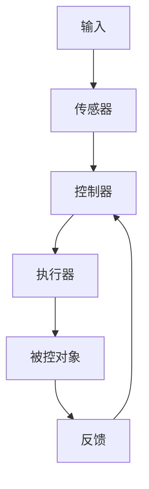

                 

# 控制论：自然系统的数学调节

> 关键词：控制论, 自然系统, 数学调节, 调节系统, 反馈机制, 稳定性, 优化算法

> 摘要：本文旨在深入探讨控制论的基本原理及其在自然系统中的应用。通过详细分析调节系统的工作机制，我们将介绍核心概念、数学模型、算法原理，并通过实际代码案例进行演示。此外，本文还将探讨控制论在实际应用场景中的重要性，并提供学习资源和开发工具推荐，以帮助读者更好地理解和应用控制论。

## 1. 背景介绍
### 1.1 目的和范围
本文旨在为读者提供一个全面的控制论入门指南，涵盖其基本概念、数学模型、算法原理及其在实际项目中的应用。通过本文，读者将能够理解控制论的核心思想，并学会如何在实际项目中应用这些知识。

### 1.2 预期读者
本文适合以下读者群体：
- 对控制论感兴趣的技术爱好者
- 计算机科学、自动化、机器人学、人工智能领域的学生和研究人员
- 工程师和开发者，希望在项目中应用控制论原理
- 对自然系统和数学调节感兴趣的读者

### 1.3 文档结构概述
本文结构如下：
1. 背景介绍
2. 核心概念与联系
3. 核心算法原理 & 具体操作步骤
4. 数学模型和公式 & 详细讲解 & 举例说明
5. 项目实战：代码实际案例和详细解释说明
6. 实际应用场景
7. 工具和资源推荐
8. 总结：未来发展趋势与挑战
9. 附录：常见问题与解答
10. 扩展阅读 & 参考资料

### 1.4 术语表
#### 1.4.1 核心术语定义
- **控制论**：研究信息传递和调节机制的科学。
- **调节系统**：通过反馈机制调整系统行为以达到目标的系统。
- **反馈机制**：系统输出返回到输入端，影响系统行为的过程。
- **稳定性**：系统在受到扰动后能够恢复到稳定状态的能力。
- **优化算法**：通过迭代过程改进系统性能的方法。

#### 1.4.2 相关概念解释
- **自然系统**：自然界中的各种系统，如生物体、生态系统等。
- **数学调节**：使用数学方法分析和优化调节系统的行为。

#### 1.4.3 缩略词列表
- **PID**：比例-积分-微分控制器
- **MPC**：模型预测控制
- **LQR**：线性二次调节器

## 2. 核心概念与联系
### 2.1 调节系统的工作机制
调节系统通过反馈机制调整系统行为，以达到预定的目标。其基本工作流程如下：



### 2.2 反馈机制
反馈机制是调节系统的核心。它通过将系统输出返回到输入端，影响系统的控制决策。反馈机制可以分为正反馈和负反馈两种类型。

- **正反馈**：系统输出增强输入信号，导致系统行为加剧。
- **负反馈**：系统输出减弱输入信号，使系统行为趋于稳定。

### 2.3 稳定性
稳定性是调节系统的重要特性。系统在受到扰动后能够恢复到稳定状态的能力称为稳定性。稳定性可以通过数学模型进行分析和验证。

## 3. 核心算法原理 & 具体操作步骤
### 3.1 PID控制器
PID控制器是最常用的调节器之一，通过比例、积分和微分三个部分来调整系统行为。

#### 3.1.1 PID控制器原理
PID控制器的基本公式如下：

$$
u(t) = K_p e(t) + K_i \int_0^t e(\tau) d\tau + K_d \frac{de(t)}{dt}
$$

其中：
- $u(t)$：控制器输出
- $e(t)$：误差信号
- $K_p$：比例增益
- $K_i$：积分增益
- $K_d$：微分增益

#### 3.1.2 PID控制器伪代码
```pseudo
function PIDController(error, Kp, Ki, Kd):
    integral = 0
    derivative = 0
    output = 0
    
    while True:
        integral += error * dt
        derivative = (error - previous_error) / dt
        output = Kp * error + Ki * integral + Kd * derivative
        previous_error = error
        yield output
```

### 3.2 模型预测控制（MPC）
MPC是一种基于模型的控制方法，通过预测未来行为来优化系统性能。

#### 3.2.1 MPC原理
MPC的基本思想是通过预测未来行为来优化当前控制决策。其基本公式如下：

$$
\min_{u} \sum_{k=0}^{N-1} \left( \frac{1}{2} (y_{k+1} - y_{k+1}^*)^T Q (y_{k+1} - y_{k+1}^*) + \frac{1}{2} u_k^T R u_k \right)
$$

其中：
- $y_{k+1}$：未来输出
- $y_{k+1}^*$：期望输出
- $Q$：输出权重矩阵
- $R$：控制输入权重矩阵

#### 3.2.2 MPC伪代码
```pseudo
function MPCController(model, Q, R, N):
    u = 0
    y = model(x)
    for k in range(N):
        u = optimize(u, y, Q, R)
        x = model(x, u)
        y = model(x)
    return u
```

## 4. 数学模型和公式 & 详细讲解 & 举例说明
### 4.1 线性二次调节器（LQR）
LQR是一种基于线性系统的最优控制方法，通过最小化二次性能指标来优化系统性能。

#### 4.1.1 LQR原理
LQR的基本公式如下：

$$
\min_{u} \int_0^\infty (x^T Q x + u^T R u) dt
$$

其中：
- $x$：状态向量
- $u$：控制输入
- $Q$：状态权重矩阵
- $R$：控制输入权重矩阵

#### 4.1.2 LQR数学模型
LQR的数学模型可以表示为：

$$
\dot{x} = Ax + Bu
$$

其中：
- $A$：系统矩阵
- $B$：输入矩阵

### 4.2 举例说明
假设我们有一个简单的单摆系统，其状态方程为：

$$
\dot{x} = \begin{bmatrix} 0 & 1 \\ -\frac{g}{l} & -\frac{b}{ml} \end{bmatrix} x + \begin{bmatrix} 0 \\ \frac{1}{ml} \end{bmatrix} u
$$

其中：
- $x = \begin{bmatrix} \theta \\ \omega \end{bmatrix}$：状态向量
- $u$：控制输入
- $g$：重力加速度
- $l$：摆长
- $b$：阻尼系数
- $m$：摆的质量

我们可以使用LQR方法来设计控制器，以最小化系统的二次性能指标。

## 5. 项目实战：代码实际案例和详细解释说明
### 5.1 开发环境搭建
我们将使用Python和NumPy库进行开发。首先安装必要的库：

```bash
pip install numpy scipy matplotlib
```

### 5.2 源代码详细实现和代码解读
我们将实现一个简单的单摆系统，并使用LQR控制器进行控制。

```python
import numpy as np
from scipy.linalg import solve_continuous_are
from scipy.optimize import minimize

# 单摆系统参数
g = 9.81
l = 1.0
b = 0.1
m = 1.0

# 系统矩阵
A = np.array([[0, 1], [-g/l, -b/(m*l)]])
B = np.array([[0], [1/(m*l)]])

# LQR控制器设计
def lqr_controller(A, B, Q, R):
    P = solve_continuous_are(A, B, Q, R)
    K = np.dot(np.dot(B.T, P), np.linalg.inv(np.dot(np.dot(B, P), B.T) + R))
    return K

# 二次性能指标权重矩阵
Q = np.diag([1, 1])
R = 1

# 设计LQR控制器
K = lqr_controller(A, B, Q, R)

# 单摆系统仿真
def simulate_pendulum(K, x0, t):
    def pendulum_dynamics(x, t):
        u = -np.dot(K, x)
        return np.dot(A, x) + np.dot(B, u)
    
    from scipy.integrate import solve_ivp
    sol = solve_ivp(pendulum_dynamics, [0, t], x0, method='RK45')
    return sol.y

# 初始状态
x0 = np.array([np.pi/4, 0])

# 仿真时间
t = 10

# 仿真结果
sol = simulate_pendulum(K, x0, t)

# 绘制结果
import matplotlib.pyplot as plt
plt.plot(sol[0], sol[1])
plt.xlabel('角度 (rad)')
plt.ylabel('角速度 (rad/s)')
plt.title('单摆系统仿真')
plt.show()
```

### 5.3 代码解读与分析
- **系统矩阵**：定义了单摆系统的动态行为。
- **LQR控制器设计**：通过求解连续时间代数Riccati方程来设计控制器。
- **仿真**：使用`solve_ivp`函数进行仿真，并绘制结果。

## 6. 实际应用场景
控制论在许多领域都有广泛的应用，如机器人学、自动化、航空航天等。以下是一些实际应用场景：

- **机器人控制**：通过控制论方法实现机器人精确运动控制。
- **航空航天**：通过控制论方法实现飞行器姿态控制。
- **工业自动化**：通过控制论方法实现生产线自动化控制。

## 7. 工具和资源推荐
### 7.1 学习资源推荐
#### 7.1.1 书籍推荐
- **《控制工程基础》**：深入介绍了控制论的基本原理和应用。
- **《现代控制理论》**：详细讲解了现代控制理论的最新进展。

#### 7.1.2 在线课程
- **Coursera - 控制工程基础**：提供了丰富的在线课程资源。
- **edX - 现代控制理论**：提供了深入的在线课程。

#### 7.1.3 技术博客和网站
- **Control System Blog**：提供了大量的控制论相关技术博客和文章。
- **Control System Wiki**：提供了丰富的控制论相关知识和资源。

### 7.2 开发工具框架推荐
#### 7.2.1 IDE和编辑器
- **PyCharm**：功能强大的Python IDE。
- **VSCode**：轻量级但功能强大的代码编辑器。

#### 7.2.2 调试和性能分析工具
- **PyCharm Debugger**：强大的Python调试工具。
- **Python Profiler**：用于分析Python代码性能的工具。

#### 7.2.3 相关框架和库
- **NumPy**：用于数值计算的Python库。
- **SciPy**：用于科学计算的Python库。
- **Matplotlib**：用于数据可视化的Python库。

### 7.3 相关论文著作推荐
#### 7.3.1 经典论文
- **《控制论：或关于在动物和机器中控制和通信的科学》**：由诺伯特·维纳撰写，是控制论领域的经典之作。
- **《现代控制理论》**：由克劳德·香农撰写，介绍了现代控制理论的基本原理。

#### 7.3.2 最新研究成果
- **《基于深度学习的控制论方法》**：介绍了最新的深度学习在控制论中的应用。
- **《模型预测控制的最新进展》**：介绍了模型预测控制的最新研究成果。

#### 7.3.3 应用案例分析
- **《机器人控制中的LQR方法》**：分析了LQR方法在机器人控制中的应用案例。
- **《航空航天中的控制论方法》**：分析了控制论方法在航空航天中的应用案例。

## 8. 总结：未来发展趋势与挑战
控制论在未来将继续发挥重要作用，特别是在人工智能、机器人学和自动化等领域。然而，也面临着一些挑战，如复杂系统的建模、实时控制的实现等。未来的研究方向将集中在更高效的算法、更精确的模型和更智能的控制系统。

## 9. 附录：常见问题与解答
### 9.1 问题：如何选择合适的控制器？
**解答**：选择合适的控制器需要考虑系统的特性、性能要求和实际应用。PID控制器适用于大多数简单系统，而MPC和LQR适用于更复杂系统。

### 9.2 问题：如何优化控制器参数？
**解答**：可以通过仿真和实验来优化控制器参数。使用优化算法如遗传算法、粒子群优化等可以找到最优参数。

## 10. 扩展阅读 & 参考资料
- **维基百科 - 控制论**：提供了丰富的控制论相关知识和资源。
- **控制论论坛**：提供了丰富的控制论相关讨论和交流平台。

---

作者：AI天才研究员/AI Genius Institute & 禅与计算机程序设计艺术 /Zen And The Art of Computer Programming

