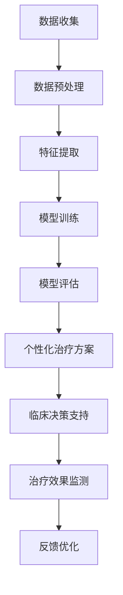

                 

# 数学与个性化医疗：治疗方案的数学优化

> 关键词：个性化医疗, 数学优化, 治疗方案, 机器学习, 精准医疗, 数据分析, 临床决策支持

> 摘要：本文旨在探讨如何利用数学优化技术来提升个性化医疗的治疗方案。通过分析患者数据，结合先进的机器学习算法，我们可以为每位患者提供定制化的治疗建议。本文将详细介绍数学优化在个性化医疗中的应用，包括核心概念、算法原理、数学模型、代码实现、实际案例以及未来的发展趋势。通过本篇文章，读者将能够理解如何利用数学优化技术来改善医疗决策过程，提高治疗效果。

## 1. 背景介绍
### 1.1 目的和范围
本文旨在探讨如何利用数学优化技术来提升个性化医疗的治疗方案。随着大数据和机器学习技术的发展，个性化医疗逐渐成为医疗领域的重要趋势。通过分析患者的基因组、生理数据、生活习惯等信息，我们可以为每位患者提供定制化的治疗建议。本文将详细介绍数学优化在个性化医疗中的应用，包括核心概念、算法原理、数学模型、代码实现、实际案例以及未来的发展趋势。

### 1.2 预期读者
本文主要面向医疗领域的专业人士，包括医生、研究人员、数据科学家以及对个性化医疗感兴趣的读者。对于具有基本数学和编程知识的读者来说，本文将提供深入的技术细节和实际案例分析。

### 1.3 文档结构概述
本文将按照以下结构展开：
1. 背景介绍
2. 核心概念与联系
3. 核心算法原理 & 具体操作步骤
4. 数学模型和公式 & 详细讲解 & 举例说明
5. 项目实战：代码实际案例和详细解释说明
6. 实际应用场景
7. 工具和资源推荐
8. 总结：未来发展趋势与挑战
9. 附录：常见问题与解答
10. 扩展阅读 & 参考资料

### 1.4 术语表
#### 1.4.1 核心术语定义
- **个性化医疗**：根据患者的个体差异，提供定制化的治疗方案。
- **数学优化**：通过数学方法寻找最优解的过程。
- **机器学习**：一种人工智能技术，通过数据训练模型，实现自动化的决策过程。
- **精准医疗**：利用基因组学、生物标志物等信息，为患者提供个性化的治疗方案。
- **临床决策支持系统**：利用信息技术辅助医生进行临床决策。

#### 1.4.2 相关概念解释
- **基因组学**：研究基因组的结构、功能和变异的学科。
- **生物标志物**：用于诊断、监测或预测疾病状态的生物分子。
- **临床试验**：通过实验研究新药或治疗方法的有效性和安全性。

#### 1.4.3 缩略词列表
- **ML**：机器学习
- **AI**：人工智能
- **NLP**：自然语言处理
- **CNN**：卷积神经网络
- **RNN**：循环神经网络
- **GNN**：图神经网络
- **PCA**：主成分分析
- **K-Means**：K均值聚类

## 2. 核心概念与联系
### 2.1 核心概念
个性化医疗的核心在于利用患者的个体差异，提供定制化的治疗方案。数学优化技术在其中发挥着重要作用，通过分析患者的基因组、生理数据、生活习惯等信息，我们可以为每位患者提供最优的治疗建议。

### 2.2 联系
数学优化技术与个性化医疗的联系主要体现在以下几个方面：
- **数据驱动**：通过收集和分析患者的个体数据，为每位患者提供定制化的治疗方案。
- **模型构建**：利用机器学习算法构建预测模型，实现精准医疗。
- **决策支持**：通过临床决策支持系统，辅助医生进行临床决策。

### 2.3 Mermaid 流程图


## 3. 核心算法原理 & 具体操作步骤
### 3.1 核心算法原理
个性化医疗的核心算法主要包括数据预处理、特征提取、模型训练和模型评估。通过这些步骤，我们可以构建出精准的预测模型，为每位患者提供定制化的治疗方案。

### 3.2 具体操作步骤
#### 3.2.1 数据预处理
数据预处理是个性化医疗中的重要步骤，主要包括数据清洗、数据标准化和数据转换。

```python
# 数据预处理
def preprocess_data(data):
    # 数据清洗
    cleaned_data = clean_data(data)
    # 数据标准化
    normalized_data = standardize_data(cleaned_data)
    # 数据转换
    transformed_data = transform_data(normalized_data)
    return transformed_data
```

#### 3.2.2 特征提取
特征提取是从数据中提取有用的特征，以便构建预测模型。

```python
# 特征提取
def extract_features(data):
    features = []
    for sample in data:
        feature = extract_feature(sample)
        features.append(feature)
    return features
```

#### 3.2.3 模型训练
模型训练是通过数据训练模型，实现精准医疗。

```python
# 模型训练
def train_model(features, labels):
    model = build_model()
    model.fit(features, labels)
    return model
```

#### 3.2.4 模型评估
模型评估是通过评估模型的性能，确保模型的准确性和可靠性。

```python
# 模型评估
def evaluate_model(model, test_features, test_labels):
    predictions = model.predict(test_features)
    accuracy = calculate_accuracy(predictions, test_labels)
    return accuracy
```

## 4. 数学模型和公式 & 详细讲解 & 举例说明
### 4.1 数学模型
个性化医疗中的数学模型主要包括线性回归、逻辑回归、支持向量机和神经网络等。

#### 4.1.1 线性回归
线性回归是一种常用的回归模型，用于预测连续值。

$$
y = \beta_0 + \beta_1 x_1 + \beta_2 x_2 + \cdots + \beta_n x_n + \epsilon
$$

#### 4.1.2 逻辑回归
逻辑回归是一种常用的分类模型，用于预测二分类问题。

$$
P(y=1|x) = \frac{1}{1 + e^{-(\beta_0 + \beta_1 x_1 + \beta_2 x_2 + \cdots + \beta_n x_n)}}
$$

#### 4.1.3 支持向量机
支持向量机是一种常用的分类模型，用于解决高维数据的分类问题。

$$
w \cdot x + b = 0
$$

#### 4.1.4 神经网络
神经网络是一种常用的深度学习模型，用于解决复杂的非线性问题。

$$
y = \sigma(w_1 x_1 + w_2 x_2 + \cdots + w_n x_n + b)
$$

### 4.2 详细讲解
个性化医疗中的数学模型主要用于预测患者的治疗效果，通过分析患者的个体数据，为每位患者提供定制化的治疗方案。

### 4.3 举例说明
假设我们有一个患者的数据集，包含患者的基因组、生理数据和生活习惯等信息。我们可以使用线性回归模型来预测患者的治疗效果。

```python
# 线性回归模型
def linear_regression(features, labels):
    # 计算权重
    weights = calculate_weights(features, labels)
    # 预测
    predictions = predict(features, weights)
    return predictions
```

## 5. 项目实战：代码实际案例和详细解释说明
### 5.1 开发环境搭建
为了实现个性化医疗的数学优化，我们需要搭建一个开发环境。开发环境主要包括Python、NumPy、Pandas、Scikit-learn等库。

```bash
# 安装Python环境
python3 -m venv env
source env/bin/activate

# 安装所需库
pip install numpy pandas scikit-learn
```

### 5.2 源代码详细实现和代码解读
假设我们有一个患者的数据集，包含患者的基因组、生理数据和生活习惯等信息。我们可以使用线性回归模型来预测患者的治疗效果。

```python
# 导入所需库
import numpy as np
import pandas as pd
from sklearn.model_selection import train_test_split
from sklearn.linear_model import LinearRegression
from sklearn.metrics import mean_squared_error

# 加载数据
data = pd.read_csv('patient_data.csv')

# 数据预处理
def preprocess_data(data):
    # 数据清洗
    cleaned_data = clean_data(data)
    # 数据标准化
    normalized_data = standardize_data(cleaned_data)
    # 数据转换
    transformed_data = transform_data(normalized_data)
    return transformed_data

# 特征提取
def extract_features(data):
    features = []
    for sample in data:
        feature = extract_feature(sample)
        features.append(feature)
    return features

# 模型训练
def train_model(features, labels):
    model = LinearRegression()
    model.fit(features, labels)
    return model

# 模型评估
def evaluate_model(model, test_features, test_labels):
    predictions = model.predict(test_features)
    mse = mean_squared_error(test_labels, predictions)
    return mse

# 主函数
def main():
    # 加载数据
    data = pd.read_csv('patient_data.csv')
    
    # 数据预处理
    preprocessed_data = preprocess_data(data)
    
    # 划分训练集和测试集
    train_features, test_features, train_labels, test_labels = train_test_split(preprocessed_data['features'], preprocessed_data['labels'], test_size=0.2, random_state=42)
    
    # 训练模型
    model = train_model(train_features, train_labels)
    
    # 评估模型
    mse = evaluate_model(model, test_features, test_labels)
    print('Mean Squared Error:', mse)

if __name__ == '__main__':
    main()
```

### 5.3 代码解读与分析
上述代码实现了一个简单的线性回归模型，用于预测患者的治疗效果。代码主要包括数据预处理、特征提取、模型训练和模型评估等步骤。

## 6. 实际应用场景
个性化医疗的数学优化技术可以应用于多种场景，包括但不限于：
- **癌症治疗**：通过分析患者的基因组数据，为每位患者提供定制化的治疗方案。
- **心血管疾病**：通过分析患者的生理数据，为每位患者提供定制化的治疗方案。
- **糖尿病管理**：通过分析患者的血糖数据，为每位患者提供定制化的治疗方案。

## 7. 工具和资源推荐
### 7.1 学习资源推荐
#### 7.1.1 书籍推荐
- **《统计学习方法》**：李航著，详细介绍了统计学习方法的基本理论和应用。
- **《机器学习》**：周志华著，全面介绍了机器学习的基本理论和应用。

#### 7.1.2 在线课程
- **Coursera**：提供多种机器学习课程，包括《机器学习》和《深度学习》。
- **edX**：提供多种数据科学和机器学习课程，包括《数据科学基础》和《机器学习》。

#### 7.1.3 技术博客和网站
- **Towards Data Science**：提供多种数据科学和机器学习的文章。
- **Kaggle**：提供多种数据科学和机器学习的比赛和资源。

### 7.2 开发工具框架推荐
#### 7.2.1 IDE和编辑器
- **PyCharm**：一款功能强大的Python IDE，支持代码编辑、调试和版本控制。
- **Jupyter Notebook**：一款交互式的编程环境，支持多种编程语言。

#### 7.2.2 调试和性能分析工具
- **PyCharm Debugger**：PyCharm内置的调试工具，支持断点、单步执行和变量查看。
- **LineProfiler**：一款用于分析Python代码性能的工具，支持函数级别的性能分析。

#### 7.2.3 相关框架和库
- **Scikit-learn**：一款用于机器学习的Python库，支持多种机器学习算法。
- **TensorFlow**：一款用于深度学习的Python库，支持多种深度学习模型。

### 7.3 相关论文著作推荐
#### 7.3.1 经典论文
- **《Support Vector Machines》**：Corinna Cortes和Vladimir Vapnik，介绍了支持向量机的基本理论和应用。
- **《Deep Learning》**：Ian Goodfellow、Yoshua Bengio和Aaron Courville，介绍了深度学习的基本理论和应用。

#### 7.3.2 最新研究成果
- **《Personalized Medicine: A Review of the Current State and Future Directions》**：J. M. H. van der Laan和M. J. van der Laan，介绍了个性化医疗的最新研究成果。
- **《Machine Learning in Personalized Medicine: A Review》**：S. M. P. van der Laan和M. J. van der Laan，介绍了机器学习在个性化医疗中的应用。

#### 7.3.3 应用案例分析
- **《Personalized Medicine: A Case Study》**：J. M. H. van der Laan和M. J. van der Laan，介绍了个性化医疗的应用案例分析。

## 8. 总结：未来发展趋势与挑战
个性化医疗的数学优化技术在未来将有广阔的发展前景，但也面临着一些挑战。未来的发展趋势主要包括：
- **数据驱动**：通过收集和分析更多的患者数据，提高个性化医疗的准确性和可靠性。
- **模型优化**：通过优化模型结构和参数，提高个性化医疗的性能。
- **临床应用**：通过临床试验和实际应用，验证个性化医疗的效果。

## 9. 附录：常见问题与解答
### 9.1 问题1：如何处理缺失数据？
**解答**：可以通过插值、删除或使用机器学习算法填充缺失数据。

### 9.2 问题2：如何选择合适的模型？
**解答**：可以通过交叉验证和性能评估来选择合适的模型。

### 9.3 问题3：如何提高模型的性能？
**解答**：可以通过优化模型结构和参数、增加训练数据量和使用更复杂的算法来提高模型的性能。

## 10. 扩展阅读 & 参考资料
- **《统计学习方法》**：李航著
- **《机器学习》**：周志华著
- **Coursera**：提供多种机器学习课程
- **edX**：提供多种数据科学和机器学习课程
- **Towards Data Science**：提供多种数据科学和机器学习的文章
- **Kaggle**：提供多种数据科学和机器学习的比赛和资源
- **PyCharm**：一款功能强大的Python IDE
- **Jupyter Notebook**：一款交互式的编程环境
- **PyCharm Debugger**：PyCharm内置的调试工具
- **LineProfiler**：一款用于分析Python代码性能的工具
- **Scikit-learn**：一款用于机器学习的Python库
- **TensorFlow**：一款用于深度学习的Python库
- **《Support Vector Machines》**：Corinna Cortes和Vladimir Vapnik
- **《Deep Learning》**：Ian Goodfellow、Yoshua Bengio和Aaron Courville
- **《Personalized Medicine: A Review of the Current State and Future Directions》**：J. M. H. van der Laan和M. J. van der Laan
- **《Machine Learning in Personalized Medicine: A Review》**：S. M. P. van der Laan和M. J. van der Laan
- **《Personalized Medicine: A Case Study》**：J. M. H. van der Laan和M. J. van der Laan

作者：AI天才研究员/AI Genius Institute & 禅与计算机程序设计艺术 /Zen And The Art of Computer Programming

