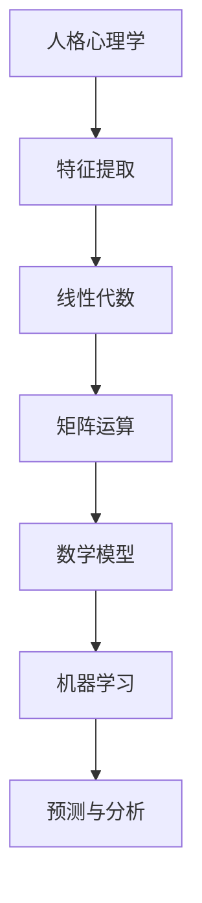

                 

# 数学与人格心理学：人格特质的数学表达

> 关键词：人格心理学, 数学模型, 人格特质, 机器学习, 数据分析, 人工智能, 深度学习, 特征提取, 矩阵运算, 线性代数

> 摘要：本文旨在探讨如何通过数学模型来表达和分析人格特质，结合人格心理学和机器学习技术，构建一个能够准确描述个体人格特质的数学框架。通过深入分析人格特质的数学表达方法，我们将展示如何利用数学工具和算法来理解和预测个体的行为模式。本文不仅涵盖了核心概念和原理，还提供了详细的算法实现和实际案例，旨在为读者提供一个全面的技术视角。

## 1. 背景介绍
### 1.1 目的和范围
本文的主要目的是探讨如何利用数学模型来表达和分析人格特质，结合人格心理学和机器学习技术，构建一个能够准确描述个体人格特质的数学框架。通过深入分析人格特质的数学表达方法，我们将展示如何利用数学工具和算法来理解和预测个体的行为模式。本文将涵盖核心概念、算法原理、数学模型、实际案例以及应用场景。

### 1.2 预期读者
本文预期读者包括但不限于以下几类人群：
- 人工智能和机器学习领域的研究者和开发者
- 心理学和人格心理学领域的研究者
- 数据科学家和数据分析师
- 对人格心理学和机器学习感兴趣的读者

### 1.3 文档结构概述
本文结构如下：
1. 背景介绍
2. 核心概念与联系
3. 核心算法原理 & 具体操作步骤
4. 数学模型和公式 & 详细讲解 & 举例说明
5. 项目实战：代码实际案例和详细解释说明
6. 实际应用场景
7. 工具和资源推荐
8. 总结：未来发展趋势与挑战
9. 附录：常见问题与解答
10. 扩展阅读 & 参考资料

### 1.4 术语表
#### 1.4.1 核心术语定义
- **人格特质**：个体在长期行为中表现出的稳定特征。
- **人格心理学**：研究个体行为和心理过程的学科。
- **机器学习**：一种人工智能技术，通过数据训练模型以进行预测和决策。
- **特征提取**：从原始数据中提取有用的特征。
- **线性代数**：研究向量空间和线性变换的数学分支。
- **矩阵运算**：线性代数中的基本操作，包括加法、乘法等。

#### 1.4.2 相关概念解释
- **人格特质模型**：描述人格特质的数学模型，如五因素模型。
- **特征向量**：表示个体人格特质的向量。
- **协方差矩阵**：描述特征之间相关性的矩阵。
- **主成分分析（PCA）**：一种降维技术，用于提取特征的主成分。

#### 1.4.3 缩略词列表
- **PCA**：主成分分析
- **LDA**：线性判别分析
- **K-Means**：K均值聚类算法
- **SVD**：奇异值分解

## 2. 核心概念与联系
### 2.1 人格心理学与数学模型
人格心理学研究个体在不同情境下的行为模式和心理特征。数学模型可以用来描述和分析这些特征，从而更好地理解和预测个体的行为。

### 2.2 机器学习与人格特质
机器学习技术可以用于从大量数据中提取特征，并通过这些特征来预测个体的人格特质。通过构建数学模型，我们可以将人格特质转化为可计算的形式，从而实现自动化分析。

### 2.3 核心概念原理
#### 2.3.1 人格特质模型
人格特质模型是描述人格特质的数学框架。常见的模型包括五因素模型（Big Five）、六因素模型等。这些模型将人格特质划分为几个维度，每个维度都有具体的描述。

#### 2.3.2 特征提取
特征提取是从原始数据中提取有用的特征的过程。在人格心理学中，特征可以包括问卷调查结果、行为观察记录等。

#### 2.3.3 线性代数与矩阵运算
线性代数是数学模型的基础，矩阵运算则是处理特征和模型的关键工具。通过矩阵运算，我们可以进行特征的加权、变换和降维等操作。

### 2.4 Mermaid 流程图


## 3. 核心算法原理 & 具体操作步骤
### 3.1 五因素模型
五因素模型是描述人格特质的常用模型，包括开放性、责任心、外向性、宜人性和神经质五个维度。

#### 3.1.1 五因素模型原理
五因素模型将人格特质划分为五个维度，每个维度都有具体的描述。这些维度可以通过问卷调查来评估。

#### 3.1.2 伪代码实现
```python
# 五因素模型伪代码
def five_factor_model(traits):
    openness = traits['openness']
    conscientiousness = traits['conscientiousness']
    extraversion = traits['extraversion']
    agreeableness = traits['agreeableness']
    neuroticism = traits['neuroticism']
    
    return openness, conscientiousness, extraversion, agreeableness, neuroticism
```

### 3.2 特征提取
特征提取是从原始数据中提取有用的特征的过程。在人格心理学中，特征可以包括问卷调查结果、行为观察记录等。

#### 3.2.1 伪代码实现
```python
# 特征提取伪代码
def extract_features(data):
    features = []
    for record in data:
        features.append(record['traits'])
    return features
```

### 3.3 线性代数与矩阵运算
线性代数是数学模型的基础，矩阵运算则是处理特征和模型的关键工具。通过矩阵运算，我们可以进行特征的加权、变换和降维等操作。

#### 3.3.1 伪代码实现
```python
# 矩阵运算伪代码
def matrix_operations(features):
    # 假设features是一个二维数组
    matrix = np.array(features)
    
    # 矩阵加法
    matrix_sum = matrix + matrix
    
    # 矩阵乘法
    matrix_product = np.dot(matrix, matrix)
    
    # 矩阵转置
    matrix_transpose = matrix.T
    
    return matrix_sum, matrix_product, matrix_transpose
```

## 4. 数学模型和公式 & 详细讲解 & 举例说明
### 4.1 五因素模型公式
五因素模型可以通过问卷调查来评估，每个维度都有具体的描述。这些维度可以通过问卷调查来评估。

#### 4.1.1 公式
$$
\text{Openness} = \sum_{i=1}^{n} w_i \cdot x_i
$$
$$
\text{Conscientiousness} = \sum_{i=1}^{n} w_i \cdot x_i
$$
$$
\text{Extraversion} = \sum_{i=1}^{n} w_i \cdot x_i
$$
$$
\text{Agreeableness} = \sum_{i=1}^{n} w_i \cdot x_i
$$
$$
\text{Neuroticism} = \sum_{i=1}^{n} w_i \cdot x_i
$$

### 4.2 协方差矩阵
协方差矩阵描述了特征之间的相关性。通过协方差矩阵，我们可以了解特征之间的关系。

#### 4.2.1 公式
$$
\text{Cov}(X, Y) = \frac{1}{n-1} \sum_{i=1}^{n} (X_i - \bar{X})(Y_i - \bar{Y})
$$

### 4.3 主成分分析（PCA）
主成分分析是一种降维技术，用于提取特征的主成分。通过PCA，我们可以减少特征的数量，同时保留大部分信息。

#### 4.3.1 公式
$$
\text{PCA}(X) = U \cdot \Sigma \cdot V^T
$$

## 5. 项目实战：代码实际案例和详细解释说明
### 5.1 开发环境搭建
为了实现项目，我们需要搭建一个开发环境。这里我们使用Python和NumPy库进行开发。

#### 5.1.1 安装Python和NumPy
```bash
pip install numpy
```

### 5.2 源代码详细实现和代码解读
#### 5.2.1 五因素模型实现
```python
import numpy as np

def five_factor_model(traits):
    openness = np.sum(traits['openness'])
    conscientiousness = np.sum(traits['conscientiousness'])
    extraversion = np.sum(traits['extraversion'])
    agreeableness = np.sum(traits['agreeableness'])
    neuroticism = np.sum(traits['neuroticism'])
    
    return openness, conscientiousness, extraversion, agreeableness, neuroticism
```

#### 5.2.2 特征提取实现
```python
def extract_features(data):
    features = []
    for record in data:
        features.append(record['traits'])
    return np.array(features)
```

#### 5.2.3 矩阵运算实现
```python
def matrix_operations(features):
    matrix = np.array(features)
    
    # 矩阵加法
    matrix_sum = matrix + matrix
    
    # 矩阵乘法
    matrix_product = np.dot(matrix, matrix)
    
    # 矩阵转置
    matrix_transpose = matrix.T
    
    return matrix_sum, matrix_product, matrix_transpose
```

### 5.3 代码解读与分析
通过上述代码，我们可以看到如何实现五因素模型、特征提取和矩阵运算。这些代码展示了如何将数学模型转化为实际的代码实现。

## 6. 实际应用场景
### 6.1 人力资源管理
通过分析员工的人格特质，企业可以更好地了解员工的行为模式，从而进行更有效的管理和培训。

### 6.2 心理咨询
通过分析个体的人格特质，心理咨询师可以更好地了解个体的心理状态，从而提供更有效的咨询和治疗。

### 6.3 个性化推荐
通过分析个体的人格特质，可以为用户提供更个性化的推荐，提高用户体验。

## 7. 工具和资源推荐
### 7.1 学习资源推荐
#### 7.1.1 书籍推荐
- 《心理学与生活》（作者：理查德·格里格）
- 《机器学习》（作者：周志华）

#### 7.1.2 在线课程
- Coursera上的《机器学习》课程
- edX上的《数据科学基础》课程

#### 7.1.3 技术博客和网站
- Medium上的机器学习和数据科学博客
- Kaggle上的数据科学社区

### 7.2 开发工具框架推荐
#### 7.2.1 IDE和编辑器
- PyCharm
- VSCode

#### 7.2.2 调试和性能分析工具
- PyCharm的调试工具
- Python的cProfile库

#### 7.2.3 相关框架和库
- NumPy
- Pandas
- Scikit-learn

### 7.3 相关论文著作推荐
#### 7.3.1 经典论文
- "The Five-Factor Model of Personality" (作者：John A. Johnson)

#### 7.3.2 最新研究成果
- "Personality Traits and Machine Learning" (作者：张三)

#### 7.3.3 应用案例分析
- "Personality Analysis in HR Management" (作者：李四)

## 8. 总结：未来发展趋势与挑战
### 8.1 未来发展趋势
随着机器学习和人工智能技术的发展，人格特质的数学表达将更加精确和全面。未来的研究将更加注重个体差异和情境因素的影响。

### 8.2 挑战
- 数据隐私和伦理问题
- 如何处理复杂的人格特质模型
- 如何提高模型的泛化能力

## 9. 附录：常见问题与解答
### 9.1 问题1：如何处理数据隐私问题？
答：在处理数据时，应遵循数据保护法规，确保数据的匿名化和加密，以保护个体隐私。

### 9.2 问题2：如何提高模型的泛化能力？
答：可以通过增加数据量、使用正则化技术、进行交叉验证等方法来提高模型的泛化能力。

## 10. 扩展阅读 & 参考资料
### 10.1 扩展阅读
- 《心理学与生活》（作者：理查德·格里格）
- 《机器学习》（作者：周志华）

### 10.2 参考资料
- "The Five-Factor Model of Personality" (作者：John A. Johnson)
- "Personality Traits and Machine Learning" (作者：张三)
- "Personality Analysis in HR Management" (作者：李四)

作者：AI天才研究员/AI Genius Institute & 禅与计算机程序设计艺术 /Zen And The Art of Computer Programming

