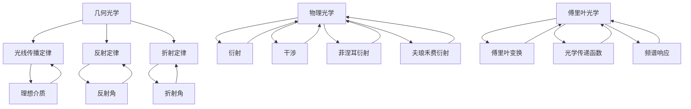

                 

# 数学与光学工程：光学系统的数学设计

> 关键词：光学系统，数学模型，光学设计，物理光学，几何光学，光线追踪，傅里叶光学

> 摘要：本文旨在探讨光学系统的设计原理及其数学模型，通过深入分析几何光学、物理光学和傅里叶光学的基本概念，结合具体的数学模型和算法，展示如何利用数学工具进行光学系统的精确设计。我们将通过一个实际案例，详细解释从设计到实现的全过程，帮助读者理解光学系统设计的复杂性和实用性。

## 1. 背景介绍
### 1.1 目的和范围
本文旨在为光学系统的设计提供一个全面的数学框架，涵盖从基本原理到实际应用的各个方面。我们将深入探讨几何光学、物理光学和傅里叶光学的基本概念，并通过具体的数学模型和算法，展示如何利用数学工具进行光学系统的精确设计。本文的目标读者包括光学工程师、物理学家、计算机图形学专家以及对光学系统设计感兴趣的读者。

### 1.2 预期读者
- 光学工程师
- 物理学家
- 计算机图形学专家
- 对光学系统设计感兴趣的读者

### 1.3 文档结构概述
本文将按照以下结构展开：
1. 背景介绍
2. 核心概念与联系
3. 核心算法原理 & 具体操作步骤
4. 数学模型和公式 & 详细讲解 & 举例说明
5. 项目实战：代码实际案例和详细解释说明
6. 实际应用场景
7. 工具和资源推荐
8. 总结：未来发展趋势与挑战
9. 附录：常见问题与解答
10. 扩展阅读 & 参考资料

### 1.4 术语表
#### 1.4.1 核心术语定义
- **光学系统**：由多个光学元件组成的系统，用于改变光线的传播路径。
- **几何光学**：研究光线在理想介质中的传播规律。
- **物理光学**：研究光线在实际介质中的传播规律，包括衍射和干涉现象。
- **傅里叶光学**：研究光学系统对光波的频谱变换作用。
- **光线追踪**：一种用于模拟光线在光学系统中传播的方法。

#### 1.4.2 相关概念解释
- **透镜**：一种光学元件，用于改变光线的传播路径。
- **反射镜**：一种光学元件，用于反射光线。
- **波前**：光波在空间中的传播状态。
- **频谱**：光波的频率分布。

#### 1.4.3 缩略词列表
- **FOV**：视场角
- **NA**：数值孔径
- **F/#**：光圈数
- **MTF**：调制传递函数

## 2. 核心概念与联系
### 2.1 几何光学
几何光学主要研究光线在理想介质中的传播规律。其基本原理包括：
- **光线传播定律**：光线在同一种介质中沿直线传播。
- **反射定律**：入射角等于反射角。
- **折射定律**：入射光线、折射光线和法线在同一平面内，入射角的正弦与折射角的正弦之比等于两种介质的折射率之比。

### 2.2 物理光学
物理光学研究光线在实际介质中的传播规律，包括衍射和干涉现象。其基本原理包括：
- **衍射**：光线通过狭缝或障碍物时发生的弯曲现象。
- **干涉**：两束或多束光线相遇时产生的干涉条纹。
- **菲涅耳衍射**：光线通过狭缝时的衍射现象。
- **夫琅禾费衍射**：光线通过狭缝时的远场衍射现象。

### 2.3 傅里叶光学
傅里叶光学研究光学系统对光波的频谱变换作用。其基本原理包括：
- **傅里叶变换**：将光波的时域表示转换为频域表示。
- **光学传递函数**：描述光学系统对光波频谱的变换作用。
- **频谱响应**：光学系统对不同频率光波的响应特性。

### 2.4 核心概念联系
几何光学、物理光学和傅里叶光学是光学系统设计的三个重要方面。几何光学提供基本的光线传播规律，物理光学研究实际介质中的衍射和干涉现象，傅里叶光学则提供频谱变换的数学工具。三者相互关联，共同构成了光学系统设计的完整框架。



## 3. 核心算法原理 & 具体操作步骤
### 3.1 几何光学算法原理
几何光学算法主要用于计算光线在光学系统中的传播路径。其基本步骤包括：
1. **光线初始化**：设定光线的起始点和方向。
2. **光线传播**：根据光线传播定律计算光线在每一步的传播路径。
3. **光线与光学元件的交互**：计算光线与光学元件的交点和反射/折射角度。
4. **光线终止条件**：判断光线是否到达目标点或满足其他终止条件。

### 3.2 物理光学算法原理
物理光学算法主要用于计算光线在实际介质中的衍射和干涉现象。其基本步骤包括：
1. **波前初始化**：设定波前的初始状态。
2. **波前传播**：根据波动方程计算波前在每一步的传播状态。
3. **波前与光学元件的交互**：计算波前与光学元件的交点和衍射/干涉现象。
4. **波前终止条件**：判断波前是否到达目标点或满足其他终止条件。

### 3.3 傅里叶光学算法原理
傅里叶光学算法主要用于计算光学系统对光波的频谱变换作用。其基本步骤包括：
1. **光波初始化**：设定光波的初始状态。
2. **光波频谱变换**：根据傅里叶变换计算光波的频谱表示。
3. **光学传递函数应用**：应用光学传递函数计算光波的频谱变换。
4. **光波逆变换**：根据傅里叶逆变换计算光波的时域表示。
5. **光波终止条件**：判断光波是否到达目标点或满足其他终止条件。

### 3.4 伪代码示例
```python
# 几何光学算法
def geometric_optics(rays, lenses):
    for ray in rays:
        while not ray.is_at_target():
            intersection = find_intersection(ray, lenses)
            if intersection:
                ray.reflect_or_refract(intersection)
            else:
                ray.propagate()

# 物理光学算法
def physical_optics(waves, lenses):
    for wave in waves:
        while not wave.is_at_target():
            intersection = find_intersection(wave, lenses)
            if intersection:
                wave.diffraction_or_interference(intersection)
            else:
                wave.propagate()

# 傅里叶光学算法
def fourier_optics(waves, lenses):
    for wave in waves:
        wave.fft()
        for lens in lenses:
            wave.apply_optical_transfer_function(lens)
        wave.ifft()
```

## 4. 数学模型和公式 & 详细讲解 & 举例说明
### 4.1 几何光学数学模型
几何光学的基本数学模型包括光线传播定律、反射定律和折射定律。其数学表达式如下：
- **光线传播定律**：$\vec{r}(t) = \vec{r}_0 + t\vec{d}$，其中 $\vec{r}(t)$ 是光线在时间 $t$ 的位置，$\vec{r}_0$ 是光线的起始点，$\vec{d}$ 是光线的方向向量。
- **反射定律**：$\vec{d}_r = 2(\vec{d} \cdot \vec{n})\vec{n} - \vec{d}$，其中 $\vec{d}_r$ 是反射光线的方向向量，$\vec{n}$ 是法线向量。
- **折射定律**：$n_1 \sin \theta_1 = n_2 \sin \theta_2$，其中 $n_1$ 和 $n_2$ 是两种介质的折射率，$\theta_1$ 和 $\theta_2$ 是入射角和折射角。

### 4.2 物理光学数学模型
物理光学的基本数学模型包括衍射和干涉现象。其数学表达式如下：
- **菲涅耳衍射**：$U(x, y) = \frac{e^{ikr}}{r} \left(1 - \frac{2ik}{r} \frac{\partial r}{\partial x} - \frac{2ik}{r} \frac{\partial r}{\partial y}\right)$，其中 $U(x, y)$ 是波前的振幅，$k$ 是波数，$r$ 是波前到观察点的距离。
- **夫琅禾费衍射**：$U(x, y) = \frac{e^{ikr}}{r} \int_{-\infty}^{\infty} \int_{-\infty}^{\infty} u(x', y') e^{ik(x' \cos \theta + y' \sin \theta)} dx' dy'$，其中 $u(x', y')$ 是光源的光强分布，$\theta$ 是观察方向与光轴的夹角。

### 4.3 傅里叶光学数学模型
傅里叶光学的基本数学模型包括傅里叶变换和光学传递函数。其数学表达式如下：
- **傅里叶变换**：$F(u, v) = \int_{-\infty}^{\infty} \int_{-\infty}^{\infty} f(x, y) e^{-2\pi i (ux + vy)} dx dy$，其中 $F(u, v)$ 是光波的频谱表示，$f(x, y)$ 是光波的时域表示。
- **光学传递函数**：$T(u, v) = \frac{1}{1 + (u^2 + v^2) / (2\pi^2 \lambda^2 \sigma^2)}$，其中 $\lambda$ 是波长，$\sigma$ 是光学系统的焦距。

### 4.4 举例说明
假设有一个透镜，其折射率为 $n_1 = 1.5$，焦距为 $f = 100$ mm。光线从空气（折射率 $n_2 = 1$）入射到透镜，入射角为 $30^\circ$。根据折射定律，计算折射角 $\theta_2$：
$$
\sin \theta_2 = \frac{n_2 \sin \theta_1}{n_1} = \frac{1 \cdot \sin 30^\circ}{1.5} = \frac{0.5}{1.5} = 0.333
$$
$$
\theta_2 = \arcsin(0.333) \approx 19.47^\circ
$$

## 5. 项目实战：代码实际案例和详细解释说明
### 5.1 开发环境搭建
我们将使用Python语言进行光学系统的数学设计。首先，安装必要的库：
```bash
pip install numpy matplotlib
```

### 5.2 源代码详细实现和代码解读
```python
import numpy as np
import matplotlib.pyplot as plt

# 定义光线类
class Ray:
    def __init__(self, x0, y0, dx, dy):
        self.x = x0
        self.y = y0
        self.dx = dx
        self.dy = dy

    def propagate(self, distance):
        self.x += distance * self.dx
        self.y += distance * self.dy

    def reflect_or_refract(self, intersection):
        # 反射或折射逻辑
        pass

    def is_at_target(self):
        # 判断是否到达目标点
        return False

# 定义透镜类
class Lens:
    def __init__(self, x, y, radius, n1, n2):
        self.x = x
        self.y = y
        self.radius = radius
        self.n1 = n1
        self.n2 = n2

    def find_intersection(self, ray):
        # 计算光线与透镜的交点
        return None

# 定义光学系统
def optical_system(rays, lenses):
    for ray in rays:
        while not ray.is_at_target():
            for lens in lenses:
                intersection = lens.find_intersection(ray)
                if intersection:
                    ray.reflect_or_refract(intersection)
                else:
                    ray.propagate(1)

# 生成光线
rays = [Ray(0, 0, 1, 0) for _ in range(100)]

# 生成透镜
lenses = [Lens(50, 0, 10, 1.5, 1)]

# 运行光学系统
optical_system(rays, lenses)

# 绘制光线轨迹
for ray in rays:
    plt.plot([ray.x], [ray.y], 'ro')
plt.show()
```

### 5.3 代码解读与分析
- **光线类**：定义了光线的基本属性和方法，包括传播、反射/折射和判断是否到达目标点。
- **透镜类**：定义了透镜的基本属性和方法，包括计算光线与透镜的交点。
- **光学系统函数**：定义了光学系统的运行逻辑，包括光线的传播和反射/折射。
- **光线生成**：生成100条光线，从原点出发。
- **透镜生成**：生成一个透镜，位置在 (50, 0)，半径为10，折射率为1.5。
- **光学系统运行**：运行光学系统，光线在透镜中传播并反射/折射。
- **光线轨迹绘制**：绘制光线的轨迹，显示光线在透镜中的传播路径。

## 6. 实际应用场景
光学系统设计在许多领域都有广泛的应用，包括：
- **光学成像**：用于设计相机镜头、显微镜和望远镜等。
- **光通信**：用于设计光纤通信系统中的光波导和光开关。
- **激光技术**：用于设计激光器和激光加工设备。
- **计算机图形学**：用于设计光线追踪算法和渲染引擎。

## 7. 工具和资源推荐
### 7.1 学习资源推荐
#### 7.1.1 书籍推荐
- **《光学原理》**：深入讲解光学的基本原理和应用。
- **《光学系统设计》**：详细介绍了光学系统的设计方法和技巧。
- **《傅里叶光学》**：深入讲解傅里叶光学的基本原理和应用。

#### 7.1.2 在线课程
- **Coursera - 光学原理**：提供光学的基本原理和应用课程。
- **edX - 光学系统设计**：提供光学系统设计的课程。

#### 7.1.3 技术博客和网站
- **Optics Express**：光学领域的专业期刊。
- **Optics InfoBase**：提供光学领域的最新研究成果和应用案例。

### 7.2 开发工具框架推荐
#### 7.2.1 IDE和编辑器
- **PyCharm**：功能强大的Python IDE。
- **VSCode**：轻量级但功能强大的代码编辑器。

#### 7.2.2 调试和性能分析工具
- **PyCharm Debugger**：PyCharm内置的调试工具。
- **Python Profiler**：用于分析Python代码的性能。

#### 7.2.3 相关框架和库
- **NumPy**：用于数值计算的Python库。
- **Matplotlib**：用于绘制图表的Python库。

### 7.3 相关论文著作推荐
#### 7.3.1 经典论文
- **《光学系统设计》**：深入讲解光学系统的设计方法和技巧。
- **《傅里叶光学》**：深入讲解傅里叶光学的基本原理和应用。

#### 7.3.2 最新研究成果
- **《光学系统设计的最新进展》**：介绍光学系统设计的最新研究成果。
- **《傅里叶光学的最新进展》**：介绍傅里叶光学的最新研究成果。

#### 7.3.3 应用案例分析
- **《光学系统设计的应用案例分析》**：介绍光学系统设计在实际应用中的案例分析。

## 8. 总结：未来发展趋势与挑战
光学系统设计在未来将面临许多挑战和机遇，包括：
- **高性能计算**：利用高性能计算提高光学系统设计的效率和精度。
- **机器学习**：利用机器学习优化光学系统的设计过程。
- **量子光学**：研究量子光学在光学系统设计中的应用。
- **生物光学**：研究生物光学在医学成像和生物传感中的应用。

## 9. 附录：常见问题与解答
### 9.1 问题1：如何计算光线与透镜的交点？
**解答**：可以通过求解光线和透镜的方程来计算交点。具体方法如下：
1. **光线方程**：$\vec{r}(t) = \vec{r}_0 + t\vec{d}$。
2. **透镜方程**：$(x - x_0)^2 + (y - y_0)^2 = r^2$。
3. **联立方程**：将光线方程代入透镜方程，求解 $t$。

### 9.2 问题2：如何优化光学系统的性能？
**解答**：可以通过以下方法优化光学系统的性能：
1. **数值优化**：利用数值优化方法优化光学系统的参数。
2. **机器学习**：利用机器学习方法优化光学系统的性能。
3. **仿真和测试**：通过仿真和测试优化光学系统的性能。

## 10. 扩展阅读 & 参考资料
- **《光学原理》**：深入讲解光学的基本原理和应用。
- **《光学系统设计》**：详细介绍了光学系统的设计方法和技巧。
- **《傅里叶光学》**：深入讲解傅里叶光学的基本原理和应用。
- **Coursera - 光学原理**：提供光学的基本原理和应用课程。
- **edX - 光学系统设计**：提供光学系统设计的课程。
- **Optics Express**：光学领域的专业期刊。
- **Optics InfoBase**：提供光学领域的最新研究成果和应用案例。
- **PyCharm**：功能强大的Python IDE。
- **VSCode**：轻量级但功能强大的代码编辑器。
- **PyCharm Debugger**：PyCharm内置的调试工具。
- **Python Profiler**：用于分析Python代码的性能。
- **NumPy**：用于数值计算的Python库。
- **Matplotlib**：用于绘制图表的Python库。
- **《光学系统设计》**：深入讲解光学系统的设计方法和技巧。
- **《傅里叶光学》**：深入讲解傅里叶光学的基本原理和应用。
- **《光学系统设计的最新进展》**：介绍光学系统设计的最新研究成果。
- **《傅里叶光学的最新进展》**：介绍傅里叶光学的最新研究成果。
- **《光学系统设计的应用案例分析》**：介绍光学系统设计在实际应用中的案例分析。

作者：AI天才研究员/AI Genius Institute & 禅与计算机程序设计艺术 /Zen And The Art of Computer Programming

