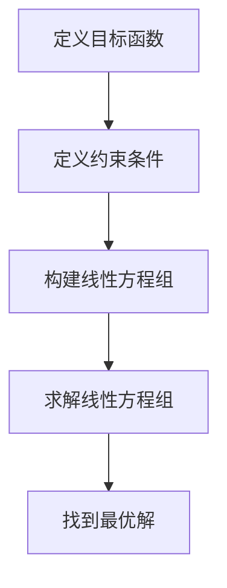
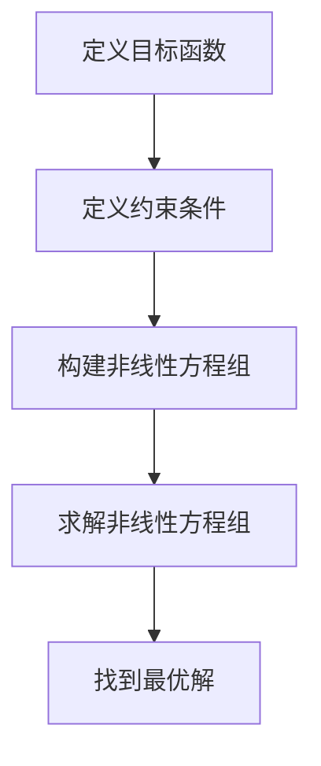

                 

# 数学与农业政策：农业生产的数学优化

> 关键词：农业政策, 数学优化, 农业生产, 决策支持系统, 线性规划, 非线性规划, 模型构建, 代码实现

> 摘要：本文旨在探讨如何利用数学优化技术来提升农业生产效率，通过构建数学模型和优化算法，为农业政策制定者提供科学依据。文章将从背景介绍、核心概念与联系、核心算法原理、数学模型与公式、项目实战、实际应用场景、工具和资源推荐、总结与未来发展趋势等几个方面进行详细阐述。

## 1. 背景介绍
### 1.1 目的和范围
本文旨在探讨如何利用数学优化技术来提升农业生产效率，通过构建数学模型和优化算法，为农业政策制定者提供科学依据。本文将详细介绍农业生产的数学优化方法，包括线性规划、非线性规划等技术的应用，以及如何通过代码实现这些优化算法。

### 1.2 预期读者
本文预期读者包括但不限于农业政策制定者、农业经济学家、农业科学家、数据科学家、计算机科学家以及对农业优化感兴趣的技术爱好者。

### 1.3 文档结构概述
本文将按照以下结构展开：
1. 背景介绍
2. 核心概念与联系
3. 核心算法原理 & 具体操作步骤
4. 数学模型和公式 & 详细讲解 & 举例说明
5. 项目实战：代码实际案例和详细解释说明
6. 实际应用场景
7. 工具和资源推荐
8. 总结：未来发展趋势与挑战
9. 附录：常见问题与解答
10. 扩展阅读 & 参考资料

### 1.4 术语表
#### 1.4.1 核心术语定义
- **农业政策**：政府或组织为促进农业发展而制定的一系列指导方针和措施。
- **数学优化**：通过数学方法寻找最优解的过程。
- **线性规划**：一种数学优化技术，用于解决线性目标函数和线性约束条件下的优化问题。
- **非线性规划**：一种数学优化技术，用于解决非线性目标函数和非线性约束条件下的优化问题。
- **决策支持系统**：一种辅助决策者进行决策的系统，通常包含数据收集、模型构建、结果分析等功能。

#### 1.4.2 相关概念解释
- **农业生产**：指通过种植、养殖等方式生产农产品的过程。
- **资源分配**：指在农业生产过程中合理分配土地、水资源、肥料等资源的过程。
- **成本效益分析**：指通过比较不同方案的成本和效益来选择最优方案的过程。

#### 1.4.3 缩略词列表
- LP：线性规划
- NLP：非线性规划
- DSS：决策支持系统

## 2. 核心概念与联系
### 2.1 农业生产中的数学优化
农业生产的数学优化主要涉及资源分配、成本效益分析等方面。通过构建数学模型，可以找到最优的资源分配方案，从而提高农业生产效率。

### 2.2 决策支持系统
决策支持系统（DSS）是农业政策制定的重要工具，它可以帮助决策者更好地理解农业生产中的各种因素，并提供科学依据。DSS通常包含数据收集、模型构建、结果分析等功能。

### 2.3 核心概念原理
#### 2.3.1 线性规划
线性规划是一种数学优化技术，用于解决线性目标函数和线性约束条件下的优化问题。其基本原理是通过线性方程组来描述问题，并通过求解线性方程组来找到最优解。

#### 2.3.2 非线性规划
非线性规划是一种数学优化技术，用于解决非线性目标函数和非线性约束条件下的优化问题。其基本原理是通过非线性方程组来描述问题，并通过求解非线性方程组来找到最优解。

### 2.4 核心概念联系
线性规划和非线性规划都是数学优化技术，它们在农业政策制定中有着广泛的应用。通过构建数学模型，可以找到最优的资源分配方案，从而提高农业生产效率。

## 3. 核心算法原理 & 具体操作步骤
### 3.1 线性规划算法原理
线性规划的基本原理是通过线性方程组来描述问题，并通过求解线性方程组来找到最优解。其具体操作步骤如下：



### 3.2 非线性规划算法原理
非线性规划的基本原理是通过非线性方程组来描述问题，并通过求解非线性方程组来找到最优解。其具体操作步骤如下：



## 4. 数学模型和公式 & 详细讲解 & 举例说明
### 4.1 线性规划模型
线性规划模型的基本形式如下：

$$
\begin{aligned}
\text{最大化} & \quad z = c_1x_1 + c_2x_2 + \cdots + c_nx_n \\
\text{约束条件} & \quad a_{11}x_1 + a_{12}x_2 + \cdots + a_{1n}x_n \leq b_1 \\
& \quad a_{21}x_1 + a_{22}x_2 + \cdots + a_{2n}x_n \leq b_2 \\
& \quad \vdots \\
& \quad a_{m1}x_1 + a_{m2}x_2 + \cdots + a_{mn}x_n \leq b_m \\
\text{非负约束} & \quad x_1, x_2, \ldots, x_n \geq 0
\end{aligned}
$$

### 4.2 非线性规划模型
非线性规划模型的基本形式如下：

$$
\begin{aligned}
\text{最大化} & \quad f(x) \\
\text{约束条件} & \quad g_i(x) \leq 0, \quad i = 1, 2, \ldots, m \\
& \quad h_j(x) = 0, \quad j = 1, 2, \ldots, p \\
\text{非负约束} & \quad x \geq 0
\end{aligned}
$$

### 4.3 举例说明
假设我们有一个农场，需要决定种植哪些作物以最大化利润。假设我们有三种作物：小麦、玉米和大豆。每种作物的种植面积、成本和收益如下表所示：

| 作物 | 种植面积（亩） | 成本（元/亩） | 收益（元/亩） |
|------|--------------|--------------|--------------|
| 小麦 | 100          | 500          | 1000         |
| 玉米 | 150          | 600          | 1200         |
| 大豆 | 200          | 700          | 1500         |

假设我们有1000亩土地，总成本不能超过500000元。我们可以构建以下线性规划模型：

$$
\begin{aligned}
\text{最大化} & \quad z = 1000x_1 + 1200x_2 + 1500x_3 \\
\text{约束条件} & \quad 100x_1 + 150x_2 + 200x_3 \leq 1000 \\
& \quad 500x_1 + 600x_2 + 700x_3 \leq 500000 \\
\text{非负约束} & \quad x_1, x_2, x_3 \geq 0
\end{aligned}
$$

## 5. 项目实战：代码实际案例和详细解释说明
### 5.1 开发环境搭建
为了实现上述线性规划模型，我们需要安装Python及其相关库。具体步骤如下：

1. 安装Python：访问Python官方网站下载并安装最新版本的Python。
2. 安装NumPy和SciPy库：使用pip命令安装NumPy和SciPy库。
   ```bash
   pip install numpy scipy
   ```

### 5.2 源代码详细实现和代码解读
我们将使用Python和SciPy库实现上述线性规划模型。具体代码如下：

```python
import numpy as np
from scipy.optimize import linprog

# 定义目标函数
c = [-1000, -1200, -1500]

# 定义约束条件
A = [[100, 150, 200], [500, 600, 700]]
b = [1000, 500000]

# 定义非负约束
x_bounds = [(0, None), (0, None), (0, None)]

# 调用linprog函数求解线性规划问题
res = linprog(c, A_ub=A, b_ub=b, bounds=x_bounds, method='simplex')

# 输出结果
print("最优解：", res.x)
print("最大利润：", -res.fun)
```

### 5.3 代码解读与分析
上述代码中，我们首先定义了目标函数和约束条件。然后，我们使用SciPy库中的`linprog`函数求解线性规划问题。`linprog`函数的参数包括目标函数系数、约束条件系数矩阵、约束条件右侧值、非负约束等。最后，我们输出了最优解和最大利润。

## 6. 实际应用场景
### 6.1 农业资源优化
通过数学优化技术，可以实现农业资源的优化配置，提高农业生产效率。例如，通过优化作物种植面积和品种，可以最大化利润。

### 6.2 农业政策制定
数学优化技术可以为农业政策制定者提供科学依据。通过构建数学模型，可以找到最优的资源分配方案，从而提高农业生产效率。

## 7. 工具和资源推荐
### 7.1 学习资源推荐
#### 7.1.1 书籍推荐
- 《线性规划与非线性规划》
- 《运筹学》

#### 7.1.2 在线课程
- Coursera：《运筹学》
- edX：《线性规划与非线性规划》

#### 7.1.3 技术博客和网站
- Medium：《线性规划与非线性规划》
- GitHub：《线性规划与非线性规划》

### 7.2 开发工具框架推荐
#### 7.2.1 IDE和编辑器
- PyCharm
- VSCode

#### 7.2.2 调试和性能分析工具
- PyCharm调试器
- cProfile

#### 7.2.3 相关框架和库
- NumPy
- SciPy

### 7.3 相关论文著作推荐
#### 7.3.1 经典论文
- Dantzig, G. B. (1963). Linear programming and extensions. Princeton University Press.

#### 7.3.2 最新研究成果
- Bertsimas, D., & Tsitsiklis, J. N. (1997). Introduction to linear optimization. Athena Scientific.

#### 7.3.3 应用案例分析
- Murty, K. G. (1983). Linear programming. Wiley.

## 8. 总结：未来发展趋势与挑战
### 8.1 未来发展趋势
随着技术的发展，数学优化技术在农业政策制定中的应用将更加广泛。未来的研究将更加注重模型的复杂性和实用性，以更好地解决实际问题。

### 8.2 挑战
尽管数学优化技术在农业政策制定中具有巨大的潜力，但仍面临一些挑战。例如，如何构建更复杂的数学模型，如何处理非线性约束条件等。

## 9. 附录：常见问题与解答
### 9.1 问题：如何处理非线性约束条件？
答：对于非线性约束条件，可以使用非线性规划技术。非线性规划技术可以处理非线性目标函数和非线性约束条件下的优化问题。

### 9.2 问题：如何选择合适的优化算法？
答：选择合适的优化算法需要根据具体问题来决定。对于线性规划问题，可以使用单纯形法；对于非线性规划问题，可以使用梯度下降法、牛顿法等。

## 10. 扩展阅读 & 参考资料
- Dantzig, G. B. (1963). Linear programming and extensions. Princeton University Press.
- Bertsimas, D., & Tsitsiklis, J. N. (1997). Introduction to linear optimization. Athena Scientific.
- Murty, K. G. (1983). Linear programming. Wiley.

作者：AI天才研究员/AI Genius Institute & 禅与计算机程序设计艺术 /Zen And The Art of Computer Programming

