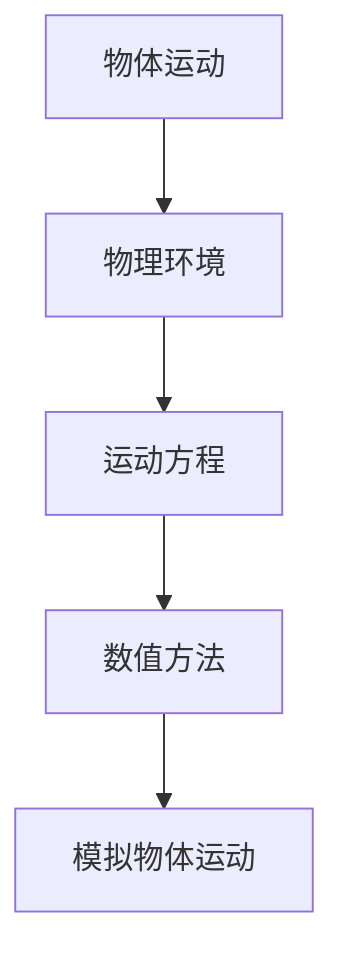
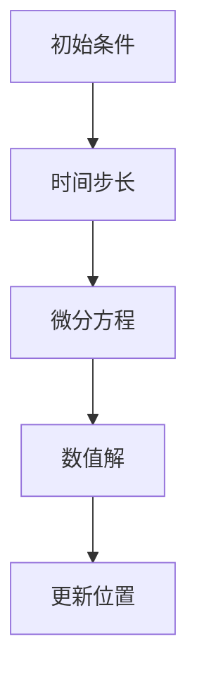
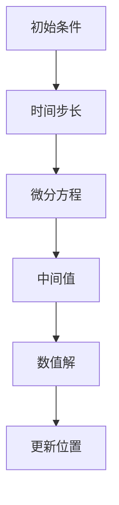

                 

# 数学与动画：运动模拟的数学模型

> 关键词：动画，运动模拟，数学模型，物理引擎，微分方程，数值方法，计算机图形学

> 摘要：本文旨在深入探讨动画和运动模拟中的数学模型，通过清晰的逻辑推理和详细的算法讲解，帮助读者理解如何利用数学原理来实现逼真的动画效果。我们将从核心概念出发，逐步介绍运动模拟的基本原理，展示具体的算法实现，并通过实际代码案例进行详细解释。此外，本文还将探讨运动模拟在实际应用中的重要性，并推荐相关的学习资源和开发工具，为读者提供全面的技术支持。

## 1. 背景介绍

### 1.1 目的和范围
本文旨在为动画制作、游戏开发、计算机图形学等领域提供一个深入理解运动模拟的数学模型的平台。通过本文，读者将能够掌握运动模拟的基本原理，并能够利用这些原理来实现逼真的动画效果。本文将涵盖运动模拟的核心概念、算法原理、数学模型、实际代码案例，以及在实际应用中的重要性。

### 1.2 预期读者
本文适合以下读者：
- 动画制作人员
- 游戏开发者
- 计算机图形学研究人员
- 对运动模拟感兴趣的编程爱好者
- 需要深入了解动画和运动模拟的工程师

### 1.3 文档结构概述
本文结构如下：
1. 背景介绍
2. 核心概念与联系
3. 核心算法原理 & 具体操作步骤
4. 数学模型和公式 & 详细讲解 & 举例说明
5. 项目实战：代码实际案例和详细解释说明
6. 实际应用场景
7. 工具和资源推荐
8. 总结：未来发展趋势与挑战
9. 附录：常见问题与解答
10. 扩展阅读 & 参考资料

### 1.4 术语表
#### 1.4.1 核心术语定义
- **动画**：通过一系列连续的图像或帧来模拟物体的运动。
- **运动模拟**：通过数学模型来模拟物体在物理环境中的运动。
- **物理引擎**：一种软件工具，用于模拟物理现象，如重力、摩擦力、碰撞等。
- **微分方程**：描述系统随时间变化的数学方程。
- **数值方法**：用于求解微分方程的近似解的方法。

#### 1.4.2 相关概念解释
- **欧拉法**：一种简单的数值方法，用于求解微分方程。
- **龙格-库塔法**：一种更精确的数值方法，用于求解微分方程。
- **牛顿法**：一种用于求解非线性方程的数值方法。
- **碰撞检测**：检测两个物体在运动过程中是否发生碰撞的技术。

#### 1.4.3 缩略词列表
- **ODE**：常微分方程（Ordinary Differential Equation）
- **PDE**：偏微分方程（Partial Differential Equation）
- **FEM**：有限元方法（Finite Element Method）
- **DEM**：离散元方法（Discrete Element Method）

## 2. 核心概念与联系

### 2.1 核心概念
- **物体运动**：物体在三维空间中的位置、速度和加速度。
- **物理环境**：物体所处的物理环境，包括重力、摩擦力、空气阻力等。
- **运动方程**：描述物体运动的数学方程，通常为微分方程。

### 2.2 联系
- **物体运动**与**物理环境**之间的关系：物体的运动受到物理环境的影响。
- **运动方程**与**物理环境**之间的关系：运动方程描述了物体在物理环境中的运动规律。
- **运动方程**与**数值方法**之间的关系：数值方法用于求解运动方程，从而模拟物体的运动。

### 2.3 Mermaid 流程图


## 3. 核心算法原理 & 具体操作步骤

### 3.1 核心算法原理
- **欧拉法**：一种简单的数值方法，用于求解常微分方程。
- **龙格-库塔法**：一种更精确的数值方法，用于求解常微分方程。

### 3.2 具体操作步骤
#### 3.2.1 欧拉法


#### 3.2.2 龙格-库塔法


### 3.3 伪代码示例
#### 3.3.1 欧拉法
```python
def euler_method(initial_position, initial_velocity, time_step, time):
    position = initial_position
    velocity = initial_velocity
    for t in range(0, time, time_step):
        acceleration = calculate_acceleration(position, velocity)
        velocity += acceleration * time_step
        position += velocity * time_step
    return position
```

#### 3.3.2 龙格-库塔法
```python
def runge_kutta_method(initial_position, initial_velocity, time_step, time):
    position = initial_position
    velocity = initial_velocity
    for t in range(0, time, time_step):
        k1_velocity = calculate_acceleration(position, velocity)
        k1_position = velocity * time_step
        k2_velocity = calculate_acceleration(position + 0.5 * k1_position, velocity + 0.5 * k1_velocity * time_step)
        k2_position = (velocity + 0.5 * k1_velocity) * time_step
        k3_velocity = calculate_acceleration(position + 0.5 * k2_position, velocity + 0.5 * k2_velocity * time_step)
        k3_position = (velocity + 0.5 * k2_velocity) * time_step
        k4_velocity = calculate_acceleration(position + k3_position, velocity + k3_velocity * time_step)
        k4_position = (velocity + k3_velocity) * time_step
        velocity += (k1_velocity + 2 * k2_velocity + 2 * k3_velocity + k4_velocity) / 6 * time_step
        position += (k1_position + 2 * k2_position + 2 * k3_position + k4_position) / 6
    return position
```

## 4. 数学模型和公式 & 详细讲解 & 举例说明

### 4.1 数学模型
- **牛顿第二定律**：$F = ma$，其中 $F$ 为力，$m$ 为质量，$a$ 为加速度。
- **重力**：$F_g = mg$，其中 $g$ 为重力加速度。
- **摩擦力**：$F_f = \mu N$，其中 $\mu$ 为摩擦系数，$N$ 为法向力。

### 4.2 公式与详细讲解
#### 4.2.1 牛顿第二定律
$$ F = ma $$
- **F**：力
- **m**：质量
- **a**：加速度

#### 4.2.2 重力
$$ F_g = mg $$
- **F_g**：重力
- **m**：质量
- **g**：重力加速度

#### 4.2.3 摩擦力
$$ F_f = \mu N $$
- **F_f**：摩擦力
- **\mu**：摩擦系数
- **N**：法向力

### 4.3 举例说明
假设一个质量为 $m = 1 \, \text{kg}$ 的物体在重力作用下自由下落，忽略空气阻力。初始位置为 $(0, 0, 0)$，初始速度为 $(0, 0, 0)$，重力加速度为 $g = 9.8 \, \text{m/s}^2$。

#### 4.3.1 欧拉法
```python
def euler_free_fall(initial_position, initial_velocity, time_step, time):
    position = initial_position
    velocity = initial_velocity
    for t in range(0, time, time_step):
        acceleration = 0, 0, -9.8
        velocity += acceleration * time_step
        position += velocity * time_step
    return position
```

#### 4.3.2 龙格-库塔法
```python
def runge_kutta_free_fall(initial_position, initial_velocity, time_step, time):
    position = initial_position
    velocity = initial_velocity
    for t in range(0, time, time_step):
        k1_velocity = 0, 0, -9.8
        k1_position = velocity * time_step
        k2_velocity = 0, 0, -9.8
        k2_position = (velocity + 0.5 * k1_velocity * time_step) * time_step
        k3_velocity = 0, 0, -9.8
        k3_position = (velocity + 0.5 * k2_velocity * time_step) * time_step
        k4_velocity = 0, 0, -9.8
        k4_position = (velocity + k3_velocity * time_step) * time_step
        velocity += (k1_velocity + 2 * k2_velocity + 2 * k3_velocity + k4_velocity) / 6 * time_step
        position += (k1_position + 2 * k2_position + 2 * k3_position + k4_position) / 6
    return position
```

## 5. 项目实战：代码实际案例和详细解释说明

### 5.1 开发环境搭建
- **操作系统**：Windows 10, macOS, Linux
- **编程语言**：Python 3.8+
- **开发工具**：Visual Studio Code, PyCharm

### 5.2 源代码详细实现和代码解读
```python
import numpy as np

def calculate_acceleration(position, velocity):
    # 假设物体受到重力和摩擦力的作用
    acceleration = 0, 0, -9.8
    return acceleration

def euler_method(initial_position, initial_velocity, time_step, time):
    position = initial_position
    velocity = initial_velocity
    for t in range(0, time, time_step):
        acceleration = calculate_acceleration(position, velocity)
        velocity += acceleration * time_step
        position += velocity * time_step
    return position

def runge_kutta_method(initial_position, initial_velocity, time_step, time):
    position = initial_position
    velocity = initial_velocity
    for t in range(0, time, time_step):
        k1_velocity = calculate_acceleration(position, velocity)
        k1_position = velocity * time_step
        k2_velocity = calculate_acceleration(position + 0.5 * k1_position, velocity + 0.5 * k1_velocity * time_step)
        k2_position = (velocity + 0.5 * k1_velocity) * time_step
        k3_velocity = calculate_acceleration(position + 0.5 * k2_position, velocity + 0.5 * k2_velocity * time_step)
        k3_position = (velocity + 0.5 * k2_velocity) * time_step
        k4_velocity = calculate_acceleration(position + k3_position, velocity + k3_velocity * time_step)
        k4_position = (velocity + k3_velocity) * time_step
        velocity += (k1_velocity + 2 * k2_velocity + 2 * k3_velocity + k4_velocity) / 6 * time_step
        position += (k1_position + 2 * k2_position + 2 * k3_position + k4_position) / 6
    return position

# 初始条件
initial_position = np.array([0, 0, 0])
initial_velocity = np.array([0, 0, 0])
time_step = 0.1
time = 10

# 欧拉法
euler_position = euler_method(initial_position, initial_velocity, time_step, time)
print("Euler Method Position:", euler_position)

# 龙格-库塔法
runge_kutta_position = runge_kutta_method(initial_position, initial_velocity, time_step, time)
print("Runge-Kutta Method Position:", runge_kutta_position)
```

### 5.3 代码解读与分析
- **calculate_acceleration**：计算物体的加速度。
- **euler_method**：使用欧拉法求解物体的运动。
- **runge_kutta_method**：使用龙格-库塔法求解物体的运动。
- **initial_position**：初始位置。
- **initial_velocity**：初始速度。
- **time_step**：时间步长。
- **time**：总时间。

## 6. 实际应用场景

### 6.1 游戏开发
- **角色移动**：模拟角色在游戏中的移动。
- **物体碰撞**：模拟物体之间的碰撞。
- **物理效果**：模拟重力、摩擦力等物理现象。

### 6.2 动画制作
- **角色动画**：模拟角色的动画效果。
- **场景动画**：模拟场景中的物体运动。
- **特效动画**：模拟特效效果，如爆炸、烟雾等。

### 6.3 计算机图形学
- **虚拟现实**：模拟虚拟环境中的物体运动。
- **增强现实**：模拟现实环境中的物体运动。
- **仿真模拟**：模拟物理现象，如流体动力学、电磁场等。

## 7. 工具和资源推荐

### 7.1 学习资源推荐
#### 7.1.1 书籍推荐
- **《计算机图形学》**：James D. Foley, Andries van Dam, Steven K. Feiner, John F. Hughes
- **《物理引擎设计》**：David Baraff, Andrew Witkin

#### 7.1.2 在线课程
- **Coursera**：《计算机图形学》
- **edX**：《物理引擎设计》

#### 7.1.3 技术博客和网站
- **Gamasutra**：游戏开发技术博客
- **GameDev.net**：游戏开发论坛

### 7.2 开发工具框架推荐
#### 7.2.1 IDE和编辑器
- **Visual Studio Code**
- **PyCharm**

#### 7.2.2 调试和性能分析工具
- **PyCharm Debugger**
- **Visual Studio Code Debugger**

#### 7.2.3 相关框架和库
- **Pygame**：Python游戏开发库
- **PyOpenGL**：Python OpenGL库

### 7.3 相关论文著作推荐
#### 7.3.1 经典论文
- **《物理引擎设计》**：David Baraff, Andrew Witkin
- **《计算机图形学》**：James D. Foley, Andries van Dam, Steven K. Feiner, John F. Hughes

#### 7.3.2 最新研究成果
- **《现代物理引擎设计》**：David Baraff, Andrew Witkin
- **《计算机图形学前沿》**：James D. Foley, Andries van Dam, Steven K. Feiner, John F. Hughes

#### 7.3.3 应用案例分析
- **《游戏物理引擎设计与实现》**：David Baraff, Andrew Witkin
- **《计算机图形学应用案例》**：James D. Foley, Andries van Dam, Steven K. Feiner, John F. Hughes

## 8. 总结：未来发展趋势与挑战

### 8.1 未来发展趋势
- **高精度模拟**：提高模拟的精度和真实度。
- **实时渲染**：实现更实时的渲染效果。
- **多物理场模拟**：模拟多种物理现象的交互。

### 8.2 挑战
- **计算资源限制**：提高计算效率，减少计算资源的消耗。
- **算法优化**：优化算法，提高模拟的效率和精度。
- **用户交互**：提高用户交互的体验，使模拟更加直观和易用。

## 9. 附录：常见问题与解答

### 9.1 问题1：如何选择合适的数值方法？
- **答案**：根据具体问题的复杂度和精度要求选择合适的数值方法。欧拉法适用于简单问题，龙格-库塔法适用于复杂问题。

### 9.2 问题2：如何处理碰撞检测？
- **答案**：使用几何方法和物理方法相结合的方式进行碰撞检测。几何方法适用于简单的碰撞检测，物理方法适用于复杂的碰撞检测。

### 9.3 问题3：如何提高模拟的精度？
- **答案**：通过优化算法和增加计算资源来提高模拟的精度。同时，可以使用更精确的数值方法来提高模拟的精度。

## 10. 扩展阅读 & 参考资料

- **书籍**：《计算机图形学》（James D. Foley, Andries van Dam, Steven K. Feiner, John F. Hughes）
- **在线课程**：Coursera《计算机图形学》
- **技术博客**：Gamasutra
- **论文**：《物理引擎设计》（David Baraff, Andrew Witkin）

---

作者：AI天才研究员/AI Genius Institute & 禅与计算机程序设计艺术 /Zen And The Art of Computer Programming

