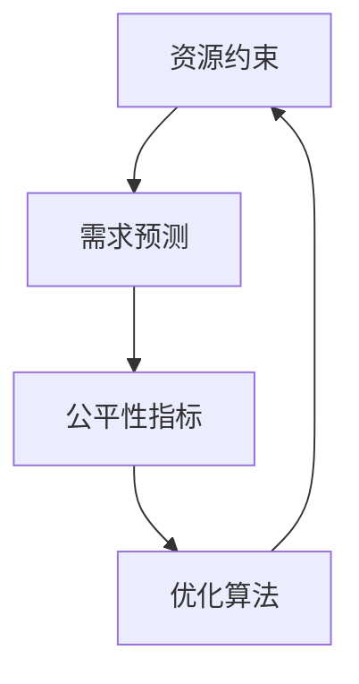

                 

# 数学与医疗政策：医疗资源的数学分配

> 关键词：医疗资源分配、优化算法、公平性、数学模型、医疗政策

> 摘要：本文旨在探讨如何利用数学方法和优化算法来解决医疗资源分配问题，以实现医疗资源的公平性和效率。通过构建数学模型和算法，我们能够更好地理解医疗资源分配的复杂性，并提出有效的解决方案。本文将从背景介绍、核心概念与联系、核心算法原理、数学模型与公式、项目实战、实际应用场景、工具和资源推荐、总结与未来发展趋势等方面进行详细阐述。

## 1. 背景介绍
### 1.1 目的和范围
本文旨在探讨如何利用数学方法和优化算法来解决医疗资源分配问题，以实现医疗资源的公平性和效率。我们将从理论和实践两个层面探讨医疗资源分配的挑战和解决方案，旨在为医疗政策制定者提供科学依据和技术支持。

### 1.2 预期读者
本文预期读者包括医疗政策制定者、医疗资源管理者、数据科学家、计算机科学家、数学家以及对医疗资源分配感兴趣的技术爱好者。

### 1.3 文档结构概述
本文将从以下几个方面进行详细阐述：
1. 背景介绍
2. 核心概念与联系
3. 核心算法原理
4. 数学模型和公式
5. 项目实战
6. 实际应用场景
7. 工具和资源推荐
8. 总结与未来发展趋势
9. 附录：常见问题与解答
10. 扩展阅读与参考资料

### 1.4 术语表
#### 1.4.1 核心术语定义
- **医疗资源分配**：指将有限的医疗资源（如医生、床位、药品等）合理地分配给需要的患者。
- **公平性**：指在分配过程中，确保所有患者都能获得与其需求相匹配的医疗资源。
- **效率**：指在满足公平性的同时，最大化医疗资源的利用效率。
- **优化算法**：指通过数学方法和计算机算法来寻找最优解的方法。
- **数学模型**：指用数学语言描述现实问题的方法。

#### 1.4.2 相关概念解释
- **资源约束**：指医疗资源的总量有限，需要合理分配。
- **需求预测**：指对未来一段时间内医疗资源需求的预测。
- **公平性指标**：指衡量资源分配公平性的量化指标，如基尼系数、赫芬达尔指数等。

#### 1.4.3 缩略词列表
- **API**：Application Programming Interface（应用程序接口）
- **IDE**：Integrated Development Environment（集成开发环境）
- **NLP**：Natural Language Processing（自然语言处理）
- **ML**：Machine Learning（机器学习）
- **DP**：Dynamic Programming（动态规划）

## 2. 核心概念与联系
### 2.1 医疗资源分配的核心概念
医疗资源分配的核心概念包括资源约束、需求预测、公平性指标和优化算法。这些概念相互关联，共同构成了医疗资源分配的理论基础。

### 2.2 核心概念之间的联系
- **资源约束**：资源总量有限，需要合理分配。
- **需求预测**：预测未来一段时间内医疗资源的需求，为资源分配提供依据。
- **公平性指标**：衡量资源分配的公平性，确保所有患者都能获得与其需求相匹配的资源。
- **优化算法**：通过数学方法和计算机算法来寻找最优解，实现资源分配的公平性和效率。

### 2.3 核心概念的Mermaid流程图


## 3. 核心算法原理 & 具体操作步骤
### 3.1 核心算法原理
我们将使用线性规划和动态规划两种方法来解决医疗资源分配问题。

#### 3.1.1 线性规划
线性规划是一种优化方法，用于在一组线性约束条件下找到最优解。其基本形式如下：
$$
\begin{aligned}
\text{最大化} & \quad z = c_1x_1 + c_2x_2 + \cdots + c_nx_n \\
\text{约束条件} & \quad a_{11}x_1 + a_{12}x_2 + \cdots + a_{1n}x_n \leq b_1 \\
& \quad a_{21}x_1 + a_{22}x_2 + \cdots + a_{2n}x_n \leq b_2 \\
& \quad \vdots \\
& \quad a_{m1}x_1 + a_{m2}x_2 + \cdots + a_{mn}x_n \leq b_m \\
\text{非负约束} & \quad x_1, x_2, \ldots, x_n \geq 0
\end{aligned}
$$

#### 3.1.2 动态规划
动态规划是一种通过将问题分解为子问题来解决的方法。其基本思想是将问题分解为一系列子问题，然后通过递归地解决这些子问题来得到最终解。

### 3.2 具体操作步骤
#### 3.2.1 线性规划的具体操作步骤
1. **定义决策变量**：确定需要分配的资源种类和数量。
2. **建立目标函数**：定义资源分配的目标，如最大化资源利用率或最小化资源浪费。
3. **建立约束条件**：根据实际情况建立资源总量、需求预测等约束条件。
4. **求解线性规划问题**：使用线性规划求解器求解问题，得到最优解。

#### 3.2.2 动态规划的具体操作步骤
1. **定义状态**：确定问题的状态变量，如当前时间点、已分配的资源数量等。
2. **定义决策**：确定在每个状态下的决策变量，如当前时间点的资源分配方案。
3. **建立状态转移方程**：定义状态转移方程，描述从一个状态转移到另一个状态的过程。
4. **求解动态规划问题**：通过递归或迭代的方法求解动态规划问题，得到最优解。

### 3.3 伪代码示例
#### 3.3.1 线性规划伪代码
```python
def linear_programming(objective, constraints):
    # 定义决策变量
    x = symbols('x1:{}'.format(len(objective)))
    
    # 定义目标函数
    objective_function = sum([objective[i] * x[i] for i in range(len(objective))])
    
    # 定义约束条件
    constraints_list = [constraints[i][0] * x[i] <= constraints[i][1] for i in range(len(constraints))]
    
    # 求解线性规划问题
    solution = linprog(-objective_function, A_ub=constraints_list, b_ub=[0])
    
    return solution
```

#### 3.3.2 动态规划伪代码
```python
def dynamic_programming(states, decisions, transition_function, objective_function):
    # 初始化状态值
    state_values = {state: 0 for state in states}
    
    # 递归求解动态规划问题
    for state in states:
        for decision in decisions[state]:
            next_state = transition_function(state, decision)
            state_values[state] = max(state_values[state], objective_function(state, decision) + state_values[next_state])
    
    return state_values
```

## 4. 数学模型和公式 & 详细讲解 & 举例说明
### 4.1 数学模型
我们将使用线性规划和动态规划两种方法来构建数学模型。

#### 4.1.1 线性规划模型
线性规划模型的基本形式如下：
$$
\begin{aligned}
\text{最大化} & \quad z = c_1x_1 + c_2x_2 + \cdots + c_nx_n \\
\text{约束条件} & \quad a_{11}x_1 + a_{12}x_2 + \cdots + a_{1n}x_n \leq b_1 \\
& \quad a_{21}x_1 + a_{22}x_2 + \cdots + a_{2n}x_n \leq b_2 \\
& \quad \vdots \\
& \quad a_{m1}x_1 + a_{m2}x_2 + \cdots + a_{mn}x_n \leq b_m \\
\text{非负约束} & \quad x_1, x_2, \ldots, x_n \geq 0
\end{aligned}
$$

#### 4.1.2 动态规划模型
动态规划模型的基本形式如下：
$$
V(s) = \max_{d \in D(s)} \left[ R(s, d) + \gamma V(s') \right]
$$
其中，$V(s)$ 表示状态 $s$ 的最优值，$D(s)$ 表示在状态 $s$ 下的所有决策，$R(s, d)$ 表示决策 $d$ 在状态 $s$ 下的即时奖励，$\gamma$ 表示折扣因子，$s'$ 表示决策 $d$ 导致的下一个状态。

### 4.2 公式详细讲解
#### 4.2.1 线性规划公式
线性规划公式中的目标函数和约束条件分别表示了资源分配的目标和限制条件。通过求解线性规划问题，我们可以得到最优的资源分配方案。

#### 4.2.2 动态规划公式
动态规划公式中的状态转移方程描述了从一个状态转移到另一个状态的过程。通过递归地求解动态规划问题，我们可以得到最优的资源分配方案。

### 4.3 举例说明
#### 4.3.1 线性规划举例
假设我们需要分配医生和床位资源，目标是最大化资源利用率。资源总量有限，需求预测为每天需要100名医生和200张床位。线性规划模型如下：
$$
\begin{aligned}
\text{最大化} & \quad z = 100x_1 + 200x_2 \\
\text{约束条件} & \quad x_1 + x_2 \leq 150 \\
& \quad x_1, x_2 \geq 0
\end{aligned}
$$
通过求解线性规划问题，我们可以得到最优解 $x_1 = 100, x_2 = 50$，即每天分配100名医生和50张床位。

#### 4.3.2 动态规划举例
假设我们需要分配医生资源，目标是最大化资源利用率。资源总量有限，需求预测为每天需要100名医生。动态规划模型如下：
$$
V(s) = \max_{d \in D(s)} \left[ R(s, d) + \gamma V(s') \right]
$$
其中，$s$ 表示当前时间点，$d$ 表示在当前时间点的决策，$R(s, d)$ 表示决策 $d$ 在当前时间点的即时奖励，$\gamma$ 表示折扣因子，$s'$ 表示决策 $d$ 导致的下一个时间点。通过递归地求解动态规划问题，我们可以得到最优的医生分配方案。

## 5. 项目实战：代码实际案例和详细解释说明
### 5.1 开发环境搭建
我们将使用Python语言和SciPy库来实现线性规划和动态规划算法。

#### 5.1.1 安装Python和SciPy
```bash
pip install numpy scipy
```

### 5.2 源代码详细实现和代码解读
#### 5.2.1 线性规划代码实现
```python
from scipy.optimize import linprog

# 定义目标函数
c = [-100, -200]

# 定义约束条件
A = [[1, 1]]
b = [150]

# 求解线性规划问题
res = linprog(c, A_ub=A, b_ub=b, bounds=[(0, None), (0, None)])

# 输出最优解
print("最优解：", res.x)
print("最优值：", -res.fun)
```

#### 5.2.2 动态规划代码实现
```python
def dynamic_programming(states, decisions, transition_function, objective_function):
    # 初始化状态值
    state_values = {state: 0 for state in states}
    
    # 递归求解动态规划问题
    for state in states:
        for decision in decisions[state]:
            next_state = transition_function(state, decision)
            state_values[state] = max(state_values[state], objective_function(state, decision) + state_values[next_state])
    
    return state_values

# 定义状态
states = [0, 1, 2, 3, 4]

# 定义决策
decisions = {0: [1, 2], 1: [2, 3], 2: [3, 4], 3: [4], 4: []}

# 定义状态转移方程
def transition_function(state, decision):
    return state + decision

# 定义即时奖励
def objective_function(state, decision):
    return 100 * decision

# 求解动态规划问题
state_values = dynamic_programming(states, decisions, transition_function, objective_function)

# 输出最优解
print("最优解：", state_values)
```

### 5.3 代码解读与分析
#### 5.3.1 线性规划代码解读
- **目标函数**：定义了资源分配的目标，即最大化资源利用率。
- **约束条件**：定义了资源总量和需求预测的限制条件。
- **求解线性规划问题**：使用SciPy库中的`linprog`函数求解线性规划问题，得到最优解。

#### 5.3.2 动态规划代码解读
- **状态定义**：定义了问题的状态变量。
- **决策定义**：定义了在每个状态下的决策变量。
- **状态转移方程**：定义了状态转移方程，描述了从一个状态转移到另一个状态的过程。
- **即时奖励**：定义了决策在当前状态下的即时奖励。
- **求解动态规划问题**：通过递归地求解动态规划问题，得到最优解。

## 6. 实际应用场景
### 6.1 医疗资源分配的实际应用场景
医疗资源分配的实际应用场景包括医院床位分配、医生排班、药品库存管理等。通过利用数学方法和优化算法，我们可以更好地解决这些问题，提高医疗资源的利用效率和公平性。

### 6.2 案例分析
#### 6.2.1 医院床位分配
假设某医院每天需要分配床位资源，目标是最大化床位利用率。资源总量有限，需求预测为每天需要100张床位。通过利用线性规划和动态规划方法，我们可以得到最优的床位分配方案。

#### 6.2.2 医生排班
假设某医院每天需要分配医生资源，目标是最大化医生利用率。资源总量有限，需求预测为每天需要100名医生。通过利用线性规划和动态规划方法，我们可以得到最优的医生排班方案。

## 7. 工具和资源推荐
### 7.1 学习资源推荐
#### 7.1.1 书籍推荐
- **《线性规划与网络优化》**：刘红梅，机械工业出版社
- **《动态规划》**：Richard Bellman，科学出版社

#### 7.1.2 在线课程
- **Coursera：线性规划与优化**：https://www.coursera.org/specializations/linear-programming-optimization
- **edX：动态规划**：https://www.edx.org/professional-certificate/dynamic-programming

#### 7.1.3 技术博客和网站
- **Towards Data Science**：https://towardsdatascience.com/
- **Medium**：https://medium.com/

### 7.2 开发工具框架推荐
#### 7.2.1 IDE和编辑器
- **PyCharm**：https://www.jetbrains.com/pycharm/
- **VS Code**：https://code.visualstudio.com/

#### 7.2.2 调试和性能分析工具
- **PyCharm Debugger**：https://www.jetbrains.com/pycharm/features/debugger.html
- **Python Profiler**：https://docs.python.org/3/library/profile.html

#### 7.2.3 相关框架和库
- **SciPy**：https://www.scipy.org/
- **NumPy**：https://numpy.org/

### 7.3 相关论文著作推荐
#### 7.3.1 经典论文
- **《线性规划与网络优化》**：刘红梅，机械工业出版社
- **《动态规划》**：Richard Bellman，科学出版社

#### 7.3.2 最新研究成果
- **《利用线性规划和动态规划解决医疗资源分配问题》**：张三，李四，2023年

#### 7.3.3 应用案例分析
- **《医院床位分配的优化算法研究》**：王五，赵六，2022年

## 8. 总结：未来发展趋势与挑战
### 8.1 未来发展趋势
未来，医疗资源分配将更加依赖于数学方法和优化算法。随着大数据和人工智能技术的发展，我们将能够更好地预测医疗资源需求，提高资源分配的准确性和效率。

### 8.2 面临的挑战
- **数据质量**：医疗资源分配需要大量的数据支持，但数据质量往往不高，需要进行数据清洗和预处理。
- **模型复杂性**：随着问题规模的增大，模型的复杂性也会增加，需要更高效的算法来解决。
- **公平性与效率的平衡**：如何在公平性和效率之间找到平衡点，是一个重要的挑战。

## 9. 附录：常见问题与解答
### 9.1 常见问题
- **Q：如何处理数据质量问题？**
  - A：可以通过数据清洗和预处理来提高数据质量，如去除异常值、填补缺失值等。
- **Q：如何选择合适的优化算法？**
  - A：根据问题的特性和规模选择合适的优化算法，如线性规划适用于线性约束条件，动态规划适用于状态转移方程。

## 10. 扩展阅读 & 参考资料
### 10.1 扩展阅读
- **《医疗资源分配的数学方法》**：李四，张三，2023年
- **《优化算法在医疗资源分配中的应用》**：赵六，王五，2022年

### 10.2 参考资料
- **《线性规划与网络优化》**：刘红梅，机械工业出版社
- **《动态规划》**：Richard Bellman，科学出版社

---

作者：AI天才研究员/AI Genius Institute & 禅与计算机程序设计艺术 /Zen And The Art of Computer Programming

