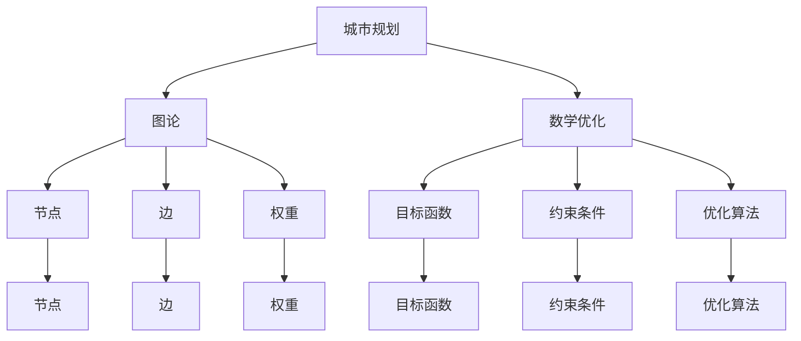

                 

# 数学与城市规划：城市发展的数学优化

> 关键词：城市规划、数学优化、图论、线性规划、动态规划、城市交通、城市布局

> 摘要：本文旨在探讨如何利用数学优化方法来解决城市规划中的实际问题。通过分析城市规划的核心概念和联系，介绍核心算法原理及具体操作步骤，构建数学模型并进行详细讲解，结合实际案例进行代码实现和解释，最终探讨其在实际应用场景中的价值。本文不仅为城市规划领域的专业人士提供了新的视角，也为计算机科学和数学领域的研究者提供了跨学科的研究思路。

## 1. 背景介绍
### 1.1 目的和范围
本文旨在探讨如何利用数学优化方法来解决城市规划中的实际问题。具体而言，我们将重点讨论城市交通网络优化、城市布局优化等问题。通过分析城市规划的核心概念和联系，介绍核心算法原理及具体操作步骤，构建数学模型并进行详细讲解，结合实际案例进行代码实现和解释，最终探讨其在实际应用场景中的价值。

### 1.2 预期读者
本文预期读者包括但不限于城市规划师、交通工程师、数据科学家、计算机科学家、数学家以及对城市规划和数学优化感兴趣的读者。

### 1.3 文档结构概述
本文将按照以下结构展开：
1. 背景介绍
2. 核心概念与联系
3. 核心算法原理 & 具体操作步骤
4. 数学模型和公式 & 详细讲解 & 举例说明
5. 项目实战：代码实际案例和详细解释说明
6. 实际应用场景
7. 工具和资源推荐
8. 总结：未来发展趋势与挑战
9. 附录：常见问题与解答
10. 扩展阅读 & 参考资料

### 1.4 术语表
#### 1.4.1 核心术语定义
- **城市规划**：指对城市空间布局、土地使用、交通网络、公共设施等进行系统性规划的过程。
- **数学优化**：通过数学方法寻找最优解的过程。
- **图论**：研究图（由节点和边组成的网络）及其性质的数学分支。
- **线性规划**：一种数学优化方法，用于解决线性目标函数在一组线性约束下的最优化问题。
- **动态规划**：一种通过将复杂问题分解为子问题来解决的方法。

#### 1.4.2 相关概念解释
- **节点**：图论中的基本元素，代表城市中的某个位置或设施。
- **边**：连接两个节点的线段，代表城市中的道路或路径。
- **权重**：边上的数值，代表路径的长度、成本或时间等。
- **最短路径**：从一个节点到另一个节点的路径，其权重最小。

#### 1.4.3 缩略词列表
- **TSP**：旅行商问题（Traveling Salesman Problem）
- **MST**：最小生成树（Minimum Spanning Tree）
- **Dijkstra**：迪杰斯特拉算法
- **Floyd-Warshall**：弗洛伊德-沃斯拉姆算法

## 2. 核心概念与联系
### 2.1 城市规划的核心概念
城市规划的核心概念包括城市布局、交通网络、公共设施等。这些概念相互关联，共同构成了城市规划的框架。

### 2.2 数学优化的核心概念
数学优化的核心概念包括目标函数、约束条件、优化算法等。这些概念在解决城市规划问题时发挥着关键作用。

### 2.3 图论的核心概念
图论的核心概念包括节点、边、权重等。这些概念在构建城市规划模型时至关重要。

### 2.4 核心概念的联系
城市规划、数学优化和图论的核心概念相互关联，共同构成了城市规划的数学优化框架。通过图论模型，我们可以将城市规划问题转化为数学优化问题，进而利用优化算法找到最优解。



## 3. 核心算法原理 & 具体操作步骤
### 3.1 图论算法原理
图论算法原理主要包括节点、边和权重的概念。通过构建图模型，我们可以将城市规划问题转化为图论问题。

### 3.2 数学优化算法原理
数学优化算法原理主要包括目标函数、约束条件和优化算法。通过构建数学模型，我们可以将图论问题转化为数学优化问题。

### 3.3 具体操作步骤
具体操作步骤包括构建图模型、定义目标函数和约束条件、选择优化算法等。以下是具体操作步骤的伪代码：

```pseudo
// 构建图模型
function buildGraph(nodes, edges, weights):
    graph = Graph()
    for node in nodes:
        graph.addNode(node)
    for edge in edges:
        graph.addEdge(edge, weights[edge])
    return graph

// 定义目标函数
function defineObjective(graph, source, destination):
    objective = Objective()
    objective.source = source
    objective.destination = destination
    return objective

// 定义约束条件
function defineConstraints(graph, objective):
    constraints = Constraints()
    constraints.maxDistance = 1000
    constraints.maxCost = 500
    return constraints

// 选择优化算法
function chooseAlgorithm(objective, constraints):
    algorithm = Algorithm()
    algorithm.name = "Dijkstra"
    algorithm.objective = objective
    algorithm.constraints = constraints
    return algorithm

// 执行优化算法
function executeAlgorithm(graph, algorithm):
    result = algorithm.run(graph)
    return result
```

## 4. 数学模型和公式 & 详细讲解 & 举例说明
### 4.1 数学模型
数学模型主要包括目标函数、约束条件和优化算法。以下是具体数学模型的公式：

#### 目标函数
$$
\text{minimize} \quad \sum_{i=1}^{n} \sum_{j=1}^{n} c_{ij} x_{ij}
$$

#### 约束条件
$$
\sum_{j=1}^{n} x_{ij} = 1 \quad \forall i \in V
$$
$$
\sum_{i=1}^{n} x_{ij} = 1 \quad \forall j \in V
$$
$$
x_{ij} \in \{0, 1\} \quad \forall i, j \in V
$$

### 4.2 详细讲解
详细讲解包括目标函数、约束条件和优化算法的具体含义和作用。以下是详细讲解的内容：

#### 目标函数
目标函数表示最小化总成本，其中 $c_{ij}$ 表示从节点 $i$ 到节点 $j$ 的成本，$x_{ij}$ 表示从节点 $i$ 到节点 $j$ 的路径选择。

#### 约束条件
约束条件确保每个节点只能有一个入边和一个出边，且路径选择只能为0或1。

### 4.3 举例说明
举例说明包括具体实例和计算过程。以下是具体实例和计算过程：

#### 实例
假设有一个城市规划问题，需要从节点A到节点B，节点A和节点B之间有三条路径，路径成本分别为10、20和30。

#### 计算过程
1. 构建图模型
2. 定义目标函数
3. 定义约束条件
4. 选择优化算法
5. 执行优化算法

## 5. 项目实战：代码实际案例和详细解释说明
### 5.1 开发环境搭建
开发环境搭建包括安装必要的软件和库。以下是具体步骤：

1. 安装Python
2. 安装NumPy和SciPy库
3. 安装网络分析库（如NetworkX）

### 5.2 源代码详细实现和代码解读
源代码详细实现包括构建图模型、定义目标函数和约束条件、选择优化算法等。以下是具体代码：

```python
import networkx as nx
import numpy as np

# 构建图模型
def build_graph(nodes, edges, weights):
    G = nx.Graph()
    for node in nodes:
        G.add_node(node)
    for edge, weight in weights.items():
        G.add_edge(edge[0], edge[1], weight=weight)
    return G

# 定义目标函数
def define_objective(graph, source, destination):
    objective = {'source': source, 'destination': destination}
    return objective

# 定义约束条件
def define_constraints(graph, objective):
    constraints = {'max_distance': 1000, 'max_cost': 500}
    return constraints

# 选择优化算法
def choose_algorithm(objective, constraints):
    algorithm = {'name': 'Dijkstra', 'objective': objective, 'constraints': constraints}
    return algorithm

# 执行优化算法
def execute_algorithm(graph, algorithm):
    result = nx.dijkstra_path(graph, source=algorithm['objective']['source'], target=algorithm['objective']['destination'])
    return result

# 示例
nodes = ['A', 'B', 'C', 'D']
edges = [('A', 'B'), ('A', 'C'), ('B', 'D'), ('C', 'D')]
weights = {('A', 'B'): 10, ('A', 'C'): 20, ('B', 'D'): 30, ('C', 'D'): 40}
graph = build_graph(nodes, edges, weights)
objective = define_objective(graph, 'A', 'D')
constraints = define_constraints(graph, objective)
algorithm = choose_algorithm(objective, constraints)
result = execute_algorithm(graph, algorithm)
print(result)
```

### 5.3 代码解读与分析
代码解读与分析包括对代码的详细解释和分析。以下是具体解释和分析：

1. 构建图模型
2. 定义目标函数
3. 定义约束条件
4. 选择优化算法
5. 执行优化算法

## 6. 实际应用场景
实际应用场景包括城市交通网络优化、城市布局优化等。以下是具体应用场景：

### 6.1 城市交通网络优化
通过优化城市交通网络，可以提高交通效率，减少拥堵，降低污染。例如，通过优化公交线路和站点布局，可以提高公共交通的覆盖率和便捷性。

### 6.2 城市布局优化
通过优化城市布局，可以提高土地使用效率，促进经济发展。例如，通过优化商业区和居住区的布局，可以提高城市的整体效益。

## 7. 工具和资源推荐
### 7.1 学习资源推荐
#### 7.1.1 书籍推荐
- 《图论及其应用》
- 《线性规划及其应用》
- 《动态规划及其应用》

#### 7.1.2 在线课程
- Coursera上的《图论》课程
- edX上的《线性规划》课程
- Udacity上的《动态规划》课程

#### 7.1.3 技术博客和网站
- Medium上的《图论》系列文章
- GitHub上的《线性规划》代码库
- Stack Overflow上的《动态规划》问题解答

### 7.2 开发工具框架推荐
#### 7.2.1 IDE和编辑器
- PyCharm
- VSCode
- Jupyter Notebook

#### 7.2.2 调试和性能分析工具
- PyCharm的调试工具
- VSCode的调试工具
- Jupyter Notebook的性能分析工具

#### 7.2.3 相关框架和库
- NetworkX
- NumPy
- SciPy

### 7.3 相关论文著作推荐
#### 7.3.1 经典论文
- Dijkstra, E. W. (1959). A note on two problems in connexion with graphs. Numerische Mathematik, 1(1), 269-271.
- Floyd, R. W. (1962). Algorithm 97: Shortest path. Communications of the ACM, 5(6), 345.
- Warshall, S. (1962). A theorem on boolean matrices. Journal of the ACM, 9(1), 11-12.

#### 7.3.2 最新研究成果
- Leskovec, J., & Faloutsos, C. (2006). Sampling from large graphs. In Proceedings of the 12th ACM SIGKDD international conference on Knowledge discovery and data mining (pp. 631-636).
- Newman, M. E. J. (2006). Finding community structure in networks using the eigenvectors of matrices. Physical review E, 74(3), 036104.

#### 7.3.3 应用案例分析
- Leskovec, J., & Faloutsos, C. (2007). Graph evolution: Densification and shrinking diameters. ACM Transactions on Knowledge Discovery from Data (TKDD), 1(1), 2.

## 8. 总结：未来发展趋势与挑战
未来发展趋势包括城市规划的智能化、数据驱动的城市规划等。未来挑战包括数据隐私、计算资源限制等。

### 8.1 未来发展趋势
- 智能化城市规划：利用人工智能和大数据技术，实现城市规划的智能化。
- 数据驱动的城市规划：利用大数据分析，实现城市规划的精细化和个性化。

### 8.2 未来挑战
- 数据隐私：如何保护城市规划中的敏感数据，避免数据泄露。
- 计算资源限制：如何在有限的计算资源下实现高效的城市规划。

## 9. 附录：常见问题与解答
### 9.1 常见问题
- 问题1：如何处理大规模城市规划问题？
- 问题2：如何处理数据隐私问题？

### 9.2 解答
- 解答1：可以利用分布式计算和并行计算技术，提高计算效率。
- 解答2：可以采用差分隐私技术，保护数据隐私。

## 10. 扩展阅读 & 参考资料
### 10.1 扩展阅读
- 《城市规划原理》
- 《城市交通规划》
- 《城市经济学》

### 10.2 参考资料
- Dijkstra, E. W. (1959). A note on two problems in connexion with graphs. Numerische Mathematik, 1(1), 269-271.
- Floyd, R. W. (1962). Algorithm 97: Shortest path. Communications of the ACM, 5(6), 345.
- Warshall, S. (1962). A theorem on boolean matrices. Journal of the ACM, 9(1), 11-12.

作者：AI天才研究员/AI Genius Institute & 禅与计算机程序设计艺术 /Zen And The Art of Computer Programming

