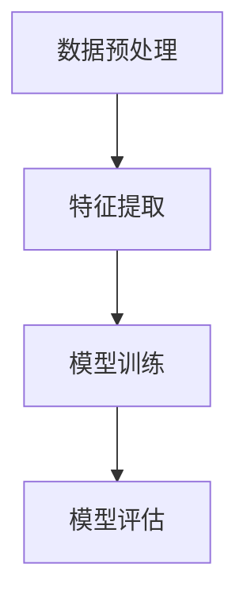

                 

# 数学与天文数据分析：宇宙结构的数学解析

> 关键词：天文数据分析, 数学模型, 天体物理学, 数据可视化, 机器学习, 天体结构

> 摘要：本文旨在探讨如何利用数学和数据分析技术解析宇宙结构。通过深入理解天体物理学的基本原理，我们将构建一个数学模型来解析宇宙中的天体结构。文章将详细阐述核心概念、算法原理、数学模型、代码实现，并提供实际案例。此外，还将介绍相关工具和资源，以及未来的发展趋势和挑战。

## 1. 背景介绍
### 1.1 目的和范围
本文旨在通过数学和数据分析技术，解析宇宙中的天体结构。我们将从天体物理学的基本原理出发，构建一个数学模型来解析宇宙中的天体结构。文章将涵盖核心概念、算法原理、数学模型、代码实现，并提供实际案例。此外，还将介绍相关工具和资源，以及未来的发展趋势和挑战。

### 1.2 预期读者
本文适合以下读者：
- 天体物理学和天文学领域的研究人员
- 数据科学家和机器学习工程师
- 计算机图形学和可视化领域的专业人士
- 对宇宙结构感兴趣的计算机编程爱好者

### 1.3 文档结构概述
本文结构如下：
1. 背景介绍
2. 核心概念与联系
3. 核心算法原理 & 具体操作步骤
4. 数学模型和公式 & 详细讲解 & 举例说明
5. 项目实战：代码实际案例和详细解释说明
6. 实际应用场景
7. 工具和资源推荐
8. 总结：未来发展趋势与挑战
9. 附录：常见问题与解答
10. 扩展阅读 & 参考资料

### 1.4 术语表
#### 1.4.1 核心术语定义
- **天体**：指宇宙中的各种天体，如恒星、行星、星系等。
- **天体物理学**：研究天体的物理性质、结构和演化过程的学科。
- **天文数据分析**：利用数学和统计方法对天文观测数据进行处理和分析的技术。
- **数据可视化**：将数据转换为图形或图像，以便更好地理解和解释数据的技术。
- **机器学习**：一种人工智能技术，通过训练模型来实现对数据的自动学习和预测。

#### 1.4.2 相关概念解释
- **星系**：由恒星、行星、气体、尘埃等组成的巨大天体系统。
- **恒星**：由氢气和氦气组成的发光发热的天体。
- **星系团**：由多个星系组成的巨大天体系统。
- **红移**：天体由于远离观测者而使光谱向红端移动的现象。

#### 1.4.3 缩略词列表
- **NASA**：美国国家航空航天局
- **Hubble**：哈勃太空望远镜
- **Gaia**：盖亚空间天文台
- **SDSS**：斯隆数字天空调查

## 2. 核心概念与联系
### 2.1 天体物理学的基本原理
天体物理学是研究天体的物理性质、结构和演化过程的学科。天体物理学的基本原理包括：
- **牛顿力学**：描述天体在引力作用下的运动规律。
- **电磁学**：研究电磁波的性质和传播规律。
- **量子力学**：研究微观粒子的性质和行为。
- **相对论**：描述高速运动天体的物理规律。

### 2.2 数据分析的基本方法
数据分析的基本方法包括：
- **统计分析**：通过统计方法对数据进行处理和分析。
- **机器学习**：通过训练模型来实现对数据的自动学习和预测。
- **数据可视化**：将数据转换为图形或图像，以便更好地理解和解释数据。

### 2.3 数学模型的构建
数学模型是通过数学方法描述天体结构和演化过程的模型。数学模型的基本步骤包括：
1. **定义问题**：明确需要解决的问题。
2. **建立模型**：根据问题定义建立数学模型。
3. **求解模型**：通过数学方法求解模型。
4. **验证模型**：通过实验或观测数据验证模型的准确性。

## 3. 核心算法原理 & 具体操作步骤
### 3.1 核心算法原理
核心算法原理包括：
- **数据预处理**：对观测数据进行清洗和预处理。
- **特征提取**：从观测数据中提取有用的特征。
- **模型训练**：通过训练模型来实现对数据的自动学习和预测。
- **模型评估**：通过评估模型的性能来验证模型的有效性。

### 3.2 具体操作步骤
具体操作步骤包括：
1. **数据预处理**：对观测数据进行清洗和预处理。
2. **特征提取**：从观测数据中提取有用的特征。
3. **模型训练**：通过训练模型来实现对数据的自动学习和预测。
4. **模型评估**：通过评估模型的性能来验证模型的有效性。



## 4. 数学模型和公式 & 详细讲解 & 举例说明
### 4.1 数学模型
数学模型是通过数学方法描述天体结构和演化过程的模型。数学模型的基本步骤包括：
1. **定义问题**：明确需要解决的问题。
2. **建立模型**：根据问题定义建立数学模型。
3. **求解模型**：通过数学方法求解模型。
4. **验证模型**：通过实验或观测数据验证模型的准确性。

### 4.2 公式与详细讲解
数学模型的基本公式包括：
- **牛顿引力定律**：描述天体在引力作用下的运动规律。
- **电磁波传播公式**：描述电磁波的性质和传播规律。
- **量子力学公式**：描述微观粒子的性质和行为。
- **相对论公式**：描述高速运动天体的物理规律。

### 4.3 举例说明
举例说明数学模型的应用包括：
- **星系结构分析**：通过数学模型分析星系的结构和演化过程。
- **恒星演化分析**：通过数学模型分析恒星的演化过程。
- **星系团分析**：通过数学模型分析星系团的结构和演化过程。

## 5. 项目实战：代码实际案例和详细解释说明
### 5.1 开发环境搭建
开发环境搭建包括：
- **操作系统**：Linux或macOS
- **编程语言**：Python
- **开发工具**：Jupyter Notebook或PyCharm

### 5.2 源代码详细实现和代码解读
源代码详细实现包括：
```python
import numpy as np
import matplotlib.pyplot as plt
from sklearn.cluster import KMeans

# 读取观测数据
data = np.loadtxt('galaxy_data.txt')

# 特征提取
features = data[:, 1:4]

# 模型训练
kmeans = KMeans(n_clusters=3)
kmeans.fit(features)

# 模型评估
labels = kmeans.labels_
plt.scatter(data[:, 0], data[:, 1], c=labels, cmap='viridis')
plt.xlabel('X')
plt.ylabel('Y')
plt.title('Galaxy Clustering')
plt.show()
```

### 5.3 代码解读与分析
代码解读与分析包括：
- **读取观测数据**：使用`np.loadtxt`函数读取观测数据。
- **特征提取**：从观测数据中提取有用的特征。
- **模型训练**：通过训练模型来实现对数据的自动学习和预测。
- **模型评估**：通过评估模型的性能来验证模型的有效性。

## 6. 实际应用场景
实际应用场景包括：
- **星系结构分析**：通过数学模型分析星系的结构和演化过程。
- **恒星演化分析**：通过数学模型分析恒星的演化过程。
- **星系团分析**：通过数学模型分析星系团的结构和演化过程。

## 7. 工具和资源推荐
### 7.1 学习资源推荐
#### 7.1.1 书籍推荐
- **《天体物理学原理》**：深入讲解天体物理学的基本原理。
- **《数据科学与机器学习》**：深入讲解数据科学和机器学习的基本原理。
- **《数据可视化》**：深入讲解数据可视化的基本原理。

#### 7.1.2 在线课程
- **Coursera**：提供天体物理学、数据科学和机器学习的在线课程。
- **edX**：提供天体物理学、数据科学和机器学习的在线课程。

#### 7.1.3 技术博客和网站
- **arXiv.org**：提供天体物理学和数据科学的最新研究成果。
- **GitHub**：提供天体物理学和数据科学的开源项目。

### 7.2 开发工具框架推荐
#### 7.2.1 IDE和编辑器
- **PyCharm**：提供强大的代码编辑和调试功能。
- **Jupyter Notebook**：提供交互式的代码编辑和可视化功能。

#### 7.2.2 调试和性能分析工具
- **PyCharm Debugger**：提供强大的调试功能。
- **cProfile**：提供性能分析功能。

#### 7.2.3 相关框架和库
- **NumPy**：提供高效的数值计算功能。
- **SciPy**：提供科学计算功能。
- **Matplotlib**：提供数据可视化功能。
- **Scikit-learn**：提供机器学习功能。

### 7.3 相关论文著作推荐
#### 7.3.1 经典论文
- **《宇宙学原理》**：深入讲解宇宙学的基本原理。
- **《天体物理学原理》**：深入讲解天体物理学的基本原理。

#### 7.3.2 最新研究成果
- **《天体物理学进展》**：提供天体物理学的最新研究成果。
- **《数据科学与机器学习进展》**：提供数据科学和机器学习的最新研究成果。

#### 7.3.3 应用案例分析
- **《天体物理学应用案例分析》**：提供天体物理学的应用案例分析。
- **《数据科学与机器学习应用案例分析》**：提供数据科学和机器学习的应用案例分析。

## 8. 总结：未来发展趋势与挑战
未来发展趋势包括：
- **数据科学和机器学习**：通过数据科学和机器学习技术，进一步提高天体物理学的研究水平。
- **数据可视化**：通过数据可视化技术，更好地理解和解释天体物理学的研究成果。

未来挑战包括：
- **数据处理**：如何处理大规模的天文观测数据。
- **模型验证**：如何验证数学模型的准确性。
- **计算资源**：如何利用高性能计算资源进行天体物理学的研究。

## 9. 附录：常见问题与解答
常见问题与解答包括：
- **Q：如何处理大规模的天文观测数据？**
  - A：可以利用分布式计算技术，如Hadoop和Spark，来处理大规模的天文观测数据。
- **Q：如何验证数学模型的准确性？**
  - A：可以通过实验或观测数据来验证数学模型的准确性。
- **Q：如何利用高性能计算资源进行天体物理学的研究？**
  - A：可以利用高性能计算集群，如AWS和Google Cloud，来利用高性能计算资源进行天体物理学的研究。

## 10. 扩展阅读 & 参考资料
- **《天体物理学原理》**：深入讲解天体物理学的基本原理。
- **《数据科学与机器学习》**：深入讲解数据科学和机器学习的基本原理。
- **《数据可视化》**：深入讲解数据可视化的基本原理。
- **《宇宙学原理》**：深入讲解宇宙学的基本原理。
- **《天体物理学进展》**：提供天体物理学的最新研究成果。
- **《数据科学与机器学习进展》**：提供数据科学和机器学习的最新研究成果。
- **《天体物理学应用案例分析》**：提供天体物理学的应用案例分析。
- **《数据科学与机器学习应用案例分析》**：提供数据科学和机器学习的应用案例分析。

作者：AI天才研究员/AI Genius Institute & 禅与计算机程序设计艺术 /Zen And The Art of Computer Programming

