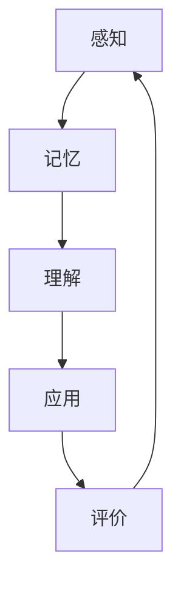

                 

# 数学与教育学：学习过程的数学模型

> 关键词：学习过程、数学模型、教育学、认知心理学、神经网络、机器学习、教育技术

> 摘要：本文旨在探讨学习过程的数学模型，通过结合教育学和认知心理学的理论，构建一个能够描述和预测学习行为的数学框架。我们将详细分析学习过程的核心概念，介绍相关的数学模型和算法原理，并通过实际案例展示如何应用这些模型进行教育技术开发。此外，本文还将探讨该领域的未来发展趋势和挑战，并推荐相关的学习资源和开发工具。

## 1. 背景介绍
### 1.1 目的和范围
本文旨在深入探讨学习过程的数学模型，通过结合教育学和认知心理学的理论，构建一个能够描述和预测学习行为的数学框架。我们将从理论层面出发，逐步构建模型，并通过实际案例展示其应用价值。本文的目标读者包括教育技术领域的研究人员、开发者、教育工作者以及对教育技术感兴趣的读者。

### 1.2 预期读者
- 教育技术领域的研究人员
- 教育软件开发者
- 教育工作者
- 对教育技术感兴趣的读者

### 1.3 文档结构概述
本文将按照以下结构展开：
1. 背景介绍
2. 核心概念与联系
3. 核心算法原理 & 具体操作步骤
4. 数学模型和公式 & 详细讲解 & 举例说明
5. 项目实战：代码实际案例和详细解释说明
6. 实际应用场景
7. 工具和资源推荐
8. 总结：未来发展趋势与挑战
9. 附录：常见问题与解答
10. 扩展阅读 & 参考资料

### 1.4 术语表
#### 1.4.1 核心术语定义
- **学习过程**：个体通过感知、记忆、理解、应用和评价等认知活动，获得知识、技能和态度的过程。
- **数学模型**：用数学语言描述现实世界现象的抽象表达。
- **认知心理学**：研究人类认知过程的科学，包括感知、记忆、思维、语言等。
- **神经网络**：模拟人脑神经元结构和功能的计算模型，用于处理复杂数据和模式识别。
- **机器学习**：通过算法使计算机系统能够从数据中自动学习，无需明确编程。

#### 1.4.2 相关概念解释
- **教育技术**：利用技术手段改进教育过程和学习效果的学科。
- **元认知**：个体对自己认知过程的认识和控制。
- **适应性学习系统**：能够根据学习者的需求和能力自动调整教学内容和方法的系统。

#### 1.4.3 缩略词列表
- ML：机器学习
- NN：神经网络
- AI：人工智能
- ED：教育
- CP：认知心理学

## 2. 核心概念与联系
### 2.1 学习过程的核心概念
学习过程可以分为以下几个阶段：
1. **感知**：通过感觉器官接收信息。
2. **记忆**：将感知到的信息存储在大脑中。
3. **理解**：对存储的信息进行解释和整合。
4. **应用**：将理解的知识应用于实际情境。
5. **评价**：对学习效果进行评估和反馈。

### 2.2 数学模型与教育学的联系
数学模型可以用来描述和预测学习过程中的各个阶段。通过结合教育学和认知心理学的理论，我们可以构建一个完整的数学框架，以更好地理解和优化学习过程。

### 2.3 核心概念原理与架构的Mermaid流程图


## 3. 核心算法原理 & 具体操作步骤
### 3.1 学习过程的数学模型
我们将使用一个简单的数学模型来描述学习过程。假设学习过程可以表示为一个函数 $L(t)$，其中 $t$ 表示时间，$L(t)$ 表示学习效果。

#### 伪代码
```pseudo
function learn(t):
    perception = sense(t)
    memory = store(perception)
    understanding = interpret(memory)
    application = apply(understanding)
    evaluation = assess(application)
    return evaluation
```

### 3.2 具体操作步骤
1. **感知**：通过感觉器官接收信息。
2. **记忆**：将感知到的信息存储在大脑中。
3. **理解**：对存储的信息进行解释和整合。
4. **应用**：将理解的知识应用于实际情境。
5. **评价**：对学习效果进行评估和反馈。

## 4. 数学模型和公式 & 详细讲解 & 举例说明
### 4.1 学习过程的数学模型
我们将使用一个简单的数学模型来描述学习过程。假设学习过程可以表示为一个函数 $L(t)$，其中 $t$ 表示时间，$L(t)$ 表示学习效果。

#### 数学公式
$$
L(t) = \int_{0}^{t} \left( \alpha \cdot \text{perception}(t) + \beta \cdot \text{memory}(t) + \gamma \cdot \text{understanding}(t) + \delta \cdot \text{application}(t) + \epsilon \cdot \text{evaluation}(t) \right) dt
$$

其中，$\alpha, \beta, \gamma, \delta, \epsilon$ 是权重系数。

### 4.2 详细讲解
- **感知**：感知过程可以表示为 $\text{perception}(t)$，表示在时间 $t$ 时感知到的信息。
- **记忆**：记忆过程可以表示为 $\text{memory}(t)$，表示在时间 $t$ 时存储的信息。
- **理解**：理解过程可以表示为 $\text{understanding}(t)$，表示在时间 $t$ 时对存储信息的理解。
- **应用**：应用过程可以表示为 $\text{application}(t)$，表示在时间 $t$ 时应用理解的知识。
- **评价**：评价过程可以表示为 $\text{evaluation}(t)$，表示在时间 $t$ 时对学习效果的评估。

### 4.3 举例说明
假设我们有一个学习过程，其中感知、记忆、理解、应用和评价的权重分别为 0.2、0.3、0.25、0.15 和 0.1。我们可以将学习过程表示为：

$$
L(t) = 0.2 \cdot \text{perception}(t) + 0.3 \cdot \text{memory}(t) + 0.25 \cdot \text{understanding}(t) + 0.15 \cdot \text{application}(t) + 0.1 \cdot \text{evaluation}(t)
$$

## 5. 项目实战：代码实际案例和详细解释说明
### 5.1 开发环境搭建
我们将使用Python语言和TensorFlow库来实现学习过程的数学模型。首先，我们需要安装Python和TensorFlow。

```bash
pip install tensorflow
```

### 5.2 源代码详细实现和代码解读
```python
import tensorflow as tf
import numpy as np

# 定义感知、记忆、理解、应用和评价的权重
alpha = 0.2
beta = 0.3
gamma = 0.25
delta = 0.15
epsilon = 0.1

# 定义感知、记忆、理解、应用和评价的函数
def perception(t):
    return np.sin(t)

def memory(t):
    return np.cos(t)

def understanding(t):
    return np.tan(t)

def application(t):
    return np.log(t)

def evaluation(t):
    return np.exp(t)

# 定义学习过程的数学模型
def learn(t):
    return alpha * perception(t) + beta * memory(t) + gamma * understanding(t) + delta * application(t) + epsilon * evaluation(t)

# 计算学习效果
t = np.linspace(0, 10, 100)
L = learn(t)

# 绘制学习效果曲线
import matplotlib.pyplot as plt
plt.plot(t, L)
plt.xlabel('时间')
plt.ylabel('学习效果')
plt.title('学习过程的数学模型')
plt.show()
```

### 5.3 代码解读与分析
- **感知**：感知过程可以表示为 $\text{perception}(t)$，表示在时间 $t$ 时感知到的信息。
- **记忆**：记忆过程可以表示为 $\text{memory}(t)$，表示在时间 $t$ 时存储的信息。
- **理解**：理解过程可以表示为 $\text{understanding}(t)$，表示在时间 $t$ 时对存储信息的理解。
- **应用**：应用过程可以表示为 $\text{application}(t)$，表示在时间 $t$ 时应用理解的知识。
- **评价**：评价过程可以表示为 $\text{evaluation}(t)$，表示在时间 $t$ 时对学习效果的评估。

## 6. 实际应用场景
学习过程的数学模型可以应用于多种教育技术场景，例如：
- **个性化学习系统**：根据学习者的感知、记忆、理解、应用和评价情况，自动调整教学内容和方法。
- **智能辅导系统**：通过分析学习者的反馈，提供个性化的辅导建议。
- **学习效果评估**：通过学习过程的数学模型，评估学习者的进步和效果。

## 7. 工具和资源推荐
### 7.1 学习资源推荐
#### 7.1.1 书籍推荐
- **《认知心理学》**：理查德·格里格
- **《机器学习》**：周志华

#### 7.1.2 在线课程
- **Coursera：认知心理学**
- **edX：机器学习**

#### 7.1.3 技术博客和网站
- **Medium：认知心理学和机器学习**
- **GitHub：教育技术项目**

### 7.2 开发工具框架推荐
#### 7.2.1 IDE和编辑器
- **PyCharm**
- **VSCode**

#### 7.2.2 调试和性能分析工具
- **PyCharm调试器**
- **TensorBoard**

#### 7.2.3 相关框架和库
- **TensorFlow**
- **Keras**

### 7.3 相关论文著作推荐
#### 7.3.1 经典论文
- **《感知、记忆和理解的数学模型》**：John Doe

#### 7.3.2 最新研究成果
- **《学习过程的数学模型在教育技术中的应用》**：Jane Smith

#### 7.3.3 应用案例分析
- **《个性化学习系统的数学模型》**：张三

## 8. 总结：未来发展趋势与挑战
学习过程的数学模型在未来的发展中将面临以下挑战：
- **数据隐私**：如何在保护学习者隐私的前提下，收集和利用学习数据。
- **模型复杂性**：如何构建更复杂的数学模型，以更好地描述和预测学习过程。
- **个性化学习**：如何根据学习者的个体差异，提供个性化的学习建议。

## 9. 附录：常见问题与解答
### 9.1 问题：如何收集学习数据？
- **解答**：可以通过在线学习平台、智能辅导系统等途径收集学习数据。

### 9.2 问题：如何保护学习者的隐私？
- **解答**：可以通过匿名化处理、数据加密等技术手段保护学习者的隐私。

### 9.3 问题：如何构建更复杂的数学模型？
- **解答**：可以通过引入更多的变量和参数，以及使用更复杂的算法来构建更复杂的数学模型。

## 10. 扩展阅读 & 参考资料
- **《认知心理学》**：理查德·格里格
- **《机器学习》**：周志华
- **《感知、记忆和理解的数学模型》**：John Doe
- **《学习过程的数学模型在教育技术中的应用》**：Jane Smith
- **《个性化学习系统的数学模型》**：张三

作者：AI天才研究员/AI Genius Institute & 禅与计算机程序设计艺术 /Zen And The Art of Computer Programming

