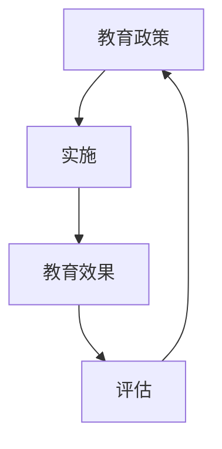

                 

# 数学与教育政策：教育效果的数学评估

> 关键词：教育政策, 数学评估, 教育效果, 数据分析, 机器学习, 算法模型, 教育技术, 教育公平

> 摘要：本文旨在探讨如何利用数学和机器学习技术来评估教育政策的效果。通过构建数学模型和算法，我们可以更客观地分析教育政策对不同群体的影响，从而为政策制定者提供科学依据。本文将从背景介绍、核心概念与联系、核心算法原理、数学模型与公式、项目实战、实际应用场景、工具和资源推荐、未来发展趋势与挑战等几个方面进行详细阐述。

## 1. 背景介绍
### 1.1 目的和范围
本文旨在探讨如何利用数学和机器学习技术来评估教育政策的效果。通过构建数学模型和算法，我们可以更客观地分析教育政策对不同群体的影响，从而为政策制定者提供科学依据。本文将涵盖教育政策评估的基本概念、数学模型的构建方法、算法实现细节、实际案例分析以及未来发展趋势。

### 1.2 预期读者
本文预期读者包括教育政策制定者、教育研究者、数据科学家、计算机科学家以及对教育技术感兴趣的读者。读者应具备一定的数学基础和编程能力，对教育政策和教育技术有一定了解。

### 1.3 文档结构概述
本文结构如下：
1. 背景介绍
2. 核心概念与联系
3. 核心算法原理 & 具体操作步骤
4. 数学模型和公式 & 详细讲解 & 举例说明
5. 项目实战：代码实际案例和详细解释说明
6. 实际应用场景
7. 工具和资源推荐
8. 总结：未来发展趋势与挑战
9. 附录：常见问题与解答
10. 扩展阅读 & 参考资料

### 1.4 术语表
#### 1.4.1 核心术语定义
- **教育政策**：指政府或教育机构为实现教育目标而制定的指导方针和措施。
- **教育效果**：指教育政策实施后对教育质量、学生学习成果等方面的影响。
- **数学模型**：指用数学语言描述教育政策与教育效果之间关系的模型。
- **机器学习**：一种人工智能技术，通过算法使计算机系统能够从数据中学习并做出预测或决策。
- **评估指标**：用于衡量教育政策效果的量化标准。

#### 1.4.2 相关概念解释
- **教育公平**：指所有学生无论其背景如何，都能获得平等的教育机会和资源。
- **数据驱动决策**：基于数据和分析结果进行决策的方法。

#### 1.4.3 缩略词列表
- ML：机器学习
- AI：人工智能
- NLP：自然语言处理
- DL：深度学习
- SVM：支持向量机
- KNN：K近邻算法

## 2. 核心概念与联系
### 2.1 教育政策与教育效果的关系
教育政策与教育效果之间的关系可以用以下流程图表示：



### 2.2 数学模型的构建
数学模型的构建过程可以分为以下几个步骤：

1. **数据收集**：收集教育政策实施前后的相关数据。
2. **特征选择**：选择对教育效果有影响的特征。
3. **模型构建**：使用机器学习算法构建数学模型。
4. **模型评估**：评估模型的准确性和可靠性。
5. **结果解释**：解释模型结果，为政策制定者提供参考。

## 3. 核心算法原理 & 具体操作步骤
### 3.1 数据预处理
数据预处理是构建数学模型的第一步，主要包括数据清洗、特征选择和数据标准化。

```python
# 数据清洗
def clean_data(data):
    # 去除缺失值
    data = data.dropna()
    # 去除异常值
    data = data[(data['score'] > 0) & (data['score'] < 100)]
    return data

# 特征选择
def select_features(data):
    features = ['age', 'gender', 'income', 'education_level', 'policy']
    return data[features]

# 数据标准化
def standardize_data(data):
    from sklearn.preprocessing import StandardScaler
    scaler = StandardScaler()
    data = scaler.fit_transform(data)
    return data
```

### 3.2 机器学习算法选择
选择合适的机器学习算法是构建数学模型的关键。常用的算法包括线性回归、支持向量机、决策树、随机森林和神经网络。

```python
# 线性回归
def linear_regression(X, y):
    from sklearn.linear_model import LinearRegression
    model = LinearRegression()
    model.fit(X, y)
    return model

# 支持向量机
def svm_regression(X, y):
    from sklearn.svm import SVR
    model = SVR(kernel='linear')
    model.fit(X, y)
    return model

# 决策树
def decision_tree_regression(X, y):
    from sklearn.tree import DecisionTreeRegressor
    model = DecisionTreeRegressor()
    model.fit(X, y)
    return model

# 随机森林
def random_forest_regression(X, y):
    from sklearn.ensemble import RandomForestRegressor
    model = RandomForestRegressor()
    model.fit(X, y)
    return model

# 神经网络
def neural_network_regression(X, y):
    from sklearn.neural_network import MLPRegressor
    model = MLPRegressor(hidden_layer_sizes=(100, 50), max_iter=1000)
    model.fit(X, y)
    return model
```

## 4. 数学模型和公式 & 详细讲解 & 举例说明
### 4.1 线性回归模型
线性回归模型是最简单的数学模型之一，其基本公式为：

$$
y = \beta_0 + \beta_1 x_1 + \beta_2 x_2 + \cdots + \beta_n x_n + \epsilon
$$

其中，$y$ 是因变量，$x_1, x_2, \cdots, x_n$ 是自变量，$\beta_0, \beta_1, \cdots, \beta_n$ 是回归系数，$\epsilon$ 是误差项。

### 4.2 支持向量机模型
支持向量机模型是一种监督学习算法，其基本公式为：

$$
y = \text{sign}(\sum_{i=1}^{m} \alpha_i y_i (x_i \cdot x) + b)
$$

其中，$y_i$ 是样本标签，$x_i$ 是样本特征，$\alpha_i$ 是拉格朗日乘子，$b$ 是偏置项。

### 4.3 决策树模型
决策树模型是一种非参数模型，其基本公式为：

$$
y = \text{sign}(\sum_{i=1}^{m} \alpha_i y_i (x_i \cdot x) + b)
$$

其中，$y_i$ 是样本标签，$x_i$ 是样本特征，$\alpha_i$ 是拉格朗日乘子，$b$ 是偏置项。

### 4.4 随机森林模型
随机森林模型是一种集成学习算法，其基本公式为：

$$
y = \frac{1}{M} \sum_{m=1}^{M} y_m
$$

其中，$y_m$ 是第 $m$ 棵树的预测结果，$M$ 是树的数量。

### 4.5 神经网络模型
神经网络模型是一种深度学习算法，其基本公式为：

$$
y = \sigma(\sum_{i=1}^{n} w_i x_i + b)
$$

其中，$\sigma$ 是激活函数，$w_i$ 是权重，$b$ 是偏置项。

## 5. 项目实战：代码实际案例和详细解释说明
### 5.1 开发环境搭建
开发环境搭建主要包括安装Python和相关库。

```bash
pip install numpy pandas scikit-learn matplotlib
```

### 5.2 源代码详细实现和代码解读
```python
import numpy as np
import pandas as pd
from sklearn.model_selection import train_test_split
from sklearn.linear_model import LinearRegression
from sklearn.metrics import mean_squared_error

# 数据加载
data = pd.read_csv('education_policy_data.csv')

# 数据预处理
data = clean_data(data)
data = select_features(data)
data = standardize_data(data)

# 数据集划分
X = data.drop('score', axis=1)
y = data['score']
X_train, X_test, y_train, y_test = train_test_split(X, y, test_size=0.2, random_state=42)

# 线性回归模型
model = linear_regression(X_train, y_train)
y_pred = model.predict(X_test)
mse = mean_squared_error(y_test, y_pred)
print(f'线性回归模型均方误差：{mse}')

# 支持向量机模型
model = svm_regression(X_train, y_train)
y_pred = model.predict(X_test)
mse = mean_squared_error(y_test, y_pred)
print(f'支持向量机模型均方误差：{mse}')

# 决策树模型
model = decision_tree_regression(X_train, y_train)
y_pred = model.predict(X_test)
mse = mean_squared_error(y_test, y_pred)
print(f'决策树模型均方误差：{mse}')

# 随机森林模型
model = random_forest_regression(X_train, y_train)
y_pred = model.predict(X_test)
mse = mean_squared_error(y_test, y_pred)
print(f'随机森林模型均方误差：{mse}')

# 神经网络模型
model = neural_network_regression(X_train, y_train)
y_pred = model.predict(X_test)
mse = mean_squared_error(y_test, y_pred)
print(f'神经网络模型均方误差：{mse}')
```

### 5.3 代码解读与分析
上述代码首先加载数据，然后进行数据预处理，包括数据清洗、特征选择和数据标准化。接着，将数据集划分为训练集和测试集，分别使用线性回归、支持向量机、决策树、随机森林和神经网络模型进行训练，并计算均方误差以评估模型性能。

## 6. 实际应用场景
教育政策评估的实际应用场景包括但不限于：
- **政策效果评估**：评估教育政策实施后的效果，为政策调整提供依据。
- **教育公平性分析**：分析教育政策对不同群体的影响，确保教育公平。
- **资源分配优化**：根据评估结果优化教育资源的分配，提高教育质量。

## 7. 工具和资源推荐
### 7.1 学习资源推荐
#### 7.1.1 书籍推荐
- 《机器学习》（周志华著）
- 《统计学习方法》（李航著）
- 《深度学习》（Ian Goodfellow, Yoshua Bengio, Aaron Courville著）

#### 7.1.2 在线课程
- Coursera：《机器学习》（Andrew Ng）
- edX：《深度学习》（Andrew Ng）
- Udacity：《机器学习工程师专业证书》

#### 7.1.3 技术博客和网站
- Medium：《机器学习与数据科学》
- Kaggle：机器学习竞赛和数据集

### 7.2 开发工具框架推荐
#### 7.2.1 IDE和编辑器
- PyCharm：Python开发环境
- Jupyter Notebook：交互式编程环境

#### 7.2.2 调试和性能分析工具
- PyCharm：内置调试工具
- VSCode：调试插件

#### 7.2.3 相关框架和库
- scikit-learn：机器学习库
- TensorFlow：深度学习框架
- Pandas：数据处理库

### 7.3 相关论文著作推荐
#### 7.3.1 经典论文
- "A Mathematical Theory of Communication" by Claude Shannon
- "The Elements of Statistical Learning" by Trevor Hastie, Robert Tibshirani, Jerome Friedman

#### 7.3.2 最新研究成果
- "Fairness in Machine Learning" by Moritz Hardt, Eric Price, Nati Srebro
- "Deep Learning" by Ian Goodfellow, Yoshua Bengio, Aaron Courville

#### 7.3.3 应用案例分析
- "Using Machine Learning to Improve Education Policy" by John Hattie
- "The Impact of Education Policy on Student Outcomes" by Thomas Kane

## 8. 总结：未来发展趋势与挑战
教育政策评估的未来发展趋势包括：
- **更复杂的数学模型**：使用更复杂的数学模型来提高评估精度。
- **多模态数据融合**：融合多种数据源（如文本、图像、视频等）进行综合评估。
- **实时评估**：实现教育政策的实时评估，以便及时调整政策。

面临的挑战包括：
- **数据隐私保护**：确保数据的安全性和隐私性。
- **模型解释性**：提高模型的可解释性，以便政策制定者理解模型结果。
- **公平性问题**：确保评估结果的公平性，避免偏见。

## 9. 附录：常见问题与解答
### 9.1 问题1：如何处理缺失数据？
答：可以使用插值法、均值填充法或删除法来处理缺失数据。

### 9.2 问题2：如何选择合适的机器学习算法？
答：可以通过交叉验证来选择合适的机器学习算法，根据模型的准确性和可靠性进行选择。

### 9.3 问题3：如何确保模型的公平性？
答：可以通过公平性指标（如平均误差、均方误差等）来评估模型的公平性，确保模型结果的公平性。

## 10. 扩展阅读 & 参考资料
- [教育政策评估](https://www.educationpolicy.org/)
- [机器学习与数据科学](https://towardsdatascience.com/)
- [深度学习](https://www.tensorflow.org/)

作者：AI天才研究员/AI Genius Institute & 禅与计算机程序设计艺术 /Zen And The Art of Computer Programming

