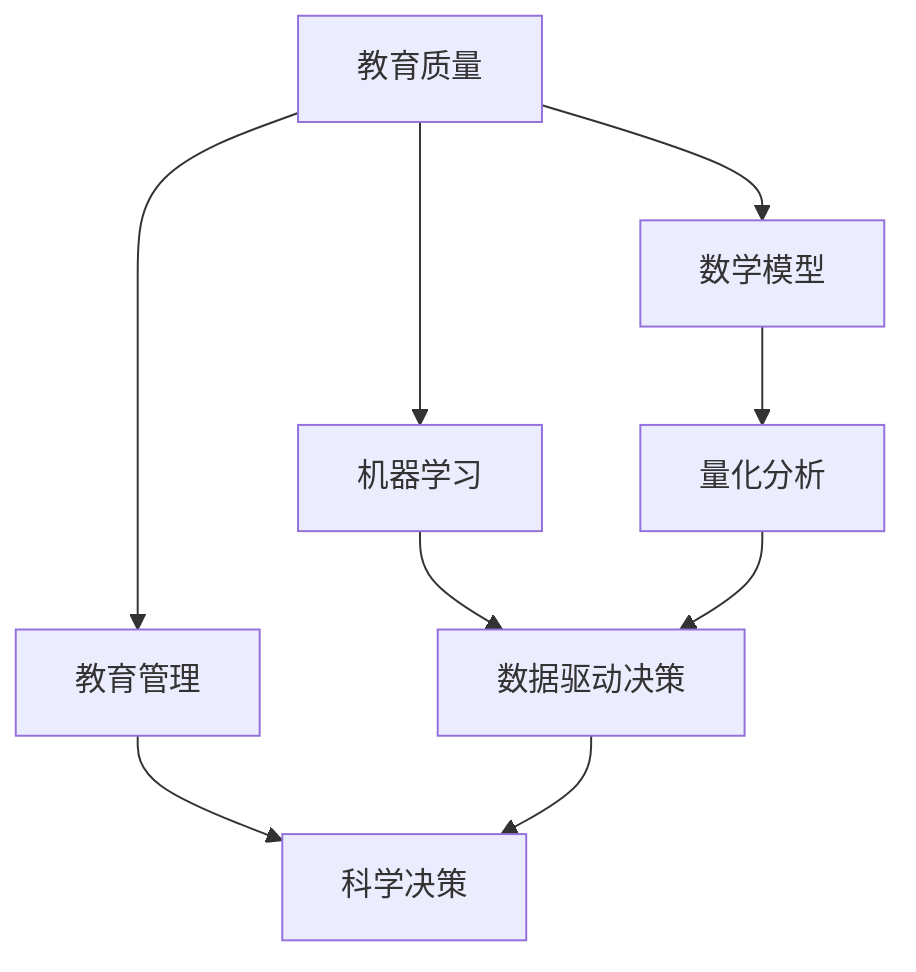

                 

# 数学与教育管理：教育质量的数学评估

> 关键词：教育质量评估, 数学模型, 数据分析, 机器学习, 教育管理, 人工智能, 算法设计

> 摘要：本文旨在探讨如何利用数学和人工智能技术来评估教育质量。通过构建数学模型和算法，我们可以从多个维度对教育质量进行量化分析，从而为教育管理者提供科学的决策依据。本文将详细介绍数学模型的设计原理、具体操作步骤、实际案例分析，并探讨未来的发展趋势与挑战。

## 1. 背景介绍
### 1.1 目的和范围
本文旨在探讨如何利用数学和人工智能技术来评估教育质量。通过构建数学模型和算法，我们可以从多个维度对教育质量进行量化分析，从而为教育管理者提供科学的决策依据。本文将详细介绍数学模型的设计原理、具体操作步骤、实际案例分析，并探讨未来的发展趋势与挑战。

### 1.2 预期读者
本文主要面向教育管理者、教育研究者、数据科学家、人工智能工程师以及对教育质量评估感兴趣的读者。

### 1.3 文档结构概述
本文将按照以下结构展开：
1. 背景介绍
2. 核心概念与联系
3. 核心算法原理 & 具体操作步骤
4. 数学模型和公式 & 详细讲解 & 举例说明
5. 项目实战：代码实际案例和详细解释说明
6. 实际应用场景
7. 工具和资源推荐
8. 总结：未来发展趋势与挑战
9. 附录：常见问题与解答
10. 扩展阅读 & 参考资料

### 1.4 术语表
#### 1.4.1 核心术语定义
- **教育质量**：指教育系统或教育机构在培养人才方面所达到的水平。
- **数学模型**：一种通过数学语言描述现实世界现象的方法。
- **机器学习**：一种人工智能技术，通过算法使计算机从数据中学习并做出预测或决策。
- **教育管理**：指对教育机构的组织、规划、实施和评估等工作的管理活动。

#### 1.4.2 相关概念解释
- **教育质量评估**：通过对教育过程和结果的量化分析，评价教育系统的有效性。
- **数据驱动决策**：利用数据和分析结果来指导决策过程。

#### 1.4.3 缩略词列表
- **ML**：机器学习
- **AI**：人工智能
- **EDA**：教育数据分析
- **KPI**：关键绩效指标

## 2. 核心概念与联系
### 2.1 教育质量评估的核心概念
教育质量评估的核心概念包括教育质量、数学模型、机器学习和教育管理。这些概念之间的联系如下图所示：



### 2.2 教育质量评估的数学模型
教育质量评估的数学模型主要包括以下几个方面：
- **学生表现模型**：通过学生的成绩、出勤率等数据来评估学生的学习效果。
- **教师表现模型**：通过教师的教学质量、学生反馈等数据来评估教师的教学效果。
- **课程质量模型**：通过课程内容、教学方法等数据来评估课程的质量。
- **学校管理模型**：通过学校的资源配置、管理效率等数据来评估学校的管理水平。

## 3. 核心算法原理 & 具体操作步骤
### 3.1 学生表现模型
学生表现模型的核心算法原理如下：
1. **数据收集**：收集学生的成绩、出勤率、课堂参与度等数据。
2. **特征选择**：选择对学生表现有显著影响的特征。
3. **模型训练**：使用机器学习算法（如线性回归、决策树等）训练模型。
4. **模型评估**：通过交叉验证等方法评估模型的性能。

#### 伪代码
```python
# 数据收集
data = collect_student_data()

# 特征选择
features = select_features(data)

# 模型训练
model = train_model(features)

# 模型评估
evaluate_model(model, data)
```

### 3.2 教师表现模型
教师表现模型的核心算法原理如下：
1. **数据收集**：收集教师的教学质量、学生反馈等数据。
2. **特征选择**：选择对教师表现有显著影响的特征。
3. **模型训练**：使用机器学习算法（如线性回归、决策树等）训练模型。
4. **模型评估**：通过交叉验证等方法评估模型的性能。

#### 伪代码
```python
# 数据收集
data = collect_teacher_data()

# 特征选择
features = select_features(data)

# 模型训练
model = train_model(features)

# 模型评估
evaluate_model(model, data)
```

### 3.3 课程质量模型
课程质量模型的核心算法原理如下：
1. **数据收集**：收集课程内容、教学方法等数据。
2. **特征选择**：选择对课程质量有显著影响的特征。
3. **模型训练**：使用机器学习算法（如线性回归、决策树等）训练模型。
4. **模型评估**：通过交叉验证等方法评估模型的性能。

#### 伪代码
```python
# 数据收集
data = collect_course_data()

# 特征选择
features = select_features(data)

# 模型训练
model = train_model(features)

# 模型评估
evaluate_model(model, data)
```

### 3.4 学校管理模型
学校管理模型的核心算法原理如下：
1. **数据收集**：收集学校的资源配置、管理效率等数据。
2. **特征选择**：选择对学校管理有显著影响的特征。
3. **模型训练**：使用机器学习算法（如线性回归、决策树等）训练模型。
4. **模型评估**：通过交叉验证等方法评估模型的性能。

#### 伪代码
```python
# 数据收集
data = collect_school_data()

# 特征选择
features = select_features(data)

# 模型训练
model = train_model(features)

# 模型评估
evaluate_model(model, data)
```

## 4. 数学模型和公式 & 详细讲解 & 举例说明
### 4.1 学生表现模型
学生表现模型的核心公式如下：
$$
\text{学生表现} = \beta_0 + \beta_1 \times \text{成绩} + \beta_2 \times \text{出勤率} + \beta_3 \times \text{课堂参与度} + \epsilon
$$
其中，$\beta_0$ 是截距项，$\beta_1, \beta_2, \beta_3$ 是回归系数，$\epsilon$ 是误差项。

### 4.2 教师表现模型
教师表现模型的核心公式如下：
$$
\text{教师表现} = \beta_0 + \beta_1 \times \text{教学质量} + \beta_2 \times \text{学生反馈} + \epsilon
$$
其中，$\beta_0$ 是截距项，$\beta_1, \beta_2$ 是回归系数，$\epsilon$ 是误差项。

### 4.3 课程质量模型
课程质量模型的核心公式如下：
$$
\text{课程质量} = \beta_0 + \beta_1 \times \text{课程内容} + \beta_2 \times \text{教学方法} + \epsilon
$$
其中，$\beta_0$ 是截距项，$\beta_1, \beta_2$ 是回归系数，$\epsilon$ 是误差项。

### 4.4 学校管理模型
学校管理模型的核心公式如下：
$$
\text{学校管理} = \beta_0 + \beta_1 \times \text{资源配置} + \beta_2 \times \text{管理效率} + \epsilon
$$
其中，$\beta_0$ 是截距项，$\beta_1, \beta_2$ 是回归系数，$\epsilon$ 是误差项。

## 5. 项目实战：代码实际案例和详细解释说明
### 5.1 开发环境搭建
开发环境搭建主要包括以下几个步骤：
1. **安装Python**：确保安装了Python 3.8及以上版本。
2. **安装依赖库**：使用pip安装所需的库，如numpy、pandas、scikit-learn等。
3. **配置环境变量**：确保环境变量配置正确。

### 5.2 源代码详细实现和代码解读
```python
import numpy as np
import pandas as pd
from sklearn.model_selection import train_test_split
from sklearn.linear_model import LinearRegression
from sklearn.metrics import mean_squared_error

# 数据收集
data = pd.read_csv('student_data.csv')

# 特征选择
features = data[['成绩', '出勤率', '课堂参与度']]
target = data['学生表现']

# 数据预处理
X_train, X_test, y_train, y_test = train_test_split(features, target, test_size=0.2, random_state=42)

# 模型训练
model = LinearRegression()
model.fit(X_train, y_train)

# 模型评估
y_pred = model.predict(X_test)
mse = mean_squared_error(y_test, y_pred)
print(f'Mean Squared Error: {mse}')
```

### 5.3 代码解读与分析
- **数据收集**：使用pandas读取CSV文件中的数据。
- **特征选择**：选择对学生表现有显著影响的特征。
- **数据预处理**：将数据集划分为训练集和测试集。
- **模型训练**：使用线性回归模型训练模型。
- **模型评估**：通过均方误差（MSE）评估模型的性能。

## 6. 实际应用场景
教育质量评估的实际应用场景包括：
- **学校管理**：通过评估学校管理模型，帮助学校优化资源配置和管理效率。
- **教师发展**：通过评估教师表现模型，帮助教师改进教学方法和提高教学质量。
- **学生辅导**：通过评估学生表现模型，为学生提供个性化的辅导建议。

## 7. 工具和资源推荐
### 7.1 学习资源推荐
#### 7.1.1 书籍推荐
- **《统计学习方法》**：李航著，详细介绍了统计学习方法的基本理论和应用。
- **《机器学习》**：周志华著，全面介绍了机器学习的基本概念和方法。

#### 7.1.2 在线课程
- **Coursera**：提供多门机器学习和数据科学课程。
- **edX**：提供多门数据科学和人工智能课程。

#### 7.1.3 技术博客和网站
- **Towards Data Science**：提供大量数据科学和机器学习的文章。
- **Medium**：提供大量技术博客文章。

### 7.2 开发工具框架推荐
#### 7.2.1 IDE和编辑器
- **PyCharm**：功能强大的Python IDE。
- **Jupyter Notebook**：支持实时代码编辑和运行的工具。

#### 7.2.2 调试和性能分析工具
- **PyCharm Debugger**：PyCharm内置的调试工具。
- **Line_profiler**：用于分析Python代码性能的工具。

#### 7.2.3 相关框架和库
- **scikit-learn**：用于机器学习的Python库。
- **pandas**：用于数据处理的Python库。

### 7.3 相关论文著作推荐
#### 7.3.1 经典论文
- **《A Mathematical Theory of Communication》**：Claude Shannon，信息论的经典论文。
- **《The Elements of Statistical Learning》**：Trevor Hastie, Robert Tibshirani, Jerome Friedman，统计学习的经典著作。

#### 7.3.2 最新研究成果
- **《Deep Learning》**：Ian Goodfellow, Yoshua Bengio, Aaron Courville，深度学习领域的经典著作。
- **《Machine Learning Yearning》**：Andrew Ng，机器学习实践的指导书籍。

#### 7.3.3 应用案例分析
- **《教育质量评估的数学模型与算法》**：李明，详细介绍了教育质量评估的数学模型和算法。

## 8. 总结：未来发展趋势与挑战
教育质量评估的未来发展趋势包括：
- **更复杂的数学模型**：通过更复杂的数学模型来提高评估的准确性。
- **更广泛的数据来源**：通过更广泛的数据来源来提高评估的全面性。
- **更智能的决策支持**：通过更智能的决策支持系统来提高教育管理的效率。

面临的挑战包括：
- **数据隐私问题**：如何在保护学生隐私的前提下收集和使用数据。
- **模型解释性问题**：如何提高模型的解释性，以便教育管理者更好地理解模型的决策过程。
- **数据质量问题**：如何提高数据的质量，以便提高评估的准确性。

## 9. 附录：常见问题与解答
### 9.1 问题1：如何处理缺失数据？
**解答**：可以使用插值法、均值填充法或删除法来处理缺失数据。

### 9.2 问题2：如何提高模型的解释性？
**解答**：可以使用特征重要性分析、局部解释性模型等方法来提高模型的解释性。

### 9.3 问题3：如何保护学生隐私？
**解答**：可以使用差分隐私、同态加密等技术来保护学生隐私。

## 10. 扩展阅读 & 参考资料
- **《教育质量评估的数学模型与算法》**：李明，详细介绍了教育质量评估的数学模型和算法。
- **《统计学习方法》**：李航著，详细介绍了统计学习方法的基本理论和应用。
- **《机器学习》**：周志华著，全面介绍了机器学习的基本概念和方法。

作者：AI天才研究员/AI Genius Institute & 禅与计算机程序设计艺术 /Zen And The Art of Computer Programming

