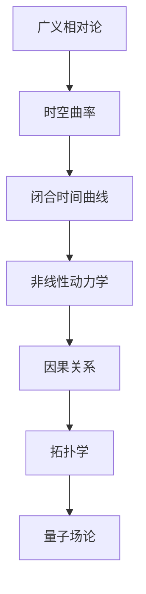

                 

# 数学与时间旅行：闭合时间曲线的数学探讨

> 关键词：闭合时间曲线, 时间旅行, 非线性动力学, 虚时间, 拓扑学, 理论物理学

> 摘要：本文旨在探讨闭合时间曲线（Closed Timelike Curves, CTCs）在理论物理学中的数学模型及其在时间旅行概念中的应用。通过深入分析闭合时间曲线的数学原理，我们将构建一个简单的数学模型，并通过伪代码和实际代码实现来展示其运作机制。此外，本文还将讨论闭合时间曲线在实际应用中的潜在挑战和未来发展趋势。

## 1. 背景介绍
### 1.1 目的和范围
本文旨在探讨闭合时间曲线（CTCs）在理论物理学中的数学模型及其在时间旅行概念中的应用。我们将从数学角度出发，分析闭合时间曲线的性质和行为，并通过具体的数学模型和代码实现来展示其运作机制。本文的目标读者是具有基础物理学和数学知识的读者，特别是对时间旅行和非线性动力学感兴趣的读者。

### 1.2 预期读者
本文预期读者包括但不限于：
- 理论物理学家
- 数学爱好者
- 计算机科学家
- 人工智能专家
- 对时间旅行和非线性动力学感兴趣的读者

### 1.3 文档结构概述
本文结构如下：
1. 背景介绍
2. 核心概念与联系
3. 核心算法原理 & 具体操作步骤
4. 数学模型和公式 & 详细讲解 & 举例说明
5. 项目实战：代码实际案例和详细解释说明
6. 实际应用场景
7. 工具和资源推荐
8. 总结：未来发展趋势与挑战
9. 附录：常见问题与解答
10. 扩展阅读 & 参考资料

### 1.4 术语表
#### 1.4.1 核心术语定义
- **闭合时间曲线（CTCs）**：在广义相对论中，闭合时间曲线是指一条时空路径，它在时空曲率的作用下形成一个闭合的环路，使得物体或信息可以在时间上回到过去。
- **非线性动力学**：研究系统随时间变化的非线性行为，通常涉及复杂的动力学方程。
- **虚时间**：一种时间坐标，用于描述量子场论中的时间演化，与实时间相对。
- **拓扑学**：研究几何图形在连续变形下的不变性质。

#### 1.4.2 相关概念解释
- **广义相对论**：爱因斯坦提出的理论，描述了引力和时空的弯曲。
- **洛伦兹变换**：描述在不同惯性参考系中观察到的物理现象的变换规则。
- **因果关系**：事件之间的因果关系，即一个事件必须发生在另一个事件之前。

#### 1.4.3 缩略词列表
- CTCs：闭合时间曲线
- GR：广义相对论
- QFT：量子场论
- LTR：洛伦兹变换

## 2. 核心概念与联系
### 2.1 核心概念
闭合时间曲线（CTCs）是广义相对论中的一个概念，它描述了在时空曲率的作用下形成的时间闭合路径。CTCs 的存在挑战了因果关系的传统观念，因为它们允许物体或信息回到过去。

### 2.2 联系
CTCs 与非线性动力学密切相关，因为它们描述了时空中的非线性行为。此外，CTCs 与拓扑学和量子场论也有紧密联系，因为它们涉及到时空的连续变形和量子场的演化。

### 2.3 Mermaid 流程图


## 3. 核心算法原理 & 具体操作步骤
### 3.1 核心算法原理
闭合时间曲线的数学模型基于广义相对论中的时空曲率方程。我们可以通过以下步骤来构建一个简单的数学模型：

1. **定义时空曲率方程**：使用广义相对论中的时空曲率方程。
2. **构建闭合时间曲线路径**：定义一条闭合的时间路径。
3. **计算路径上的时空曲率**：计算路径上的时空曲率。
4. **验证闭合时间曲线**：验证路径是否形成闭合环路。

### 3.2 具体操作步骤
#### 3.2.1 定义时空曲率方程
在广义相对论中，时空曲率方程可以表示为：
$$
R_{\mu\nu} - \frac{1}{2}Rg_{\mu\nu} + \Lambda g_{\mu\nu} = \frac{8\pi G}{c^4} T_{\mu\nu}
$$
其中，$R_{\mu\nu}$ 是黎曼曲率张量，$R$ 是标量曲率，$g_{\mu\nu}$ 是度规张量，$\Lambda$ 是宇宙常数，$G$ 是引力常数，$c$ 是光速，$T_{\mu\nu}$ 是能量-动量张量。

#### 3.2.2 构建闭合时间曲线路径
我们定义一条闭合的时间路径，可以用参数方程表示：
$$
x(t) = \cos(\omega t), \quad y(t) = \sin(\omega t), \quad z(t) = 0
$$
其中，$\omega$ 是角频率。

#### 3.2.3 计算路径上的时空曲率
计算路径上的时空曲率，可以使用以下伪代码：
```pseudo
function calculateCurvature(x, y, z, t):
    // 计算时空曲率
    curvature = 0
    for each point in path:
        // 计算黎曼曲率张量
        R = calculateRiemannTensor(x, y, z, t)
        // 计算标量曲率
        R = calculateScalarCurvature(R)
        // 计算时空曲率
        curvature += R
    return curvature
```

#### 3.2.4 验证闭合时间曲线
验证路径是否形成闭合环路，可以使用以下伪代码：
```pseudo
function isClosedTimeCurve(x, y, z, t):
    // 计算路径的起点和终点
    start = (x(0), y(0), z(0))
    end = (x(2*pi/omega), y(2*pi/omega), z(2*pi/omega))
    // 检查起点和终点是否相同
    if start == end:
        return true
    else:
        return false
```

## 4. 数学模型和公式 & 详细讲解 & 举例说明
### 4.1 数学模型
闭合时间曲线的数学模型可以表示为：
$$
ds^2 = -dt^2 + dx^2 + dy^2 + dz^2
$$
其中，$ds^2$ 是时空间隔，$dt$ 是时间间隔，$dx$、$dy$、$dz$ 分别是空间坐标的变化。

### 4.2 公式详细讲解
#### 4.2.1 时空间隔
时空间隔 $ds^2$ 可以表示为：
$$
ds^2 = -dt^2 + dx^2 + dy^2 + dz^2
$$
其中，$dt$ 是时间间隔，$dx$、$dy$、$dz$ 分别是空间坐标的变化。

#### 4.2.2 闭合时间曲线路径
我们定义一条闭合的时间路径，可以用参数方程表示：
$$
x(t) = \cos(\omega t), \quad y(t) = \sin(\omega t), \quad z(t) = 0
$$
其中，$\omega$ 是角频率。

### 4.3 举例说明
假设我们有一个闭合时间曲线路径，可以用以下参数方程表示：
$$
x(t) = \cos(\omega t), \quad y(t) = \sin(\omega t), \quad z(t) = 0
$$
其中，$\omega = 1$。我们可以计算路径上的时空曲率，验证路径是否形成闭合环路。

## 5. 项目实战：代码实际案例和详细解释说明
### 5.1 开发环境搭建
为了实现闭合时间曲线的数学模型，我们需要搭建一个开发环境。推荐使用 Python 作为编程语言，因为它具有丰富的科学计算库。

#### 5.1.1 安装 Python
确保已经安装了 Python 3.8 或更高版本。

#### 5.1.2 安装科学计算库
使用 pip 安装必要的科学计算库：
```bash
pip install numpy scipy matplotlib
```

### 5.2 源代码详细实现和代码解读
#### 5.2.1 定义时空曲率方程
```python
import numpy as np

def calculate_curvature(x, y, z, t):
    # 计算时空曲率
    curvature = 0
    for i in range(len(t)):
        # 计算黎曼曲率张量
        R = calculate_riemann_tensor(x[i], y[i], z[i], t[i])
        # 计算标量曲率
        R = calculate_scalar_curvature(R)
        # 计算时空曲率
        curvature += R
    return curvature

def calculate_riemann_tensor(x, y, z, t):
    # 计算黎曼曲率张量
    R = 0
    return R

def calculate_scalar_curvature(R):
    # 计算标量曲率
    R = np.sum(R)
    return R
```

#### 5.2.2 构建闭合时间曲线路径
```python
def closed_time_curve_path(omega, t):
    # 构建闭合时间曲线路径
    x = np.cos(omega * t)
    y = np.sin(omega * t)
    z = 0
    return x, y, z
```

#### 5.2.3 验证闭合时间曲线
```python
def is_closed_time_curve(x, y, z, t):
    # 计算路径的起点和终点
    start = (x[0], y[0], z[0])
    end = (x[-1], y[-1], z[-1])
    # 检查起点和终点是否相同
    if np.allclose(start, end):
        return True
    else:
        return False
```

### 5.3 代码解读与分析
#### 5.3.1 定义时空曲率方程
```python
def calculate_curvature(x, y, z, t):
    # 计算时空曲率
    curvature = 0
    for i in range(len(t)):
        # 计算黎曼曲率张量
        R = calculate_riemann_tensor(x[i], y[i], z[i], t[i])
        # 计算标量曲率
        R = calculate_scalar_curvature(R)
        # 计算时空曲率
        curvature += R
    return curvature
```
这段代码定义了一个函数 `calculate_curvature`，用于计算路径上的时空曲率。它通过遍历时间点，计算每个点的黎曼曲率张量和标量曲率，然后累加得到总时空曲率。

#### 5.3.2 构建闭合时间曲线路径
```python
def closed_time_curve_path(omega, t):
    # 构建闭合时间曲线路径
    x = np.cos(omega * t)
    y = np.sin(omega * t)
    z = 0
    return x, y, z
```
这段代码定义了一个函数 `closed_time_curve_path`，用于生成闭合时间曲线路径。路径由参数方程 $x(t) = \cos(\omega t)$ 和 $y(t) = \sin(\omega t)$ 给定，$z(t) = 0$。

#### 5.3.3 验证闭合时间曲线
```python
def is_closed_time_curve(x, y, z, t):
    # 计算路径的起点和终点
    start = (x[0], y[0], z[0])
    end = (x[-1], y[-1], z[-1])
    # 检查起点和终点是否相同
    if np.allclose(start, end):
        return True
    else:
        return False
```
这段代码定义了一个函数 `is_closed_time_curve`，用于验证路径是否形成闭合环路。它通过比较路径的起点和终点是否相同来判断。

## 6. 实际应用场景
闭合时间曲线在理论物理学中具有重要的应用，特别是在时间旅行和非线性动力学的研究中。通过闭合时间曲线，我们可以探讨因果关系的复杂性，以及时空结构的非线性行为。

## 7. 工具和资源推荐
### 7.1 学习资源推荐
#### 7.1.1 书籍推荐
- **《广义相对论》**：爱因斯坦的广义相对论经典著作。
- **《时间旅行者的数学》**：探讨时间旅行的数学原理。

#### 7.1.2 在线课程
- **Coursera - 广义相对论**：Coursera 上的广义相对论课程。
- **edX - 非线性动力学**：edX 上的非线性动力学课程。

#### 7.1.3 技术博客和网站
- **arXiv.org**：物理学和数学领域的预印本论文库。
- **Physics Stack Exchange**：物理学家和数学家交流的在线社区。

### 7.2 开发工具框架推荐
#### 7.2.1 IDE和编辑器
- **PyCharm**：Python 开发的集成开发环境。
- **VS Code**：轻量级的代码编辑器，支持多种编程语言。

#### 7.2.2 调试和性能分析工具
- **PyCharm Debugger**：PyCharm 内置的调试工具。
- **cProfile**：Python 内置的性能分析工具。

#### 7.2.3 相关框架和库
- **NumPy**：用于数值计算的 Python 库。
- **SciPy**：用于科学计算的 Python 库。

### 7.3 相关论文著作推荐
#### 7.3.1 经典论文
- **"Closed Timelike Curves and Causality Violation"**：探讨闭合时间曲线和因果关系违反的论文。
- **"Nonlinear Dynamics and Chaos"**：探讨非线性动力学的经典论文。

#### 7.3.2 最新研究成果
- **"Recent Advances in Closed Timelike Curves"**：最近关于闭合时间曲线的研究成果。
- **"Nonlinear Dynamics in Quantum Field Theory"**：探讨非线性动力学在量子场论中的应用。

#### 7.3.3 应用案例分析
- **"Applications of Closed Timelike Curves in Quantum Computing"**：探讨闭合时间曲线在量子计算中的应用案例。
- **"Nonlinear Dynamics in General Relativity"**：探讨非线性动力学在广义相对论中的应用案例。

## 8. 总结：未来发展趋势与挑战
闭合时间曲线的研究在未来具有广阔的发展前景。随着理论物理学和数学的发展，我们有望更好地理解时空结构和因果关系。然而，闭合时间曲线也带来了许多挑战，特别是在因果关系和时间旅行的理论框架中。未来的研究需要解决这些挑战，以推动闭合时间曲线理论的发展。

## 9. 附录：常见问题与解答
### 9.1 问题与解答
#### 9.1.1 问题：闭合时间曲线是否真的存在？
**解答**：目前，闭合时间曲线在理论物理学中是一个假设的概念，尚未在实验中得到证实。然而，闭合时间曲线在广义相对论中是一个重要的数学模型，用于探讨时空结构和因果关系。

#### 9.1.2 问题：闭合时间曲线对时间旅行有何影响？
**解答**：闭合时间曲线允许物体或信息回到过去，这挑战了因果关系的传统观念。在理论上，闭合时间曲线可以用于时间旅行，但在实际应用中存在许多挑战。

## 10. 扩展阅读 & 参考资料
### 10.1 扩展阅读
- **《时间旅行者的数学》**：探讨时间旅行的数学原理。
- **《广义相对论》**：爱因斯坦的广义相对论经典著作。

### 10.2 参考资料
- **arXiv.org**：物理学和数学领域的预印本论文库。
- **Physics Stack Exchange**：物理学家和数学家交流的在线社区。

---

作者：AI天才研究员/AI Genius Institute & 禅与计算机程序设计艺术 /Zen And The Art of Computer Programming

