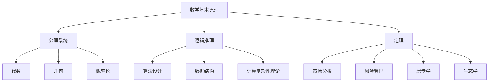

                 

# 数学与普遍主义：数学在所有领域的适用性

> 关键词：数学、普遍主义、应用领域、逻辑推理、算法、模型、编程

> 摘要：本文旨在探讨数学在各个领域的普遍适用性，通过分析数学的基本原理和核心概念，展示数学如何成为解决复杂问题的强大工具。我们将从数学的基本原理出发，逐步深入到具体的应用案例，揭示数学在不同领域的实际应用价值。通过本文，读者将能够理解数学在各个领域的广泛适用性，并掌握如何利用数学工具解决实际问题。

## 1. 背景介绍
### 1.1 目的和范围
本文旨在探讨数学在各个领域的普遍适用性，通过分析数学的基本原理和核心概念，展示数学如何成为解决复杂问题的强大工具。我们将从数学的基本原理出发，逐步深入到具体的应用案例，揭示数学在不同领域的实际应用价值。本文的目标读者是具有基本数学知识的程序员、软件架构师、人工智能专家以及对数学在实际应用中感兴趣的技术爱好者。

### 1.2 预期读者
- 程序员
- 软件架构师
- 人工智能专家
- 技术爱好者
- 对数学在实际应用中感兴趣的人士

### 1.3 文档结构概述
本文将按照以下结构展开：
1. 背景介绍
2. 核心概念与联系
3. 核心算法原理 & 具体操作步骤
4. 数学模型和公式 & 详细讲解 & 举例说明
5. 项目实战：代码实际案例和详细解释说明
6. 实际应用场景
7. 工具和资源推荐
8. 总结：未来发展趋势与挑战
9. 附录：常见问题与解答
10. 扩展阅读 & 参考资料

### 1.4 术语表
#### 1.4.1 核心术语定义
- **普遍主义**：一种哲学观点，认为某些概念、原则或方法在所有领域中都具有普遍适用性。
- **数学模型**：用数学语言描述现实世界现象的方法。
- **算法**：解决问题的具体步骤或方法。
- **逻辑推理**：通过逻辑规则进行推理的过程。
- **公理系统**：一组基本假设，从这些假设出发可以推导出其他结论。
- **定理**：在公理系统中通过逻辑推理得出的结论。

#### 1.4.2 相关概念解释
- **数学**：研究数量、结构、变化和空间等概念的一门学科。
- **应用数学**：将数学理论应用于实际问题的领域。
- **计算机科学**：研究计算机系统的设计、实现和应用的学科。

#### 1.4.3 缩略词列表
- **API**：Application Programming Interface（应用程序编程接口）
- **IDE**：Integrated Development Environment（集成开发环境）
- **GUI**：Graphical User Interface（图形用户界面）

## 2. 核心概念与联系
### 2.1 数学的基本原理
数学的基本原理包括公理系统、逻辑推理和定理。公理系统是一组基本假设，逻辑推理是通过这些假设推导出其他结论的过程，而定理是通过逻辑推理得出的结论。

### 2.2 数学与普遍主义的关系
数学的普遍主义体现在其基本原理和方法在各个领域中的广泛适用性。例如，代数、几何、概率论等数学分支在不同领域都有广泛的应用。

### 2.3 数学在各个领域的应用
数学在各个领域的应用包括但不限于：
- **计算机科学**：算法设计、数据结构、计算复杂性理论等。
- **工程学**：结构分析、控制系统设计等。
- **经济学**：市场分析、风险管理等。
- **物理学**：力学、电磁学、量子力学等。
- **生物学**：遗传学、生态学等。

### 2.4 Mermaid 流程图


## 3. 核心算法原理 & 具体操作步骤
### 3.1 算法设计的基本步骤
算法设计的基本步骤包括：
1. **问题定义**：明确问题的输入和输出。
2. **算法设计**：设计解决问题的具体步骤。
3. **算法分析**：分析算法的时间复杂度和空间复杂度。
4. **算法实现**：将算法转化为计算机可执行的代码。
5. **算法测试**：验证算法的正确性和效率。

### 3.2 伪代码示例
```plaintext
# 伪代码示例：快速排序算法
function quicksort(arr):
    if length(arr) <= 1:
        return arr
    else:
        pivot = arr[0]
        less = [x for x in arr[1:] if x <= pivot]
        greater = [x for x in arr[1:] if x > pivot]
        return quicksort(less) + [pivot] + quicksort(greater)
```

## 4. 数学模型和公式 & 详细讲解 & 举例说明
### 4.1 数学模型的基本概念
数学模型是用数学语言描述现实世界现象的方法。例如，线性回归模型可以用来预测房价。

### 4.2 数学模型的构建步骤
1. **问题定义**：明确问题的输入和输出。
2. **假设条件**：设定合理的假设条件。
3. **数学表达**：用数学语言表达问题。
4. **求解方法**：选择合适的求解方法。
5. **模型验证**：验证模型的正确性和有效性。

### 4.3 数学模型的实例
#### 4.3.1 线性回归模型
线性回归模型是一种常用的数学模型，用于预测连续变量。其基本公式为：
$$
y = \beta_0 + \beta_1 x + \epsilon
$$
其中，$y$ 是因变量，$x$ 是自变量，$\beta_0$ 和 $\beta_1$ 是模型参数，$\epsilon$ 是误差项。

#### 4.3.2 详细讲解
线性回归模型的基本步骤包括：
1. **数据收集**：收集自变量和因变量的数据。
2. **模型拟合**：使用最小二乘法拟合模型。
3. **模型评估**：评估模型的拟合效果。
4. **模型应用**：使用模型进行预测。

### 4.4 数学公式的详细讲解
#### 4.4.1 最小二乘法
最小二乘法是一种常用的求解线性回归模型的方法。其基本公式为：
$$
\hat{\beta} = (X^T X)^{-1} X^T y
$$
其中，$X$ 是自变量矩阵，$y$ 是因变量向量，$\hat{\beta}$ 是模型参数向量。

## 5. 项目实战：代码实际案例和详细解释说明
### 5.1 开发环境搭建
#### 5.1.1 环境要求
- Python 3.8+
- NumPy
- Pandas
- Matplotlib

#### 5.1.2 安装依赖
```bash
pip install numpy pandas matplotlib
```

### 5.2 源代码详细实现和代码解读
```python
import numpy as np
import pandas as pd
import matplotlib.pyplot as plt

# 生成示例数据
np.random.seed(0)
X = np.random.rand(100, 1)
y = 2 + 3 * X + np.random.rand(100, 1)

# 数据预处理
X_b = np.c_[np.ones((100, 1)), X]  # 添加偏置项
theta_best = np.linalg.inv(X_b.T.dot(X_b)).dot(X_b.T).dot(y)

# 模型预测
X_new = np.array([[0], [2]])
X_new_b = np.c_[np.ones((2, 1)), X_new]
y_predict = X_new_b.dot(theta_best)

# 绘制结果
plt.plot(X_new, y_predict, "r-", label="Predictions")
plt.plot(X, y, "b.")
plt.xlabel("$x_1$", fontsize=18)
plt.ylabel("$y$", rotation=0, fontsize=18)
plt.legend(loc="upper left", fontsize=14)
plt.axis([0, 2, 0, 15])
plt.show()
```

### 5.3 代码解读与分析
- **数据生成**：使用 NumPy 生成示例数据。
- **数据预处理**：添加偏置项，以便进行线性回归。
- **模型拟合**：使用最小二乘法拟合模型。
- **模型预测**：使用模型进行预测。
- **结果可视化**：使用 Matplotlib 绘制结果。

## 6. 实际应用场景
### 6.1 金融领域
在金融领域，数学模型被广泛应用于风险管理、投资组合优化等。例如，VaR（Value at Risk）模型可以用来预测投资组合的风险。

### 6.2 工程领域
在工程领域，数学模型被广泛应用于结构分析、控制系统设计等。例如，有限元分析可以用来预测结构的应力和应变。

### 6.3 生物领域
在生物领域，数学模型被广泛应用于遗传学、生态学等。例如，种群动态模型可以用来预测种群的数量变化。

## 7. 工具和资源推荐
### 7.1 学习资源推荐
#### 7.1.1 书籍推荐
- **《数学之美》**：吴军
- **《线性代数及其应用》**：Gilbert Strang
- **《概率论与数理统计》**：陈希孺

#### 7.1.2 在线课程
- **Coursera**：《数学思维导论》
- **edX**：《线性代数》
- **Khan Academy**：《概率论与统计》

#### 7.1.3 技术博客和网站
- **Medium**：《数学与编程》系列文章
- **Towards Data Science**：《数学在数据科学中的应用》系列文章

### 7.2 开发工具框架推荐
#### 7.2.1 IDE和编辑器
- **PyCharm**
- **VS Code**

#### 7.2.2 调试和性能分析工具
- **PyCharm Debugger**
- **Python Profiler**

#### 7.2.3 相关框架和库
- **NumPy**
- **Pandas**
- **Matplotlib**

### 7.3 相关论文著作推荐
#### 7.3.1 经典论文
- **《线性代数及其应用》**：Gilbert Strang
- **《概率论与数理统计》**：陈希孺

#### 7.3.2 最新研究成果
- **《机器学习中的数学》**：周志华

#### 7.3.3 应用案例分析
- **《金融工程中的数学模型》**：John C. Hull

## 8. 总结：未来发展趋势与挑战
### 8.1 未来发展趋势
- **深度学习**：数学在深度学习中的应用将更加广泛。
- **大数据**：数学在大数据分析中的应用将更加深入。
- **人工智能**：数学在人工智能中的应用将更加广泛。

### 8.2 挑战
- **计算复杂性**：数学模型的计算复杂性将越来越高。
- **数据隐私**：数学模型的数据隐私问题将越来越突出。
- **模型解释性**：数学模型的解释性将越来越重要。

## 9. 附录：常见问题与解答
### 9.1 问题与解答
- **Q：数学在实际应用中有哪些挑战？**
  - A：数学模型的计算复杂性、数据隐私和模型解释性是主要挑战。
- **Q：如何提高数学模型的解释性？**
  - A：可以通过可视化、简化模型结构等方式提高数学模型的解释性。

## 10. 扩展阅读 & 参考资料
- **《数学之美》**：吴军
- **《线性代数及其应用》**：Gilbert Strang
- **《概率论与数理统计》**：陈希孺
- **Coursera**：《数学思维导论》
- **edX**：《线性代数》
- **Khan Academy**：《概率论与统计》
- **PyCharm**
- **VS Code**
- **PyCharm Debugger**
- **Python Profiler**
- **NumPy**
- **Pandas**
- **Matplotlib**
- **《机器学习中的数学》**：周志华
- **《金融工程中的数学模型》**：John C. Hull

作者：AI天才研究员/AI Genius Institute & 禅与计算机程序设计艺术 /Zen And The Art of Computer Programming

