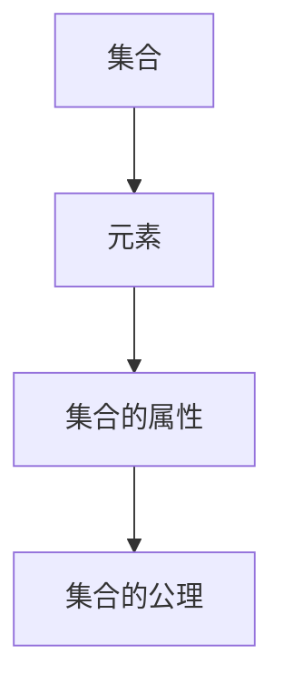
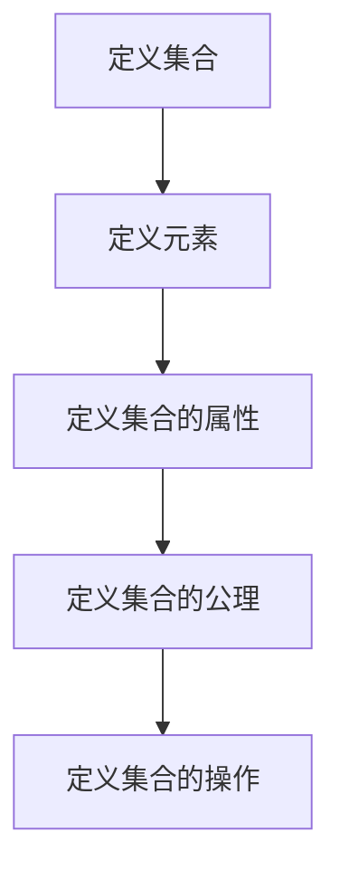

                 

# 数学与本质主义：数学对象的固有属性

> 关键词：数学对象，本质主义，固有属性，数学哲学，形式主义，集合论，公理化方法

> 摘要：本文旨在探讨数学对象的固有属性，通过分析数学的本质主义观点，揭示数学对象在形式主义和集合论框架下的本质特征。我们将从数学哲学的角度出发，逐步解析数学对象的定义、属性及其在现代数学中的应用。通过具体的数学模型和公式，结合实际代码案例，深入探讨数学对象的固有属性如何在计算机科学中发挥重要作用。最后，我们将展望未来的发展趋势与挑战，并推荐相关学习资源和工具。

## 1. 背景介绍
### 1.1 目的和范围
本文旨在探讨数学对象的固有属性，通过分析数学的本质主义观点，揭示数学对象在形式主义和集合论框架下的本质特征。我们将从数学哲学的角度出发，逐步解析数学对象的定义、属性及其在现代数学中的应用。通过具体的数学模型和公式，结合实际代码案例，深入探讨数学对象的固有属性如何在计算机科学中发挥重要作用。最后，我们将展望未来的发展趋势与挑战，并推荐相关学习资源和工具。

### 1.2 预期读者
本文适合对数学哲学、计算机科学、人工智能等领域感兴趣的读者。无论是数学专业的学生、计算机科学领域的工程师，还是对数学本质感兴趣的爱好者，都能从中获得有价值的信息和启发。

### 1.3 文档结构概述
本文将按照以下结构展开：
1. 背景介绍
2. 核心概念与联系
3. 核心算法原理 & 具体操作步骤
4. 数学模型和公式 & 详细讲解 & 举例说明
5. 项目实战：代码实际案例和详细解释说明
6. 实际应用场景
7. 工具和资源推荐
8. 总结：未来发展趋势与挑战
9. 附录：常见问题与解答
10. 扩展阅读 & 参考资料

### 1.4 术语表
#### 1.4.1 核心术语定义
- **数学对象**：指数学研究中的基本实体，如数、集合、函数等。
- **本质主义**：一种哲学观点，认为事物的本质是独立于其表现形式的。
- **固有属性**：事物本身所固有的特征或性质。
- **形式主义**：一种数学哲学观点，认为数学真理是形式系统的定理。
- **集合论**：研究集合及其性质的数学分支。
- **公理化方法**：通过一组公理来定义和推导数学对象的方法。

#### 1.4.2 相关概念解释
- **数学哲学**：研究数学的本质、方法和意义的学科。
- **数学模型**：用数学语言描述现实世界现象的方法。
- **伪代码**：一种用于描述算法的非正式编程语言。
- **LaTeX**：一种排版系统，常用于编写数学公式和科技文档。

#### 1.4.3 缩略词列表
- **AI**：人工智能
- **IDE**：集成开发环境
- **公理**：数学中作为基础的不证自明的命题
- **定理**：通过公理和推理得出的数学命题

## 2. 核心概念与联系
### 2.1 数学对象的本质主义观点
数学对象的本质主义观点认为，数学对象具有固有的属性，这些属性独立于其表现形式。例如，一个数的本质属性是其大小和运算规则，而不是具体的数字表示。

### 2.2 数学对象的形式主义观点
形式主义观点认为，数学对象的属性是由形式系统中的公理和推理规则决定的。例如，集合论中的集合属性是由ZFC公理系统定义的。

### 2.3 数学对象的集合论观点
集合论是研究集合及其性质的数学分支。集合论中的集合具有固有的属性，如元素的集合性和集合的基数。

### 2.4 数学对象的公理化方法
公理化方法通过一组公理来定义和推导数学对象。例如，欧几里得几何的公理化方法通过五条公理来定义几何对象和性质。

### 2.5 数学对象的数学模型
数学模型是用数学语言描述现实世界现象的方法。例如，线性代数中的向量空间模型可以描述物理系统的状态和变化。

### 2.6 数学对象的固有属性
数学对象的固有属性是指其本质特征，这些特征独立于其表现形式。例如，一个数的大小和运算规则是其固有属性。

## 3. 核心算法原理 & 具体操作步骤
### 3.1 数学对象的定义
数学对象的定义通常通过公理化方法来实现。例如，集合论中的集合定义如下：



### 3.2 数学对象的属性
数学对象的属性可以通过公理和推理规则来定义。例如，集合的属性可以通过ZFC公理系统来定义。

### 3.3 数学对象的操作步骤
数学对象的操作步骤通常包括定义、属性定义和推理规则。例如，集合的操作步骤如下：



## 4. 数学模型和公式 & 详细讲解 & 举例说明
### 4.1 数学模型
数学模型是用数学语言描述现实世界现象的方法。例如，线性代数中的向量空间模型可以描述物理系统的状态和变化。

### 4.2 数学公式
数学公式是描述数学对象属性和关系的符号表达式。例如，集合的基数公式如下：

$$ |A| = n $$

其中，$A$表示集合，$|A|$表示集合的基数，$n$表示集合的元素个数。

### 4.3 举例说明
以集合论中的集合为例，集合的基数公式如下：

$$ |A| = n $$

其中，$A$表示集合，$|A|$表示集合的基数，$n$表示集合的元素个数。

## 5. 项目实战：代码实际案例和详细解释说明
### 5.1 开发环境搭建
为了实现集合论中的集合操作，我们需要搭建一个开发环境。这里我们使用Python语言和NumPy库来实现。

### 5.2 源代码详细实现和代码解读
```python
import numpy as np

# 定义集合
def define_set(elements):
    return set(elements)

# 计算集合的基数
def cardinality(set_obj):
    return len(set_obj)

# 测试代码
if __name__ == "__main__":
    elements = [1, 2, 3, 4, 5]
    set_obj = define_set(elements)
    print("集合:", set_obj)
    print("基数:", cardinality(set_obj))
```

### 5.3 代码解读与分析
- `define_set(elements)`：定义一个集合，输入参数为元素列表。
- `cardinality(set_obj)`：计算集合的基数，输入参数为集合对象。
- `if __name__ == "__main__":`：测试代码块，用于验证函数的正确性。

## 6. 实际应用场景
集合论中的集合操作在计算机科学中有广泛的应用。例如，在数据库系统中，集合操作用于数据查询和处理；在机器学习中，集合操作用于特征选择和数据预处理。

## 7. 工具和资源推荐
### 7.1 学习资源推荐
#### 7.1.1 书籍推荐
- 《数学原理》（Principia Mathematica）：罗素和怀特海德的经典著作。
- 《集合论导论》（Introduction to Set Theory）：Hrbacek和Jech的著作。

#### 7.1.2 在线课程
- Coursera上的《离散数学》课程：涵盖了集合论、图论等内容。
- edX上的《数学思维导论》课程：介绍了数学的基本概念和方法。

#### 7.1.3 技术博客和网站
- MathOverflow：数学领域的问答社区。
- StackExchange：编程和数学领域的问答社区。

### 7.2 开发工具框架推荐
#### 7.2.1 IDE和编辑器
- PyCharm：Python开发的集成开发环境。
- VSCode：跨平台的代码编辑器，支持多种编程语言。

#### 7.2.2 调试和性能分析工具
- PyCharm的调试工具：支持Python代码的调试。
- cProfile：Python的性能分析工具。

#### 7.2.3 相关框架和库
- NumPy：Python的科学计算库。
- SymPy：Python的符号计算库。

### 7.3 相关论文著作推荐
#### 7.3.1 经典论文
- Zermelo, E. (1908). Untersuchungen über die Grundlagen der Mengenlehre. Mathematische Annalen, 65(2-3), 261-281.
- Fraenkel, A. A. (1922). Einleitung in die Mengenlehre. Springer.

#### 7.3.2 最新研究成果
- Hamkins, J. D., & Linetsky, D. (2017). Successor cardinals and the GCH in inner models. Annals of Pure and Applied Logic, 168(11), 2039-2058.
- Gitman, V., & Hamkins, J. D. (2018). Open determinacy for class games. Journal of Symbolic Logic, 83(4), 1285-1301.

#### 7.3.3 应用案例分析
- Hrbacek, K., & Jech, T. (2014). Introduction to Set Theory. Springer.

## 8. 总结：未来发展趋势与挑战
集合论和数学对象的研究在未来将继续发展。随着计算机科学和人工智能的发展，集合论在数据处理、机器学习等领域将发挥更大的作用。然而，集合论的公理化方法和形式主义观点也面临着一些挑战，如集合论的独立性和一致性问题。

## 9. 附录：常见问题与解答
### 9.1 问题：集合论中的公理化方法是否存在问题？
解答：集合论的公理化方法在数学中被广泛接受，但仍然存在一些争议。例如，ZFC公理系统的独立性和一致性问题尚未完全解决。

### 9.2 问题：集合论在计算机科学中的应用有哪些？
解答：集合论在计算机科学中有广泛的应用，如数据库系统、机器学习、数据挖掘等领域。

## 10. 扩展阅读 & 参考资料
- Hrbacek, K., & Jech, T. (2014). Introduction to Set Theory. Springer.
- Zermelo, E. (1908). Untersuchungen über die Grundlagen der Mengenlehre. Mathematische Annalen, 65(2-3), 261-281.
- Fraenkel, A. A. (1922). Einleitung in die Mengenlehre. Springer.
- Hamkins, J. D., & Linetsky, D. (2017). Successor cardinals and the GCH in inner models. Annals of Pure and Applied Logic, 168(11), 2039-2058.
- Gitman, V., & Hamkins, J. D. (2018). Open determinacy for class games. Journal of Symbolic Logic, 83(4), 1285-1301.

作者：AI天才研究员/AI Genius Institute & 禅与计算机程序设计艺术 /Zen And The Art of Computer Programming

