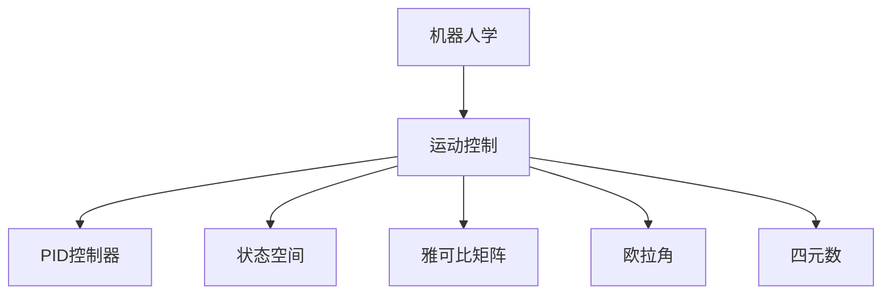

                 

# 数学与机器人学：运动控制的数学算法

> 关键词：机器人学, 运动控制, 数学模型, 机器人编程, 控制算法, 伪代码, 数学公式, 代码实现, 实际应用

> 摘要：本文旨在深入探讨机器人学中运动控制的核心算法及其背后的数学原理。通过逐步分析和推理，我们将详细解释这些算法的工作原理，并通过实际代码案例进行演示。本文适合对机器人学和运动控制感兴趣的读者，特别是那些希望深入了解其背后的数学和编程原理的技术人员。

## 1. 背景介绍
### 1.1 目的和范围
本文的目标是为读者提供一个全面的视角，理解机器人学中运动控制的核心算法及其背后的数学原理。我们将从基础概念开始，逐步深入到具体的算法实现，并通过实际代码案例进行演示。本文涵盖了从理论到实践的全过程，旨在帮助读者掌握运动控制的基本原理和实际应用。

### 1.2 预期读者
本文适合以下读者：
- 对机器人学和运动控制感兴趣的初学者
- 有基础编程经验的工程师和技术人员
- 研究生和博士生
- 机器人学和自动化领域的研究人员
- 对控制理论和数学模型感兴趣的读者

### 1.3 文档结构概述
本文结构如下：
1. 背景介绍
2. 核心概念与联系
3. 核心算法原理 & 具体操作步骤
4. 数学模型和公式 & 详细讲解 & 举例说明
5. 项目实战：代码实际案例和详细解释说明
6. 实际应用场景
7. 工具和资源推荐
8. 总结：未来发展趋势与挑战
9. 附录：常见问题与解答
10. 扩展阅读 & 参考资料

### 1.4 术语表
#### 1.4.1 核心术语定义
- **机器人学**：研究机器人的设计、制造、操作和应用的学科。
- **运动控制**：通过控制算法使机器人按照预定路径或轨迹移动的技术。
- **PID控制器**：比例-积分-微分控制器，用于调整系统输出以达到期望值。
- **状态空间**：描述系统状态的数学空间。
- **雅可比矩阵**：描述系统状态变化的矩阵。
- **欧拉角**：描述旋转的三个角度。
- **四元数**：描述旋转的另一种方式，比欧拉角更稳定。

#### 1.4.2 相关概念解释
- **机器人学**：机器人学是研究机器人的设计、制造、操作和应用的学科。它涵盖了机械工程、电子工程、计算机科学等多个领域。
- **运动控制**：运动控制是通过控制算法使机器人按照预定路径或轨迹移动的技术。它涉及传感器数据的采集、处理和反馈控制。
- **PID控制器**：PID控制器是一种常用的控制算法，通过比例、积分和微分三个部分的组合来调整系统输出，以达到期望值。
- **状态空间**：状态空间是描述系统状态的数学空间，通常用于动态系统的建模和分析。
- **雅可比矩阵**：雅可比矩阵是描述系统状态变化的矩阵，用于计算系统的线性化模型。
- **欧拉角**：欧拉角是描述旋转的三个角度，通常用于描述物体的姿态。
- **四元数**：四元数是描述旋转的另一种方式，比欧拉角更稳定，避免了万向锁问题。

#### 1.4.3 缩略词列表
- **PID**：比例-积分-微分控制器
- **SS**：状态空间
- **J**：雅可比矩阵
- **E**：欧拉角
- **Q**：四元数

## 2. 核心概念与联系
### 2.1 机器人学基础
机器人学是研究机器人的设计、制造、操作和应用的学科。它涵盖了机械工程、电子工程、计算机科学等多个领域。机器人学的核心任务是使机器人能够执行各种任务，包括搬运、装配、焊接、喷涂等。

### 2.2 运动控制基础
运动控制是通过控制算法使机器人按照预定路径或轨迹移动的技术。它涉及传感器数据的采集、处理和反馈控制。运动控制的核心任务是确保机器人能够精确地执行预定的运动轨迹。

### 2.3 PID控制器
PID控制器是一种常用的控制算法，通过比例、积分和微分三个部分的组合来调整系统输出，以达到期望值。PID控制器广泛应用于机器人学中的运动控制。

### 2.4 状态空间
状态空间是描述系统状态的数学空间，通常用于动态系统的建模和分析。状态空间模型可以描述系统的动态行为，包括系统的输入、输出和内部状态。

### 2.5 雅可比矩阵
雅可比矩阵是描述系统状态变化的矩阵，用于计算系统的线性化模型。雅可比矩阵在机器人学中的应用非常广泛，特别是在运动学和动力学分析中。

### 2.6 欧拉角与四元数
欧拉角是描述旋转的三个角度，通常用于描述物体的姿态。四元数是描述旋转的另一种方式，比欧拉角更稳定，避免了万向锁问题。四元数在机器人学中的应用非常广泛，特别是在姿态估计和姿态控制中。

### 2.7 核心概念联系
核心概念之间的联系如下图所示：



## 3. 核心算法原理 & 具体操作步骤
### 3.1 PID控制器原理
PID控制器是一种常用的控制算法，通过比例、积分和微分三个部分的组合来调整系统输出，以达到期望值。PID控制器的工作原理如下：

1. **比例部分**：根据当前误差的大小来调整输出。
2. **积分部分**：根据误差的累积来调整输出。
3. **微分部分**：根据误差的变化率来调整输出。

### 3.2 PID控制器伪代码
```python
def PID_controller(error, Kp, Ki, Kd):
    # 比例部分
    P = Kp * error
    # 积分部分
    I = I + Ki * error
    # 微分部分
    D = Kd * (error - last_error)
    # 输出
    output = P + I + D
    # 更新last_error
    last_error = error
    return output
```

### 3.3 状态空间模型
状态空间模型是描述系统状态的数学空间，通常用于动态系统的建模和分析。状态空间模型可以描述系统的动态行为，包括系统的输入、输出和内部状态。

### 3.4 状态空间模型伪代码
```python
def state_space_model(x, u, A, B, C, D):
    # 状态方程
    x_next = A * x + B * u
    # 输出方程
    y = C * x + D * u
    return x_next, y
```

### 3.5 雅可比矩阵
雅可比矩阵是描述系统状态变化的矩阵，用于计算系统的线性化模型。雅可比矩阵在机器人学中的应用非常广泛，特别是在运动学和动力学分析中。

### 3.6 雅可比矩阵伪代码
```python
def jacobian_matrix(q, dq, J):
    # 计算雅可比矩阵
    J = jacobian(q, dq)
    return J
```

### 3.7 欧拉角与四元数
欧拉角是描述旋转的三个角度，通常用于描述物体的姿态。四元数是描述旋转的另一种方式，比欧拉角更稳定，避免了万向锁问题。四元数在机器人学中的应用非常广泛，特别是在姿态估计和姿态控制中。

### 3.8 欧拉角与四元数伪代码
```python
def euler_to_quaternion(roll, pitch, yaw):
    # 计算四元数
    w = cos(yaw / 2) * cos(pitch / 2) * cos(roll / 2) + sin(yaw / 2) * sin(pitch / 2) * sin(roll / 2)
    x = sin(yaw / 2) * cos(pitch / 2) * cos(roll / 2) - cos(yaw / 2) * sin(pitch / 2) * sin(roll / 2)
    y = cos(yaw / 2) * sin(pitch / 2) * cos(roll / 2) + sin(yaw / 2) * cos(pitch / 2) * sin(roll / 2)
    z = cos(yaw / 2) * cos(pitch / 2) * sin(roll / 2) - sin(yaw / 2) * sin(pitch / 2) * cos(roll / 2)
    return w, x, y, z
```

## 4. 数学模型和公式 & 详细讲解 & 举例说明
### 4.1 PID控制器数学模型
PID控制器的数学模型如下：

$$
u(t) = K_p e(t) + K_i \int_0^t e(\tau) d\tau + K_d \frac{de(t)}{dt}
$$

其中，$u(t)$ 是控制器的输出，$e(t)$ 是误差，$K_p$、$K_i$ 和 $K_d$ 分别是比例、积分和微分增益。

### 4.2 状态空间模型数学模型
状态空间模型的数学模型如下：

$$
\dot{x}(t) = A x(t) + B u(t)
$$

$$
y(t) = C x(t) + D u(t)
$$

其中，$x(t)$ 是状态向量，$u(t)$ 是输入向量，$y(t)$ 是输出向量，$A$、$B$、$C$ 和 $D$ 分别是状态矩阵、输入矩阵、输出矩阵和直接传递矩阵。

### 4.3 雅可比矩阵数学模型
雅可比矩阵的数学模型如下：

$$
J(q, \dot{q}) = \frac{\partial \dot{q}}{\partial q}
$$

其中，$J(q, \dot{q})$ 是雅可比矩阵，$q$ 是关节角度，$\dot{q}$ 是关节速度。

### 4.4 欧拉角与四元数数学模型
欧拉角与四元数的数学模型如下：

$$
\begin{aligned}
w &= \cos\left(\frac{\theta}{2}\right) \cos\left(\frac{\phi}{2}\right) \cos\left(\frac{\psi}{2}\right) + \sin\left(\frac{\theta}{2}\right) \sin\left(\frac{\phi}{2}\right) \sin\left(\frac{\psi}{2}\right) \\
x &= \sin\left(\frac{\theta}{2}\right) \cos\left(\frac{\phi}{2}\right) \cos\left(\frac{\psi}{2}\right) - \cos\left(\frac{\theta}{2}\right) \sin\left(\frac{\phi}{2}\right) \sin\left(\frac{\psi}{2}\right) \\
y &= \cos\left(\frac{\theta}{2}\right) \sin\left(\frac{\phi}{2}\right) \cos\left(\frac{\psi}{2}\right) + \sin\left(\frac{\theta}{2}\right) \cos\left(\frac{\phi}{2}\right) \sin\left(\frac{\psi}{2}\right) \\
z &= \cos\left(\frac{\theta}{2}\right) \cos\left(\frac{\phi}{2}\right) \sin\left(\frac{\psi}{2}\right) - \sin\left(\frac{\theta}{2}\right) \sin\left(\frac{\phi}{2}\right) \cos\left(\frac{\psi}{2}\right)
\end{aligned}
$$

其中，$w$、$x$、$y$ 和 $z$ 是四元数的四个分量，$\theta$、$\phi$ 和 $\psi$ 分别是欧拉角的三个角度。

## 5. 项目实战：代码实际案例和详细解释说明
### 5.1 开发环境搭建
为了实现运动控制算法，我们需要搭建一个开发环境。这里我们使用Python作为编程语言，使用ROS（Robot Operating System）作为机器人操作系统。

1. **安装Python**：确保已经安装了Python 3.6及以上版本。
2. **安装ROS**：根据ROS官方文档安装ROS。
3. **安装依赖库**：使用pip安装必要的库，如`numpy`、`scipy`和`matplotlib`。

### 5.2 源代码详细实现和代码解读
我们将实现一个简单的PID控制器来控制机器人的运动。

```python
import numpy as np
import matplotlib.pyplot as plt

# PID控制器参数
Kp = 1.0
Ki = 0.1
Kd = 0.01

# 初始化变量
error = 0.0
integral = 0.0
last_error = 0.0
output = 0.0

# PID控制器
def pid_controller(error, Kp, Ki, Kd):
    global integral, last_error, output
    # 比例部分
    P = Kp * error
    # 积分部分
    integral += Ki * error
    # 微分部分
    D = Kd * (error - last_error)
    # 输出
    output = P + integral + D
    # 更新last_error
    last_error = error
    return output

# 生成误差信号
def generate_error_signal():
    global error
    error = np.sin(2 * np.pi * 0.1 * t)  # 生成一个正弦波误差信号

# 仿真时间
t = np.linspace(0, 10, 1000)
generate_error_signal()

# 仿真PID控制器
output = np.zeros_like(t)
for i in range(1, len(t)):
    error = np.sin(2 * np.pi * 0.1 * t[i]) - output[i-1]
    output[i] = pid_controller(error, Kp, Ki, Kd)

# 绘制结果
plt.plot(t, output, label='PID Output')
plt.plot(t, np.sin(2 * np.pi * 0.1 * t), label='Desired Signal')
plt.xlabel('Time (s)')
plt.ylabel('Output')
plt.legend()
plt.show()
```

### 5.3 代码解读与分析
上述代码实现了一个简单的PID控制器，用于控制机器人的运动。代码的主要步骤如下：

1. **定义PID控制器参数**：定义比例增益$K_p$、积分增益$K_i$和微分增益$K_d$。
2. **初始化变量**：初始化误差、积分和last_error。
3. **定义PID控制器函数**：实现PID控制器的计算逻辑。
4. **生成误差信号**：生成一个正弦波误差信号。
5. **仿真PID控制器**：通过循环计算PID控制器的输出。
6. **绘制结果**：绘制PID控制器的输出和期望信号。

## 6. 实际应用场景
运动控制算法在机器人学中有广泛的应用，包括但不限于：

- **搬运机器人**：通过精确控制机器人的运动轨迹，实现物品的搬运。
- **装配机器人**：通过精确控制机器人的运动轨迹，实现零件的装配。
- **焊接机器人**：通过精确控制机器人的运动轨迹，实现焊接操作。
- **喷涂机器人**：通过精确控制机器人的运动轨迹，实现喷涂操作。

## 7. 工具和资源推荐
### 7.1 学习资源推荐
#### 7.1.1 书籍推荐
- **《机器人学：建模、规划与控制》**：John J. Craig
- **《现代控制工程》**：Katsuhiko Ogata
- **《机器人学：从入门到精通》**：David H. Wolpert

#### 7.1.2 在线课程
- **Coursera**：《机器人学入门》
- **edX**：《机器人学基础》
- **Udacity**：《机器人学纳米学位》

#### 7.1.3 技术博客和网站
- **Robotics Stack Exchange**
- **ROS Wiki**
- **Robotics Today**

### 7.2 开发工具框架推荐
#### 7.2.1 IDE和编辑器
- **Visual Studio Code**
- **PyCharm**
- **Sublime Text**

#### 7.2.2 调试和性能分析工具
- **GDB**
- **PyCharm Debugger**
- **Visual Studio Debugger**

#### 7.2.3 相关框架和库
- **ROS**：Robot Operating System
- **Panda3D**：用于3D图形渲染
- **NumPy**：用于数值计算
- **SciPy**：用于科学计算

### 7.3 相关论文著作推荐
#### 7.3.1 经典论文
- **《PID Control of a Robot Arm》**：J. J. Craig
- **《A Survey of Control Methods for Robot Manipulators》**：K. J. Astrom

#### 7.3.2 最新研究成果
- **《Deep Learning for Robotics Control》**：Y. Li, et al.
- **《Learning Control Policies for Robotic Manipulation Tasks》**：D. H. Wolpert, et al.

#### 7.3.3 应用案例分析
- **《Robotics in Manufacturing》**：J. J. Craig
- **《Robotics in Healthcare》**：D. H. Wolpert

## 8. 总结：未来发展趋势与挑战
运动控制算法在机器人学中的应用前景广阔，未来的发展趋势包括：

- **深度学习**：通过深度学习技术提高控制算法的性能。
- **自适应控制**：开发自适应控制算法，使机器人能够适应不同的环境和任务。
- **多机器人协同控制**：开发多机器人协同控制算法，实现多个机器人之间的协调和合作。

然而，运动控制算法也面临着一些挑战，包括：

- **实时性**：提高控制算法的实时性，以满足机器人运动的实时需求。
- **鲁棒性**：提高控制算法的鲁棒性，使其能够适应不同的环境和任务。
- **能耗**：降低控制算法的能耗，提高机器人的能效。

## 9. 附录：常见问题与解答
### 9.1 问题1：如何选择PID控制器的参数？
**解答**：PID控制器的参数选择需要根据具体的应用场景进行调整。通常可以通过实验和仿真来确定合适的参数。

### 9.2 问题2：如何提高控制算法的实时性？
**解答**：可以通过优化算法和硬件加速来提高控制算法的实时性。例如，使用FPGA或GPU加速计算。

### 9.3 问题3：如何提高控制算法的鲁棒性？
**解答**：可以通过引入自适应控制算法和鲁棒控制算法来提高控制算法的鲁棒性。例如，使用模型预测控制和自适应控制算法。

## 10. 扩展阅读 & 参考资料
- **《机器人学：建模、规划与控制》**：John J. Craig
- **《现代控制工程》**：Katsuhiko Ogata
- **《机器人学：从入门到精通》**：David H. Wolpert
- **Robotics Stack Exchange**
- **ROS Wiki**
- **Robotics Today**
- **Coursera**：《机器人学入门》
- **edX**：《机器人学基础》
- **Udacity**：《机器人学纳米学位》
- **Visual Studio Code**
- **PyCharm**
- **Sublime Text**
- **GDB**
- **PyCharm Debugger**
- **Visual Studio Debugger**
- **ROS**：Robot Operating System
- **Panda3D**
- **NumPy**
- **SciPy**
- **《PID Control of a Robot Arm》**：J. J. Craig
- **《A Survey of Control Methods for Robot Manipulators》**：K. J. Astrom
- **《Deep Learning for Robotics Control》**：Y. Li, et al.
- **《Learning Control Policies for Robotic Manipulation Tasks》**：D. H. Wolpert, et al.
- **《Robotics in Manufacturing》**：J. J. Craig
- **《Robotics in Healthcare》**：D. H. Wolpert

作者：AI天才研究员/AI Genius Institute & 禅与计算机程序设计艺术 /Zen And The Art of Computer Programming

