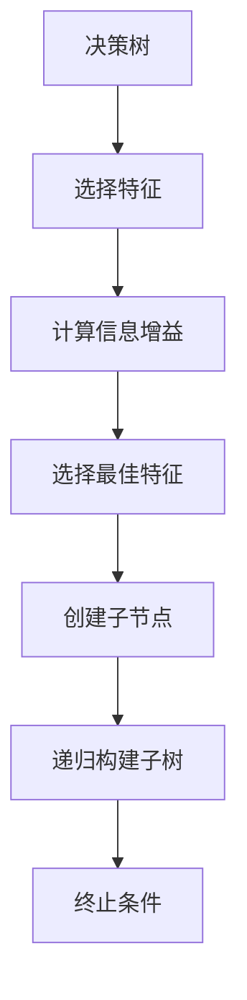
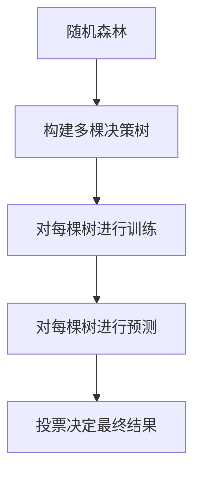
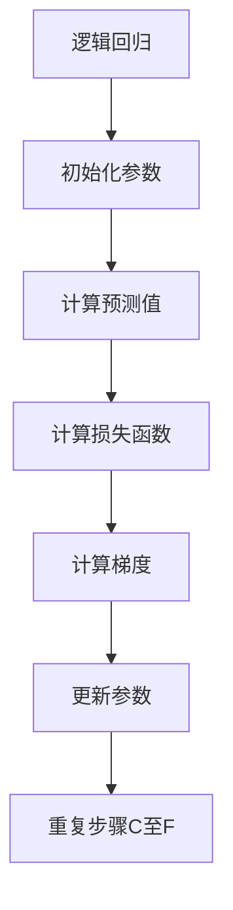

                 

# 数学与机器学习公平性：算法偏见的数学分析

> 关键词：机器学习，公平性，算法偏见，数学分析，决策树，逻辑回归，随机森林，公平性指标

> 摘要：随着机器学习技术在各个领域的广泛应用，算法偏见和公平性问题日益凸显。本文旨在通过数学分析的方法，深入探讨机器学习模型中的偏见来源及其对公平性的影响。我们将从核心概念出发，逐步解析算法偏见的数学原理，通过具体的算法原理和操作步骤，展示如何构建公平的机器学习模型。此外，本文还将通过实际代码案例，详细解释如何在实践中实现公平性。最后，我们将讨论实际应用场景、推荐学习资源和开发工具，并展望未来的发展趋势与挑战。

## 1. 背景介绍
### 1.1 目的和范围
本文旨在探讨机器学习模型中的偏见问题及其对公平性的影响。我们将从数学角度出发，深入分析算法偏见的来源，并提出相应的解决方案。本文的目标读者包括机器学习工程师、数据科学家、研究人员以及对公平性问题感兴趣的读者。本文将涵盖机器学习模型的公平性分析、算法偏见的数学原理、实际代码案例以及未来的发展趋势。

### 1.2 预期读者
- 机器学习工程师
- 数据科学家
- 研究人员
- 对公平性问题感兴趣的读者

### 1.3 文档结构概述
本文将按照以下结构展开：
1. 背景介绍
2. 核心概念与联系
3. 核心算法原理 & 具体操作步骤
4. 数学模型和公式 & 详细讲解 & 举例说明
5. 项目实战：代码实际案例和详细解释说明
6. 实际应用场景
7. 工具和资源推荐
8. 总结：未来发展趋势与挑战
9. 附录：常见问题与解答
10. 扩展阅读 & 参考资料

### 1.4 术语表
#### 1.4.1 核心术语定义
- **偏见**：在数据或模型中存在系统性的错误或偏差。
- **公平性**：模型在不同群体中的表现一致，不受性别、种族等因素的影响。
- **决策树**：一种树形结构的分类模型，用于决策过程。
- **逻辑回归**：一种用于分类问题的线性模型。
- **随机森林**：一种集成学习方法，通过多棵决策树进行投票。
- **公平性指标**：用于评估模型公平性的量化指标。

#### 1.4.2 相关概念解释
- **数据集**：包含特征和标签的数据集合。
- **特征**：描述样本的属性。
- **标签**：样本的分类结果。
- **训练集**：用于训练模型的数据集。
- **测试集**：用于评估模型性能的数据集。
- **交叉验证**：一种评估模型性能的方法，通过多次划分数据集进行验证。

#### 1.4.3 缩略词列表
- **ML**：机器学习
- **AI**：人工智能
- **NN**：神经网络
- **ROC**：接收者操作特征曲线
- **AUC**：曲线下面积

## 2. 核心概念与联系
### 2.1 决策树
决策树是一种树形结构的分类模型，用于决策过程。每个节点代表一个特征，每个分支代表一个特征值，每个叶节点代表一个分类结果。决策树的构建过程可以通过以下伪代码表示：



### 2.2 逻辑回归
逻辑回归是一种用于分类问题的线性模型，通过sigmoid函数将线性组合映射到0到1之间，表示样本属于某一类的概率。逻辑回归的数学模型可以表示为：

$$
P(y=1|x) = \frac{1}{1 + e^{-(\beta_0 + \beta_1 x_1 + \beta_2 x_2 + \cdots + \beta_n x_n)}}
$$

其中，$\beta_0, \beta_1, \ldots, \beta_n$ 是模型参数，$x_1, x_2, \ldots, x_n$ 是特征值。

### 2.3 随机森林
随机森林是一种集成学习方法，通过多棵决策树进行投票。随机森林的构建过程可以通过以下伪代码表示：



## 3. 核心算法原理 & 具体操作步骤
### 3.1 决策树算法原理
决策树的构建过程可以通过以下伪代码表示：


具体操作步骤如下：
1. 选择特征：选择一个特征作为当前节点的分裂特征。
2. 计算信息增益：计算该特征的信息增益。
3. 选择最佳特征：选择信息增益最大的特征。
4. 创建子节点：根据特征值创建子节点。
5. 递归构建子树：递归构建子树，直到满足终止条件。
6. 终止条件：当节点的纯度达到一定阈值或节点的样本数小于某个阈值时，终止递归。

### 3.2 逻辑回归算法原理
逻辑回归的训练过程可以通过以下伪代码表示：



具体操作步骤如下：
1. 初始化参数：初始化模型参数。
2. 计算预测值：根据当前参数计算预测值。
3. 计算损失函数：计算预测值与真实值之间的损失函数。
4. 计算梯度：计算损失函数对参数的梯度。
5. 更新参数：根据梯度更新参数。
6. 重复步骤C至F：重复上述步骤，直到损失函数收敛。

### 3.3 随机森林算法原理
随机森林的构建过程可以通过以下伪代码表示：


具体操作步骤如下：
1. 构建多棵决策树：构建多棵决策树。
2. 对每棵树进行训练：对每棵树进行训练。
3. 对每棵树进行预测：对每棵树进行预测。
4. 投票决定最终结果：根据每棵树的预测结果进行投票，决定最终结果。

## 4. 数学模型和公式 & 详细讲解 & 举例说明
### 4.1 信息增益
信息增益是决策树选择特征的重要依据。信息增益的计算公式为：

$$
\text{信息增益} = \text{熵}(D) - \sum_{i=1}^{m} \frac{|D_i|}{|D|} \cdot \text{熵}(D_i)
$$

其中，$D$ 是当前节点的样本集，$D_i$ 是子节点的样本集，$m$ 是子节点的数量，$|D|$ 是样本集的大小。

### 4.2 损失函数
逻辑回归的损失函数通常采用交叉熵损失函数，其公式为：

$$
\text{损失函数} = -\frac{1}{N} \sum_{i=1}^{N} \left[ y_i \log(p_i) + (1 - y_i) \log(1 - p_i) \right]
$$

其中，$N$ 是样本数量，$y_i$ 是真实标签，$p_i$ 是预测概率。

### 4.3 公平性指标
公平性指标用于评估模型在不同群体中的表现。常用的公平性指标包括：

- **平均准确率**：不同群体的平均准确率。
- **平均误差**：不同群体的平均误差。
- **平均预测概率**：不同群体的平均预测概率。

## 5. 项目实战：代码实际案例和详细解释说明
### 5.1 开发环境搭建
为了实现公平的机器学习模型，我们需要搭建一个合适的开发环境。推荐使用Python作为编程语言，并安装以下库：

```bash
pip install numpy pandas scikit-learn
```

### 5.2 源代码详细实现和代码解读
我们将使用逻辑回归模型实现一个公平性分析的案例。具体代码如下：

```python
import numpy as np
import pandas as pd
from sklearn.linear_model import LogisticRegression
from sklearn.model_selection import train_test_split
from sklearn.metrics import accuracy_score, mean_squared_error

# 读取数据
data = pd.read_csv('data.csv')

# 数据预处理
X = data.drop('label', axis=1)
y = data['label']

# 划分训练集和测试集
X_train, X_test, y_train, y_test = train_test_split(X, y, test_size=0.2, random_state=42)

# 训练逻辑回归模型
model = LogisticRegression()
model.fit(X_train, y_train)

# 预测
y_pred = model.predict(X_test)

# 评估模型
accuracy = accuracy_score(y_test, y_pred)
mse = mean_squared_error(y_test, y_pred)

print(f'Accuracy: {accuracy}')
print(f'MSE: {mse}')
```

### 5.3 代码解读与分析
1. **读取数据**：使用`pandas`库读取数据。
2. **数据预处理**：将特征和标签分别存储在`X`和`y`中。
3. **划分训练集和测试集**：使用`train_test_split`函数将数据集划分为训练集和测试集。
4. **训练逻辑回归模型**：使用`LogisticRegression`类训练模型。
5. **预测**：使用训练好的模型进行预测。
6. **评估模型**：计算模型的准确率和均方误差。

## 6. 实际应用场景
机器学习模型的公平性问题在许多实际应用场景中都非常重要。例如，在招聘系统中，模型可能会对某些群体产生偏见，导致不公平的结果。在信贷评估系统中，模型可能会对某些群体产生偏见，导致不公平的贷款决策。在司法系统中，模型可能会对某些群体产生偏见，导致不公平的判决结果。

## 7. 工具和资源推荐
### 7.1 学习资源推荐
#### 7.1.1 书籍推荐
- **《机器学习》**：周志华著，深入浅出地介绍了机器学习的基本概念和方法。
- **《统计学习方法》**：李航著，详细介绍了统计学习方法的基本原理和应用。

#### 7.1.2 在线课程
- **Coursera**：提供多个关于机器学习和公平性的在线课程。
- **edX**：提供多个关于机器学习和公平性的在线课程。

#### 7.1.3 技术博客和网站
- **Medium**：提供多个关于机器学习和公平性的技术博客。
- **GitHub**：提供多个关于机器学习和公平性的开源项目。

### 7.2 开发工具框架推荐
#### 7.2.1 IDE和编辑器
- **PyCharm**：功能强大的Python IDE。
- **VSCode**：轻量级但功能强大的代码编辑器。

#### 7.2.2 调试和性能分析工具
- **PyCharm Debugger**：PyCharm内置的调试工具。
- **VSCode Debugger**：VSCode内置的调试工具。

#### 7.2.3 相关框架和库
- **scikit-learn**：提供多种机器学习算法和工具。
- **Fairlearn**：提供多种公平性评估和改进方法。

### 7.3 相关论文著作推荐
#### 7.3.1 经典论文
- **"Fairness Through Awareness"**：介绍了一种基于公平性的机器学习方法。
- **"A Study of Fairness in Machine Learning"**：深入探讨了机器学习中的公平性问题。

#### 7.3.2 最新研究成果
- **"Mitigating Unwanted Biases with Adversarial Learning"**：介绍了一种基于对抗学习的方法来减轻偏见。
- **"Fairness in Machine Learning: A Survey"**：提供了一个关于机器学习公平性的全面综述。

#### 7.3.3 应用案例分析
- **"Fairness in Criminal Justice Risk Assessments: The Case of COMPAS"**：分析了COMPAS系统的公平性问题。
- **"Fairness in Hiring: A Case Study of a Large-Scale Online Job Platform"**：分析了在线招聘平台的公平性问题。

## 8. 总结：未来发展趋势与挑战
机器学习模型的公平性问题在未来将继续受到广泛关注。随着技术的发展，我们将看到更多关于公平性的研究和实践。然而，实现公平的机器学习模型仍然面临许多挑战，包括数据偏见、模型偏见和算法偏见。未来的研究将致力于解决这些问题，以实现更加公平和公正的机器学习模型。

## 9. 附录：常见问题与解答
### 9.1 问题：如何处理数据偏见？
**解答**：可以通过数据清洗、数据增强和数据平衡等方法来处理数据偏见。例如，可以使用过采样或欠采样方法来平衡不同群体的数据分布。

### 9.2 问题：如何评估模型的公平性？
**解答**：可以通过计算公平性指标来评估模型的公平性。例如，可以计算不同群体的平均准确率、平均误差和平均预测概率等指标。

### 9.3 问题：如何减轻模型偏见？
**解答**：可以通过调整模型参数、使用公平性约束和使用公平性算法来减轻模型偏见。例如，可以使用Fairlearn库中的公平性算法来减轻模型偏见。

## 10. 扩展阅读 & 参考资料
- **《机器学习》**：周志华著
- **《统计学习方法》**：李航著
- **"Fairness Through Awareness"**：介绍了一种基于公平性的机器学习方法
- **"A Study of Fairness in Machine Learning"**：深入探讨了机器学习中的公平性问题
- **"Mitigating Unwanted Biases with Adversarial Learning"**：介绍了一种基于对抗学习的方法来减轻偏见
- **"Fairness in Machine Learning: A Survey"**：提供了一个关于机器学习公平性的全面综述

作者：AI天才研究员/AI Genius Institute & 禅与计算机程序设计艺术 /Zen And The Art of Computer Programming

