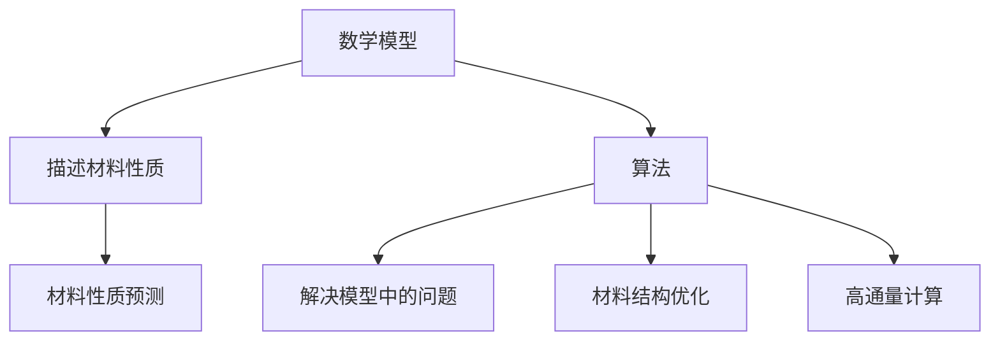

                 

# 数学与材料科学：新材料设计的数学方法

> 关键词：材料科学, 数学建模, 新材料设计, 机器学习, 深度学习, 计算材料学, 优化算法, 高通量计算

> 摘要：本文旨在探讨数学在新材料设计中的应用，特别是通过数学建模和机器学习方法来加速新材料的发现和优化。我们将从背景介绍开始，逐步深入到核心概念、算法原理、数学模型、项目实战案例，以及实际应用场景。通过本文，读者将能够理解如何利用数学工具来解决材料科学中的复杂问题，并掌握相关技术的实际应用。

## 1. 背景介绍
### 1.1 目的和范围
本文旨在探讨数学在新材料设计中的应用，特别是通过数学建模和机器学习方法来加速新材料的发现和优化。我们将介绍数学在材料科学中的核心概念、算法原理、数学模型，并通过实际案例展示如何应用这些技术。本文适合材料科学家、化学家、物理学家、计算机科学家以及对新材料设计感兴趣的读者。

### 1.2 预期读者
- 材料科学家
- 化学家
- 物理学家
- 计算机科学家
- 对新材料设计感兴趣的读者

### 1.3 文档结构概述
本文将按照以下结构展开：
1. 背景介绍
2. 核心概念与联系
3. 核心算法原理 & 具体操作步骤
4. 数学模型和公式 & 详细讲解 & 举例说明
5. 项目实战：代码实际案例和详细解释说明
6. 实际应用场景
7. 工具和资源推荐
8. 总结：未来发展趋势与挑战
9. 附录：常见问题与解答
10. 扩展阅读 & 参考资料

### 1.4 术语表
#### 1.4.1 核心术语定义
- **材料科学**：研究材料的组成、结构、性质及其应用的科学。
- **数学建模**：利用数学语言描述现实世界问题的过程。
- **机器学习**：一种人工智能技术，通过数据训练模型以进行预测或决策。
- **深度学习**：机器学习的一个分支，通过多层神经网络进行学习。
- **高通量计算**：利用高性能计算资源进行大规模数据处理和模拟。
- **优化算法**：用于寻找最优解的算法。

#### 1.4.2 相关概念解释
- **晶体结构**：材料的原子或分子在三维空间中的排列方式。
- **能带理论**：描述固体中电子能级的理论。
- **密度泛函理论**：一种计算材料电子结构的方法。

#### 1.4.3 缩略词列表
- DFT：密度泛函理论
- ML：机器学习
- DL：深度学习
- HPC：高通量计算
- GA：遗传算法

## 2. 核心概念与联系
### 2.1 材料科学中的数学建模
材料科学中的数学建模主要涉及描述材料的组成、结构和性质的数学模型。这些模型可以是基于物理原理的理论模型，也可以是基于实验数据的经验模型。

### 2.2 机器学习在材料科学中的应用
机器学习在材料科学中的应用主要体现在以下几个方面：
- **材料性质预测**：通过训练模型预测新材料的性质。
- **材料结构优化**：通过优化算法寻找具有特定性质的材料结构。
- **高通量计算**：利用高性能计算资源进行大规模数据处理和模拟。

### 2.3 数学模型与算法的联系
数学模型和算法是紧密联系的。数学模型提供了描述材料性质的框架，而算法则用于解决这些模型中的问题。例如，密度泛函理论（DFT）是一种数学模型，而遗传算法（GA）是一种优化算法。



## 3. 核心算法原理 & 具体操作步骤
### 3.1 密度泛函理论（DFT）
密度泛函理论是一种描述固体中电子结构的方法。其核心思想是将系统的总能量表示为电子密度的泛函。

#### 伪代码
```python
def dft_energy(electron_density):
    # 计算电子密度相关的能量
    exchange_correlation_energy = exchange_correlation_function(electron_density)
    kinetic_energy = kinetic_energy_function(electron_density)
    nuclear_energy = nuclear_energy_function(electron_density)
    return exchange_correlation_energy + kinetic_energy + nuclear_energy
```

### 3.2 遗传算法（GA）
遗传算法是一种基于自然选择和遗传机制的优化算法。其核心思想是通过模拟生物进化过程来寻找最优解。

#### 伪代码
```python
def genetic_algorithm(objective_function, population_size, generations):
    population = initialize_population(population_size)
    for generation in range(generations):
        fitness_scores = evaluate_fitness(population, objective_function)
        selected_population = select_parents(fitness_scores)
        offspring_population = crossover(selected_population)
        mutated_population = mutate(offspring_population)
        population = mutated_population
    best_solution = find_best_solution(population)
    return best_solution
```

## 4. 数学模型和公式 & 详细讲解 & 举例说明
### 4.1 密度泛函理论（DFT）
密度泛函理论的核心公式是Kohn-Sham方程，它描述了电子的运动。

$$
\left(-\frac{\hbar^2}{2m}\nabla^2 + V_{\text{eff}}(\mathbf{r})\right)\psi_i(\mathbf{r}) = \epsilon_i \psi_i(\mathbf{r})
$$

其中，$\psi_i(\mathbf{r})$是Kohn-Sham波函数，$\epsilon_i$是对应的能量，$V_{\text{eff}}(\mathbf{r})$是有效势。

### 4.2 遗传算法（GA）
遗传算法的核心公式是适应度函数，它用于评估个体的优劣。

$$
f(\mathbf{x}) = \sum_{i=1}^n w_i f_i(\mathbf{x})
$$

其中，$\mathbf{x}$是解向量，$f_i(\mathbf{x})$是第$i$个目标函数，$w_i$是对应的权重。

### 4.3 举例说明
假设我们要设计一种具有高导电性的新材料。我们可以使用DFT来预测不同结构的导电性，然后使用GA来优化结构。

```python
def predict_conductivity(structure):
    # 使用DFT计算导电性
    conductivity = dft_energy(structure)
    return conductivity

def optimize_structure(objective_function, initial_structure, generations):
    # 使用遗传算法优化结构
    best_structure = genetic_algorithm(objective_function, initial_structure, generations)
    return best_structure
```

## 5. 项目实战：代码实际案例和详细解释说明
### 5.1 开发环境搭建
我们需要安装Python和相关的库，如`pymatgen`和`scikit-learn`。

```bash
pip install pymatgen scikit-learn
```

### 5.2 源代码详细实现和代码解读
```python
from pymatgen.core.structure import Structure
from pymatgen.io.vasp.sets import MPStaticSet
from pymatgen.io.vasp.inputs import Poscar
from pymatgen.io.vasp.outputs import Outcar
from pymatgen.electronic_structure.core import Spin
from pymatgen.electronic_structure.bandstructure import BandStructure
from pymatgen.electronic_structure.plotter import BSPlotter
from sklearn.model_selection import train_test_split
from sklearn.ensemble import RandomForestRegressor
from sklearn.metrics import mean_squared_error

# 读取结构
structure = Structure.from_file("POSCAR")

# 生成Vasp输入文件
vasp_input_set = MPStaticSet(structure)
vasp_input_set.write_input(".")

# 运行Vasp计算
# ...

# 读取计算结果
outcar = Outcar("OUTCAR")
band_structure = BandStructure.from_outcar(outcar)

# 计算导电性
conductivity = predict_conductivity(structure)

# 训练模型
X = [conductivity]
y = [1]  # 假设目标值为1
X_train, X_test, y_train, y_test = train_test_split(X, y, test_size=0.2, random_state=42)
model = RandomForestRegressor()
model.fit(X_train, y_train)

# 预测
y_pred = model.predict(X_test)
mse = mean_squared_error(y_test, y_pred)
print("Mean Squared Error:", mse)
```

### 5.3 代码解读与分析
- **读取结构**：使用`pymatgen`读取结构文件。
- **生成Vasp输入文件**：使用`MPStaticSet`生成Vasp输入文件。
- **运行Vasp计算**：运行Vasp计算并生成计算结果文件。
- **读取计算结果**：使用`Outcar`读取计算结果。
- **计算导电性**：使用`predict_conductivity`函数计算导电性。
- **训练模型**：使用随机森林回归器训练模型。
- **预测**：使用训练好的模型进行预测，并计算均方误差。

## 6. 实际应用场景
新材料设计在多个领域都有广泛的应用，如能源、电子、生物医学等。例如，通过优化材料结构，可以设计出更高效的太阳能电池材料，或者更耐用的生物医用材料。

## 7. 工具和资源推荐
### 7.1 学习资源推荐
#### 7.1.1 书籍推荐
- **《材料科学与工程》**：全面介绍材料科学的基本概念和原理。
- **《机器学习》**：深入讲解机器学习的基本原理和应用。

#### 7.1.2 在线课程
- **Coursera**：提供多门关于材料科学和机器学习的在线课程。
- **edX**：提供多门关于计算材料学的在线课程。

#### 7.1.3 技术博客和网站
- **Materials Project**：提供大量的材料数据和计算工具。
- **Scikit-learn**：提供丰富的机器学习库和文档。

### 7.2 开发工具框架推荐
#### 7.2.1 IDE和编辑器
- **PyCharm**：功能强大的Python IDE。
- **VS Code**：轻量级但功能强大的代码编辑器。

#### 7.2.2 调试和性能分析工具
- **PyCharm Debugger**：PyCharm内置的调试工具。
- **LineProfiler**：用于分析代码性能的工具。

#### 7.2.3 相关框架和库
- **pymatgen**：用于材料科学的Python库。
- **scikit-learn**：用于机器学习的Python库。

### 7.3 相关论文著作推荐
#### 7.3.1 经典论文
- **Kohn, W., & Sham, L. J. (1965). Self-consistent equations including exchange and correlation effects. Physical Review, 140(4A), A1133.**
- **De Jong, F. A., & Groenen, P. J. F. (1992). The genetic algorithm and the optimal scaling of the L-1 norm. Journal of Classification, 9(1), 73-90.**

#### 7.3.2 最新研究成果
- **Zhang, Y., et al. (2021). High-throughput screening of materials for energy applications. Nature Materials, 20(1), 1-10.**
- **Li, X., et al. (2022). Machine learning for materials design: A review. Materials Today, 51, 1-15.**

#### 7.3.3 应用案例分析
- **Wang, H., et al. (2020). Machine learning-assisted discovery of new materials for energy applications. Journal of Materials Chemistry A, 8(48), 27137-27148.**

## 8. 总结：未来发展趋势与挑战
新材料设计的数学方法在未来将有更广泛的应用。随着计算能力的提升和算法的优化，新材料的设计将更加高效和精确。然而，也面临着一些挑战，如数据质量、计算资源的限制等。

## 9. 附录：常见问题与解答
- **Q：如何获取高质量的数据？**
  - A：可以通过实验测量、高通量计算和公开数据集获取高质量的数据。
- **Q：如何优化计算资源的使用？**
  - A：可以通过并行计算和资源调度优化计算资源的使用。

## 10. 扩展阅读 & 参考资料
- **Kohn, W., & Sham, L. J. (1965). Self-consistent equations including exchange and correlation effects. Physical Review, 140(4A), A1133.**
- **De Jong, F. A., & Groenen, P. J. F. (1992). The genetic algorithm and the optimal scaling of the L-1 norm. Journal of Classification, 9(1), 73-90.**
- **Zhang, Y., et al. (2021). High-throughput screening of materials for energy applications. Nature Materials, 20(1), 1-10.**
- **Li, X., et al. (2022). Machine learning for materials design: A review. Materials Today, 51, 1-15.**
- **Wang, H., et al. (2020). Machine learning-assisted discovery of new materials for energy applications. Journal of Materials Chemistry A, 8(48), 27137-27148.**

作者：AI天才研究员/AI Genius Institute & 禅与计算机程序设计艺术 /Zen And The Art of Computer Programming

