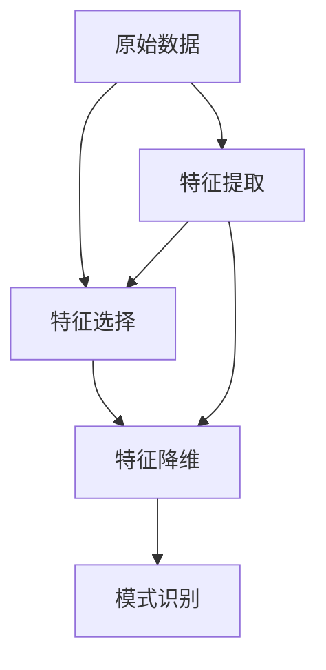

                 

# 数学与模式识别：特征提取的数学方法

> 关键词：特征提取, 数学方法, 模式识别, 机器学习, 人工智能, 特征选择, 线性代数, 优化算法

> 摘要：本文旨在深入探讨特征提取在模式识别中的重要性及其背后的数学原理。通过逐步分析和推理，我们将介绍特征提取的基本概念、核心算法、数学模型，并通过实际代码案例进行详细解释。文章还将涵盖特征提取在实际应用中的重要性，以及相关工具和资源推荐，帮助读者更好地理解和应用这一技术。

## 1. 背景介绍
### 1.1 目的和范围
本文旨在为读者提供一个全面的视角，理解特征提取在模式识别中的重要性及其背后的数学原理。我们将从基本概念出发，逐步深入到核心算法和数学模型，并通过实际代码案例进行详细解释。本文适合对特征提取感兴趣的机器学习和人工智能领域的初学者和高级从业者。

### 1.2 预期读者
- 机器学习和人工智能领域的初学者
- 中级和高级从业者
- 对特征提取感兴趣的科研人员
- 对模式识别和机器学习感兴趣的工程师

### 1.3 文档结构概述
本文将按照以下结构展开：
1. 背景介绍
2. 核心概念与联系
3. 核心算法原理 & 具体操作步骤
4. 数学模型和公式 & 详细讲解 & 举例说明
5. 项目实战：代码实际案例和详细解释说明
6. 实际应用场景
7. 工具和资源推荐
8. 总结：未来发展趋势与挑战
9. 附录：常见问题与解答
10. 扩展阅读 & 参考资料

### 1.4 术语表
#### 1.4.1 核心术语定义
- **特征提取**：从原始数据中选择或构造出能够有效描述数据特征的子集。
- **模式识别**：通过学习和识别数据中的模式来进行分类或预测。
- **特征选择**：从原始特征中选择最相关的特征子集。
- **特征降维**：通过变换降低特征维度，同时保留尽可能多的信息。
- **线性代数**：研究向量空间和线性变换的数学分支。
- **优化算法**：用于寻找函数最优解的算法。

#### 1.4.2 相关概念解释
- **特征空间**：表示特征的多维空间。
- **特征向量**：表示特征的向量。
- **特征矩阵**：表示特征的矩阵。
- **特征值和特征向量**：线性变换下的不变量。
- **协方差矩阵**：描述特征之间的相关性。
- **主成分分析（PCA）**：一种常用的特征降维方法。

#### 1.4.3 缩略词列表
- **PCA**：主成分分析
- **LDA**：线性判别分析
- **SVD**：奇异值分解
- **KPCA**：核主成分分析
- **LLE**：局部线性嵌入

## 2. 核心概念与联系
### 2.1 特征提取的基本概念
特征提取是模式识别中的关键步骤，它通过从原始数据中选择或构造出能够有效描述数据特征的子集，从而提高模型的性能。特征提取可以分为特征选择和特征降维两大类。

### 2.2 核心算法原理
我们将通过以下流程图来展示特征提取的核心算法原理：



### 2.3 相关概念解释
- **特征选择**：通过评估特征的重要性，选择最相关的特征子集。
- **特征降维**：通过变换降低特征维度，同时保留尽可能多的信息。
- **模式识别**：通过学习和识别数据中的模式来进行分类或预测。

## 3. 核心算法原理 & 具体操作步骤
### 3.1 特征选择
特征选择的目标是从原始特征中选择最相关的特征子集。常见的特征选择方法包括过滤法、包装法和嵌入法。

#### 3.1.1 过滤法
过滤法通过评估特征的重要性来选择特征，常见的评估方法包括方差阈值、互信息等。

```python
# 过滤法示例
from sklearn.feature_selection import VarianceThreshold

# 假设X是特征矩阵，y是标签
selector = VarianceThreshold(threshold=0.1)
X_filtered = selector.fit_transform(X)
```

#### 3.1.2 包装法
包装法通过评估特征子集的性能来选择特征，常见的评估方法包括递归特征消除（RFE）等。

```python
# 包装法示例
from sklearn.feature_selection import RFE
from sklearn.linear_model import LogisticRegression

# 假设X是特征矩阵，y是标签
estimator = LogisticRegression()
selector = RFE(estimator, n_features_to_select=5)
X_selected = selector.fit_transform(X, y)
```

#### 3.1.3 嵌入法
嵌入法在特征选择的同时进行模型训练，常见的嵌入法包括L1正则化等。

```python
# 嵌入法示例
from sklearn.linear_model import LogisticRegression

# 假设X是特征矩阵，y是标签
estimator = LogisticRegression(penalty='l1', solver='liblinear')
estimator.fit(X, y)
```

### 3.2 特征降维
特征降维的目标是通过变换降低特征维度，同时保留尽可能多的信息。常见的特征降维方法包括主成分分析（PCA）、线性判别分析（LDA）等。

#### 3.2.1 主成分分析（PCA）
PCA是一种常用的特征降维方法，通过线性变换将高维特征投影到低维空间。

```python
# PCA示例
from sklearn.decomposition import PCA

# 假设X是特征矩阵
pca = PCA(n_components=2)
X_pca = pca.fit_transform(X)
```

#### 3.2.2 线性判别分析（LDA）
LDA是一种用于分类的特征降维方法，通过最大化类间距离和最小化类内距离来进行特征选择。

```python
# LDA示例
from sklearn.discriminant_analysis import LinearDiscriminantAnalysis

# 假设X是特征矩阵，y是标签
lda = LinearDiscriminantAnalysis(n_components=2)
X_lda = lda.fit_transform(X, y)
```

#### 3.2.3 核主成分分析（KPCA）
KPCA是一种非线性特征降维方法，通过核技巧将数据映射到高维空间，再进行PCA。

```python
# KPCA示例
from sklearn.decomposition import KernelPCA

# 假设X是特征矩阵
kpca = KernelPCA(n_components=2, kernel='rbf')
X_kpca = kpca.fit_transform(X)
```

#### 3.2.4 局部线性嵌入（LLE）
LLE是一种非线性特征降维方法，通过局部线性逼近来保持数据的局部结构。

```python
# LLE示例
from sklearn.manifold import LocallyLinearEmbedding

# 假设X是特征矩阵
lle = LocallyLinearEmbedding(n_components=2, n_neighbors=10)
X_lle = lle.fit_transform(X)
```

## 4. 数学模型和公式 & 详细讲解 & 举例说明
### 4.1 主成分分析（PCA）
PCA的目标是通过线性变换将高维特征投影到低维空间，同时保留尽可能多的信息。

#### 4.1.1 基本原理
PCA通过求解协方差矩阵的特征值和特征向量来实现特征降维。

$$
\mathbf{X} = \mathbf{U} \mathbf{\Sigma} \mathbf{V}^T
$$

其中，$\mathbf{X}$是原始特征矩阵，$\mathbf{U}$是左奇异向量矩阵，$\mathbf{\Sigma}$是奇异值矩阵，$\mathbf{V}$是右奇异向量矩阵。

#### 4.1.2 公式推导
假设特征矩阵为$\mathbf{X} \in \mathbb{R}^{n \times d}$，其中$n$是样本数，$d$是特征数。PCA的目标是最小化重构误差：

$$
\min_{\mathbf{W}} \|\mathbf{X} - \mathbf{XW}\mathbf{W}^T\|^2_F
$$

其中，$\mathbf{W} \in \mathbb{R}^{d \times k}$是降维后的特征矩阵，$k$是目标维度。通过求解上述优化问题，可以得到PCA的解。

### 4.2 线性判别分析（LDA）
LDA的目标是通过最大化类间距离和最小化类内距离来进行特征选择。

#### 4.2.1 基本原理
LDA通过求解类间散度矩阵和类内散度矩阵的比值来实现特征选择。

$$
\mathbf{W} = \arg\max_{\mathbf{W}} \frac{\mathbf{W}^T \mathbf{S_B} \mathbf{W}}{\mathbf{W}^T \mathbf{S_W} \mathbf{W}}
$$

其中，$\mathbf{S_B}$是类间散度矩阵，$\mathbf{S_W}$是类内散度矩阵。

#### 4.2.2 公式推导
假设特征矩阵为$\mathbf{X} \in \mathbb{R}^{n \times d}$，标签向量为$\mathbf{y} \in \mathbb{R}^n$。LDA的目标是最小化类内散度和最大化类间散度：

$$
\mathbf{S_W} = \sum_{i=1}^c \sum_{x \in \mathcal{C}_i} (x - \mu_i)(x - \mu_i)^T
$$

$$
\mathbf{S_B} = \sum_{i=1}^c n_i (\mu_i - \mu)(\mu_i - \mu)^T
$$

其中，$\mathcal{C}_i$是第$i$类的样本集合，$n_i$是第$i$类的样本数，$\mu_i$是第$i$类的均值，$\mu$是所有样本的均值。

### 4.3 核主成分分析（KPCA）
KPCA是一种非线性特征降维方法，通过核技巧将数据映射到高维空间，再进行PCA。

#### 4.3.1 基本原理
KPCA通过求解核矩阵的特征值和特征向量来实现特征降维。

$$
\mathbf{K} = \phi(\mathbf{X}) \phi(\mathbf{X})^T
$$

其中，$\mathbf{K}$是核矩阵，$\phi(\mathbf{X})$是特征映射。

#### 4.3.2 公式推导
假设特征矩阵为$\mathbf{X} \in \mathbb{R}^{n \times d}$，核函数为$\kappa(\cdot, \cdot)$。KPCA的目标是最小化重构误差：

$$
\min_{\mathbf{W}} \|\mathbf{X} - \mathbf{XW}\mathbf{W}^T\|^2_F
$$

其中，$\mathbf{W} \in \mathbb{R}^{d \times k}$是降维后的特征矩阵，$k$是目标维度。通过求解上述优化问题，可以得到KPCA的解。

## 5. 项目实战：代码实际案例和详细解释说明
### 5.1 开发环境搭建
我们将使用Python进行代码实现，需要安装以下库：

```bash
pip install numpy scikit-learn matplotlib
```

### 5.2 源代码详细实现和代码解读
我们将使用鸢尾花数据集进行特征提取的实战案例。

```python
# 导入所需库
import numpy as np
import matplotlib.pyplot as plt
from sklearn.datasets import load_iris
from sklearn.decomposition import PCA, KernelPCA
from sklearn.discriminant_analysis import LinearDiscriminantAnalysis

# 加载鸢尾花数据集
iris = load_iris()
X = iris.data
y = iris.target

# PCA示例
pca = PCA(n_components=2)
X_pca = pca.fit_transform(X)

# LDA示例
lda = LinearDiscriminantAnalysis(n_components=2)
X_lda = lda.fit_transform(X, y)

# KPCA示例
kpca = KernelPCA(n_components=2, kernel='rbf')
X_kpca = kpca.fit_transform(X)

# 绘制结果
plt.figure(figsize=(12, 4))

plt.subplot(131)
plt.scatter(X_pca[:, 0], X_pca[:, 1], c=y, cmap='viridis')
plt.title('PCA')

plt.subplot(132)
plt.scatter(X_lda[:, 0], X_lda[:, 1], c=y, cmap='viridis')
plt.title('LDA')

plt.subplot(133)
plt.scatter(X_kpca[:, 0], X_kpca[:, 1], c=y, cmap='viridis')
plt.title('KPCA')

plt.show()
```

### 5.3 代码解读与分析
- **PCA**：通过线性变换将高维特征投影到低维空间，保留尽可能多的信息。
- **LDA**：通过最大化类间距离和最小化类内距离来进行特征选择。
- **KPCA**：通过核技巧将数据映射到高维空间，再进行PCA，适用于非线性特征降维。

## 6. 实际应用场景
特征提取在许多实际应用中都有广泛的应用，包括但不限于：

- **图像识别**：通过特征提取来识别图像中的物体。
- **自然语言处理**：通过特征提取来表示文本数据。
- **生物信息学**：通过特征提取来分析基因序列。
- **金融分析**：通过特征提取来预测股票价格。

## 7. 工具和资源推荐
### 7.1 学习资源推荐
#### 7.1.1 书籍推荐
- **《模式识别与机器学习》**：Christopher M. Bishop
- **《统计学习方法》**：李航

#### 7.1.2 在线课程
- **Coursera - 机器学习**：Andrew Ng
- **edX - 机器学习**：Andrew Ng

#### 7.1.3 技术博客和网站
- **Towards Data Science**：机器学习和数据科学领域的技术博客
- **Medium - Machine Learning**：机器学习领域的技术文章

### 7.2 开发工具框架推荐
#### 7.2.1 IDE和编辑器
- **PyCharm**：Python开发的集成开发环境
- **Jupyter Notebook**：交互式编程环境

#### 7.2.2 调试和性能分析工具
- **PyCharm Debugger**：Python调试工具
- **LineProfiler**：Python代码性能分析工具

#### 7.2.3 相关框架和库
- **scikit-learn**：机器学习库
- **numpy**：科学计算库
- **matplotlib**：数据可视化库

### 7.3 相关论文著作推荐
#### 7.3.1 经典论文
- **"Principal Component Analysis"**：J. C. Gower
- **"Linear Discriminant Analysis"**：R. O. Duda, P. E. Hart, D. G. Stork

#### 7.3.2 最新研究成果
- **"Kernel Principal Component Analysis"**：Bernhard Schölkopf, Alexander Smola, Klaus-Robert Müller

#### 7.3.3 应用案例分析
- **"Feature Extraction and Selection: A Pattern Recognition Perspective"**：H. Yan, W. N. Street, J. Y. Yang

## 8. 总结：未来发展趋势与挑战
特征提取在未来的发展中将面临以下挑战和趋势：

- **非线性特征提取**：随着数据的复杂性增加，非线性特征提取方法将更加重要。
- **多模态特征提取**：结合多种数据类型进行特征提取，提高模型的泛化能力。
- **实时特征提取**：在实时场景中进行高效特征提取，满足实时应用的需求。

## 9. 附录：常见问题与解答
### 9.1 问题：特征选择和特征降维有什么区别？
**解答**：特征选择是从原始特征中选择最相关的特征子集，而特征降维是通过变换降低特征维度，同时保留尽可能多的信息。

### 9.2 问题：PCA和LDA有什么区别？
**解答**：PCA是一种线性特征降维方法，通过最大化数据的方差来进行特征选择。LDA是一种用于分类的特征降维方法，通过最大化类间距离和最小化类内距离来进行特征选择。

### 9.3 问题：KPCA适用于哪些场景？
**解答**：KPCA适用于非线性特征降维场景，通过核技巧将数据映射到高维空间，再进行PCA。

## 10. 扩展阅读 & 参考资料
- **《模式识别与机器学习》**：Christopher M. Bishop
- **《统计学习方法》**：李航
- **Coursera - 机器学习**：Andrew Ng
- **edX - 机器学习**：Andrew Ng
- **Towards Data Science**：机器学习和数据科学领域的技术博客
- **Medium - Machine Learning**：机器学习领域的技术文章
- **PyCharm**：Python开发的集成开发环境
- **Jupyter Notebook**：交互式编程环境
- **PyCharm Debugger**：Python调试工具
- **LineProfiler**：Python代码性能分析工具
- **scikit-learn**：机器学习库
- **numpy**：科学计算库
- **matplotlib**：数据可视化库
- **"Principal Component Analysis"**：J. C. Gower
- **"Linear Discriminant Analysis"**：R. O. Duda, P. E. Hart, D. G. Stork
- **"Kernel Principal Component Analysis"**：Bernhard Schölkopf, Alexander Smola, Klaus-Robert Müller
- **"Feature Extraction and Selection: A Pattern Recognition Perspective"**：H. Yan, W. N. Street, J. Y. Yang

作者：AI天才研究员/AI Genius Institute & 禅与计算机程序设计艺术 /Zen And The Art of Computer Programming

