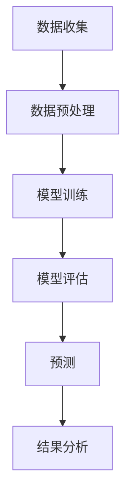

                 

# 数学与气候科学：预测地球系统变化

> 关键词：气候科学, 数学模型, 机器学习, 气候预测, 地球系统, 人工智能, 深度学习

> 摘要：本文旨在探讨数学与气候科学的结合，通过深入分析数学模型和机器学习算法在气候预测中的应用，揭示地球系统变化的复杂性。我们将从背景介绍、核心概念与联系、核心算法原理、数学模型和公式、项目实战、实际应用场景、工具和资源推荐，以及未来发展趋势与挑战等方面进行详细阐述。通过本文，读者将能够理解如何利用数学和计算技术来预测地球系统的变化，并为相关领域的研究和实践提供指导。

## 1. 背景介绍
### 1.1 目的和范围
本文旨在探讨数学与气候科学的结合，通过深入分析数学模型和机器学习算法在气候预测中的应用，揭示地球系统变化的复杂性。我们将从背景介绍、核心概念与联系、核心算法原理、数学模型和公式、项目实战、实际应用场景、工具和资源推荐，以及未来发展趋势与挑战等方面进行详细阐述。

### 1.2 预期读者
本文预期读者包括但不限于气候科学家、数据科学家、计算机科学家、环境科学家、工程师以及对气候科学和数学模型感兴趣的读者。读者应具备一定的数学基础和编程能力，对气候科学和机器学习有一定的了解。

### 1.3 文档结构概述
本文结构如下：
1. 背景介绍
2. 核心概念与联系
3. 核心算法原理 & 具体操作步骤
4. 数学模型和公式 & 详细讲解 & 举例说明
5. 项目实战：代码实际案例和详细解释说明
6. 实际应用场景
7. 工具和资源推荐
8. 总结：未来发展趋势与挑战
9. 附录：常见问题与解答
10. 扩展阅读 & 参考资料

### 1.4 术语表
#### 1.4.1 核心术语定义
- **气候系统**：由大气、海洋、陆地、冰盖和生物圈组成的复杂系统。
- **气候模型**：用于模拟地球气候系统的数学模型。
- **机器学习**：一种人工智能技术，通过算法使计算机从数据中学习并做出预测。
- **深度学习**：机器学习的一个分支，通过多层神经网络进行学习。
- **回归分析**：一种统计方法，用于预测连续变量的值。
- **时间序列分析**：分析随时间变化的数据序列的方法。
- **随机森林**：一种集成学习方法，通过多个决策树进行预测。
- **梯度下降**：一种优化算法，用于最小化损失函数。

#### 1.4.2 相关概念解释
- **地球系统**：指地球及其自然环境的各个组成部分及其相互作用。
- **气候预测**：通过数学模型和算法预测未来一段时间内的气候状况。
- **数据预处理**：对原始数据进行清洗、转换和归一化，以便于后续分析。

#### 1.4.3 缩略词列表
- **CMIP**：Coupled Model Intercomparison Project
- **AR**：Autoregressive
- **ANN**：Artificial Neural Network
- **LSTM**：Long Short-Term Memory
- **PCA**：Principal Component Analysis

## 2. 核心概念与联系
### 2.1 气候系统概述
地球气候系统是一个复杂的非线性系统，由大气、海洋、陆地、冰盖和生物圈组成。这些组成部分之间存在复杂的相互作用，导致气候系统的动态变化。

### 2.2 数学模型
数学模型是描述气候系统行为的数学表达式。常见的数学模型包括：
- **物理模型**：基于物理定律和方程的模型，如热传导方程、流体动力学方程等。
- **统计模型**：基于统计方法的模型，如回归分析、时间序列分析等。
- **混合模型**：结合物理和统计方法的模型。

### 2.3 机器学习与气候科学
机器学习在气候科学中的应用主要包括：
- **预测模型**：通过历史数据训练模型，预测未来气候状况。
- **模式识别**：识别气候模式和趋势。
- **异常检测**：检测异常气候事件。

### 2.4 气候预测流程
气候预测流程包括数据收集、数据预处理、模型训练、模型评估和预测。流程图如下：



## 3. 核心算法原理 & 具体操作步骤
### 3.1 回归分析
回归分析是一种统计方法，用于预测连续变量的值。具体操作步骤如下：

```python
# 假设我们有一个数据集X和目标变量y
X = ...  # 特征数据
y = ...  # 目标变量

# 使用线性回归模型
from sklearn.linear_model import LinearRegression

# 创建模型
model = LinearRegression()

# 训练模型
model.fit(X, y)

# 预测
predictions = model.predict(X)
```

### 3.2 时间序列分析
时间序列分析用于分析随时间变化的数据序列。具体操作步骤如下：

```python
# 假设我们有一个时间序列数据
time_series = ...  # 时间序列数据

# 使用AR模型
from statsmodels.tsa.ar_model import AR

# 创建模型
model = AR(time_series)

# 训练模型
model_fit = model.fit()

# 预测
predictions = model_fit.predict(start=len(time_series), end=len(time_series)+10)
```

### 3.3 深度学习
深度学习在气候预测中的应用主要包括：
- **卷积神经网络（CNN）**：用于处理空间数据，如卫星图像。
- **循环神经网络（RNN）**：用于处理时间序列数据。
- **长短期记忆网络（LSTM）**：用于处理长期依赖关系。

具体操作步骤如下：

```python
# 假设我们有一个时间序列数据
time_series = ...  # 时间序列数据

# 使用LSTM模型
from keras.models import Sequential
from keras.layers import LSTM, Dense

# 创建模型
model = Sequential()
model.add(LSTM(50, activation='relu', input_shape=(time_series.shape[1], 1)))
model.add(Dense(1))

# 编译模型
model.compile(optimizer='adam', loss='mse')

# 训练模型
model.fit(time_series, time_series, epochs=100, verbose=0)

# 预测
predictions = model.predict(time_series)
```

## 4. 数学模型和公式 & 详细讲解 & 举例说明
### 4.1 物理模型
物理模型基于物理定律和方程，如热传导方程、流体动力学方程等。具体公式如下：

$$
\frac{\partial T}{\partial t} = \alpha \nabla^2 T
$$

其中，$T$ 是温度，$\alpha$ 是热扩散系数，$\nabla^2$ 是拉普拉斯算子。

### 4.2 统计模型
统计模型基于统计方法，如回归分析、时间序列分析等。具体公式如下：

$$
y = \beta_0 + \beta_1 x_1 + \beta_2 x_2 + \epsilon
$$

其中，$y$ 是目标变量，$x_1$ 和 $x_2$ 是特征变量，$\beta_0$、$\beta_1$ 和 $\beta_2$ 是回归系数，$\epsilon$ 是误差项。

### 4.3 混合模型
混合模型结合物理和统计方法，如物理统计模型。具体公式如下：

$$
y = f(x) + \epsilon
$$

其中，$f(x)$ 是物理模型，$\epsilon$ 是误差项。

## 5. 项目实战：代码实际案例和详细解释说明
### 5.1 开发环境搭建
开发环境包括Python、NumPy、Pandas、Scikit-learn、Keras等库。具体步骤如下：

1. 安装Python和相关库
2. 创建虚拟环境
3. 安装所需库

```bash
pip install numpy pandas scikit-learn keras tensorflow
```

### 5.2 源代码详细实现和代码解读
假设我们有一个时间序列数据集，用于预测未来一段时间内的气温变化。具体代码如下：

```python
import numpy as np
import pandas as pd
from sklearn.model_selection import train_test_split
from sklearn.linear_model import LinearRegression
from sklearn.metrics import mean_squared_error
import matplotlib.pyplot as plt

# 加载数据
data = pd.read_csv('temperature_data.csv')

# 数据预处理
X = data['time'].values.reshape(-1, 1)
y = data['temperature'].values

# 划分训练集和测试集
X_train, X_test, y_train, y_test = train_test_split(X, y, test_size=0.2, random_state=42)

# 创建模型
model = LinearRegression()

# 训练模型
model.fit(X_train, y_train)

# 预测
y_pred = model.predict(X_test)

# 评估模型
mse = mean_squared_error(y_test, y_pred)
print(f'Mean Squared Error: {mse}')

# 可视化结果
plt.scatter(X_test, y_test, color='blue', label='Actual')
plt.plot(X_test, y_pred, color='red', label='Predicted')
plt.xlabel('Time')
plt.ylabel('Temperature')
plt.legend()
plt.show()
```

### 5.3 代码解读与分析
- **数据加载**：使用Pandas加载数据集。
- **数据预处理**：将时间数据转换为一维数组。
- **划分训练集和测试集**：使用Scikit-learn的`train_test_split`函数。
- **创建模型**：使用线性回归模型。
- **训练模型**：使用训练数据训练模型。
- **预测**：使用测试数据进行预测。
- **评估模型**：计算均方误差。
- **可视化结果**：使用Matplotlib绘制实际值和预测值。

## 6. 实际应用场景
气候预测在多个领域具有广泛的应用，包括：
- **农业**：预测气候变化对农作物生长的影响。
- **能源**：预测气候变化对能源需求的影响。
- **水资源管理**：预测气候变化对水资源的影响。
- **灾害预警**：预测气候变化引发的自然灾害。

## 7. 工具和资源推荐
### 7.1 学习资源推荐
#### 7.1.1 书籍推荐
- **《统计学习方法》**：李航著，深入讲解统计学习方法。
- **《深度学习》**：Ian Goodfellow, Yoshua Bengio, Aaron Courville著，全面介绍深度学习。

#### 7.1.2 在线课程
- **Coursera**：《机器学习》（Andrew Ng）
- **edX**：《深度学习》（Andrew Ng）

#### 7.1.3 技术博客和网站
- **Medium**：Climate Science and Machine Learning
- **Kaggle**：Climate Change Prediction Challenges

### 7.2 开发工具框架推荐
#### 7.2.1 IDE和编辑器
- **PyCharm**：功能强大的Python IDE。
- **Jupyter Notebook**：交互式编程环境。

#### 7.2.2 调试和性能分析工具
- **PyCharm Debugger**：PyCharm内置的调试工具。
- **LineProfiler**：用于分析代码性能的工具。

#### 7.2.3 相关框架和库
- **NumPy**：数值计算库。
- **Pandas**：数据处理库。
- **Scikit-learn**：机器学习库。
- **Keras**：深度学习库。

### 7.3 相关论文著作推荐
#### 7.3.1 经典论文
- **《Climate Change 2013: The Physical Science Basis》**：IPCC报告，深入探讨气候变化的物理基础。
- **《Deep Learning》**：Ian Goodfellow, Yoshua Bengio, Aaron Courville著，深度学习经典著作。

#### 7.3.2 最新研究成果
- **《Using Machine Learning to Predict Climate Change》**：最新研究论文，探讨机器学习在气候预测中的应用。
- **《Climate Prediction Using Deep Learning》**：最新研究论文，探讨深度学习在气候预测中的应用。

#### 7.3.3 应用案例分析
- **《Climate Change Prediction Using Machine Learning》**：应用案例分析，探讨机器学习在气候预测中的实际应用。

## 8. 总结：未来发展趋势与挑战
未来气候预测的发展趋势包括：
- **更精确的模型**：通过更复杂的数学模型和算法提高预测精度。
- **更广泛的应用**：在更多领域应用气候预测技术。
- **更实时的数据**：利用物联网和传感器技术获取更实时的数据。

面临的挑战包括：
- **数据质量问题**：数据的准确性和完整性对预测结果有很大影响。
- **计算资源需求**：复杂的模型需要大量的计算资源。
- **模型解释性**：如何解释复杂的模型结果，提高模型的可解释性。

## 9. 附录：常见问题与解答
### 9.1 问题：如何处理缺失数据？
**解答**：可以使用插值方法、均值填充或删除缺失值的方法处理缺失数据。

### 9.2 问题：如何评估模型性能？
**解答**：可以使用均方误差、R²分数等指标评估模型性能。

### 9.3 问题：如何提高模型精度？
**解答**：可以通过增加数据量、优化模型结构和参数、使用更复杂的算法等方法提高模型精度。

## 10. 扩展阅读 & 参考资料
- **《统计学习方法》**：李航著
- **《深度学习》**：Ian Goodfellow, Yoshua Bengio, Aaron Courville著
- **《Climate Change 2013: The Physical Science Basis》**：IPCC报告
- **《Using Machine Learning to Predict Climate Change》**：最新研究论文
- **《Climate Prediction Using Deep Learning》**：最新研究论文

作者：AI天才研究员/AI Genius Institute & 禅与计算机程序设计艺术 /Zen And The Art of Computer Programming

