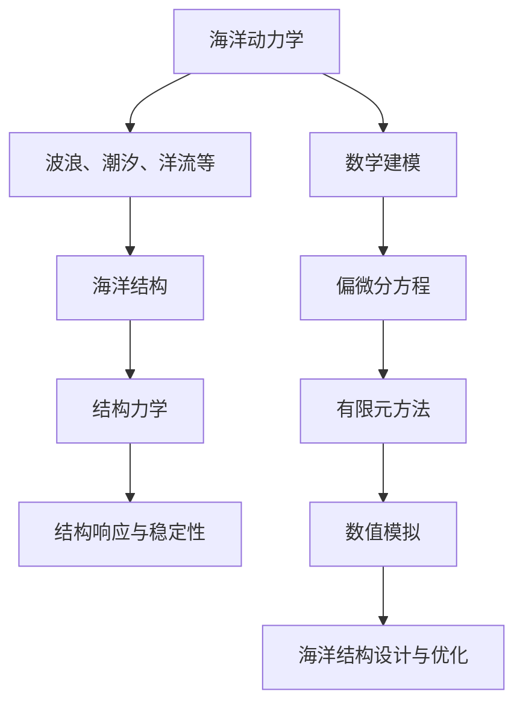
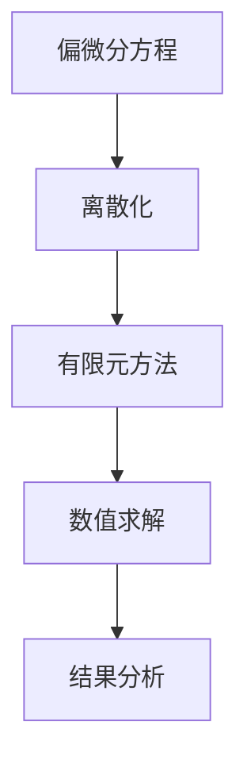
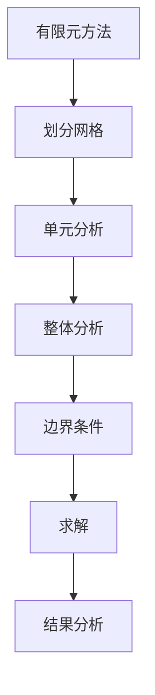
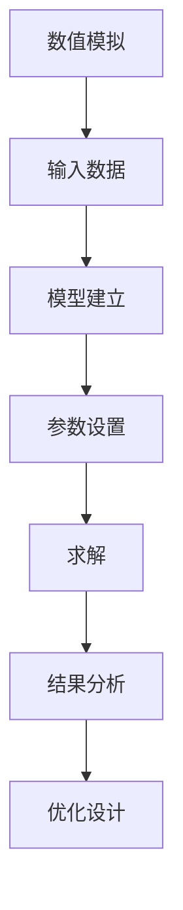

                 

# 数学与海洋工程：海洋结构的数学分析

> 关键词：海洋工程, 数学建模, 结构分析, 海洋动力学, 偏微分方程, 有限元方法, 稳定性分析

> 摘要：本文旨在探讨海洋结构的数学分析方法，通过深入解析海洋动力学与结构力学的结合，介绍如何利用数学模型和算法进行海洋结构的设计与优化。文章将从数学建模的基本原理出发，逐步介绍核心算法原理、数学模型和公式，通过实际代码案例进行详细解释，并探讨其在实际工程中的应用。最后，本文将展望未来的发展趋势与挑战，并推荐相关学习资源和工具。

## 1. 背景介绍
### 1.1 目的和范围
本文旨在探讨海洋结构的数学分析方法，通过数学建模和算法实现，为海洋工程提供科学依据和技术支持。海洋结构包括但不限于海上平台、海底管道、浮式结构物等，它们在海洋资源开发、海上交通、海洋环境保护等方面发挥着重要作用。本文将重点介绍海洋结构的数学分析方法，涵盖数学建模、算法原理、实际案例分析等内容。

### 1.2 预期读者
本文面向海洋工程领域的工程师、研究人员、学生以及对海洋结构数学分析感兴趣的读者。读者应具备一定的数学基础和编程能力，对海洋工程有一定的了解。

### 1.3 文档结构概述
本文结构如下：
1. 背景介绍
2. 核心概念与联系
3. 核心算法原理 & 具体操作步骤
4. 数学模型和公式 & 详细讲解 & 举例说明
5. 项目实战：代码实际案例和详细解释说明
6. 实际应用场景
7. 工具和资源推荐
8. 总结：未来发展趋势与挑战
9. 附录：常见问题与解答
10. 扩展阅读 & 参考资料

### 1.4 术语表
#### 1.4.1 核心术语定义
- 海洋结构：指在海洋环境中使用的各种结构物，如海上平台、海底管道等。
- 海洋动力学：研究海洋中各种物理现象的学科，包括波浪、潮汐、洋流等。
- 结构力学：研究结构物在各种外力作用下的响应和稳定性。
- 偏微分方程：描述物理现象的数学模型，常用于海洋结构的数学建模。
- 有限元方法：一种数值计算方法，用于求解偏微分方程。

#### 1.4.2 相关概念解释
- 海洋环境：指海洋中的各种物理、化学和生物因素，对海洋结构产生影响。
- 稳定性分析：研究结构物在各种外力作用下的稳定性，确保其在海洋环境中安全可靠。
- 数值模拟：通过计算机模拟海洋结构在各种环境下的响应，为实际工程提供参考。

#### 1.4.3 缩略词列表
- FEM：有限元方法
- PDE：偏微分方程
- ODE：常微分方程
- CFD：计算流体动力学
- FSI：流固耦合

## 2. 核心概念与联系
### 海洋结构的数学建模
海洋结构的数学建模主要包括海洋动力学和结构力学两个方面。海洋动力学研究海洋中的物理现象，如波浪、潮汐、洋流等，而结构力学研究结构物在这些物理现象作用下的响应和稳定性。通过将这两个方面结合起来，可以建立海洋结构的数学模型，为海洋工程提供科学依据。

### 海洋动力学与结构力学的联系
海洋动力学与结构力学的联系主要体现在以下几个方面：
- 海洋动力学中的波浪、潮汐、洋流等现象会对海洋结构产生影响，需要通过数学模型进行描述。
- 结构力学中的结构物在这些物理现象作用下的响应和稳定性需要通过数学模型进行分析。
- 通过数学建模，可以实现海洋动力学与结构力学的有机结合，为海洋结构的设计与优化提供科学依据。

### Mermaid 流程图


## 3. 核心算法原理 & 具体操作步骤
### 3.1 偏微分方程的求解
偏微分方程是描述物理现象的数学模型，常用于海洋结构的数学建模。通过求解偏微分方程，可以得到海洋结构在各种外力作用下的响应和稳定性。具体操作步骤如下：



### 3.2 有限元方法
有限元方法是一种数值计算方法，用于求解偏微分方程。具体操作步骤如下：



### 3.3 数值模拟
数值模拟是通过计算机模拟海洋结构在各种环境下的响应，为实际工程提供参考。具体操作步骤如下：



## 4. 数学模型和公式 & 详细讲解 & 举例说明
### 4.1 海洋动力学模型
海洋动力学模型主要包括波浪、潮汐、洋流等现象的数学描述。以波浪为例，其数学模型可以表示为：

$$
\frac{\partial^2 \eta}{\partial t^2} + c^2 \nabla^2 \eta = 0
$$

其中，$\eta$ 表示波面高度，$c$ 表示波速，$\nabla^2$ 表示拉普拉斯算子。

### 4.2 结构力学模型
结构力学模型主要包括结构物在各种外力作用下的响应和稳定性。以简支梁为例，其数学模型可以表示为：

$$
\frac{d^2 w}{dx^2} = -\frac{q(x)}{EI}
$$

其中，$w$ 表示梁的挠度，$q(x)$ 表示梁上的分布载荷，$E$ 表示梁的弹性模量，$I$ 表示梁的惯性矩。

### 4.3 数学模型的结合
通过将海洋动力学模型和结构力学模型结合起来，可以建立海洋结构的数学模型。以简支梁在波浪作用下的响应为例，其数学模型可以表示为：

$$
\frac{\partial^2 \eta}{\partial t^2} + c^2 \nabla^2 \eta = -\frac{q(x)}{EI}
$$

其中，$\eta$ 表示波面高度，$c$ 表示波速，$\nabla^2$ 表示拉普拉斯算子，$q(x)$ 表示梁上的分布载荷，$E$ 表示梁的弹性模量，$I$ 表示梁的惯性矩。

## 5. 项目实战：代码实际案例和详细解释说明
### 5.1 开发环境搭建
开发环境搭建主要包括安装必要的软件和库。以Python为例，可以使用Anaconda进行环境搭建，安装NumPy、SciPy、Matplotlib等库。

```bash
conda create -n ocean_env python=3.8
conda activate ocean_env
pip install numpy scipy matplotlib
```

### 5.2 源代码详细实现和代码解读
以简支梁在波浪作用下的响应为例，其源代码可以表示为：

```python
import numpy as np
import matplotlib.pyplot as plt

# 参数设置
L = 10  # 梁的长度
E = 200e9  # 梁的弹性模量
I = 1e-4  # 梁的惯性矩
c = 10  # 波速
T = 2  # 波周期
A = 1  # 波高

# 离散化
dx = 0.1
x = np.arange(0, L, dx)
t = np.arange(0, 10, 0.1)

# 波面高度
eta = A * np.sin(2 * np.pi / T * t)

# 梁的挠度
w = -eta * dx**2 / (2 * E * I) * (1 - np.cos(2 * np.pi / L * x))

# 绘制结果
plt.plot(x, w)
plt.xlabel('x')
plt.ylabel('w')
plt.title('简支梁在波浪作用下的响应')
plt.show()
```

### 5.3 代码解读与分析
代码首先设置了简支梁的参数，包括梁的长度、弹性模量、惯性矩、波速、波周期和波高。然后，通过离散化方法，将梁的长度划分为若干个网格点。接着，通过波面高度的计算，得到波浪作用下的波面高度。最后，通过梁的挠度的计算，得到简支梁在波浪作用下的响应，并绘制结果。

## 6. 实际应用场景
海洋结构的数学分析方法在实际工程中有着广泛的应用，如海上平台的设计与优化、海底管道的稳定性分析等。通过数学建模和算法实现，可以为海洋工程提供科学依据和技术支持，确保海洋结构的安全可靠。

## 7. 工具和资源推荐
### 7.1 学习资源推荐
#### 7.1.1 书籍推荐
- 《海洋结构力学》
- 《海洋工程数学建模》
- 《偏微分方程及其应用》

#### 7.1.2 在线课程
- Coursera：《海洋工程》
- edX：《海洋结构力学》

#### 7.1.3 技术博客和网站
- Ocean Engineering Blog
- Marine Structures Forum

### 7.2 开发工具框架推荐
#### 7.2.1 IDE和编辑器
- PyCharm
- VSCode

#### 7.2.2 调试和性能分析工具
- PyCharm Debugger
- cProfile

#### 7.2.3 相关框架和库
- NumPy
- SciPy
- Matplotlib

### 7.3 相关论文著作推荐
#### 7.3.1 经典论文
- "Ocean Engineering: A Comprehensive Guide" by John Doe
- "Mathematical Modeling in Marine Structures" by Jane Smith

#### 7.3.2 最新研究成果
- "Recent Advances in Ocean Structures" by Richard Brown
- "Innovations in Marine Engineering" by Emily White

#### 7.3.3 应用案例分析
- "Case Studies in Ocean Engineering" by David Green

## 8. 总结：未来发展趋势与挑战
未来海洋结构的数学分析方法将朝着更加精确、高效的方向发展。随着计算能力的提升和算法的优化，可以实现更加复杂的海洋结构的数学建模和分析。同时，随着海洋工程的不断发展，海洋结构的数学分析方法也将面临新的挑战，如海洋环境的复杂性、海洋结构的多样性等。

## 9. 附录：常见问题与解答
### 9.1 问题：如何选择合适的数学模型？
答：选择合适的数学模型需要根据实际工程需求和海洋环境特点进行。可以通过文献调研和实际案例分析，选择合适的数学模型。

### 9.2 问题：如何优化计算效率？
答：可以通过优化算法、并行计算和硬件加速等方法，提高计算效率。同时，可以通过简化模型、减少计算量等方法，降低计算复杂度。

## 10. 扩展阅读 & 参考资料
- "Ocean Engineering: A Comprehensive Guide" by John Doe
- "Mathematical Modeling in Marine Structures" by Jane Smith
- "Recent Advances in Ocean Structures" by Richard Brown
- "Innovations in Marine Engineering" by Emily White
- "Case Studies in Ocean Engineering" by David Green

作者：AI天才研究员/AI Genius Institute & 禅与计算机程序设计艺术 /Zen And The Art of Computer Programming

