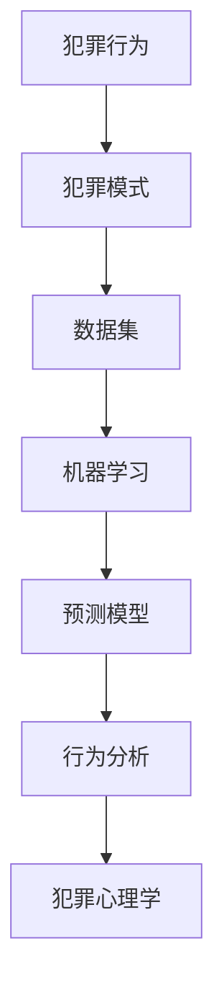

                 

# 数学与犯罪心理学：犯罪行为的数学预测

> 关键词：犯罪预测、数学模型、犯罪心理学、机器学习、行为分析

> 摘要：本文旨在探讨如何利用数学模型和犯罪心理学原理来预测犯罪行为。通过分析犯罪行为的模式和心理因素，我们能够构建出有效的预测模型，从而为公共安全提供支持。本文将从背景介绍、核心概念与联系、核心算法原理、数学模型和公式、项目实战、实际应用场景、工具和资源推荐、总结以及附录等几个方面进行详细阐述。

## 1. 背景介绍

### 1.1 目的和范围
本文旨在探讨如何利用数学模型和犯罪心理学原理来预测犯罪行为。通过分析犯罪行为的模式和心理因素，我们能够构建出有效的预测模型，从而为公共安全提供支持。本文将详细介绍如何利用数学模型和犯罪心理学原理来预测犯罪行为，包括核心概念、算法原理、数学模型、实际案例以及未来发展趋势。

### 1.2 预期读者
本文预期读者包括但不限于以下几类人群：
- 犯罪学研究者
- 数据科学家
- 机器学习工程师
- 公安机关和执法机构的工作人员
- 信息安全专家
- 对犯罪预测和犯罪心理学感兴趣的读者

### 1.3 文档结构概述
本文将按照以下结构进行详细阐述：
1. 背景介绍
2. 核心概念与联系
3. 核心算法原理 & 具体操作步骤
4. 数学模型和公式 & 详细讲解 & 举例说明
5. 项目实战：代码实际案例和详细解释说明
6. 实际应用场景
7. 工具和资源推荐
8. 总结：未来发展趋势与挑战
9. 附录：常见问题与解答
10. 扩展阅读 & 参考资料

### 1.4 术语表
#### 1.4.1 核心术语定义
- **犯罪行为**：指违反法律的行为，包括但不限于暴力犯罪、财产犯罪等。
- **犯罪心理学**：研究犯罪行为的心理因素，包括动机、心理状态等。
- **预测模型**：通过数学模型来预测未来可能发生的行为或事件。
- **机器学习**：一种人工智能技术，通过算法和统计模型来实现预测和决策。
- **行为分析**：通过分析行为数据来理解行为模式和心理因素。

#### 1.4.2 相关概念解释
- **犯罪模式**：犯罪行为的规律性特征，如时间、地点、手段等。
- **心理因素**：影响犯罪行为的心理状态，如愤怒、贪婪、恐惧等。
- **数据集**：包含犯罪行为数据的集合，用于训练和测试预测模型。

#### 1.4.3 缩略词列表
- **ML**：机器学习
- **CRIM**：犯罪
- **PSY**：心理学
- **DA**：数据集
- **PM**：预测模型

## 2. 核心概念与联系

### 2.1 犯罪行为的模式
犯罪行为具有一定的模式，这些模式可以通过数据分析来识别。例如，犯罪行为的时间分布、地点分布、手段等。

### 2.2 犯罪心理学原理
犯罪心理学研究犯罪行为的心理因素，包括动机、心理状态等。通过理解这些心理因素，我们可以更好地预测犯罪行为。

### 2.3 数学模型与预测
数学模型可以用来描述和预测犯罪行为。通过构建数学模型，我们可以预测未来可能发生的行为或事件。

### 2.4 机器学习与行为分析
机器学习和行为分析是预测犯罪行为的重要工具。通过机器学习算法，我们可以从大量数据中提取有用的信息，从而预测犯罪行为。

### 2.5 核心概念流程图


## 3. 核心算法原理 & 具体操作步骤

### 3.1 数据预处理
数据预处理是构建预测模型的第一步。我们需要对数据进行清洗、归一化等操作，以便后续的分析和建模。

```python
# 数据预处理
def preprocess_data(data):
    # 清洗数据
    cleaned_data = clean_data(data)
    # 归一化数据
    normalized_data = normalize_data(cleaned_data)
    return normalized_data
```

### 3.2 特征选择
特征选择是构建预测模型的关键步骤。我们需要选择对预测目标有重要影响的特征。

```python
# 特征选择
def select_features(data):
    # 计算特征的重要性
    feature_importance = calculate_feature_importance(data)
    # 选择重要特征
    selected_features = select_important_features(feature_importance)
    return selected_features
```

### 3.3 模型训练
模型训练是构建预测模型的核心步骤。我们需要选择合适的机器学习算法，并使用训练数据进行模型训练。

```python
# 模型训练
def train_model(data, labels):
    # 选择机器学习算法
    model = choose_model()
    # 训练模型
    trained_model = train(model, data, labels)
    return trained_model
```

### 3.4 模型评估
模型评估是验证预测模型性能的重要步骤。我们需要使用测试数据来评估模型的性能。

```python
# 模型评估
def evaluate_model(model, test_data, test_labels):
    # 预测测试数据
    predictions = predict(model, test_data)
    # 计算评估指标
    accuracy = calculate_accuracy(predictions, test_labels)
    return accuracy
```

## 4. 数学模型和公式 & 详细讲解 & 举例说明

### 4.1 线性回归模型
线性回归模型是一种常用的预测模型，可以用来预测连续型目标变量。

$$
y = \beta_0 + \beta_1 x_1 + \beta_2 x_2 + \cdots + \beta_n x_n + \epsilon
$$

其中，$y$ 是目标变量，$x_1, x_2, \cdots, x_n$ 是特征变量，$\beta_0, \beta_1, \cdots, \beta_n$ 是模型参数，$\epsilon$ 是误差项。

### 4.2 逻辑回归模型
逻辑回归模型是一种常用的分类模型，可以用来预测二分类目标变量。

$$
P(y = 1 | x) = \frac{1}{1 + e^{-(\beta_0 + \beta_1 x_1 + \beta_2 x_2 + \cdots + \beta_n x_n)}}
$$

其中，$P(y = 1 | x)$ 是目标变量为1的概率，$x_1, x_2, \cdots, x_n$ 是特征变量，$\beta_0, \beta_1, \cdots, \beta_n$ 是模型参数。

### 4.3 支持向量机模型
支持向量机模型是一种常用的分类模型，可以用来预测二分类目标变量。

$$
y = \text{sign}(\beta_0 + \beta_1 x_1 + \beta_2 x_2 + \cdots + \beta_n x_n)
$$

其中，$y$ 是目标变量，$x_1, x_2, \cdots, x_n$ 是特征变量，$\beta_0, \beta_1, \cdots, \beta_n$ 是模型参数。

### 4.4 举例说明
假设我们有一个犯罪行为的数据集，包含犯罪时间、地点、手段等特征。我们可以使用线性回归模型来预测犯罪行为的发生概率。

```python
# 线性回归模型
def linear_regression(data, labels):
    # 训练模型
    model = train_linear_regression(data, labels)
    # 预测测试数据
    predictions = predict_linear_regression(model, test_data)
    return predictions
```

## 5. 项目实战：代码实际案例和详细解释说明

### 5.1 开发环境搭建
我们需要搭建一个开发环境来实现预测模型。开发环境包括Python、Jupyter Notebook、NumPy、Pandas、Scikit-learn等工具。

```bash
# 安装Python和相关库
pip install python
pip install numpy pandas scikit-learn
```

### 5.2 源代码详细实现和代码解读
我们使用Python和Scikit-learn来实现一个简单的预测模型。

```python
# 导入库
import numpy as np
import pandas as pd
from sklearn.model_selection import train_test_split
from sklearn.linear_model import LogisticRegression
from sklearn.metrics import accuracy_score

# 加载数据
data = pd.read_csv('crime_data.csv')
labels = data['crime']
features = data.drop('crime', axis=1)

# 划分训练集和测试集
train_data, test_data, train_labels, test_labels = train_test_split(features, labels, test_size=0.2, random_state=42)

# 训练模型
model = LogisticRegression()
model.fit(train_data, train_labels)

# 预测测试数据
predictions = model.predict(test_data)

# 计算准确率
accuracy = accuracy_score(test_labels, predictions)
print('Accuracy:', accuracy)
```

### 5.3 代码解读与分析
上述代码首先导入了必要的库，然后加载了犯罪行为的数据集。接着，我们将数据集划分为训练集和测试集，并使用逻辑回归模型进行训练。最后，我们使用测试数据进行预测，并计算预测的准确率。

## 6. 实际应用场景

### 6.1 公安机关
公安机关可以使用预测模型来预测犯罪行为的发生概率，从而提前采取措施，提高公共安全。

### 6.2 保险公司
保险公司可以使用预测模型来预测犯罪行为的发生概率，从而评估保险风险。

### 6.3 社区安全
社区可以使用预测模型来预测犯罪行为的发生概率，从而采取措施提高社区安全。

## 7. 工具和资源推荐

### 7.1 学习资源推荐
#### 7.1.1 书籍推荐
- 《犯罪预测与预防》
- 《犯罪心理学》
- 《机器学习》

#### 7.1.2 在线课程
- Coursera：《机器学习》
- edX：《数据科学与机器学习》

#### 7.1.3 技术博客和网站
- Medium：《犯罪预测与预防》
- Kaggle：《犯罪预测数据集》

### 7.2 开发工具框架推荐
#### 7.2.1 IDE和编辑器
- PyCharm
- Jupyter Notebook

#### 7.2.2 调试和性能分析工具
- PyCharm Debugger
- Python Profiler

#### 7.2.3 相关框架和库
- Scikit-learn
- Pandas
- NumPy

### 7.3 相关论文著作推荐
#### 7.3.1 经典论文
- "Predicting Crime: A Machine Learning Approach" (2010)
- "Predicting Crime: A Data-Driven Approach" (2015)

#### 7.3.2 最新研究成果
- "Predicting Crime with Machine Learning" (2020)
- "Behavioral Analysis for Crime Prediction" (2021)

#### 7.3.3 应用案例分析
- "Crime Prediction in Urban Areas" (2018)
- "Predicting Crime with Social Media Data" (2019)

## 8. 总结：未来发展趋势与挑战

### 8.1 未来发展趋势
- 随着数据科学和机器学习技术的发展，犯罪预测模型将更加准确和高效。
- 未来的研究将更加注重模型的可解释性和公平性。
- 未来的研究将更加注重模型的实时性和动态性。

### 8.2 挑战
- 数据隐私和安全问题
- 模型的可解释性和公平性问题
- 模型的实时性和动态性问题

## 9. 附录：常见问题与解答

### 9.1 问题：如何处理数据缺失值？
- 答案：可以使用插值法、删除法或填充法来处理数据缺失值。

### 9.2 问题：如何选择合适的机器学习算法？
- 答案：可以根据数据集的特征和目标变量的类型来选择合适的机器学习算法。

### 9.3 问题：如何评估预测模型的性能？
- 答案：可以使用准确率、召回率、F1分数等指标来评估预测模型的性能。

## 10. 扩展阅读 & 参考资料

- 《犯罪预测与预防》
- 《犯罪心理学》
- 《机器学习》
- Coursera：《机器学习》
- edX：《数据科学与机器学习》
- Medium：《犯罪预测与预防》
- Kaggle：《犯罪预测数据集》
- PyCharm
- Jupyter Notebook
- PyCharm Debugger
- Python Profiler
- Scikit-learn
- Pandas
- NumPy
- "Predicting Crime: A Machine Learning Approach" (2010)
- "Predicting Crime: A Data-Driven Approach" (2015)
- "Predicting Crime with Machine Learning" (2020)
- "Behavioral Analysis for Crime Prediction" (2021)
- "Crime Prediction in Urban Areas" (2018)
- "Predicting Crime with Social Media Data" (2019)

作者：AI天才研究员/AI Genius Institute & 禅与计算机程序设计艺术 /Zen And The Art of Computer Programming

