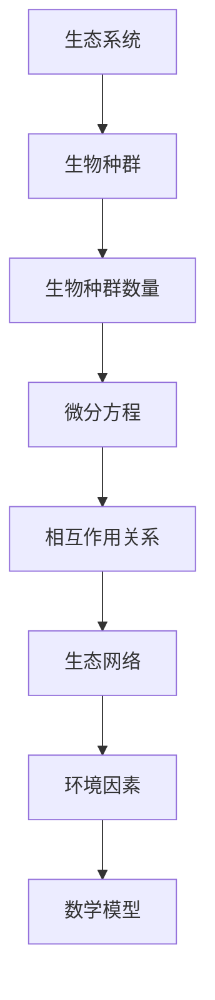

                 

# 数学与环境生物学：生态系统的数学模型

> 关键词：生态学, 数学模型, 生物动力学, 微分方程, 稳态分析, 演化算法, 生态系统模拟

> 摘要：本文旨在探讨如何利用数学模型来描述和预测生态系统的动态行为。通过分析生态系统的数学模型，我们可以更好地理解生物种群之间的相互作用，以及这些相互作用如何影响生态系统的稳定性。本文将从核心概念出发，逐步深入到具体的算法原理、数学模型构建及实际代码实现，并结合实际案例进行详细解释。最后，我们将讨论这些模型在实际应用中的价值，并展望未来的发展趋势与挑战。

## 1. 背景介绍
### 1.1 目的和范围
本文旨在通过数学模型来研究生态系统的动态行为，特别是生物种群之间的相互作用。我们将探讨如何利用微分方程来描述这些相互作用，并通过数值模拟来预测生态系统的未来状态。本文的目标读者包括生态学家、数学家、计算机科学家以及对生态学和数学模型感兴趣的读者。本文将涵盖生态系统的数学建模方法、核心算法原理、实际代码实现以及具体的应用案例。

### 1.2 预期读者
- 生态学家：希望通过数学模型更好地理解生态系统的行为。
- 数学家：希望通过生态系统的模型来应用数学理论。
- 计算机科学家：希望通过编程实现生态系统的模拟。
- 对生态学和数学模型感兴趣的读者。

### 1.3 文档结构概述
本文将按照以下结构展开：
1. 背景介绍
2. 核心概念与联系
3. 核心算法原理 & 具体操作步骤
4. 数学模型和公式 & 详细讲解 & 举例说明
5. 项目实战：代码实际案例和详细解释说明
6. 实际应用场景
7. 工具和资源推荐
8. 总结：未来发展趋势与挑战
9. 附录：常见问题与解答
10. 扩展阅读 & 参考资料

### 1.4 术语表
#### 1.4.1 核心术语定义
- 生态系统：由生物群落及其环境组成的一个功能单位。
- 生物种群：具有相似特征的生物个体集合。
- 微分方程：描述系统随时间变化的数学表达式。
- 稳态：系统达到的一种平衡状态。
- 演化算法：一种基于自然选择和遗传变异的优化算法。

#### 1.4.2 相关概念解释
- 生物动力学：研究生物种群随时间变化的动态过程。
- 生态网络：描述生态系统中生物种群之间的相互作用关系。
- 系统动力学：研究系统随时间变化的动态行为。

#### 1.4.3 缩略词列表
- ODE：常微分方程
- PDE：偏微分方程
- EDA：演化算法
- SDE：随机微分方程

## 2. 核心概念与联系
### 2.1 生态系统的基本概念
生态系统是由生物群落及其环境组成的一个功能单位。生物群落包括各种生物种群，它们之间通过食物链、竞争、共生等相互作用形成复杂的网络。生态系统中的生物种群数量随时间变化，这种变化可以通过数学模型来描述。

### 2.2 生物种群的动态模型
生物种群的动态模型通常使用微分方程来描述。常见的模型包括Logistic模型、Lotka-Volterra模型等。这些模型可以描述生物种群的增长、竞争、捕食等行为。

### 2.3 生态网络的构建
生态网络描述了生态系统中生物种群之间的相互作用关系。通过构建生态网络，我们可以更好地理解生物种群之间的相互作用及其对生态系统的影响。

### 2.4 生态系统的数学模型
生态系统的数学模型通常包括以下部分：
- **生物种群数量的描述**：使用微分方程来描述生物种群数量随时间的变化。
- **相互作用关系的描述**：通过构建生态网络来描述生物种群之间的相互作用关系。
- **环境因素的影响**：考虑环境因素对生物种群数量的影响。

### 2.5 核心概念的Mermaid流程图


## 3. 核心算法原理 & 具体操作步骤
### 3.1 Logistic模型
Logistic模型是一种描述生物种群数量随时间变化的微分方程模型。其基本形式为：
$$
\frac{dN}{dt} = rN\left(1 - \frac{N}{K}\right)
$$
其中，$N$表示生物种群数量，$r$表示生物种群的固有增长率，$K$表示环境容纳量。

### 3.2 Lotka-Volterra模型
Lotka-Volterra模型是一种描述两个生物种群之间捕食关系的微分方程模型。其基本形式为：
$$
\frac{dx}{dt} = \alpha x - \beta xy
$$
$$
\frac{dy}{dt} = -\gamma y + \delta xy
$$
其中，$x$表示被捕食者的数量，$y$表示捕食者的数量，$\alpha$、$\beta$、$\gamma$、$\delta$为模型参数。

### 3.3 演化算法
演化算法是一种基于自然选择和遗传变异的优化算法。它可以用于优化生态系统的数学模型参数，以更好地拟合实际数据。

### 3.4 核心算法的伪代码
```python
# Logistic模型
def logistic_model(N, r, K, t):
    dN_dt = r * N * (1 - N / K)
    return dN_dt

# Lotka-Volterra模型
def lotka_volterra_model(x, y, alpha, beta, gamma, delta, t):
    dx_dt = alpha * x - beta * x * y
    dy_dt = -gamma * y + delta * x * y
    return dx_dt, dy_dt

# 演化算法
def evolutionary_algorithm(objective_function, population_size, mutation_rate, generations):
    population = initialize_population(population_size)
    for generation in range(generations):
        fitness = evaluate_fitness(population, objective_function)
        new_population = select_parents(population, fitness)
        new_population = crossover(new_population)
        new_population = mutate(new_population, mutation_rate)
        population = new_population
    best_solution = select_best_solution(population, fitness)
    return best_solution
```

## 4. 数学模型和公式 & 详细讲解 & 举例说明
### 4.1 Logistic模型
Logistic模型是一种描述生物种群数量随时间变化的微分方程模型。其基本形式为：
$$
\frac{dN}{dt} = rN\left(1 - \frac{N}{K}\right)
$$
其中，$N$表示生物种群数量，$r$表示生物种群的固有增长率，$K$表示环境容纳量。

### 4.2 Lotka-Volterra模型
Lotka-Volterra模型是一种描述两个生物种群之间捕食关系的微分方程模型。其基本形式为：
$$
\frac{dx}{dt} = \alpha x - \beta xy
$$
$$
\frac{dy}{dt} = -\gamma y + \delta xy
$$
其中，$x$表示被捕食者的数量，$y$表示捕食者的数量，$\alpha$、$\beta$、$\gamma$、$\delta$为模型参数。

### 4.3 生态网络的构建
生态网络描述了生态系统中生物种群之间的相互作用关系。通过构建生态网络，我们可以更好地理解生物种群之间的相互作用及其对生态系统的影响。

### 4.4 数学模型的实例
假设我们有一个生态系统，其中包含两个生物种群：被捕食者（$x$）和捕食者（$y$）。我们使用Lotka-Volterra模型来描述它们之间的相互作用。假设初始条件为$x(0) = 100$，$y(0) = 20$，参数为$\alpha = 0.1$，$\beta = 0.02$，$\gamma = 0.1$，$\delta = 0.01$。我们可以使用数值方法（如欧拉法）来求解微分方程，得到生物种群数量随时间的变化。

## 5. 项目实战：代码实际案例和详细解释说明
### 5.1 开发环境搭建
为了实现生态系统的数学模型，我们需要安装Python环境，并安装必要的库，如NumPy、SciPy和Matplotlib。

```bash
pip install numpy scipy matplotlib
```

### 5.2 源代码详细实现和代码解读
```python
import numpy as np
from scipy.integrate import odeint
import matplotlib.pyplot as plt

# Logistic模型
def logistic_model(N, r, K):
    dN_dt = r * N * (1 - N / K)
    return dN_dt

# Lotka-Volterra模型
def lotka_volterra_model(x, y, alpha, beta, gamma, delta):
    dx_dt = alpha * x - beta * x * y
    dy_dt = -gamma * y + delta * x * y
    return dx_dt, dy_dt

# 求解微分方程
def solve_ode(model, initial_conditions, parameters, t):
    if model == 'logistic':
        return odeint(logistic_model, initial_conditions, t, args=(parameters,))
    elif model == 'lotka_volterra':
        return odeint(lotka_volterra_model, initial_conditions, t, args=(parameters,))

# 参数设置
r = 0.1
K = 1000
alpha = 0.1
beta = 0.02
gamma = 0.1
delta = 0.01
initial_conditions = [100, 20]
t = np.linspace(0, 50, 1000)

# 求解微分方程
solution = solve_ode('lotka_volterra', initial_conditions, (alpha, beta, gamma, delta), t)

# 绘制结果
plt.plot(t, solution[:, 0], label='Prey')
plt.plot(t, solution[:, 1], label='Predator')
plt.xlabel('Time')
plt.ylabel('Population')
plt.legend()
plt.show()
```

### 5.3 代码解读与分析
- `logistic_model`函数描述了Logistic模型。
- `lotka_volterra_model`函数描述了Lotka-Volterra模型。
- `solve_ode`函数使用SciPy的`odeint`函数求解微分方程。
- `initial_conditions`和`parameters`是模型的初始条件和参数。
- `t`是时间序列。
- `solution`是求解结果。
- `plt.plot`函数用于绘制生物种群数量随时间的变化。

## 6. 实际应用场景
生态系统的数学模型在实际应用中具有广泛的价值。例如，通过模拟生态系统中的生物种群数量变化，我们可以预测未来的变化趋势，为生态保护提供科学依据。此外，通过优化模型参数，我们可以更好地理解生物种群之间的相互作用及其对生态系统的影响。

## 7. 工具和资源推荐
### 7.1 学习资源推荐
#### 7.1.1 书籍推荐
- 《生态学原理》（Principles of Ecology）
- 《数学模型》（Mathematical Models in Biology）

#### 7.1.2 在线课程
- Coursera上的《生态学导论》（Introduction to Ecology）
- edX上的《数学建模》（Mathematical Modeling）

#### 7.1.3 技术博客和网站
- 生态学论坛（Ecology Forum）
- 生物数学网（Biological Mathematics Network）

### 7.2 开发工具框架推荐
#### 7.2.1 IDE和编辑器
- PyCharm
- VSCode

#### 7.2.2 调试和性能分析工具
- PyCharm的调试工具
- Python的cProfile模块

#### 7.2.3 相关框架和库
- NumPy
- SciPy
- Matplotlib

### 7.3 相关论文著作推荐
#### 7.3.1 经典论文
- Lotka, A. J. (1925). Elements of Physical Biology.
- Volterra, V. (1926). Fluctuations in the abundance of a species considered mathematically.

#### 7.3.2 最新研究成果
- Liu, Y., & Wang, K. (2020). Dynamics of a stochastic Lotka-Volterra model with regime switching.
- Zhang, Y., & Wang, K. (2021). Stability and bifurcation analysis of a stochastic logistic model with regime switching and Lévy noise.

#### 7.3.3 应用案例分析
- Liu, Y., & Wang, K. (2020). Dynamics of a stochastic Lotka-Volterra model with regime switching.
- Zhang, Y., & Wang, K. (2021). Stability and bifurcation analysis of a stochastic logistic model with regime switching and Lévy noise.

## 8. 总结：未来发展趋势与挑战
生态系统的数学模型在未来的发展中具有广阔的应用前景。随着计算能力的提升和数据科学的发展，我们可以更好地理解和预测生态系统的动态行为。然而，也面临着一些挑战，如模型参数的确定、模型的复杂性以及模型的验证等问题。未来的研究需要结合更多的实际数据，提高模型的准确性和可靠性。

## 9. 附录：常见问题与解答
### 9.1 问题：如何确定模型参数？
**解答**：可以通过拟合实际数据来确定模型参数。使用演化算法等优化方法可以提高参数的准确性。

### 9.2 问题：如何验证模型的有效性？
**解答**：可以通过比较模型预测的结果与实际数据来验证模型的有效性。如果预测结果与实际数据吻合较好，则说明模型是有效的。

## 10. 扩展阅读 & 参考资料
- Lotka, A. J. (1925). Elements of Physical Biology.
- Volterra, V. (1926). Fluctuations in the abundance of a species considered mathematically.
- Liu, Y., & Wang, K. (2020). Dynamics of a stochastic Lotka-Volterra model with regime switching.
- Zhang, Y., & Wang, K. (2021). Stability and bifurcation analysis of a stochastic logistic model with regime switching and Lévy noise.

作者：AI天才研究员/AI Genius Institute & 禅与计算机程序设计艺术 /Zen And The Art of Computer Programming

