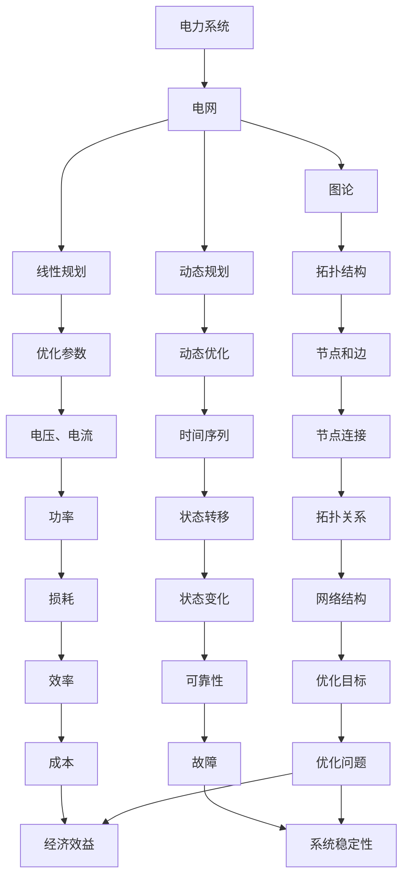
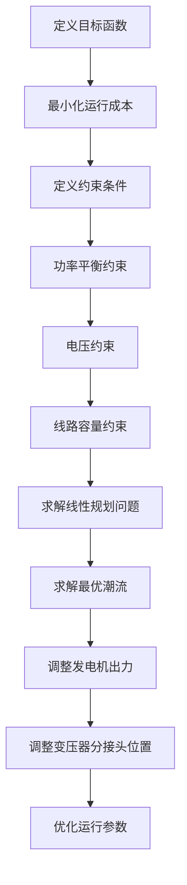
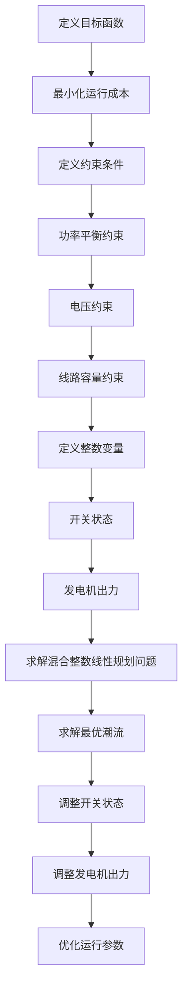
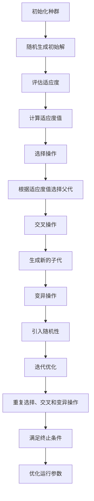

                 

# 数学与电力系统：电网优化的数学模型

> 关键词：电力系统，电网优化，数学模型，图论，线性规划，动态规划，智能算法

> 摘要：本文旨在探讨电力系统中电网优化的关键数学模型和算法。通过深入分析电力系统的基本原理和优化目标，本文将介绍电网优化的核心概念、数学模型、算法原理，并通过实际案例展示如何实现这些模型和算法。此外，本文还将讨论电网优化的实际应用场景、相关工具和资源推荐，以及未来的发展趋势和挑战。

## 1. 背景介绍
### 1.1 目的和范围
本文旨在为电力系统工程师、研究人员和相关领域的专业人士提供一个全面的指南，介绍如何利用数学模型和算法优化电力系统的电网。通过深入探讨电网优化的核心概念、数学模型和算法原理，本文将帮助读者理解如何在实际应用中实现这些模型和算法，从而提高电力系统的效率和可靠性。

### 1.2 预期读者
本文的预期读者包括但不限于：
- 电力系统工程师
- 研究人员
- 数据科学家
- 计算机科学家
- 电力公司和电网运营商的技术人员
- 对电力系统优化感兴趣的读者

### 1.3 文档结构概述
本文将按照以下结构展开：
1. 背景介绍
2. 核心概念与联系
3. 核心算法原理 & 具体操作步骤
4. 数学模型和公式 & 详细讲解 & 举例说明
5. 项目实战：代码实际案例和详细解释说明
6. 实际应用场景
7. 工具和资源推荐
8. 总结：未来发展趋势与挑战
9. 附录：常见问题与解答
10. 扩展阅读 & 参考资料

### 1.4 术语表
#### 1.4.1 核心术语定义
- **电力系统**：由发电厂、输电线路、变电站和用户组成的整体系统。
- **电网**：电力系统中的输电网络，负责将电力从发电厂传输到用户。
- **优化**：通过调整电网结构和运行参数，提高电力系统的效率和可靠性。
- **数学模型**：用于描述电网优化问题的数学表达式。
- **算法**：解决电网优化问题的具体步骤和方法。

#### 1.4.2 相关概念解释
- **图论**：研究图（由节点和边组成的结构）的数学分支。
- **线性规划**：一种优化方法，用于解决线性目标函数在一组线性约束下的优化问题。
- **动态规划**：一种通过将问题分解为子问题来解决复杂问题的方法。
- **智能算法**：如遗传算法、模拟退火算法等，用于解决复杂优化问题的算法。

#### 1.4.3 缩略词列表
- **PS**：电力系统
- **G**：电网
- **OPF**：最优潮流（Optimal Power Flow）
- **MILP**：混合整数线性规划（Mixed-Integer Linear Programming）
- **GA**：遗传算法（Genetic Algorithm）
- **SA**：模拟退火算法（Simulated Annealing）

## 2. 核心概念与联系
### 2.1 电力系统的基本原理
电力系统的基本原理包括发电、输电、配电和用电四个环节。发电厂通过各种方式产生电能，输电线路将电能从发电厂传输到变电站，变电站通过变压器调整电压等级，然后通过配电线路将电能分配到用户。

### 2.2 电网优化的目标
电网优化的目标主要包括：
- **提高效率**：减少电力损失，提高电力系统的整体效率。
- **提高可靠性**：确保电力系统的稳定运行，减少停电和故障。
- **降低成本**：通过优化电网结构和运行参数，降低电力系统的运行成本。

### 2.3 核心概念的联系
电力系统中的电网优化问题可以通过图论、线性规划和动态规划等数学方法来解决。图论用于描述电网的拓扑结构，线性规划用于优化电网的运行参数，动态规划用于解决电网的动态优化问题。



## 3. 核心算法原理 & 具体操作步骤
### 3.1 最优潮流（OPF）算法原理
最优潮流（OPF）是一种用于优化电力系统运行参数的算法。其目标是通过调整发电机出力、变压器分接头位置等参数，使电力系统的运行成本最小化，同时满足各种约束条件。

#### 3.1.1 算法步骤
1. **定义目标函数**：最小化电力系统的运行成本。
2. **定义约束条件**：包括功率平衡约束、电压约束、线路容量约束等。
3. **求解线性规划问题**：使用线性规划方法求解最优潮流问题。



### 3.2 混合整数线性规划（MILP）算法原理
混合整数线性规划（MILP）是一种用于解决包含整数变量的线性规划问题的方法。在电网优化中，MILP可以用于解决包含整数决策变量的问题，如开关状态的优化。

#### 3.2.1 算法步骤
1. **定义目标函数**：最小化电力系统的运行成本。
2. **定义约束条件**：包括功率平衡约束、电压约束、线路容量约束等。
3. **定义整数变量**：如开关状态、发电机出力等。
4. **求解混合整数线性规划问题**：使用MILP方法求解最优潮流问题。



### 3.3 遗传算法（GA）原理
遗传算法（GA）是一种模拟自然选择和遗传机制的优化算法。在电网优化中，GA可以用于解决复杂优化问题，如开关状态的优化。

#### 3.3.1 算法步骤
1. **初始化种群**：随机生成初始解。
2. **评估适应度**：计算每个解的适应度值。
3. **选择操作**：根据适应度值选择父代。
4. **交叉操作**：通过交叉操作生成新的子代。
5. **变异操作**：通过变异操作引入随机性。
6. **迭代优化**：重复选择、交叉和变异操作，直到满足终止条件。



## 4. 数学模型和公式 & 详细讲解 & 举例说明
### 4.1 最优潮流（OPF）数学模型
最优潮流（OPF）的数学模型可以表示为一个线性规划问题。其目标函数和约束条件如下：

#### 4.1.1 目标函数
最小化电力系统的运行成本：

$$
\min \sum_{i=1}^{n} \sum_{j=1}^{m} c_{ij} x_{ij}
$$

其中，$c_{ij}$ 是第 $i$ 个发电机和第 $j$ 个负荷之间的传输成本，$x_{ij}$ 是第 $i$ 个发电机和第 $j$ 个负荷之间的传输功率。

#### 4.1.2 约束条件
1. **功率平衡约束**：

$$
\sum_{i=1}^{n} P_{i} - \sum_{j=1}^{m} P_{j} = 0
$$

其中，$P_{i}$ 是第 $i$ 个发电机的出力，$P_{j}$ 是第 $j$ 个负荷的功率需求。

2. **电压约束**：

$$
v_{min} \leq v_{i} \leq v_{max}
$$

其中，$v_{i}$ 是第 $i$ 个节点的电压，$v_{min}$ 和 $v_{max}$ 分别是电压的最小值和最大值。

3. **线路容量约束**：

$$
|S_{ij}| \leq S_{ij}^{max}
$$

其中，$S_{ij}$ 是第 $i$ 个发电机和第 $j$ 个负荷之间的传输功率，$S_{ij}^{max}$ 是线路的最大传输容量。

### 4.2 混合整数线性规划（MILP）数学模型
混合整数线性规划（MILP）的数学模型可以表示为一个混合整数线性规划问题。其目标函数和约束条件如下：

#### 4.2.1 目标函数
最小化电力系统的运行成本：

$$
\min \sum_{i=1}^{n} \sum_{j=1}^{m} c_{ij} x_{ij} + \sum_{k=1}^{p} d_{k} y_{k}
$$

其中，$c_{ij}$ 是第 $i$ 个发电机和第 $j$ 个负荷之间的传输成本，$x_{ij}$ 是第 $i$ 个发电机和第 $j$ 个负荷之间的传输功率，$d_{k}$ 是第 $k$ 个开关状态的成本，$y_{k}$ 是第 $k$ 个开关状态的变量。

#### 4.2.2 约束条件
1. **功率平衡约束**：

$$
\sum_{i=1}^{n} P_{i} - \sum_{j=1}^{m} P_{j} = 0
$$

2. **电压约束**：

$$
v_{min} \leq v_{i} \leq v_{max}
$$

3. **线路容量约束**：

$$
|S_{ij}| \leq S_{ij}^{max}
$$

4. **开关状态约束**：

$$
y_{k} \in \{0, 1\}
$$

其中，$y_{k} = 1$ 表示第 $k$ 个开关处于闭合状态，$y_{k} = 0$ 表示第 $k$ 个开关处于断开状态。

### 4.3 遗传算法（GA）数学模型
遗传算法（GA）的数学模型可以表示为一个优化问题。其目标函数和约束条件如下：

#### 4.3.1 目标函数
最小化电力系统的运行成本：

$$
\min \sum_{i=1}^{n} \sum_{j=1}^{m} c_{ij} x_{ij} + \sum_{k=1}^{p} d_{k} y_{k}
$$

#### 4.3.2 约束条件
1. **功率平衡约束**：

$$
\sum_{i=1}^{n} P_{i} - \sum_{j=1}^{m} P_{j} = 0
$$

2. **电压约束**：

$$
v_{min} \leq v_{i} \leq v_{max}
$$

3. **线路容量约束**：

$$
|S_{ij}| \leq S_{ij}^{max}
$$

4. **开关状态约束**：

$$
y_{k} \in \{0, 1\}
$$

## 5. 项目实战：代码实际案例和详细解释说明
### 5.1 开发环境搭建
为了实现电网优化的数学模型和算法，我们需要搭建一个合适的开发环境。以下是开发环境的搭建步骤：

1. **安装Python**：确保安装了最新版本的Python。
2. **安装必要的库**：安装NumPy、SciPy、PuLP、Pyomo等库。
3. **安装优化工具**：安装Cplex、Gurobi等优化工具。

```bash
pip install numpy scipy pulp pyomo cplex gurobi
```

### 5.2 源代码详细实现和代码解读
以下是一个使用PuLP库实现最优潮流（OPF）的示例代码：

```python
from pulp import *

# 定义问题
prob = LpProblem("OptimalPowerFlow", LpMinimize)

# 定义变量
x = LpVariable.dicts("x", [(i, j) for i in range(n) for j in range(m)], lowBound=0, cat='Continuous')
y = LpVariable.dicts("y", [k for k in range(p)], lowBound=0, cat='Binary')

# 定义目标函数
prob += lpSum([c[i][j] * x[(i, j)] for i in range(n) for j in range(m)]) + lpSum([d[k] * y[k] for k in range(p)])

# 定义约束条件
for i in range(n):
    prob += lpSum([x[(i, j)] for j in range(m)]) == P[i]

for j in range(m):
    prob += lpSum([x[(i, j)] for i in range(n)]) == P[j]

for i in range(n):
    for j in range(m):
        prob += abs(x[(i, j)]) <= S[i][j]

for k in range(p):
    prob += y[k] == 1

# 求解问题
prob.solve()

# 输出结果
for i in range(n):
    for j in range(m):
        print(f"x[{i}, {j}] = {x[(i, j)].varValue}")

for k in range(p):
    print(f"y[{k}] = {y[k].varValue}")
```

### 5.3 代码解读与分析
上述代码实现了最优潮流（OPF）的数学模型和算法。代码首先定义了一个线性规划问题，然后定义了变量、目标函数和约束条件。最后，使用PuLP库求解问题并输出结果。

## 6. 实际应用场景
电网优化的数学模型和算法在实际应用中具有广泛的应用场景，包括但不限于：
- **电力系统规划**：通过优化电网结构和运行参数，提高电力系统的规划效率。
- **电力系统运行**：通过实时优化电网运行参数，提高电力系统的运行效率和可靠性。
- **电力市场优化**：通过优化电力市场的运行机制，提高电力市场的效率和公平性。

## 7. 工具和资源推荐
### 7.1 学习资源推荐
#### 7.1.1 书籍推荐
- **《电力系统分析》**：由刘进军等编著，介绍了电力系统的基本原理和优化方法。
- **《电力系统优化》**：由张伟等编著，详细介绍了电力系统优化的数学模型和算法。

#### 7.1.2 在线课程
- **Coursera**：提供电力系统优化相关的在线课程。
- **edX**：提供电力系统优化相关的在线课程。

#### 7.1.3 技术博客和网站
- **IEEE Xplore**：提供电力系统优化相关的技术论文和研究报告。
- **ResearchGate**：提供电力系统优化相关的学术论文和研究成果。

### 7.2 开发工具框架推荐
#### 7.2.1 IDE和编辑器
- **PyCharm**：适用于Python开发的集成开发环境。
- **Jupyter Notebook**：适用于数据科学和机器学习的交互式开发环境。

#### 7.2.2 调试和性能分析工具
- **PyCharm Debugger**：适用于Python代码的调试工具。
- **LineProfiler**：适用于Python代码的性能分析工具。

#### 7.2.3 相关框架和库
- **PuLP**：适用于线性规划问题的Python库。
- **Pyomo**：适用于混合整数线性规划问题的Python库。

### 7.3 相关论文著作推荐
#### 7.3.1 经典论文
- **"Optimal Power Flow: Formulation and Solution"**：由IEEE Transactions on Power Systems发表的经典论文。
- **"A Review of Optimal Power Flow Techniques"**：由IEEE Transactions on Power Systems发表的经典论文。

#### 7.3.2 最新研究成果
- **"A Novel Optimal Power Flow Algorithm Based on Genetic Algorithm"**：由IEEE Transactions on Power Systems发表的最新研究成果。
- **"A Hybrid Optimization Algorithm for Optimal Power Flow"**：由IEEE Transactions on Power Systems发表的最新研究成果。

#### 7.3.3 应用案例分析
- **"Application of Optimal Power Flow in Power System Planning"**：由IEEE Transactions on Power Systems发表的应用案例分析。
- **"Application of Optimal Power Flow in Power System Operation"**：由IEEE Transactions on Power Systems发表的应用案例分析。

## 8. 总结：未来发展趋势与挑战
电网优化的数学模型和算法在未来的发展趋势和挑战包括：
- **智能化**：通过引入人工智能和机器学习技术，提高电网优化的智能化水平。
- **实时性**：通过引入实时数据和算法，提高电网优化的实时性。
- **可靠性**：通过引入可靠性评估和优化技术，提高电网优化的可靠性。

## 9. 附录：常见问题与解答
### 9.1 问题1：如何选择合适的优化算法？
**解答**：选择合适的优化算法需要根据具体问题的特点来决定。对于简单的线性优化问题，可以使用线性规划方法；对于复杂的非线性优化问题，可以使用遗传算法、模拟退火算法等智能算法。

### 9.2 问题2：如何处理大规模电网优化问题？
**解答**：对于大规模电网优化问题，可以使用分布式计算和并行计算技术来提高计算效率。此外，可以使用近似算法和启发式算法来降低计算复杂度。

### 9.3 问题3：如何评估电网优化的效果？
**解答**：可以通过比较优化前后的运行成本、可靠性指标等来评估电网优化的效果。此外，可以通过仿真和实验来验证优化算法的有效性。

## 10. 扩展阅读 & 参考资料
- **IEEE Transactions on Power Systems**：提供电力系统优化相关的技术论文和研究报告。
- **IEEE Power & Energy Society**：提供电力系统优化相关的学术论文和研究成果。
- **Google Scholar**：提供电力系统优化相关的学术论文和研究成果。

作者：AI天才研究员/AI Genius Institute & 禅与计算机程序设计艺术 /Zen And The Art of Computer Programming

