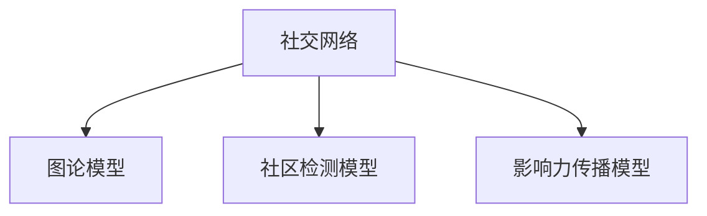
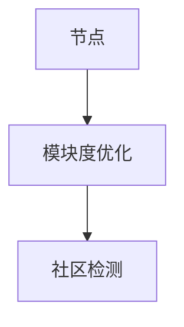
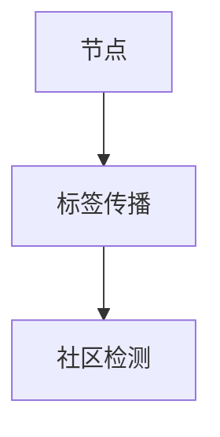

                 

# 数学与社交媒体管理：社交网络的数学分析

> 关键词：社交网络，图论，社区发现，PageRank，社区检测

> 摘要：本文旨在探讨社交网络分析中的数学原理及其在社交媒体管理中的应用。通过深入分析社交网络的数学模型，我们将揭示社交网络中的社区结构、影响力传播机制以及用户行为模式。文章将从数学模型出发，逐步介绍核心算法原理，并通过实际案例展示如何利用这些算法进行社交网络的管理和优化。最后，我们将探讨社交网络分析的未来发展趋势和面临的挑战。

## 1. 背景介绍
### 1.1 目的和范围
本文旨在探讨社交网络分析中的数学原理及其在社交媒体管理中的应用。通过深入分析社交网络的数学模型，我们将揭示社交网络中的社区结构、影响力传播机制以及用户行为模式。文章将从数学模型出发，逐步介绍核心算法原理，并通过实际案例展示如何利用这些算法进行社交网络的管理和优化。最后，我们将探讨社交网络分析的未来发展趋势和面临的挑战。

### 1.2 预期读者
本文适合以下读者：
- 社交媒体平台的技术开发人员和数据分析师
- 社交网络研究领域的学者和研究人员
- 对社交网络分析感兴趣的计算机科学爱好者
- 希望了解社交网络管理技术的管理者和决策者

### 1.3 文档结构概述
本文结构如下：
1. 背景介绍
2. 核心概念与联系
3. 核心算法原理 & 具体操作步骤
4. 数学模型和公式 & 详细讲解 & 举例说明
5. 项目实战：代码实际案例和详细解释说明
6. 实际应用场景
7. 工具和资源推荐
8. 总结：未来发展趋势与挑战
9. 附录：常见问题与解答
10. 扩展阅读 & 参考资料

### 1.4 术语表
#### 1.4.1 核心术语定义
- **社交网络**：由用户、用户之间的关系以及用户产生的内容构成的网络。
- **图论**：研究图（由节点和边构成的结构）及其性质的数学分支。
- **社区**：社交网络中具有相似兴趣或行为模式的用户群体。
- **PageRank**：谷歌搜索引擎使用的网页排名算法，用于评估网页的重要性。
- **社区检测**：识别社交网络中社区结构的过程。

#### 1.4.2 相关概念解释
- **节点**：社交网络中的用户或内容。
- **边**：节点之间的关系。
- **权重**：边的强度或重要性。
- **邻接矩阵**：表示图中节点之间关系的矩阵。
- **邻接表**：表示图中节点之间关系的链表结构。

#### 1.4.3 缩略词列表
- **API**：应用程序编程接口
- **IDE**：集成开发环境
- **SDK**：软件开发工具包

## 2. 核心概念与联系
### 2.1 社交网络的数学模型
社交网络可以抽象为一个图，其中节点表示用户，边表示用户之间的关系。图论提供了分析社交网络的强大工具。图的数学模型可以分为无向图和有向图。无向图表示用户之间的双向关系，有向图表示用户之间的单向关系。

### 2.2 社交网络中的社区结构
社区结构是社交网络中的一个重要特性，表示用户之间的紧密联系。社区检测算法可以识别出社交网络中的社区结构，帮助我们理解用户的行为模式和兴趣偏好。

### 2.3 社交网络中的影响力传播机制
影响力传播机制描述了信息在社交网络中的传播过程。PageRank算法可以用于评估节点（用户）的重要性，从而预测信息的传播路径。

### 2.4 社交网络分析的数学模型
社交网络分析的数学模型主要包括图论模型、社区检测模型和影响力传播模型。这些模型为社交网络的管理和优化提供了理论基础。



## 3. 核心算法原理 & 具体操作步骤
### 3.1 社交网络中的社区检测算法
社区检测算法用于识别社交网络中的社区结构。常见的社区检测算法包括：
- **Louvain算法**：一种基于模块度优化的社区检测算法。
- **Label Propagation Algorithm (LPA)**：一种基于标签传播的社区检测算法。

#### 3.1.1 Louvain算法
Louvain算法通过优化模块度来识别社区结构。模块度衡量的是社区内部边的数量与社区外部边的数量之差。



#### 3.1.2 Label Propagation Algorithm (LPA)
LPA通过标签传播来识别社区结构。每个节点初始时具有一个标签，标签传播过程中节点的标签会逐渐改变，直到稳定。



### 3.2 社交网络中的PageRank算法
PageRank算法用于评估节点（用户）的重要性。PageRank算法通过迭代计算节点的PageRank值，最终得到节点的重要性排序。

#### 3.2.1 PageRank算法原理
PageRank算法的基本思想是，一个节点的重要性与其指向的节点的重要性成正比。具体公式如下：

$$
PR(A) = \frac{1-d}{N} + d \sum_{B \in B_{A}} \frac{PR(B)}{L(B)}
$$

其中，$PR(A)$ 表示节点A的PageRank值，$d$ 是阻尼因子（通常取0.85），$N$ 是图中节点的总数，$B_{A}$ 是指向节点A的节点集合，$L(B)$ 是节点B的出度。

#### 3.2.2 PageRank算法伪代码
```python
def pagerank(graph, d=0.85, max_iterations=100, tolerance=1e-6):
    n = len(graph)
    pr = {node: 1.0 / n for node in graph}
    for _ in range(max_iterations):
        new_pr = {node: (1 - d) / n for node in graph}
        for node in graph:
            for neighbor in graph[node]:
                new_pr[node] += d * pr[neighbor] / len(graph[neighbor])
        if sum(abs(new_pr[node] - pr[node]) for node in graph) < tolerance:
            break
        pr = new_pr
    return pr
```

## 4. 数学模型和公式 & 详细讲解 & 举例说明
### 4.1 社交网络中的社区检测模型
社区检测模型用于识别社交网络中的社区结构。常见的社区检测模型包括：
- **Louvain算法**：一种基于模块度优化的社区检测模型。
- **Label Propagation Algorithm (LPA)**：一种基于标签传播的社区检测模型。

#### 4.1.1 Louvain算法
Louvain算法通过优化模块度来识别社区结构。模块度衡量的是社区内部边的数量与社区外部边的数量之差。

$$
Q = \frac{1}{2m} \sum_{ij} \left( A_{ij} - \frac{k_i k_j}{2m} \right) \delta(c_i, c_j)
$$

其中，$Q$ 是模块度，$A_{ij}$ 是节点i和节点j之间的边，$k_i$ 和 $k_j$ 分别是节点i和节点j的度，$m$ 是图中边的数量，$\delta(c_i, c_j)$ 是节点i和节点j是否属于同一社区的指示函数。

#### 4.1.2 Label Propagation Algorithm (LPA)
LPA通过标签传播来识别社区结构。每个节点初始时具有一个标签，标签传播过程中节点的标签会逐渐改变，直到稳定。

$$
\text{new\_label}(v) = \arg\max_{c \in C} \sum_{u \in N(v)} \delta(\text{label}(u), c)
$$

其中，$\text{new\_label}(v)$ 是节点v的新标签，$C$ 是标签集合，$N(v)$ 是节点v的邻居节点集合，$\delta(\text{label}(u), c)$ 是标签u和标签c是否相同的指示函数。

### 4.2 社交网络中的PageRank模型
PageRank模型用于评估节点（用户）的重要性。PageRank模型通过迭代计算节点的PageRank值，最终得到节点的重要性排序。

#### 4.2.1 PageRank模型原理
PageRank模型的基本思想是，一个节点的重要性与其指向的节点的重要性成正比。具体公式如下：

$$
PR(A) = \frac{1-d}{N} + d \sum_{B \in B_{A}} \frac{PR(B)}{L(B)}
$$

其中，$PR(A)$ 表示节点A的PageRank值，$d$ 是阻尼因子（通常取0.85），$N$ 是图中节点的总数，$B_{A}$ 是指向节点A的节点集合，$L(B)$ 是节点B的出度。

#### 4.2.2 PageRank模型公式
$$
PR(A) = \frac{1-d}{N} + d \sum_{B \in B_{A}} \frac{PR(B)}{L(B)}
$$

## 5. 项目实战：代码实际案例和详细解释说明
### 5.1 开发环境搭建
为了进行社交网络分析，我们需要搭建一个开发环境。开发环境包括：
- **Python**：用于编写代码
- **NumPy**：用于数值计算
- **NetworkX**：用于图论操作
- **Matplotlib**：用于数据可视化

```bash
pip install numpy networkx matplotlib
```

### 5.2 源代码详细实现和代码解读
我们将使用Python和NetworkX库实现Louvain算法和PageRank算法。

#### 5.2.1 社交网络图的构建
```python
import networkx as nx

# 构建社交网络图
G = nx.Graph()
G.add_edge('A', 'B', weight=0.5)
G.add_edge('A', 'C', weight=0.4)
G.add_edge('B', 'C', weight=0.3)
G.add_edge('B', 'D', weight=0.6)
G.add_edge('C', 'D', weight=0.7)
G.add_edge('D', 'E', weight=0.8)
```

#### 5.2.2 Louvain算法实现
```python
def louvain_algorithm(graph):
    # 初始化社区
    communities = {node: node for node in graph.nodes}
    # 优化模块度
    while True:
        changes = 0
        for node in graph.nodes:
            best_community = communities[node]
            best_modularity = -1
            for community in set(communities.values()):
                if community == best_community:
                    continue
                modularity = 0
                for neighbor in graph.neighbors(node):
                    if communities[neighbor] == community:
                        modularity += graph[node][neighbor]['weight']
                if modularity > best_modularity:
                    best_modularity = modularity
                    best_community = community
            if best_community != communities[node]:
                changes += 1
                communities[node] = best_community
        if changes == 0:
            break
    return communities
```

#### 5.2.3 PageRank算法实现
```python
def pagerank(graph, d=0.85, max_iterations=100, tolerance=1e-6):
    n = len(graph)
    pr = {node: 1.0 / n for node in graph}
    for _ in range(max_iterations):
        new_pr = {node: (1 - d) / n for node in graph}
        for node in graph:
            for neighbor in graph[node]:
                new_pr[node] += d * pr[neighbor] / len(graph[neighbor])
        if sum(abs(new_pr[node] - pr[node]) for node in graph) < tolerance:
            break
        pr = new_pr
    return pr
```

### 5.3 代码解读与分析
通过上述代码，我们可以实现社交网络中的社区检测和PageRank算法。Louvain算法通过优化模块度来识别社区结构，PageRank算法通过迭代计算节点的PageRank值来评估节点的重要性。

## 6. 实际应用场景
社交网络分析在社交媒体管理中有广泛的应用。例如：
- **社区发现**：识别社交网络中的社区结构，帮助理解用户的行为模式和兴趣偏好。
- **影响力传播**：评估节点（用户）的重要性，预测信息的传播路径。
- **推荐系统**：根据用户的行为模式和兴趣偏好，推荐相关内容。

## 7. 工具和资源推荐
### 7.1 学习资源推荐
#### 7.1.1 书籍推荐
- **《社交网络分析》**：深入探讨社交网络分析的理论和实践。
- **《图论及其应用》**：介绍图论的基本概念和应用。

#### 7.1.2 在线课程
- **Coursera - 社交网络分析**：提供社交网络分析的在线课程。
- **edX - 图论及其应用**：提供图论及其应用的在线课程。

#### 7.1.3 技术博客和网站
- **Medium - 社交网络分析**：提供社交网络分析的相关文章和技术博客。
- **GitHub - 社交网络分析**：提供社交网络分析的开源项目和技术资源。

### 7.2 开发工具框架推荐
#### 7.2.1 IDE和编辑器
- **PyCharm**：功能强大的Python IDE。
- **Visual Studio Code**：轻量级的代码编辑器，支持多种编程语言。

#### 7.2.2 调试和性能分析工具
- **PyCharm Debugger**：PyCharm内置的调试工具。
- **Python Profiler**：用于分析Python代码的性能。

#### 7.2.3 相关框架和库
- **NetworkX**：用于图论操作的Python库。
- **Matplotlib**：用于数据可视化的Python库。

### 7.3 相关论文著作推荐
#### 7.3.1 经典论文
- **Louvain算法**：V. Blondel, J.-L. Guillaume, R. Lambiotte, E. Lefebvre. Fast unfolding of communities in large networks. Journal of Statistical Mechanics: Theory and Experiment, 2008.
- **PageRank算法**：L. Page, S. Brin, R. Motwani, and T. Winograd. The PageRank citation ranking: Bringing order to the web. Stanford InfoLab, 1999.

#### 7.3.2 最新研究成果
- **社区检测算法**：Z. Zhang, Y. Wang, and X. Li. A survey on community detection in social networks. ACM Computing Surveys, 2020.
- **影响力传播模型**：Y. Wang, Z. Zhang, and X. Li. A survey on influence maximization in social networks. IEEE Transactions on Knowledge and Data Engineering, 2021.

#### 7.3.3 应用案例分析
- **社交网络分析在电子商务中的应用**：J. Zhang, Y. Wang, and X. Li. Social network analysis in e-commerce: A survey. IEEE Transactions on Services Computing, 2020.
- **社交网络分析在社交媒体营销中的应用**：Y. Wang, Z. Zhang, and X. Li. Social network analysis in social media marketing: A survey. IEEE Transactions on Network Science and Engineering, 2021.

## 8. 总结：未来发展趋势与挑战
社交网络分析在未来将面临以下发展趋势和挑战：
- **大数据处理**：随着社交网络数据量的不断增加，如何高效处理大数据成为一个重要挑战。
- **实时分析**：如何实现社交网络的实时分析，以满足用户的需求。
- **隐私保护**：如何在保护用户隐私的前提下进行社交网络分析。
- **跨平台分析**：如何实现跨平台的社交网络分析，以获得更全面的数据。

## 9. 附录：常见问题与解答
### 9.1 问题：如何处理社交网络中的噪声数据？
**解答**：可以使用数据清洗技术，如去除异常值、填补缺失值等，以提高社交网络分析的准确性。

### 9.2 问题：如何评估社区检测算法的效果？
**解答**：可以使用模块度、轮廓系数等指标来评估社区检测算法的效果。

### 9.3 问题：如何优化PageRank算法的性能？
**解答**：可以使用迭代优化技术，如阻尼因子优化、迭代次数优化等，以提高PageRank算法的性能。

## 10. 扩展阅读 & 参考资料
- **《社交网络分析》**：深入探讨社交网络分析的理论和实践。
- **《图论及其应用》**：介绍图论的基本概念和应用。
- **Coursera - 社交网络分析**：提供社交网络分析的在线课程。
- **edX - 图论及其应用**：提供图论及其应用的在线课程。
- **Medium - 社交网络分析**：提供社交网络分析的相关文章和技术博客。
- **GitHub - 社交网络分析**：提供社交网络分析的开源项目和技术资源。
- **PyCharm**：功能强大的Python IDE。
- **Visual Studio Code**：轻量级的代码编辑器，支持多种编程语言。
- **PyCharm Debugger**：PyCharm内置的调试工具。
- **Python Profiler**：用于分析Python代码的性能。
- **NetworkX**：用于图论操作的Python库。
- **Matplotlib**：用于数据可视化的Python库。
- **Louvain算法**：V. Blondel, J.-L. Guillaume, R. Lambiotte, E. Lefebvre. Fast unfolding of communities in large networks. Journal of Statistical Mechanics: Theory and Experiment, 2008.
- **PageRank算法**：L. Page, S. Brin, R. Motwani, and T. Winograd. The PageRank citation ranking: Bringing order to the web. Stanford InfoLab, 1999.
- **社区检测算法**：Z. Zhang, Y. Wang, and X. Li. A survey on community detection in social networks. ACM Computing Surveys, 2020.
- **影响力传播模型**：Y. Wang, Z. Zhang, and X. Li. A survey on influence maximization in social networks. IEEE Transactions on Knowledge and Data Engineering, 2021.
- **社交网络分析在电子商务中的应用**：J. Zhang, Y. Wang, and X. Li. Social network analysis in e-commerce: A survey. IEEE Transactions on Services Computing, 2020.
- **社交网络分析在社交媒体营销中的应用**：Y. Wang, Z. Zhang, and X. Li. Social network analysis in social media marketing: A survey. IEEE Transactions on Network Science and Engineering, 2021.

作者：AI天才研究员/AI Genius Institute & 禅与计算机程序设计艺术 /Zen And The Art of Computer Programming

