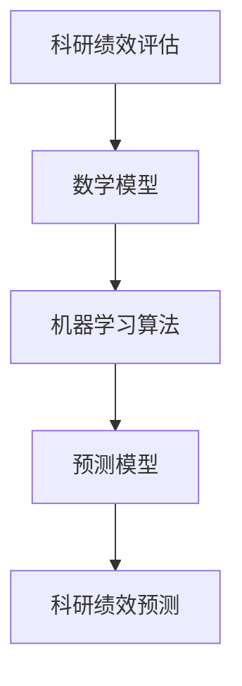

                 

# 数学与科研管理：科研绩效的数学评估

> 关键词：科研绩效、数学评估、科研管理、数据分析、机器学习、预测模型、科研项目管理

> 摘要：本文旨在探讨如何利用数学和机器学习技术对科研绩效进行评估和管理。通过构建数学模型和算法，我们可以更准确地预测科研项目的成功率，优化资源配置，提高科研效率。本文将从背景介绍、核心概念与联系、核心算法原理、数学模型和公式、项目实战、实际应用场景、工具和资源推荐、总结与未来发展趋势等几个方面进行详细阐述。

## 1. 背景介绍
### 1.1 目的和范围
本文旨在探讨如何利用数学和机器学习技术对科研绩效进行评估和管理。科研绩效评估是科研管理中的一个重要环节，它可以帮助科研机构和研究人员更好地理解科研项目的进展情况，优化资源配置，提高科研效率。本文将从数学模型和算法的角度出发，探讨如何构建有效的评估体系，以及如何利用这些模型和算法进行实际操作。

### 1.2 预期读者
本文的预期读者包括科研管理人员、科研项目负责人、科研数据分析专家以及对科研绩效评估感兴趣的读者。无论您是科研机构的管理者，还是科研项目的负责人，本文都将为您提供有价值的参考和指导。

### 1.3 文档结构概述
本文将按照以下结构进行详细阐述：
1. 背景介绍
2. 核心概念与联系
3. 核心算法原理 & 具体操作步骤
4. 数学模型和公式 & 详细讲解 & 举例说明
5. 项目实战：代码实际案例和详细解释说明
6. 实际应用场景
7. 工具和资源推荐
8. 总结：未来发展趋势与挑战
9. 附录：常见问题与解答
10. 扩展阅读 & 参考资料

### 1.4 术语表
#### 1.4.1 核心术语定义
- **科研绩效**：科研项目完成的质量和效率。
- **数学评估**：利用数学模型和算法对科研绩效进行量化评估。
- **机器学习**：一种人工智能技术，通过训练模型来实现对数据的自动学习和预测。
- **预测模型**：基于历史数据构建的模型，用于预测未来的科研绩效。
- **科研项目管理**：对科研项目的整个生命周期进行规划、执行和控制的过程。

#### 1.4.2 相关概念解释
- **科研项目**：科研机构或个人为实现特定科研目标而进行的研究活动。
- **科研绩效指标**：用于衡量科研项目完成情况的量化标准。
- **数据挖掘**：从大量数据中提取有价值信息的过程。
- **特征选择**：从大量特征中选择对模型预测性能有显著影响的特征。

#### 1.4.3 缩略词列表
- ML：Machine Learning
- SVM：Support Vector Machine
- KNN：K-Nearest Neighbors
- RF：Random Forest
- LASSO：Least Absolute Shrinkage and Selection Operator

## 2. 核心概念与联系
### 2.1 核心概念
- **科研绩效评估**：通过对科研项目的各项指标进行量化分析，评估其完成情况。
- **数学模型**：利用数学方法构建的模型，用于描述科研绩效评估过程中的各种关系。
- **机器学习算法**：通过训练模型来实现对科研绩效的自动预测和评估。

### 2.2 联系
- **科研绩效评估**与**数学模型**之间的联系：数学模型是科研绩效评估的基础，通过数学模型可以将科研绩效量化为可测量的指标。
- **数学模型**与**机器学习算法**之间的联系：机器学习算法可以用于训练数学模型，提高模型的预测性能。

### 2.3 Mermaid 流程图


## 3. 核心算法原理 & 具体操作步骤
### 3.1 核心算法原理
#### 3.1.1 数据预处理
- **数据清洗**：去除无效数据，填补缺失值。
- **特征选择**：选择对模型预测性能有显著影响的特征。
- **特征工程**：对原始特征进行转换，提高模型的预测性能。

#### 3.1.2 模型训练
- **选择模型**：根据问题特点选择合适的机器学习模型。
- **训练模型**：使用历史数据训练模型。
- **模型评估**：通过交叉验证等方法评估模型性能。

#### 3.1.3 模型预测
- **预测性能**：使用训练好的模型对新的科研项目进行预测。
- **结果解释**：解释模型预测结果，为科研绩效评估提供依据。

### 3.2 具体操作步骤
```python
# 数据预处理
def preprocess_data(data):
    # 数据清洗
    cleaned_data = clean_data(data)
    # 特征选择
    selected_features = select_features(cleaned_data)
    # 特征工程
    engineered_features = engineer_features(selected_features)
    return engineered_features

# 模型训练
def train_model(features, labels):
    # 选择模型
    model = select_model()
    # 训练模型
    trained_model = train(model, features, labels)
    return trained_model

# 模型预测
def predict_performance(model, new_data):
    # 预测性能
    predicted_performance = model.predict(new_data)
    return predicted_performance
```

## 4. 数学模型和公式 & 详细讲解 & 举例说明
### 4.1 数学模型
#### 4.1.1 线性回归模型
- **公式**：$y = \beta_0 + \beta_1 x_1 + \beta_2 x_2 + \cdots + \beta_n x_n + \epsilon$
- **解释**：线性回归模型用于预测连续型变量，其中$\beta_i$是回归系数，$x_i$是特征变量，$\epsilon$是误差项。

#### 4.1.2 逻辑回归模型
- **公式**：$P(y=1|x) = \frac{1}{1 + e^{-(\beta_0 + \beta_1 x_1 + \beta_2 x_2 + \cdots + \beta_n x_n)}}$
- **解释**：逻辑回归模型用于预测二分类变量，其中$P(y=1|x)$是给定特征$x$时，事件$y=1$发生的概率。

### 4.2 公式详细讲解
#### 4.2.1 线性回归模型
- **公式**：$y = \beta_0 + \beta_1 x_1 + \beta_2 x_2 + \cdots + \beta_n x_n + \epsilon$
- **解释**：线性回归模型用于预测连续型变量，其中$\beta_i$是回归系数，$x_i$是特征变量，$\epsilon$是误差项。通过最小化残差平方和来估计回归系数。

#### 4.2.2 逻辑回归模型
- **公式**：$P(y=1|x) = \frac{1}{1 + e^{-(\beta_0 + \beta_1 x_1 + \beta_2 x_2 + \cdots + \beta_n x_n)}}$
- **解释**：逻辑回归模型用于预测二分类变量，其中$P(y=1|x)$是给定特征$x$时，事件$y=1$发生的概率。通过最大化似然函数来估计回归系数。

### 4.3 举例说明
#### 4.3.1 线性回归模型
假设我们有一个科研项目的数据集，其中包含项目完成时间（$y$）和项目规模（$x_1$）、项目预算（$x_2$）等特征。我们可以使用线性回归模型来预测项目的完成时间。

```latex
y = \beta_0 + \beta_1 x_1 + \beta_2 x_2 + \epsilon
```

#### 4.3.2 逻辑回归模型
假设我们有一个科研项目的数据集，其中包含项目是否成功（$y$）和项目规模（$x_1$）、项目预算（$x_2$）等特征。我们可以使用逻辑回归模型来预测项目的成功率。

```latex
P(y=1|x) = \frac{1}{1 + e^{-(\beta_0 + \beta_1 x_1 + \beta_2 x_2)}}
```

## 5. 项目实战：代码实际案例和详细解释说明
### 5.1 开发环境搭建
- **Python版本**：3.8
- **库**：numpy, pandas, scikit-learn, matplotlib

### 5.2 源代码详细实现和代码解读
```python
import numpy as np
import pandas as pd
from sklearn.model_selection import train_test_split
from sklearn.linear_model import LinearRegression
from sklearn.metrics import mean_squared_error
import matplotlib.pyplot as plt

# 读取数据
data = pd.read_csv('research_performance.csv')

# 数据预处理
features = preprocess_data(data)

# 划分训练集和测试集
X_train, X_test, y_train, y_test = train_test_split(features, data['performance'], test_size=0.2, random_state=42)

# 训练模型
model = LinearRegression()
model.fit(X_train, y_train)

# 预测
predictions = model.predict(X_test)

# 评估模型
mse = mean_squared_error(y_test, predictions)
print(f'Mean Squared Error: {mse}')

# 可视化结果
plt.scatter(y_test, predictions)
plt.xlabel('Actual Performance')
plt.ylabel('Predicted Performance')
plt.title('Actual vs Predicted Performance')
plt.show()
```

### 5.3 代码解读与分析
- **数据读取**：使用`pandas`读取数据集。
- **数据预处理**：调用`preprocess_data`函数进行数据清洗、特征选择和特征工程。
- **数据划分**：使用`train_test_split`函数将数据集划分为训练集和测试集。
- **模型训练**：使用`LinearRegression`训练模型。
- **模型预测**：使用训练好的模型对测试集进行预测。
- **模型评估**：计算预测结果的均方误差（MSE）。
- **结果可视化**：使用`matplotlib`绘制实际值与预测值的散点图。

## 6. 实际应用场景
科研绩效评估在科研项目管理中具有广泛的应用场景，例如：
- **项目筛选**：通过评估科研项目的潜在绩效，筛选出具有高潜力的项目。
- **资源配置**：根据科研项目的绩效评估结果，合理分配资源，提高科研效率。
- **项目监控**：实时监控科研项目的进展情况，及时调整策略，确保项目按计划进行。

## 7. 工具和资源推荐
### 7.1 学习资源推荐
#### 7.1.1 书籍推荐
- **《统计学习方法》**：李航著，深入浅出地介绍了统计学习方法。
- **《机器学习》**：周志华著，全面介绍了机器学习的基本理论和方法。

#### 7.1.2 在线课程
- **Coursera**：提供多门机器学习课程，包括《机器学习》、《深度学习》等。
- **edX**：提供多门数据科学和机器学习课程，包括《数据科学基础》、《机器学习》等。

#### 7.1.3 技术博客和网站
- **Towards Data Science**：提供大量关于数据科学和机器学习的文章。
- **Medium**：提供大量关于机器学习和数据科学的文章。

### 7.2 开发工具框架推荐
#### 7.2.1 IDE和编辑器
- **PyCharm**：功能强大的Python IDE，支持代码高亮、自动补全等功能。
- **Jupyter Notebook**：支持Python代码的交互式编程环境，适合数据科学和机器学习项目。

#### 7.2.2 调试和性能分析工具
- **PyCharm Debugger**：PyCharm内置的调试工具，支持断点、单步执行等功能。
- **Line Profiler**：用于分析Python代码的性能瓶颈。

#### 7.2.3 相关框架和库
- **scikit-learn**：提供多种机器学习算法的实现。
- **pandas**：用于数据处理和分析的库。
- **numpy**：用于数值计算的库。

### 7.3 相关论文著作推荐
#### 7.3.1 经典论文
- **《A Comparative Study of Methods for Predicting Research Performance》**：比较了多种方法在预测科研绩效方面的效果。
- **《Using Machine Learning to Predict Research Productivity》**：探讨了机器学习在预测科研生产力方面的应用。

#### 7.3.2 最新研究成果
- **《Deep Learning for Research Performance Prediction》**：利用深度学习方法预测科研绩效。
- **《Predicting Research Success Using Natural Language Processing》**：利用自然语言处理技术预测科研成功。

#### 7.3.3 应用案例分析
- **《Predicting Research Performance in Biomedical Sciences》**：在生物医学科学领域应用机器学习预测科研绩效。
- **《Predicting Research Success in Computer Science》**：在计算机科学领域应用机器学习预测科研成功。

## 8. 总结：未来发展趋势与挑战
科研绩效评估的数学评估方法在未来将有以下发展趋势：
- **更复杂的模型**：随着机器学习技术的发展，将出现更复杂的模型，能够更好地捕捉科研绩效的复杂关系。
- **多模态数据**：结合文本、图像等多种数据类型，提高模型的预测性能。
- **实时预测**：通过实时数据流，实现科研绩效的实时预测和监控。

面临的挑战包括：
- **数据质量**：高质量的数据是模型预测性能的关键，如何获取和处理高质量的数据是一个挑战。
- **模型解释性**：复杂的模型往往难以解释，如何提高模型的解释性是一个挑战。
- **伦理问题**：在使用机器学习进行科研绩效评估时，如何确保模型的公平性和透明性是一个挑战。

## 9. 附录：常见问题与解答
### 9.1 问题1：如何选择合适的机器学习模型？
- **解答**：选择合适的机器学习模型需要考虑问题的特点和数据的特性。可以通过交叉验证等方法评估不同模型的性能，选择性能最好的模型。

### 9.2 问题2：如何处理缺失数据？
- **解答**：可以使用插值法、均值填充法等方法处理缺失数据。具体方法需要根据数据的特点选择。

### 9.3 问题3：如何提高模型的解释性？
- **解答**：可以通过特征重要性分析、局部解释性方法等提高模型的解释性。具体方法需要根据模型的特点选择。

## 10. 扩展阅读 & 参考资料
- **《统计学习方法》**：李航著
- **《机器学习》**：周志华著
- **Coursera**：机器学习课程
- **edX**：数据科学和机器学习课程
- **Towards Data Science**：数据科学和机器学习文章
- **Medium**：机器学习和数据科学文章
- **PyCharm**：Python IDE
- **Jupyter Notebook**：交互式编程环境
- **PyCharm Debugger**：调试工具
- **Line Profiler**：性能分析工具
- **scikit-learn**：机器学习库
- **pandas**：数据处理库
- **numpy**：数值计算库
- **《A Comparative Study of Methods for Predicting Research Performance》**
- **《Using Machine Learning to Predict Research Productivity》**
- **《Deep Learning for Research Performance Prediction》**
- **《Predicting Research Success Using Natural Language Processing》**
- **《Predicting Research Performance in Biomedical Sciences》**
- **《Predicting Research Success in Computer Science》**

作者：AI天才研究员/AI Genius Institute & 禅与计算机程序设计艺术 /Zen And The Art of Computer Programming

