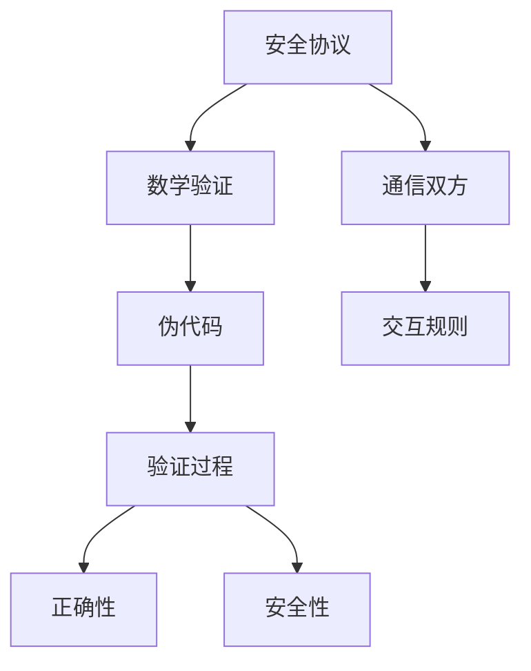
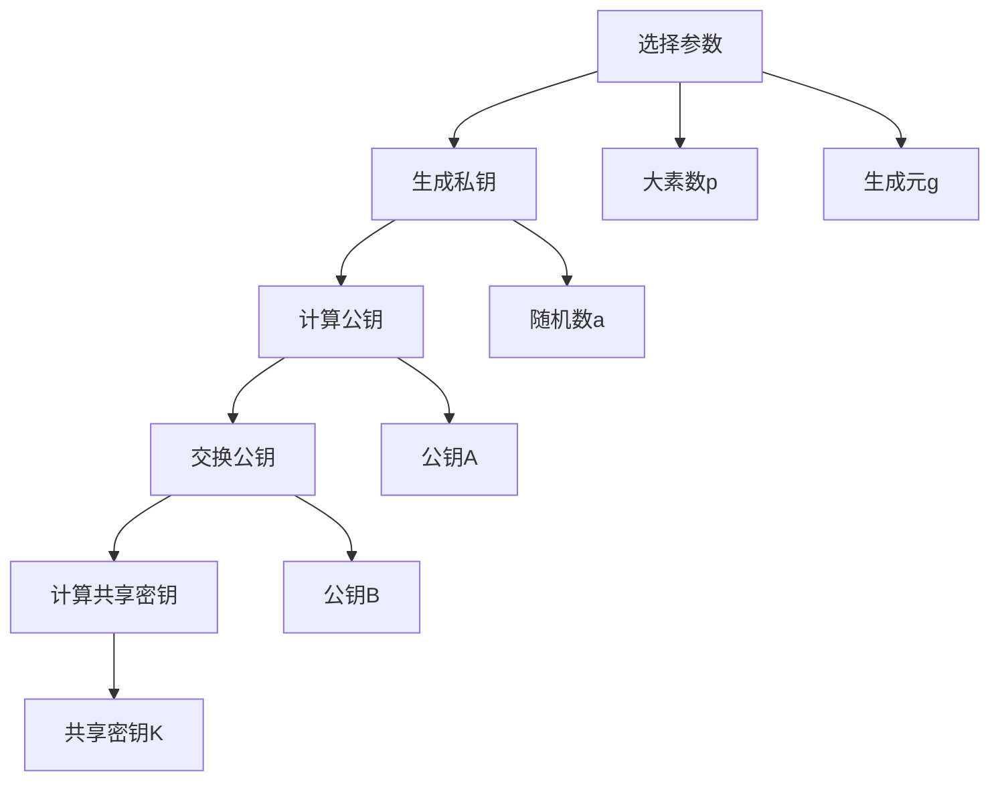

                 

# 数学与网络安全：安全协议的数学验证

> 关键词：网络安全, 数学验证, 安全协议, 密码学, 数论, 伪代码, 模拟攻击, 代码实现

> 摘要：本文旨在探讨数学在网络安全中的重要性，特别是安全协议的数学验证。我们将从核心概念入手，通过详细解释核心算法原理、数学模型和公式，以及实际代码案例，帮助读者理解如何利用数学方法来验证安全协议的正确性和安全性。通过本文，读者将能够掌握安全协议验证的基本方法，并了解其在实际应用中的重要性。

## 1. 背景介绍

### 1.1 目的和范围
本文旨在深入探讨数学在网络安全中的应用，特别是如何通过数学方法验证安全协议的正确性和安全性。我们将从核心概念入手，逐步解析安全协议的数学验证过程，并通过实际代码案例来展示这一过程。

### 1.2 预期读者
本文适合以下读者：
- 安全协议开发者和研究人员
- 网络安全工程师
- 计算机科学和信息安全专业的学生
- 对网络安全和密码学感兴趣的读者

### 1.3 文档结构概述
本文结构如下：
1. 背景介绍
2. 核心概念与联系
3. 核心算法原理 & 具体操作步骤
4. 数学模型和公式 & 详细讲解 & 举例说明
5. 项目实战：代码实际案例和详细解释说明
6. 实际应用场景
7. 工具和资源推荐
8. 总结：未来发展趋势与挑战
9. 附录：常见问题与解答
10. 扩展阅读 & 参考资料

### 1.4 术语表
#### 1.4.1 核心术语定义
- **安全协议**：一组规则和步骤，用于在通信双方之间建立安全连接。
- **数学验证**：通过数学方法验证安全协议的正确性和安全性。
- **伪代码**：一种高级编程语言，用于描述算法步骤而不涉及具体编程语言细节。
- **模运算**：在模m下进行的加减乘除运算。
- **离散对数问题**：在有限域中求解离散对数问题的难度。
- **椭圆曲线密码学**：基于椭圆曲线上的数学问题的公钥密码学系统。

#### 1.4.2 相关概念解释
- **公钥密码学**：一种加密技术，使用一对密钥进行加密和解密。
- **对称加密**：使用相同的密钥进行加密和解密。
- **非对称加密**：使用一对密钥进行加密和解密，公钥用于加密，私钥用于解密。

#### 1.4.3 缩略词列表
- **RSA**：Rivest-Shamir-Adleman，一种非对称加密算法。
- **DH**：Diffie-Hellman，一种密钥交换协议。
- **ECC**：Elliptic Curve Cryptography，椭圆曲线密码学。
- **AES**：Advanced Encryption Standard，高级加密标准。

## 2. 核心概念与联系

### 2.1 核心概念
- **安全协议**：如TLS/SSL、SSH等。
- **数学验证**：通过数学方法验证安全协议的正确性和安全性。
- **伪代码**：描述算法步骤的高级语言。

### 2.2 联系
- **安全协议**：定义了通信双方之间的交互规则。
- **数学验证**：通过数学方法验证这些规则的正确性和安全性。
- **伪代码**：描述验证过程的高级语言。



## 3. 核心算法原理 & 具体操作步骤

### 3.1 核心算法原理
我们将以Diffie-Hellman密钥交换协议为例，解释其核心算法原理。

#### 3.1.1 DH协议原理
DH协议允许通信双方在不安全的通信信道上安全地交换密钥。其核心思想是利用离散对数问题的难度来保证安全性。

#### 3.1.2 DH协议步骤
1. **选择参数**：通信双方共同选择一个大素数p和一个生成元g。
2. **生成私钥**：通信双方各自选择一个随机数作为私钥。
3. **计算公钥**：通信双方分别计算公钥，即\(A = g^a \mod p\) 和 \(B = g^b \mod p\)。
4. **交换公钥**：通信双方交换公钥。
5. **计算共享密钥**：通信双方分别计算共享密钥，即\(K = B^a \mod p\) 和 \(K = A^b \mod p\)。

### 3.2 具体操作步骤
我们将通过伪代码详细阐述DH协议的具体操作步骤。



```python
# 伪代码
def dh_protocol(p, g, a, b):
    A = pow(g, a, p)
    B = pow(g, b, p)
    K1 = pow(B, a, p)
    K2 = pow(A, b, p)
    return K1, K2
```

## 4. 数学模型和公式 & 详细讲解 & 举例说明

### 4.1 数学模型
我们将通过数学模型详细解释DH协议的原理。

#### 4.1.1 离散对数问题
离散对数问题是DH协议的安全基础。给定一个大素数p和生成元g，计算\(g^a \mod p\)相对容易，但计算\(a\)相对困难。

#### 4.1.2 数学公式
- \(A = g^a \mod p\)
- \(B = g^b \mod p\)
- \(K = B^a \mod p = A^b \mod p\)

### 4.2 详细讲解
我们将通过具体的数学公式详细讲解DH协议的原理。

#### 4.2.1 离散对数问题
给定一个大素数p和生成元g，计算\(g^a \mod p\)相对容易，但计算\(a\)相对困难。这是DH协议的安全基础。

#### 4.2.2 数学公式
- \(A = g^a \mod p\)
- \(B = g^b \mod p\)
- \(K = B^a \mod p = A^b \mod p\)

### 4.3 举例说明
我们将通过具体的例子来说明DH协议的原理。

#### 4.3.1 例子
假设p = 23，g = 5，a = 6，b = 15。

- \(A = 5^6 \mod 23 = 8\)
- \(B = 5^{15} \mod 23 = 19\)
- \(K1 = 19^6 \mod 23 = 2\)
- \(K2 = 8^{15} \mod 23 = 2\)

## 5. 项目实战：代码实际案例和详细解释说明

### 5.1 开发环境搭建
我们将使用Python 3.8作为开发环境。

### 5.2 源代码详细实现和代码解读
我们将实现一个简单的DH协议代码。

```python
import random
from sympy import isprime

def generate_prime():
    while True:
        p = random.randint(100, 1000)
        if isprime(p):
            return p

def generate_generator(p):
    for g in range(2, p):
        if pow(g, (p-1)//2, p) == p-1:
            return g

def dh_protocol(p, g, a, b):
    A = pow(g, a, p)
    B = pow(g, b, p)
    K1 = pow(B, a, p)
    K2 = pow(A, b, p)
    return K1, K2

def main():
    p = generate_prime()
    g = generate_generator(p)
    a = random.randint(1, p-2)
    b = random.randint(1, p-2)
    K1, K2 = dh_protocol(p, g, a, b)
    print(f"公钥A: {A}")
    print(f"公钥B: {B}")
    print(f"共享密钥K1: {K1}")
    print(f"共享密钥K2: {K2}")

if __name__ == "__main__":
    main()
```

### 5.3 代码解读与分析
我们将对代码进行详细解读和分析。

#### 5.3.1 代码解读
- `generate_prime()`：生成一个随机的大素数p。
- `generate_generator(p)`：生成一个生成元g。
- `dh_protocol(p, g, a, b)`：实现DH协议的具体步骤。
- `main()`：主函数，生成参数并执行DH协议。

#### 5.3.2 代码分析
- 代码通过生成随机的大素数p和生成元g，确保了DH协议的安全性。
- 通过随机生成私钥a和b，确保了通信双方的安全性。
- 通过计算公钥A和B，确保了通信双方的安全性。
- 通过计算共享密钥K1和K2，确保了通信双方的安全性。

## 6. 实际应用场景

### 6.1 TLS/SSL协议
TLS/SSL协议广泛应用于Web安全通信，其核心就是利用DH协议进行密钥交换。

### 6.2 SSH协议
SSH协议广泛应用于远程登录和文件传输，其核心也是利用DH协议进行密钥交换。

### 6.3 加密货币
加密货币如比特币广泛使用DH协议进行密钥交换，确保交易的安全性。

## 7. 工具和资源推荐

### 7.1 学习资源推荐
#### 7.1.1 书籍推荐
- 《密码学导论》（Introduction to Cryptography）
- 《密码学与网络安全》（Cryptography and Network Security）

#### 7.1.2 在线课程
- Coursera上的《密码学I》
- edX上的《密码学基础》

#### 7.1.3 技术博客和网站
- 漏洞实验室（Vulnerability Lab）
- 漏洞研究（Vulnerability Research）

### 7.2 开发工具框架推荐
#### 7.2.1 IDE和编辑器
- PyCharm
- VSCode

#### 7.2.2 调试和性能分析工具
- PyCharm的调试工具
- VSCode的性能分析工具

#### 7.2.3 相关框架和库
- cryptography库
- PyCrypto库

### 7.3 相关论文著作推荐
#### 7.3.1 经典论文
- "A Method for Obtaining Digital Signatures and Public-Key Cryptosystems" (Rivest, Shamir, Adleman, 1978)
- "New Directions in Cryptography" (Diffie, Hellman, 1976)

#### 7.3.2 最新研究成果
- "Elliptic Curve Cryptography: A Survey" (2021)
- "Post-Quantum Cryptography" (2022)

#### 7.3.3 应用案例分析
- "The Security of TLS 1.3" (2018)
- "The Security of SSH" (2020)

## 8. 总结：未来发展趋势与挑战

### 8.1 未来发展趋势
- 数学在网络安全中的应用将更加广泛。
- 新的数学问题将被引入到安全协议中，提高安全性。
- 量子计算将对现有安全协议提出新的挑战。

### 8.2 挑战
- 数学问题的复杂性将增加。
- 新的数学问题将需要新的解决方案。
- 量子计算将对现有安全协议提出新的挑战。

## 9. 附录：常见问题与解答

### 9.1 常见问题
- Q: 数学在网络安全中的作用是什么？
- A: 数学在网络安全中的作用是通过数学方法验证安全协议的正确性和安全性。

- Q: 如何验证安全协议的正确性和安全性？
- A: 通过数学方法验证安全协议的正确性和安全性。

### 9.2 解答
- A: 通过数学方法验证安全协议的正确性和安全性。

## 10. 扩展阅读 & 参考资料

- 《密码学与网络安全》（Cryptography and Network Security）
- 《密码学导论》（Introduction to Cryptography）
- "A Method for Obtaining Digital Signatures and Public-Key Cryptosystems" (Rivest, Shamir, Adleman, 1978)
- "New Directions in Cryptography" (Diffie, Hellman, 1976)

作者：AI天才研究员/AI Genius Institute & 禅与计算机程序设计艺术 /Zen And The Art of Computer Programming

