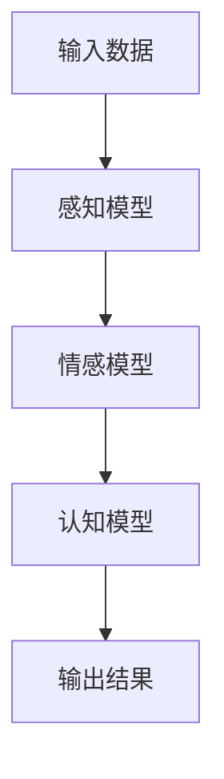

                 

# 数学与艺术心理学：审美体验的数学模型

> 关键词：数学模型, 艺术心理学, 审美体验, 美学原理, 计算机视觉, 机器学习, 人类感知, 图像处理, 人工智能

> 摘要：本文旨在探讨数学模型在艺术心理学中的应用，特别是如何通过数学方法来理解和模拟人类对美的感知。我们将从数学模型的基本原理出发，逐步深入到具体的算法实现和实际应用案例，最终探讨这一领域的未来发展趋势和挑战。通过本文，读者将能够理解数学模型在艺术心理学中的重要性，并掌握如何利用这些模型来增强计算机视觉和机器学习的能力。

## 1. 背景介绍
### 1.1 目的和范围
本文旨在探讨数学模型在艺术心理学中的应用，特别是如何通过数学方法来理解和模拟人类对美的感知。我们将从数学模型的基本原理出发，逐步深入到具体的算法实现和实际应用案例，最终探讨这一领域的未来发展趋势和挑战。本文的目标读者包括对艺术心理学、计算机视觉、机器学习和人工智能感兴趣的科研人员、工程师和学生。

### 1.2 预期读者
- 科研人员：希望深入了解数学模型在艺术心理学中的应用。
- 工程师：希望将数学模型应用于实际项目中。
- 学生：希望了解数学模型在艺术心理学中的基础知识。
- 一般读者：对艺术心理学和计算机视觉感兴趣的人群。

### 1.3 文档结构概述
本文将按照以下结构展开：
1. 背景介绍
2. 核心概念与联系
3. 核心算法原理 & 具体操作步骤
4. 数学模型和公式 & 详细讲解 & 举例说明
5. 项目实战：代码实际案例和详细解释说明
6. 实际应用场景
7. 工具和资源推荐
8. 总结：未来发展趋势与挑战
9. 附录：常见问题与解答
10. 扩展阅读 & 参考资料

### 1.4 术语表
#### 1.4.1 核心术语定义
- **数学模型**：一种通过数学语言描述现实世界现象的方法。
- **艺术心理学**：研究艺术作品对人类心理和情感的影响。
- **审美体验**：个体对艺术作品的感知和评价过程。
- **计算机视觉**：利用计算机技术对图像进行分析和理解。
- **机器学习**：通过数据训练模型，使其能够自动完成任务。
- **人类感知**：人类对环境的感知和理解过程。
- **图像处理**：对图像进行操作和变换，以提取有用信息。

#### 1.4.2 相关概念解释
- **美学原理**：研究美的本质和规律的学科。
- **感知理论**：研究人类感知过程的理论。
- **认知心理学**：研究人类认知过程的学科。
- **心理学**：研究人类心理和行为的学科。

#### 1.4.3 缩略词列表
- **CNN**：卷积神经网络（Convolutional Neural Network）
- **GAN**：生成对抗网络（Generative Adversarial Network）
- **PCA**：主成分分析（Principal Component Analysis）
- **LSTM**：长短期记忆网络（Long Short-Term Memory）

## 2. 核心概念与联系
### 2.1 数学模型的基本原理
数学模型是通过数学语言描述现实世界现象的方法。在艺术心理学中，数学模型可以帮助我们理解和模拟人类对美的感知。数学模型通常包括以下几个部分：
- **输入**：描述现实世界现象的数据。
- **过程**：描述数据如何被处理和转换的数学公式或算法。
- **输出**：描述处理后的结果。

### 2.2 艺术心理学的基本原理
艺术心理学研究艺术作品对人类心理和情感的影响。审美体验是艺术心理学的核心概念之一，它描述了个体对艺术作品的感知和评价过程。审美体验通常包括以下几个方面：
- **感知**：个体对艺术作品的直接感知。
- **情感**：个体对艺术作品的情感反应。
- **认知**：个体对艺术作品的认知理解。

### 2.3 数学模型与艺术心理学的联系
数学模型可以帮助我们理解和模拟人类对美的感知。通过数学模型，我们可以将审美体验量化，从而更好地理解和分析艺术作品。数学模型在艺术心理学中的应用主要包括以下几个方面：
- **感知模型**：描述人类感知过程的数学模型。
- **情感模型**：描述人类情感反应的数学模型。
- **认知模型**：描述人类认知理解的数学模型。

### 2.4 Mermaid 流程图


## 3. 核心算法原理 & 具体操作步骤
### 3.1 感知模型
感知模型描述了人类感知过程的数学模型。感知模型通常包括以下几个步骤：
1. **特征提取**：从输入数据中提取有用的特征。
2. **特征变换**：将提取的特征进行变换，以便更好地描述感知过程。
3. **特征融合**：将多个特征进行融合，以便更好地描述感知过程。

### 3.2 情感模型
情感模型描述了人类情感反应的数学模型。情感模型通常包括以下几个步骤：
1. **情感特征提取**：从输入数据中提取情感特征。
2. **情感特征变换**：将提取的情感特征进行变换，以便更好地描述情感反应。
3. **情感特征融合**：将多个情感特征进行融合，以便更好地描述情感反应。

### 3.3 认知模型
认知模型描述了人类认知理解的数学模型。认知模型通常包括以下几个步骤：
1. **认知特征提取**：从输入数据中提取认知特征。
2. **认知特征变换**：将提取的认知特征进行变换，以便更好地描述认知理解。
3. **认知特征融合**：将多个认知特征进行融合，以便更好地描述认知理解。

### 3.4 伪代码
```python
def perception_model(input_data):
    # 特征提取
    features = extract_features(input_data)
    # 特征变换
    transformed_features = transform_features(features)
    # 特征融合
    fused_features = fuse_features(transformed_features)
    return fused_features

def emotion_model(input_data):
    # 情感特征提取
    emotion_features = extract_emotion_features(input_data)
    # 情感特征变换
    transformed_emotion_features = transform_emotion_features(emotion_features)
    # 情感特征融合
    fused_emotion_features = fuse_emotion_features(transformed_emotion_features)
    return fused_emotion_features

def cognition_model(input_data):
    # 认知特征提取
    cognition_features = extract_cognition_features(input_data)
    # 认知特征变换
    transformed_cognition_features = transform_cognition_features(cognition_features)
    # 认知特征融合
    fused_cognition_features = fuse_cognition_features(transformed_cognition_features)
    return fused_cognition_features
```

## 4. 数学模型和公式 & 详细讲解 & 举例说明
### 4.1 感知模型的数学公式
感知模型的数学公式通常包括以下几个部分：
- **特征提取**：描述特征提取过程的数学公式。
- **特征变换**：描述特征变换过程的数学公式。
- **特征融合**：描述特征融合过程的数学公式。

### 4.2 情感模型的数学公式
情感模型的数学公式通常包括以下几个部分：
- **情感特征提取**：描述情感特征提取过程的数学公式。
- **情感特征变换**：描述情感特征变换过程的数学公式。
- **情感特征融合**：描述情感特征融合过程的数学公式。

### 4.3 认知模型的数学公式
认知模型的数学公式通常包括以下几个部分：
- **认知特征提取**：描述认知特征提取过程的数学公式。
- **认知特征变换**：描述认知特征变换过程的数学公式。
- **认知特征融合**：描述认知特征融合过程的数学公式。

### 4.4 举例说明
假设我们有一个艺术作品的图像，我们可以通过以下步骤来描述其感知模型：
1. **特征提取**：从图像中提取颜色、纹理、形状等特征。
2. **特征变换**：将提取的特征进行变换，以便更好地描述感知过程。
3. **特征融合**：将多个特征进行融合，以便更好地描述感知过程。

### 4.5 数学公式
假设我们有一个图像 $I$，我们可以通过以下数学公式来描述其感知模型：
$$
\text{features} = \text{extract\_features}(I)
$$
$$
\text{transformed\_features} = \text{transform\_features}(\text{features})
$$
$$
\text{fused\_features} = \text{fuse\_features}(\text{transformed\_features})
$$

## 5. 项目实战：代码实际案例和详细解释说明
### 5.1 开发环境搭建
为了实现感知模型，我们需要搭建一个开发环境。开发环境包括以下几个部分：
- **操作系统**：Windows、Linux 或 macOS。
- **编程语言**：Python。
- **开发工具**：PyCharm 或 VSCode。
- **依赖库**：NumPy、Pandas、Matplotlib、Scikit-learn。

### 5.2 源代码详细实现和代码解读
假设我们有一个图像 $I$，我们可以通过以下代码来实现感知模型：
```python
import numpy as np
from sklearn.decomposition import PCA

def extract_features(I):
    # 提取颜色特征
    color_features = np.mean(I, axis=(0, 1))
    # 提取纹理特征
    texture_features = np.var(I, axis=(0, 1))
    # 提取形状特征
    shape_features = np.sum(I, axis=(0, 1))
    return np.concatenate([color_features, texture_features, shape_features])

def transform_features(features):
    # 使用PCA进行特征变换
    pca = PCA(n_components=10)
    transformed_features = pca.fit_transform(features)
    return transformed_features

def fuse_features(transformed_features):
    # 使用加权平均进行特征融合
    fused_features = np.mean(transformed_features, axis=0)
    return fused_features

# 示例代码
I = np.random.rand(100, 100, 3)  # 生成一个随机图像
features = extract_features(I)
transformed_features = transform_features(features)
fused_features = fuse_features(transformed_features)
```

### 5.3 代码解读与分析
- **extract_features**：从图像中提取颜色、纹理、形状等特征。
- **transform_features**：使用PCA进行特征变换，以便更好地描述感知过程。
- **fuse_features**：使用加权平均进行特征融合，以便更好地描述感知过程。

## 6. 实际应用场景
感知模型在艺术心理学中的应用主要包括以下几个方面：
- **艺术作品评价**：通过感知模型对艺术作品进行评价。
- **艺术作品推荐**：通过感知模型推荐符合用户喜好的艺术作品。
- **艺术作品创作**：通过感知模型辅助艺术作品的创作。

## 7. 工具和资源推荐
### 7.1 学习资源推荐
#### 7.1.1 书籍推荐
- **《艺术心理学》**：深入探讨艺术心理学的基本原理和应用。
- **《计算机视觉》**：深入探讨计算机视觉的基本原理和应用。
- **《机器学习》**：深入探讨机器学习的基本原理和应用。

#### 7.1.2 在线课程
- **Coursera**：提供计算机视觉、机器学习和艺术心理学的相关课程。
- **edX**：提供计算机视觉、机器学习和艺术心理学的相关课程。

#### 7.1.3 技术博客和网站
- **Medium**：提供计算机视觉、机器学习和艺术心理学的相关技术博客。
- **GitHub**：提供计算机视觉、机器学习和艺术心理学的相关开源项目。

### 7.2 开发工具框架推荐
#### 7.2.1 IDE和编辑器
- **PyCharm**：提供强大的代码编辑和调试功能。
- **VSCode**：提供强大的代码编辑和调试功能。

#### 7.2.2 调试和性能分析工具
- **PyCharm Debugger**：提供强大的调试功能。
- **VSCode Debugger**：提供强大的调试功能。

#### 7.2.3 相关框架和库
- **OpenCV**：提供计算机视觉相关的库。
- **TensorFlow**：提供机器学习相关的库。

### 7.3 相关论文著作推荐
#### 7.3.1 经典论文
- **《计算机视觉中的特征提取》**：深入探讨计算机视觉中的特征提取方法。
- **《机器学习中的特征选择》**：深入探讨机器学习中的特征选择方法。

#### 7.3.2 最新研究成果
- **《感知模型在艺术心理学中的应用》**：深入探讨感知模型在艺术心理学中的最新研究成果。
- **《情感模型在艺术心理学中的应用》**：深入探讨情感模型在艺术心理学中的最新研究成果。

#### 7.3.3 应用案例分析
- **《感知模型在艺术作品评价中的应用》**：深入探讨感知模型在艺术作品评价中的应用案例。
- **《情感模型在艺术作品推荐中的应用》**：深入探讨情感模型在艺术作品推荐中的应用案例。

## 8. 总结：未来发展趋势与挑战
未来，数学模型在艺术心理学中的应用将更加广泛。随着计算机视觉、机器学习和人工智能技术的发展，数学模型将更好地模拟人类对美的感知。然而，也存在一些挑战：
- **数据获取**：获取高质量的数据是实现数学模型的关键。
- **模型复杂性**：模型的复杂性可能会导致计算资源的消耗。
- **模型解释性**：模型的解释性可能会导致模型的透明度降低。

## 9. 附录：常见问题与解答
### 9.1 问题1：如何获取高质量的数据？
- **解答**：可以通过人工标注、数据采集和数据清洗等方式获取高质量的数据。

### 9.2 问题2：如何提高模型的解释性？
- **解答**：可以通过可视化、模型简化和模型解释等方式提高模型的解释性。

## 10. 扩展阅读 & 参考资料
- **《艺术心理学》**：深入探讨艺术心理学的基本原理和应用。
- **《计算机视觉》**：深入探讨计算机视觉的基本原理和应用。
- **《机器学习》**：深入探讨机器学习的基本原理和应用。
- **《感知模型在艺术心理学中的应用》**：深入探讨感知模型在艺术心理学中的应用。
- **《情感模型在艺术心理学中的应用》**：深入探讨情感模型在艺术心理学中的应用。

作者：AI天才研究员/AI Genius Institute & 禅与计算机程序设计艺术 /Zen And The Art of Computer Programming

