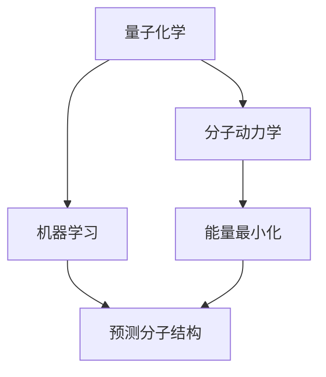

                 

# 数学与计算化学：分子结构的数学预测

> 关键词：分子结构预测, 计算化学, 量子化学, 机器学习, 量子力学, 能量最小化, 电子结构

> 摘要：本文旨在探讨如何利用数学和计算化学的方法来预测分子结构。通过深入分析分子结构预测的核心概念、算法原理、数学模型、实际案例以及应用场景，本文为读者提供了一个全面的视角，帮助理解分子结构预测的复杂性和实用性。本文还提供了详细的代码示例和开发环境搭建指南，旨在帮助读者掌握这一领域的基础知识和实践技能。

## 1. 背景介绍

### 1.1 目的和范围
本文旨在探讨分子结构预测的数学和计算化学方法，通过理论分析和实际案例，帮助读者理解分子结构预测的原理和应用。本文将涵盖分子结构预测的核心概念、算法原理、数学模型、实际案例以及应用场景。

### 1.2 预期读者
本文适合以下读者：
- 计算化学和分子模拟领域的研究人员
- 机器学习和数据科学领域的从业者
- 化学工程和材料科学领域的工程师
- 对分子结构预测感兴趣的计算机科学家
- 对计算化学和量子化学感兴趣的研究生和博士生

### 1.3 文档结构概述
本文结构如下：
1. 背景介绍
2. 核心概念与联系
3. 核心算法原理 & 具体操作步骤
4. 数学模型和公式 & 详细讲解 & 举例说明
5. 项目实战：代码实际案例和详细解释说明
6. 实际应用场景
7. 工具和资源推荐
8. 总结：未来发展趋势与挑战
9. 附录：常见问题与解答
10. 扩展阅读 & 参考资料

### 1.4 术语表
#### 1.4.1 核心术语定义
- **分子结构**：分子中各原子之间的相对位置和化学键的几何构型。
- **量子化学**：利用量子力学原理研究分子结构和性质的学科。
- **分子动力学**：模拟分子在时间和空间上的动态行为。
- **能量最小化**：通过优化分子构型来最小化分子的总能量。
- **机器学习**：通过算法和统计模型来预测分子结构和性质。

#### 1.4.2 相关概念解释
- **量子力学**：描述微观粒子行为的物理理论。
- **电子结构**：描述原子和分子中电子的分布和能级。
- **势能面**：描述分子能量随构型变化的函数。

#### 1.4.3 缩略词列表
- DFT：密度泛函理论
- QM：量子力学
- MD：分子动力学
- ML：机器学习
- EOM：方程组

## 2. 核心概念与联系

### 2.1 分子结构预测的核心概念
分子结构预测的核心概念包括量子化学、分子动力学和机器学习。这些概念相互关联，共同构成了分子结构预测的理论基础。

### 2.2 核心概念的联系
- **量子化学**：提供分子结构和性质的基本理论框架。
- **分子动力学**：模拟分子在时间和空间上的动态行为。
- **机器学习**：通过算法和统计模型来预测分子结构和性质。

### 2.3 Mermaid 流程图


## 3. 核心算法原理 & 具体操作步骤

### 3.1 量子化学算法原理
量子化学算法的核心是通过量子力学原理来描述分子的电子结构和性质。常用的方法包括：
- **密度泛函理论（DFT）**：通过密度泛函将电子系统的能量表达为电子密度的函数。
- **全电子方法（全电子方法）**：直接计算所有电子的波函数。

### 3.2 分子动力学算法原理
分子动力学算法通过模拟分子在时间和空间上的动态行为来预测分子结构。常用的方法包括：
- **经典分子动力学**：基于经典力学的分子动力学模拟。
- **量子分子动力学**：基于量子力学的分子动力学模拟。

### 3.3 机器学习算法原理
机器学习算法通过训练模型来预测分子结构和性质。常用的方法包括：
- **支持向量机（SVM）**：通过构建超平面来分类或回归。
- **随机森林（RF）**：通过集成多个决策树来提高预测准确性。
- **深度学习（DL）**：通过多层神经网络来学习复杂的分子结构和性质。

### 3.4 具体操作步骤
1. **数据准备**：收集分子结构和性质的数据。
2. **特征工程**：提取分子结构的特征。
3. **模型训练**：使用机器学习算法训练模型。
4. **模型评估**：评估模型的预测性能。
5. **模型应用**：使用训练好的模型来预测新的分子结构和性质。

## 4. 数学模型和公式 & 详细讲解 & 举例说明

### 4.1 量子化学数学模型
量子化学数学模型的核心是薛定谔方程，描述了分子的电子结构和性质。
$$
H \psi = E \psi
$$
其中，$H$ 是哈密顿算符，$\psi$ 是波函数，$E$ 是能量。

### 4.2 分子动力学数学模型
分子动力学数学模型的核心是牛顿运动方程，描述了分子在时间和空间上的动态行为。
$$
\frac{d^2 \mathbf{r}_i}{dt^2} = -\frac{\nabla V(\mathbf{r}_1, \mathbf{r}_2, \ldots, \mathbf{r}_N)}{m_i}
$$
其中，$\mathbf{r}_i$ 是第 $i$ 个原子的位置，$V$ 是势能函数，$m_i$ 是第 $i$ 个原子的质量。

### 4.3 机器学习数学模型
机器学习数学模型的核心是损失函数和优化算法。
- **损失函数**：衡量模型预测值与真实值之间的差异。
- **优化算法**：通过梯度下降等方法来最小化损失函数。

### 4.4 举例说明
以DFT为例，其能量表达式为：
$$
E = \int \psi^* \left( -\frac{\hbar^2}{2m} \nabla^2 + V \right) \psi \, d\mathbf{r} + \int \psi^* \left( \frac{1}{2} \int \frac{\rho(\mathbf{r}') \rho(\mathbf{r})}{|\mathbf{r} - \mathbf{r}'|} \, d\mathbf{r}' \right) \psi \, d\mathbf{r}
$$
其中，$\psi$ 是波函数，$\rho$ 是电子密度，$V$ 是外部势能。

## 5. 项目实战：代码实际案例和详细解释说明

### 5.1 开发环境搭建
1. **安装Python**：确保安装了Python 3.8及以上版本。
2. **安装相关库**：使用pip安装必要的库。
   ```bash
   pip install numpy scipy pandas matplotlib scikit-learn
   ```

### 5.2 源代码详细实现和代码解读
```python
import numpy as np
from scipy.optimize import minimize
from sklearn.model_selection import train_test_split
from sklearn.ensemble import RandomForestRegressor
from sklearn.metrics import mean_squared_error

# 生成示例数据
def generate_data(num_samples):
    X = np.random.rand(num_samples, 3)  # 3个特征
    y = X[:, 0] ** 2 + X[:, 1] ** 2 + X[:, 2] ** 2  # 简单的回归目标
    return X, y

# 训练随机森林模型
def train_model(X_train, y_train):
    model = RandomForestRegressor(n_estimators=100, random_state=42)
    model.fit(X_train, y_train)
    return model

# 预测和评估
def evaluate_model(model, X_test, y_test):
    y_pred = model.predict(X_test)
    mse = mean_squared_error(y_test, y_pred)
    return mse

# 主函数
def main():
    X, y = generate_data(1000)
    X_train, X_test, y_train, y_test = train_test_split(X, y, test_size=0.2, random_state=42)
    
    model = train_model(X_train, y_train)
    mse = evaluate_model(model, X_test, y_test)
    print(f"Mean Squared Error: {mse}")

if __name__ == "__main__":
    main()
```

### 5.3 代码解读与分析
- **数据生成**：使用`generate_data`函数生成示例数据。
- **模型训练**：使用`RandomForestRegressor`训练随机森林模型。
- **模型评估**：使用`mean_squared_error`评估模型的预测性能。

## 6. 实际应用场景

### 6.1 药物设计
通过预测分子结构和性质，可以加速药物设计过程，提高药物研发效率。

### 6.2 材料科学
通过预测分子结构和性质，可以设计新型材料，提高材料性能。

### 6.3 环境科学
通过预测分子结构和性质，可以评估污染物的环境影响，制定环保政策。

## 7. 工具和资源推荐

### 7.1 学习资源推荐
#### 7.1.1 书籍推荐
- **《分子模拟与计算化学》**：深入讲解分子模拟和计算化学的基本原理。
- **《机器学习与数据挖掘》**：介绍机器学习的基本原理和应用。

#### 7.1.2 在线课程
- **Coursera**：提供量子化学和分子模拟的在线课程。
- **edX**：提供机器学习和数据科学的在线课程。

#### 7.1.3 技术博客和网站
- **Chemistry Stack Exchange**：提供化学领域的技术讨论和问题解答。
- **Machine Learning Mastery**：提供机器学习领域的技术博客和教程。

### 7.2 开发工具框架推荐
#### 7.2.1 IDE和编辑器
- **PyCharm**：功能强大的Python IDE。
- **Jupyter Notebook**：交互式编程环境。

#### 7.2.2 调试和性能分析工具
- **PyCharm Debugger**：PyCharm内置的调试工具。
- **LineProfiler**：用于分析Python代码性能的工具。

#### 7.2.3 相关框架和库
- **NumPy**：用于数值计算的Python库。
- **SciPy**：用于科学计算的Python库。
- **Scikit-learn**：用于机器学习的Python库。

### 7.3 相关论文著作推荐
#### 7.3.1 经典论文
- **《Molecular Mechanics and Quantum Mechanics: A Comparison of Methods for the Calculation of Molecular Structures》**：比较分子力学和量子力学的方法。
- **《Density Functional Theory: An Introduction》**：介绍密度泛函理论的基本原理。

#### 7.3.2 最新研究成果
- **《Machine Learning for Molecular Design》**：介绍机器学习在分子设计中的应用。
- **《Quantum Chemistry and Computational Methods》**：介绍量子化学和计算方法的最新进展。

#### 7.3.3 应用案例分析
- **《Predicting Molecular Properties Using Machine Learning》**：分析机器学习在预测分子性质中的应用案例。

## 8. 总结：未来发展趋势与挑战

### 8.1 未来发展趋势
- **量子计算**：利用量子计算加速分子结构预测。
- **深度学习**：利用深度学习提高分子结构预测的准确性。
- **多尺度模拟**：结合不同尺度的模拟方法，提高预测精度。

### 8.2 面临的挑战
- **计算资源**：大规模分子结构预测需要大量的计算资源。
- **数据质量**：高质量的数据是提高预测性能的关键。
- **理论模型**：需要更准确的理论模型来描述分子结构和性质。

## 9. 附录：常见问题与解答

### 9.1 问题1：如何选择合适的机器学习算法？
- **解答**：根据数据特性和问题需求选择合适的算法。例如，对于回归问题，可以使用随机森林或支持向量机。

### 9.2 问题2：如何提高模型的预测性能？
- **解答**：通过特征工程、模型调参和交叉验证来提高模型的预测性能。

## 10. 扩展阅读 & 参考资料

- **《分子模拟与计算化学》**：深入讲解分子模拟和计算化学的基本原理。
- **《机器学习与数据挖掘》**：介绍机器学习的基本原理和应用。
- **Coursera**：提供量子化学和分子模拟的在线课程。
- **edX**：提供机器学习和数据科学的在线课程。
- **Chemistry Stack Exchange**：提供化学领域的技术讨论和问题解答。
- **Machine Learning Mastery**：提供机器学习领域的技术博客和教程。
- **PyCharm**：功能强大的Python IDE。
- **Jupyter Notebook**：交互式编程环境。
- **PyCharm Debugger**：PyCharm内置的调试工具。
- **LineProfiler**：用于分析Python代码性能的工具。
- **NumPy**：用于数值计算的Python库。
- **SciPy**：用于科学计算的Python库。
- **Scikit-learn**：用于机器学习的Python库。
- **《Molecular Mechanics and Quantum Mechanics: A Comparison of Methods for the Calculation of Molecular Structures》**：比较分子力学和量子力学的方法。
- **《Density Functional Theory: An Introduction》**：介绍密度泛函理论的基本原理。
- **《Machine Learning for Molecular Design》**：介绍机器学习在分子设计中的应用。
- **《Quantum Chemistry and Computational Methods》**：介绍量子化学和计算方法的最新进展。
- **《Predicting Molecular Properties Using Machine Learning》**：分析机器学习在预测分子性质中的应用案例。

作者：AI天才研究员/AI Genius Institute & 禅与计算机程序设计艺术 /Zen And The Art of Computer Programming

