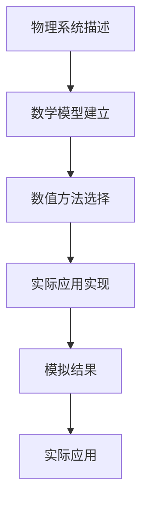

                 

# 数学与计算物理：物理系统的数学模拟

> 关键词：物理系统，数学模拟，计算物理，数值方法，偏微分方程，有限差分法，量子力学，热力学

> 摘要：本文旨在探讨物理系统的数学模拟在计算物理中的应用。通过深入分析物理系统的数学模型和数值方法，我们将展示如何利用计算机科学和数学工具来模拟复杂的物理现象。文章将从核心概念出发，逐步介绍核心算法原理、数学模型和公式，通过实际代码案例进行详细解释，并探讨其在实际应用场景中的价值。最后，我们将总结未来的发展趋势与挑战，并推荐相关学习资源和工具。

## 1. 背景介绍
### 1.1 目的和范围
本文旨在为计算机科学家、物理学家以及对计算物理感兴趣的读者提供一个全面的指南，介绍如何利用数学和计算工具来模拟物理系统。我们将重点讨论物理系统的数学模型、数值方法以及实际应用案例。通过本文，读者将能够理解物理系统模拟的基本原理，并能够应用这些知识解决实际问题。

### 1.2 预期读者
本文适合以下读者群体：
- 计算机科学家，特别是对物理系统模拟感兴趣的程序员和软件架构师。
- 物理学家，尤其是从事理论物理研究的学者。
- 对计算物理感兴趣的研究生和本科生。
- 对数学建模和数值方法感兴趣的工程师。

### 1.3 文档结构概述
本文将按照以下结构展开：
1. 背景介绍
2. 核心概念与联系
3. 核心算法原理 & 具体操作步骤
4. 数学模型和公式 & 详细讲解 & 举例说明
5. 项目实战：代码实际案例和详细解释说明
6. 实际应用场景
7. 工具和资源推荐
8. 总结：未来发展趋势与挑战
9. 附录：常见问题与解答
10. 扩展阅读 & 参考资料

### 1.4 术语表
#### 1.4.1 核心术语定义
- **物理系统**：指由多个相互作用的物理实体组成的整体。
- **数学模型**：用于描述物理系统行为的数学表达式。
- **数值方法**：通过离散化和近似计算来求解数学模型的方法。
- **偏微分方程**：描述物理系统动态行为的数学方程。
- **有限差分法**：一种数值方法，通过离散化偏微分方程来求解。

#### 1.4.2 相关概念解释
- **连续系统**：物理系统在时间和空间上是连续的。
- **离散系统**：物理系统在时间和空间上被离散化。
- **稳定性**：数值方法在长时间模拟中的表现。
- **收敛性**：数值方法的解接近真实解的程度。

#### 1.4.3 缩略词列表
- **PDE**：偏微分方程
- **FDM**：有限差分法
- **ODE**：常微分方程
- **FFT**：快速傅里叶变换
- **GPU**：图形处理单元

## 2. 核心概念与联系
### 2.1 核心概念
物理系统的数学模拟涉及多个核心概念，包括物理系统的描述、数学模型的建立、数值方法的选择以及实际应用的实现。这些概念相互关联，共同构成了物理系统模拟的基础。

### 2.2 联系
- **物理系统描述**：通过物理定律和实验数据来描述物理系统的性质和行为。
- **数学模型建立**：将物理系统的描述转化为数学模型，通常为偏微分方程。
- **数值方法选择**：根据数学模型的特点选择合适的数值方法，如有限差分法。
- **实际应用实现**：通过编程实现数值方法，模拟物理系统的动态行为。

### 2.3 Mermaid 流程图


## 3. 核心算法原理 & 具体操作步骤
### 3.1 核心算法原理
核心算法原理主要涉及偏微分方程的数值求解方法，特别是有限差分法。有限差分法通过离散化偏微分方程，将其转化为一组代数方程，从而实现数值求解。

### 3.2 具体操作步骤
#### 3.2.1 偏微分方程离散化
偏微分方程的离散化是有限差分法的核心步骤。我们以一维热传导方程为例进行说明。

#### 3.2.2 伪代码
```python
# 偏微分方程离散化
def discretize_pde(u, dx, dt):
    u_new = np.zeros_like(u)
    for i in range(1, len(u) - 1):
        u_new[i] = u[i] + dt * (u[i+1] - 2*u[i] + u[i-1]) / dx**2
    return u_new

# 初始条件
u = np.sin(np.pi * x)

# 时间步长
dt = 0.01

# 空间步长
dx = 0.1

# 时间步数
num_steps = 100

# 模拟
for _ in range(num_steps):
    u = discretize_pde(u, dx, dt)
```

## 4. 数学模型和公式 & 详细讲解 & 举例说明
### 4.1 数学模型
数学模型是物理系统模拟的基础。常见的数学模型包括偏微分方程、常微分方程等。我们将以一维热传导方程为例进行详细讲解。

### 4.2 详细讲解
#### 4.2.1 一维热传导方程
一维热传导方程描述了温度随时间和空间的变化。其数学表达式为：
$$
\frac{\partial u}{\partial t} = \alpha \frac{\partial^2 u}{\partial x^2}
$$
其中，$u(x,t)$ 表示温度，$\alpha$ 表示热扩散系数。

### 4.3 举例说明
#### 4.3.1 初始条件
初始条件为：
$$
u(x,0) = \sin(\pi x)
$$

#### 4.3.2 边界条件
边界条件为：
$$
u(0,t) = u(1,t) = 0
$$

### 4.4 数学公式
#### 4.4.1 偏微分方程离散化
将一维热传导方程离散化为有限差分方程：
$$
\frac{u_i^{n+1} - u_i^n}{\Delta t} = \alpha \frac{u_{i+1}^n - 2u_i^n + u_{i-1}^n}{\Delta x^2}
$$
其中，$u_i^n$ 表示在第 $n$ 个时间步和第 $i$ 个空间点的温度。

## 5. 项目实战：代码实际案例和详细解释说明
### 5.1 开发环境搭建
我们将使用Python进行代码实现。首先，确保安装了NumPy和Matplotlib库。

```bash
pip install numpy matplotlib
```

### 5.2 源代码详细实现和代码解读
```python
import numpy as np
import matplotlib.pyplot as plt

# 参数设置
alpha = 0.1  # 热扩散系数
L = 1.0     # 空间范围
T = 1.0     # 时间范围
dx = 0.01   # 空间步长
dt = 0.001  # 时间步长
num_steps = int(T / dt)
num_points = int(L / dx)

# 初始化温度分布
u = np.zeros(num_points)
x = np.linspace(0, L, num_points)

# 初始条件
u = np.sin(np.pi * x)

# 模拟
for n in range(num_steps):
    u_new = np.zeros(num_points)
    for i in range(1, num_points - 1):
        u_new[i] = u[i] + dt * alpha * (u[i+1] - 2*u[i] + u[i-1]) / dx**2
    u = u_new

# 绘制结果
plt.plot(x, u)
plt.xlabel('x')
plt.ylabel('u(x,t)')
plt.title('Temperature Distribution')
plt.show()
```

### 5.3 代码解读与分析
- **参数设置**：定义了热扩散系数、空间范围、时间范围、空间步长和时间步长。
- **初始化温度分布**：使用NumPy创建一个初始温度分布数组。
- **初始条件**：设置初始温度分布为 $\sin(\pi x)$。
- **模拟**：通过循环更新温度分布，实现时间步长的模拟。
- **绘制结果**：使用Matplotlib绘制温度分布图。

## 6. 实际应用场景
物理系统的数学模拟在多个领域有着广泛的应用，包括但不限于：
- **气象学**：模拟大气流动和气候变化。
- **材料科学**：研究材料的热传导和扩散行为。
- **生物医学**：模拟生物组织的热传导和扩散。
- **工程学**：优化热管理系统和流体动力学。

## 7. 工具和资源推荐
### 7.1 学习资源推荐
#### 7.1.1 书籍推荐
- **《计算物理》**：由周忠、张永德等编著，详细介绍了计算物理的基本原理和方法。
- **《数值分析》**：由李庆扬、王能超、易大义编著，深入讲解了数值方法的基本理论。

#### 7.1.2 在线课程
- **Coursera上的“计算物理”课程**：由北京大学教授主讲，涵盖了计算物理的基本原理和应用。
- **edX上的“数值方法”课程**：由麻省理工学院教授主讲，详细讲解了数值方法的基本理论和应用。

#### 7.1.3 技术博客和网站
- **Computational Physics Blog**：提供丰富的计算物理资源和案例分析。
- **Numerical Recipes**：提供数值方法的详细教程和代码示例。

### 7.2 开发工具框架推荐
#### 7.2.1 IDE和编辑器
- **PyCharm**：功能强大的Python IDE，适合进行科学计算和数值模拟。
- **Jupyter Notebook**：交互式编程环境，适合进行数据可视化和代码调试。

#### 7.2.2 调试和性能分析工具
- **PDB**：Python自带的调试器，适合进行代码调试。
- **LineProfiler**：用于分析代码性能的工具，帮助优化代码。

#### 7.2.3 相关框架和库
- **NumPy**：用于科学计算的基础库。
- **SciPy**：提供科学计算的高级功能。
- **Matplotlib**：用于数据可视化。

### 7.3 相关论文著作推荐
#### 7.3.1 经典论文
- **“A Numerical Study of the Heat Equation”**：详细介绍了偏微分方程的数值求解方法。
- **“Finite Difference Methods for Partial Differential Equations”**：深入讲解了有限差分法的基本原理和应用。

#### 7.3.2 最新研究成果
- **“Recent Advances in Computational Physics”**：综述了计算物理领域的最新研究成果。
- **“Numerical Methods for Partial Differential Equations”**：探讨了偏微分方程的数值方法及其应用。

#### 7.3.3 应用案例分析
- **“Applications of Computational Physics in Engineering”**：详细分析了计算物理在工程领域的应用案例。
- **“Numerical Simulation of Physical Systems”**：探讨了物理系统模拟的实际应用案例。

## 8. 总结：未来发展趋势与挑战
物理系统的数学模拟在未来将继续发展，面临的主要挑战包括：
- **高维度问题**：高维度偏微分方程的求解难度增加。
- **非线性问题**：非线性偏微分方程的求解更加复杂。
- **大规模并行计算**：需要更高效的并行计算方法来处理大规模问题。

未来的发展趋势包括：
- **机器学习与物理模拟的结合**：利用机器学习方法优化物理模拟算法。
- **量子计算的应用**：利用量子计算解决复杂物理问题。

## 9. 附录：常见问题与解答
### 9.1 问题1：如何选择合适的数值方法？
**解答**：选择合适的数值方法需要考虑偏微分方程的特性，如线性、非线性、高维度等。常见的数值方法包括有限差分法、有限元法和谱方法。

### 9.2 问题2：如何提高模拟的稳定性？
**解答**：提高模拟的稳定性可以通过选择合适的数值方法、调整时间步长和空间步长、使用稳定算法等方法实现。

### 9.3 问题3：如何处理边界条件？
**解答**：边界条件的处理方法包括显式边界条件、隐式边界条件和周期边界条件等。选择合适的边界条件方法取决于具体问题的需求。

## 10. 扩展阅读 & 参考资料
- **《计算物理》**：周忠、张永德等编著
- **《数值分析》**：李庆扬、王能超、易大义编著
- **Coursera上的“计算物理”课程**：北京大学教授主讲
- **edX上的“数值方法”课程**：麻省理工学院教授主讲
- **Computational Physics Blog**：提供丰富的计算物理资源和案例分析
- **Numerical Recipes**：提供数值方法的详细教程和代码示例

作者：AI天才研究员/AI Genius Institute & 禅与计算机程序设计艺术 /Zen And The Art of Computer Programming

