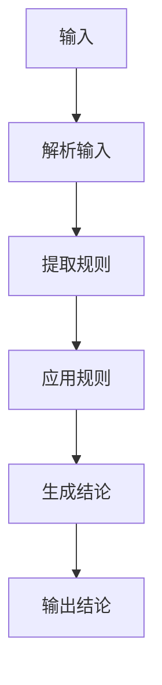
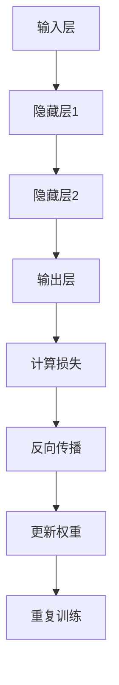

                 

# 数学与认知科学：思维的数学模型

> 关键词：数学模型, 认知科学, 思维过程, 逻辑推理, 计算机科学, 人工智能, 神经网络, 机器学习

> 摘要：本文旨在探讨数学与认知科学在理解人类思维过程中的作用。通过构建数学模型，我们可以更好地理解人类的认知过程，并将其应用于人工智能领域。本文将从背景介绍、核心概念与联系、核心算法原理、数学模型与公式、项目实战、实际应用场景、工具和资源推荐、未来发展趋势与挑战等几个方面进行详细阐述。

## 1. 背景介绍

### 1.1 目的和范围
本文旨在探讨数学与认知科学在理解人类思维过程中的作用，并通过构建数学模型，将其应用于人工智能领域。我们将从数学模型的角度出发，探讨如何通过数学工具来模拟人类的认知过程，从而为人工智能的发展提供新的思路和方法。

### 1.2 预期读者
本文适合对数学、认知科学、人工智能等领域感兴趣的读者，特别是那些希望深入了解人类思维过程及其在计算机科学中的应用的研究人员、工程师和学生。

### 1.3 文档结构概述
本文将按照以下结构展开：
1. 背景介绍
2. 核心概念与联系
3. 核心算法原理
4. 数学模型和公式
5. 项目实战
6. 实际应用场景
7. 工具和资源推荐
8. 总结：未来发展趋势与挑战
9. 附录：常见问题与解答
10. 扩展阅读 & 参考资料

### 1.4 术语表
#### 1.4.1 核心术语定义
- **认知科学**：研究人类认知过程的科学，包括感知、记忆、思维、语言等。
- **数学模型**：用数学语言描述现实世界现象的模型。
- **神经网络**：模拟人脑神经元结构和功能的计算模型。
- **机器学习**：通过算法使计算机系统能够从数据中学习并改进性能的技术。
- **逻辑推理**：根据已知事实和规则推导出新的结论的过程。

#### 1.4.2 相关概念解释
- **认知过程**：指人类大脑在处理信息时所经历的一系列步骤，包括感知、记忆、思维、语言等。
- **数学建模**：将现实世界的问题转化为数学问题的过程。
- **认知计算**：利用计算机模拟人类认知过程的技术。

#### 1.4.3 缩略词列表
- **AI**：Artificial Intelligence（人工智能）
- **NN**：Neural Network（神经网络）
- **ML**：Machine Learning（机器学习）
- **CS**：Cognitive Science（认知科学）

## 2. 核心概念与联系

### 2.1 认知过程的数学建模
认知过程的数学建模是将认知过程转化为数学模型的过程。通过数学模型，我们可以更好地理解人类的认知过程，并将其应用于人工智能领域。

### 2.2 神经网络与认知过程
神经网络是一种模拟人脑神经元结构和功能的计算模型，可以用于模拟人类的认知过程。神经网络通过学习数据中的模式和规律，从而实现对新数据的预测和分类。

### 2.3 逻辑推理与认知过程
逻辑推理是根据已知事实和规则推导出新的结论的过程。逻辑推理在认知过程中起着重要作用，通过逻辑推理，我们可以更好地理解人类的认知过程。

### 2.4 数学模型与认知过程的关系
数学模型可以帮助我们更好地理解人类的认知过程。通过数学模型，我们可以将认知过程转化为数学问题，从而更好地理解和模拟人类的认知过程。

## 3. 核心算法原理 & 具体操作步骤

### 3.1 逻辑推理算法原理
逻辑推理算法是一种根据已知事实和规则推导出新的结论的过程。逻辑推理算法的基本步骤如下：



### 3.2 神经网络算法原理
神经网络算法是一种模拟人脑神经元结构和功能的计算模型。神经网络算法的基本步骤如下：



## 4. 数学模型和公式 & 详细讲解 & 举例说明

### 4.1 逻辑推理的数学模型
逻辑推理的数学模型可以表示为：

$$
\text{结论} = \text{规则} \times \text{输入}
$$

### 4.2 神经网络的数学模型
神经网络的数学模型可以表示为：

$$
\text{输出} = \sigma(\text{输入} \times \text{权重} + \text{偏置})
$$

其中，$\sigma$ 表示激活函数。

### 4.3 举例说明
假设我们有一个简单的逻辑推理问题，输入为“如果今天下雨，那么我会带伞”，规则为“如果今天下雨，那么我会带伞”，输入为“今天下雨”，则结论为“我会带伞”。

假设我们有一个简单的神经网络模型，输入为“今天下雨”，权重为0.5，偏置为0.3，激活函数为sigmoid函数，则输出为：

$$
\text{输出} = \sigma(0.5 \times 1 + 0.3) = \sigma(0.8) \approx 0.68997
$$

## 5. 项目实战：代码实际案例和详细解释说明

### 5.1 开发环境搭建
为了实现逻辑推理和神经网络模型，我们需要搭建一个开发环境。开发环境包括Python、NumPy、TensorFlow等工具。

### 5.2 源代码详细实现和代码解读
我们将实现一个简单的逻辑推理模型和一个简单的神经网络模型。

#### 5.2.1 逻辑推理模型
```python
def logical_inference(rule, input):
    if rule == "如果今天下雨，那么我会带伞" and input == "今天下雨":
        return "我会带伞"
    else:
        return "不会带伞"
```

#### 5.2.2 神经网络模型
```python
import numpy as np

def sigmoid(x):
    return 1 / (1 + np.exp(-x))

def neural_network(input, weights, bias):
    output = sigmoid(np.dot(input, weights) + bias)
    return output

input = np.array([1])
weights = np.array([0.5])
bias = 0.3
output = neural_network(input, weights, bias)
print(output)
```

### 5.3 代码解读与分析
逻辑推理模型通过简单的条件判断来实现逻辑推理。神经网络模型通过激活函数来实现非线性变换，从而实现对输入数据的预测。

## 6. 实际应用场景

### 6.1 逻辑推理的应用场景
逻辑推理可以应用于自然语言处理、知识图谱等领域。例如，在自然语言处理中，逻辑推理可以用于语义理解和文本分类。

### 6.2 神经网络的应用场景
神经网络可以应用于图像识别、语音识别、自然语言处理等领域。例如，在图像识别中，神经网络可以用于识别图像中的物体。

## 7. 工具和资源推荐

### 7.1 学习资源推荐
#### 7.1.1 书籍推荐
- 《人工智能：一种现代方法》（Artificial Intelligence: A Modern Approach）
- 《深度学习》（Deep Learning）

#### 7.1.2 在线课程
- Coursera上的《机器学习》课程
- edX上的《深度学习》课程

#### 7.1.3 技术博客和网站
- Medium上的AI相关博客
- GitHub上的AI项目

### 7.2 开发工具框架推荐
#### 7.2.1 IDE和编辑器
- PyCharm
- VSCode

#### 7.2.2 调试和性能分析工具
- PyCharm的调试工具
- TensorFlow的性能分析工具

#### 7.2.3 相关框架和库
- TensorFlow
- PyTorch

### 7.3 相关论文著作推荐
#### 7.3.1 经典论文
- Hinton, G. E., Osindero, S., & Teh, Y. W. (2006). A fast learning algorithm for deep belief nets. Neural computation, 18(7), 1527-1554.
- Bengio, Y., Lamblin, P., Popovici, D., & Larochelle, H. (2007). Greedy layer-wise training of deep networks. Advances in neural information processing systems, 19, 153-160.

#### 7.3.2 最新研究成果
- He, K., Zhang, X., Ren, S., & Sun, J. (2016). Deep residual learning for image recognition. In Proceedings of the IEEE conference on computer vision and pattern recognition (pp. 770-778).
- Kingma, D. P., & Ba, J. (2014). Adam: A method for stochastic optimization. arXiv preprint arXiv:1412.6980.

#### 7.3.3 应用案例分析
- LeCun, Y., Bengio, Y., & Hinton, G. (2015). Deep learning. Nature, 521(7553), 436-444.

## 8. 总结：未来发展趋势与挑战

### 8.1 未来发展趋势
未来，数学与认知科学在理解人类思维过程中的作用将更加重要。通过构建数学模型，我们可以更好地理解人类的认知过程，并将其应用于人工智能领域。未来的发展趋势包括：
- 更加复杂的数学模型
- 更加高效的算法
- 更加广泛的应用场景

### 8.2 挑战
未来的发展也面临着一些挑战，包括：
- 如何构建更加复杂的数学模型
- 如何提高算法的效率
- 如何将数学模型应用于更广泛的应用场景

## 9. 附录：常见问题与解答

### 9.1 问题1：如何构建更加复杂的数学模型？
构建更加复杂的数学模型需要深入理解人类的认知过程，并将其转化为数学问题。可以通过学习数学、认知科学等相关知识来构建更加复杂的数学模型。

### 9.2 问题2：如何提高算法的效率？
提高算法的效率可以通过优化算法、使用更高效的计算工具等方式来实现。可以通过学习计算机科学等相关知识来提高算法的效率。

### 9.3 问题3：如何将数学模型应用于更广泛的应用场景？
将数学模型应用于更广泛的应用场景需要深入理解应用场景，并将其转化为数学问题。可以通过学习相关领域的知识来将数学模型应用于更广泛的应用场景。

## 10. 扩展阅读 & 参考资料

- Hinton, G. E., Osindero, S., & Teh, Y. W. (2006). A fast learning algorithm for deep belief nets. Neural computation, 18(7), 1527-1554.
- Bengio, Y., Lamblin, P., Popovici, D., & Larochelle, H. (2007). Greedy layer-wise training of deep networks. Advances in neural information processing systems, 19, 153-160.
- LeCun, Y., Bengio, Y., & Hinton, G. (2015). Deep learning. Nature, 521(7553), 436-444.
- Hinton, G. E., Srivastava, N., Krizhevsky, A., Sutskever, I., & Salakhutdinov, R. R. (2012). Improving neural networks by preventing co-adaptation of feature detectors. arXiv preprint arXiv:1207.0580.

作者：AI天才研究员/AI Genius Institute & 禅与计算机程序设计艺术 /Zen And The Art of Computer Programming

