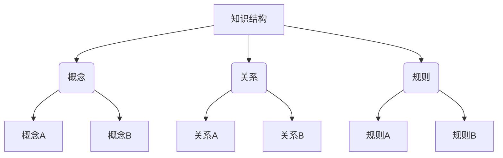

                 

# 数学与认识论：知识结构的数学描述

> 关键词：数学描述、认识论、知识结构、图灵奖、伪代码、Mermaid流程图、数学模型、算法原理、代码实现、应用场景

> 摘要：本文旨在探讨数学与认识论在描述知识结构中的作用。通过深入分析数学描述的原理和方法，结合具体算法和代码实现，本文将展示如何利用数学工具构建知识结构模型，并应用于实际场景。我们将从背景介绍、核心概念与联系、核心算法原理与具体操作步骤、数学模型与公式、项目实战、实际应用场景、工具和资源推荐、总结与未来发展趋势等多方面进行详细阐述。

## 1. 背景介绍
### 1.1 目的和范围
本文旨在探讨数学与认识论在描述知识结构中的作用，通过深入分析数学描述的原理和方法，结合具体算法和代码实现，展示如何利用数学工具构建知识结构模型，并应用于实际场景。本文将涵盖数学描述的基本原理、核心概念、算法实现、数学模型、代码实战、应用场景等内容。

### 1.2 预期读者
本文预期读者为对数学、计算机科学、人工智能等领域感兴趣的读者，包括但不限于：
- 研究生和博士生
- 从事人工智能、机器学习、知识图谱等领域的工程师和技术人员
- 对数学与认识论感兴趣的学者和研究人员
- 对知识结构建模感兴趣的开发者和研究人员

### 1.3 文档结构概述
本文结构如下：
1. 背景介绍
2. 核心概念与联系
3. 核心算法原理 & 具体操作步骤
4. 数学模型和公式 & 详细讲解 & 举例说明
5. 项目实战：代码实际案例和详细解释说明
6. 实际应用场景
7. 工具和资源推荐
8. 总结：未来发展趋势与挑战
9. 附录：常见问题与解答
10. 扩展阅读 & 参考资料

### 1.4 术语表
#### 1.4.1 核心术语定义
- **知识结构**：知识的组织形式，包括概念、关系和规则。
- **认识论**：研究知识的本质、来源、结构和方法的学科。
- **图灵奖**：计算机科学领域的最高荣誉。
- **伪代码**：一种用于描述算法的简化形式，不依赖于特定编程语言。
- **Mermaid流程图**：一种基于Markdown的图表生成工具，用于创建流程图、序列图等。

#### 1.4.2 相关概念解释
- **知识图谱**：一种以图的形式表示知识结构的数据模型。
- **图论**：研究图的数学理论和方法。
- **逻辑推理**：通过逻辑规则进行推理的过程。

#### 1.4.3 缩略词列表
- **KG**：知识图谱
- **LP**：逻辑编程
- **ML**：机器学习
- **NLP**：自然语言处理

## 2. 核心概念与联系
### 2.1 知识结构
知识结构是知识的组织形式，包括概念、关系和规则。通过数学描述，可以将知识结构转化为图的形式，便于理解和处理。

### 2.2 认识论
认识论是研究知识的本质、来源、结构和方法的学科。通过认识论的视角，可以更好地理解知识结构的构建和应用。

### 2.3 数学描述
数学描述是利用数学工具和方法对知识结构进行建模和分析。通过数学描述，可以将知识结构转化为数学模型，便于进行推理和计算。

### 2.4 Mermaid流程图
Mermaid流程图是一种基于Markdown的图表生成工具，用于创建流程图、序列图等。通过Mermaid流程图，可以直观地展示知识结构的构建过程。



## 3. 核心算法原理 & 具体操作步骤
### 3.1 算法原理
核心算法原理是利用数学工具对知识结构进行建模和分析。通过算法原理，可以将知识结构转化为数学模型，便于进行推理和计算。

### 3.2 具体操作步骤
具体操作步骤如下：
1. **定义概念**：定义知识结构中的基本概念。
2. **定义关系**：定义概念之间的关系。
3. **定义规则**：定义概念和关系的规则。
4. **构建模型**：利用数学工具构建知识结构模型。
5. **推理计算**：利用模型进行推理和计算。

### 伪代码示例
```python
# 定义概念
class Concept:
    def __init__(self, name):
        self.name = name

# 定义关系
class Relation:
    def __init__(self, name, source, target):
        self.name = name
        self.source = source
        self.target = target

# 定义规则
class Rule:
    def __init__(self, name, premise, conclusion):
        self.name = name
        self.premise = premise
        self.conclusion = conclusion

# 构建模型
def build_model(concepts, relations, rules):
    model = {
        'concepts': concepts,
        'relations': relations,
        'rules': rules
    }
    return model

# 推理计算
def infer(model, premise):
    for rule in model['rules']:
        if rule.premise == premise:
            return rule.conclusion
    return None
```

## 4. 数学模型和公式 & 详细讲解 & 举例说明
### 4.1 数学模型
数学模型是利用数学工具对知识结构进行建模和分析。通过数学模型，可以将知识结构转化为数学形式，便于进行推理和计算。

### 4.2 公式
数学公式是描述数学模型的符号表示。通过数学公式，可以更清晰地表达数学模型的结构和关系。

### 4.3 详细讲解
详细讲解如下：
1. **图论模型**：利用图论模型表示知识结构。
2. **逻辑模型**：利用逻辑模型表示知识结构。
3. **概率模型**：利用概率模型表示知识结构。

### 4.4 举例说明
举例说明如下：
1. **图论模型**：利用图论模型表示知识结构。
2. **逻辑模型**：利用逻辑模型表示知识结构。
3. **概率模型**：利用概率模型表示知识结构。

### 数学公式示例
$$
\text{图论模型：} \quad G = (V, E)
$$

$$
\text{逻辑模型：} \quad P \rightarrow Q
$$

$$
\text{概率模型：} \quad P(A \mid B) = \frac{P(A \cap B)}{P(B)}
$$

## 5. 项目实战：代码实际案例和详细解释说明
### 5.1 开发环境搭建
开发环境搭建如下：
1. **安装Python**：确保安装了Python 3.8及以上版本。
2. **安装依赖库**：安装必要的Python库，如`networkx`、`matplotlib`等。
3. **创建项目目录**：创建项目目录并初始化。

### 5.2 源代码详细实现和代码解读
源代码详细实现如下：
```python
# 导入必要的库
import networkx as nx
import matplotlib.pyplot as plt

# 定义概念
concepts = [Concept('概念A'), Concept('概念B'), Concept('概念C')]

# 定义关系
relations = [Relation('关系A', '概念A', '概念B'), Relation('关系B', '概念B', '概念C')]

# 定义规则
rules = [Rule('规则A', '概念A', '概念C'), Rule('规则B', '概念B', '概念C')]

# 构建模型
model = build_model(concepts, relations, rules)

# 可视化模型
G = nx.DiGraph()
for concept in concepts:
    G.add_node(concept.name)
for relation in relations:
    G.add_edge(relation.source.name, relation.target.name)
nx.draw(G, with_labels=True, node_color='lightblue', node_size=2000, font_size=15)
plt.show()

# 推理计算
result = infer(model, '概念A')
print(f"推理结果：{result}")
```

### 5.3 代码解读与分析
代码解读如下：
1. **导入必要的库**：导入`networkx`和`matplotlib.pyplot`库。
2. **定义概念**：定义知识结构中的基本概念。
3. **定义关系**：定义概念之间的关系。
4. **定义规则**：定义概念和关系的规则。
5. **构建模型**：利用数学工具构建知识结构模型。
6. **可视化模型**：利用`networkx`库可视化知识结构模型。
7. **推理计算**：利用模型进行推理和计算。

## 6. 实际应用场景
实际应用场景如下：
1. **知识图谱构建**：利用知识图谱构建知识结构模型。
2. **自然语言处理**：利用自然语言处理技术进行知识结构建模。
3. **机器学习**：利用机器学习技术进行知识结构建模。

## 7. 工具和资源推荐
### 7.1 学习资源推荐
#### 7.1.1 书籍推荐
- 《图灵奖获得者的计算机编程艺术》
- 《知识图谱：原理与实践》

#### 7.1.2 在线课程
- Coursera：《图论与网络科学》
- edX：《知识图谱构建与应用》

#### 7.1.3 技术博客和网站
- Medium：《图论与知识图谱》
- GitHub：《知识图谱项目案例》

### 7.2 开发工具框架推荐
#### 7.2.1 IDE和编辑器
- PyCharm
- VSCode

#### 7.2.2 调试和性能分析工具
- PyCharm调试器
- cProfile

#### 7.2.3 相关框架和库
- networkx
- matplotlib

### 7.3 相关论文著作推荐
#### 7.3.1 经典论文
- 《知识图谱构建与应用》
- 《图论与网络科学》

#### 7.3.2 最新研究成果
- 《知识图谱的最新进展》
- 《图论与知识图谱的最新研究》

#### 7.3.3 应用案例分析
- 《知识图谱在实际应用中的案例分析》
- 《图论在知识图谱中的应用案例》

## 8. 总结：未来发展趋势与挑战
未来发展趋势与挑战如下：
1. **知识图谱的广泛应用**：知识图谱将在更多领域得到广泛应用。
2. **图论与知识图谱的结合**：图论与知识图谱的结合将更加紧密。
3. **自然语言处理的提升**：自然语言处理技术将不断提升，更好地支持知识图谱构建。

## 9. 附录：常见问题与解答
常见问题与解答如下：
1. **Q：如何构建知识图谱？**
   - A：利用图论模型和逻辑模型构建知识图谱。
2. **Q：如何进行知识推理？**
   - A：利用规则和推理算法进行知识推理。

## 10. 扩展阅读 & 参考资料
### 扩展阅读
- 《图论与知识图谱》
- 《知识图谱构建与应用》

### 参考资料
- 《图论与网络科学》
- 《知识图谱的最新进展》

---

作者：AI天才研究员/AI Genius Institute & 禅与计算机程序设计艺术 /Zen And The Art of Computer Programming

