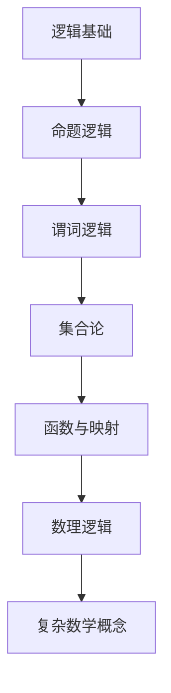
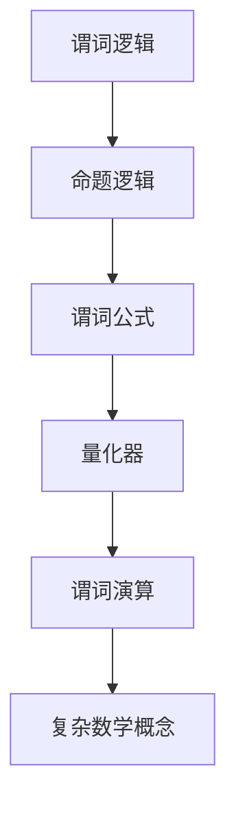
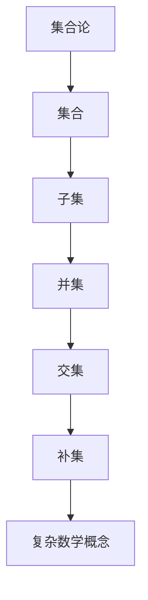
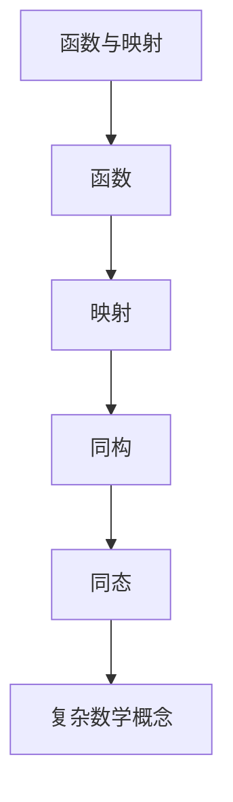
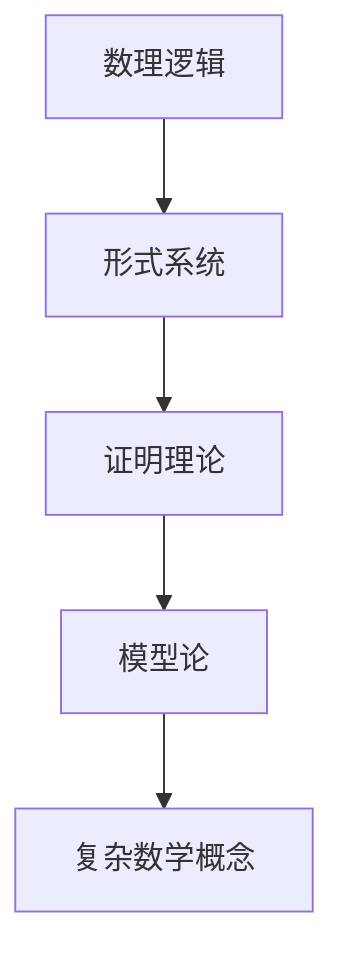
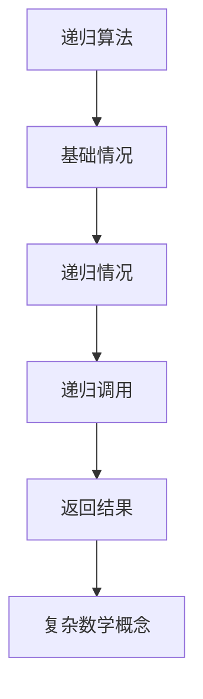
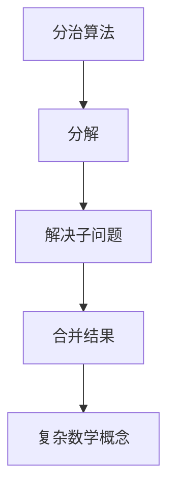
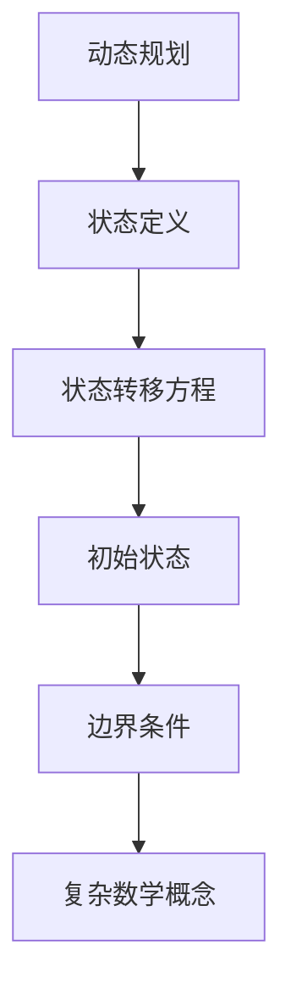

                 

# 数学与还原主义：复杂数学概念的基本构建

> 关键词：还原主义, 数学, 复杂性, 构建, 基础, 逻辑, 伪代码, 公式, 代码实现, 应用场景

> 摘要：本文旨在探讨复杂数学概念的构建过程，通过还原主义的方法，从基础逻辑出发，逐步深入到高级数学概念。我们将详细解释核心概念、算法原理、数学模型，并通过实际代码案例进行演示。此外，本文还将探讨这些概念在实际应用中的价值，并提供学习资源和开发工具推荐，帮助读者更好地理解和应用这些知识。

## 1. 背景介绍
### 1.1 目的和范围
本文旨在通过逐步推理的方式，深入探讨复杂数学概念的基本构建过程。我们将从基础逻辑出发，逐步构建复杂的数学模型，并通过实际代码案例进行演示。本文的目标读者是希望深入了解数学概念及其应用的程序员、软件架构师、人工智能专家以及对数学有浓厚兴趣的技术爱好者。

### 1.2 预期读者
- 程序员
- 软件架构师
- 人工智能专家
- 技术爱好者
- 数学爱好者

### 1.3 文档结构概述
本文将按照以下结构展开：
1. 背景介绍
2. 核心概念与联系
3. 核心算法原理 & 具体操作步骤
4. 数学模型和公式 & 详细讲解 & 举例说明
5. 项目实战：代码实际案例和详细解释说明
6. 实际应用场景
7. 工具和资源推荐
8. 总结：未来发展趋势与挑战
9. 附录：常见问题与解答
10. 扩展阅读 & 参考资料

### 1.4 术语表
#### 1.4.1 核心术语定义
- **还原主义**：一种哲学观点，认为复杂系统可以通过其组成部分及其相互作用来理解。
- **复杂数学概念**：指那些看似复杂但可以通过基础逻辑和数学原理逐步构建的概念。
- **伪代码**：一种用于描述算法的简化语言，不依赖于特定编程语言。

#### 1.4.2 相关概念解释
- **逻辑**：数学和计算机科学的基础，用于描述和分析事物之间的关系。
- **数学模型**：用数学语言描述现实世界现象的抽象表示。
- **算法**：解决特定问题的一系列步骤或规则。

#### 1.4.3 缩略词列表
- **API**：Application Programming Interface（应用程序编程接口）
- **IDE**：Integrated Development Environment（集成开发环境）
- **IDEA**：IntelliJ IDEA（一种流行的Java IDE）
- **JVM**：Java Virtual Machine（Java虚拟机）

## 2. 核心概念与联系
### 2.1 逻辑基础
逻辑是数学和计算机科学的基础。我们将从逻辑出发，逐步构建复杂的数学概念。

#### 逻辑流程图


### 2.2 谓词逻辑
谓词逻辑是逻辑的一个扩展，它允许我们描述更复杂的命题。

#### 伪代码


### 2.3 集合论
集合论是数学的基础之一，它描述了集合及其操作。

#### 伪代码


### 2.4 函数与映射
函数和映射是数学中的基本概念，它们描述了两个集合之间的关系。

#### 伪代码


### 2.5 数理逻辑
数理逻辑是逻辑的一个分支，它研究形式系统和证明理论。

#### 伪代码


## 3. 核心算法原理 & 具体操作步骤
### 3.1 递归算法
递归算法是一种通过自身调用来解决问题的方法。

#### 伪代码


### 3.2 分治算法
分治算法是一种将问题分解为更小的子问题，然后分别解决这些子问题的方法。

#### 伪代码


### 3.3 动态规划
动态规划是一种通过将问题分解为更小的子问题来解决问题的方法，同时存储子问题的解以避免重复计算。

#### 伪代码


## 4. 数学模型和公式 & 详细讲解 & 举例说明
### 4.1 代数模型
代数模型是用代数语言描述数学关系的一种方法。

#### 数学公式
$$
f(x) = ax^2 + bx + c
$$

### 4.2 几何模型
几何模型是用几何语言描述数学关系的一种方法。

#### 数学公式
$$
d = \sqrt{(x_2 - x_1)^2 + (y_2 - y_1)^2}
$$

### 4.3 概率模型
概率模型是用概率论描述随机事件的一种方法。

#### 数学公式
$$
P(A \cup B) = P(A) + P(B) - P(A \cap B)
$$

## 5. 项目实战：代码实际案例和详细解释说明
### 5.1 开发环境搭建
我们将使用Python作为编程语言，并使用Jupyter Notebook进行开发。

#### 安装Python
```bash
sudo apt-get install python3
```

#### 安装Jupyter Notebook
```bash
pip install jupyter
```

### 5.2 源代码详细实现和代码解读
我们将实现一个简单的递归算法来计算斐波那契数列。

#### 代码实现
```python
def fibonacci(n):
    if n <= 1:
        return n
    else:
        return fibonacci(n-1) + fibonacci(n-2)

# 测试代码
for i in range(10):
    print(fibonacci(i))
```

### 5.3 代码解读与分析
上述代码实现了一个递归算法来计算斐波那契数列。递归算法通过自身调用来解决问题，但可能会导致性能问题。为了优化性能，我们可以使用动态规划。

#### 优化后的代码
```python
def fibonacci_dp(n, memo={}):
    if n in memo:
        return memo[n]
    if n <= 1:
        return n
    memo[n] = fibonacci_dp(n-1, memo) + fibonacci_dp(n-2, memo)
    return memo[n]

# 测试代码
for i in range(10):
    print(fibonacci_dp(i))
```

## 6. 实际应用场景
复杂数学概念在许多领域都有广泛的应用，包括但不限于：
- 金融建模
- 机器学习
- 数据分析
- 优化问题
- 图像处理

## 7. 工具和资源推荐
### 7.1 学习资源推荐
#### 7.1.1 书籍推荐
- 《离散数学及其应用》（Discrete Mathematics and Its Applications）
- 《算法导论》（Introduction to Algorithms）

#### 7.1.2 在线课程
- Coursera上的《离散数学》课程
- edX上的《算法设计与分析》课程

#### 7.1.3 技术博客和网站
- Stack Overflow
- GitHub

### 7.2 开发工具框架推荐
#### 7.2.1 IDE和编辑器
- IntelliJ IDEA
- PyCharm

#### 7.2.2 调试和性能分析工具
- PyCharm的调试工具
- Python的cProfile模块

#### 7.2.3 相关框架和库
- NumPy
- SciPy
- Pandas

### 7.3 相关论文著作推荐
#### 7.3.1 经典论文
- Knuth的《计算机程序设计艺术》
- Dijkstra的《程序设计艺术》

#### 7.3.2 最新研究成果
- 论文《深度学习在图像识别中的应用》
- 论文《优化算法在金融建模中的应用》

#### 7.3.3 应用案例分析
- 《机器学习在医疗诊断中的应用》
- 《大数据分析在市场营销中的应用》

## 8. 总结：未来发展趋势与挑战
复杂数学概念在未来将继续发挥重要作用，特别是在人工智能、大数据和云计算等领域。然而，随着问题的复杂性增加，如何高效地构建和优化这些数学模型仍然是一个挑战。

## 9. 附录：常见问题与解答
### 9.1 问题：递归算法为什么会导致性能问题？
**解答**：递归算法可能会导致大量的重复计算，尤其是在解决大规模问题时。为了优化性能，可以使用动态规划等方法来存储子问题的解。

### 9.2 问题：如何选择合适的数学模型？
**解答**：选择合适的数学模型需要根据具体问题的特点来决定。通常，可以先尝试简单的模型，然后逐步优化和扩展。

## 10. 扩展阅读 & 参考资料
- 《离散数学及其应用》（Discrete Mathematics and Its Applications）
- 《算法导论》（Introduction to Algorithms）
- Coursera上的《离散数学》课程
- edX上的《算法设计与分析》课程
- Stack Overflow
- GitHub
- Knuth的《计算机程序设计艺术》
- Dijkstra的《程序设计艺术》
- 论文《深度学习在图像识别中的应用》
- 论文《优化算法在金融建模中的应用》
- 《机器学习在医疗诊断中的应用》
- 《大数据分析在市场营销中的应用》

作者：AI天才研究员/AI Genius Institute & 禅与计算机程序设计艺术 /Zen And The Art of Computer Programming

