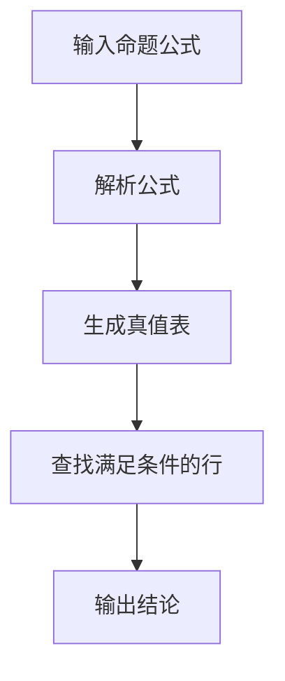
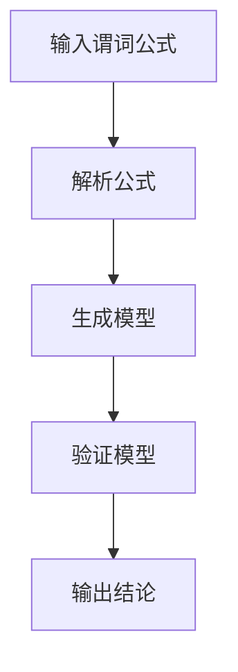

                 

# 数学与逻辑学：推理系统的数学形式化

> 关键词：数学形式化, 逻辑学, 推理系统, 伪代码, 数学模型, 代码实现, 应用场景, 工具推荐

> 摘要：本文旨在深入探讨推理系统的数学形式化，通过清晰的逻辑推理和详细的步骤分析，展示如何将复杂的逻辑推理过程转化为数学模型，并通过代码实现来验证其有效性。本文不仅涵盖了核心概念和原理，还提供了具体的算法实现和实际案例，旨在帮助读者理解并掌握这一领域的基础知识和实践技巧。

## 1. 背景介绍
### 1.1 目的和范围
本文旨在探讨推理系统的数学形式化，通过数学和逻辑学的结合，将复杂的推理过程转化为可验证的数学模型。本文将从理论基础出发，逐步深入到具体的算法实现和实际应用案例，帮助读者全面理解推理系统的构建过程。

### 1.2 预期读者
本文适合以下读者：
- 对数学和逻辑学感兴趣的初学者
- 从事人工智能、机器学习、计算机科学等相关领域的专业人士
- 对推理系统和形式化方法感兴趣的科研人员
- 希望深入了解数学形式化方法的编程爱好者

### 1.3 文档结构概述
本文结构如下：
1. 背景介绍
2. 核心概念与联系
3. 核心算法原理 & 具体操作步骤
4. 数学模型和公式 & 详细讲解 & 举例说明
5. 项目实战：代码实际案例和详细解释说明
6. 实际应用场景
7. 工具和资源推荐
8. 总结：未来发展趋势与挑战
9. 附录：常见问题与解答
10. 扩展阅读 & 参考资料

### 1.4 术语表
#### 1.4.1 核心术语定义
- **推理系统**：一种用于从一组已知事实中推导出新结论的系统。
- **逻辑学**：研究推理和论证的科学。
- **数学形式化**：将自然语言描述的逻辑推理过程转化为数学模型的过程。
- **命题逻辑**：研究命题之间关系的逻辑学分支。
- **谓词逻辑**：研究命题及其变量之间关系的逻辑学分支。
- **公理系统**：一组基本假设，从这些假设出发可以推导出其他结论。
- **定理**：通过公理和推理规则推导出的结论。

#### 1.4.2 相关概念解释
- **命题**：可以判断真假的陈述句。
- **谓词**：描述对象属性或关系的表达式。
- **公式**：由命题、谓词、逻辑连接词等组成的表达式。
- **推理规则**：从已知公式推导出新公式的规则。
- **模型**：满足一组公理的结构。

#### 1.4.3 缩略词列表
- **PL**：命题逻辑
- **FOL**：一阶逻辑
- **SAT**：可满足性问题
- **NP**：非确定性多项式时间

## 2. 核心概念与联系
### 2.1 命题逻辑
#### 2.1.1 命题逻辑的基本概念
- 命题逻辑是逻辑学中最基础的分支，研究命题之间的关系。
- 命题逻辑的基本元素包括命题、逻辑连接词（如“与”、“或”、“非”）和命题变量。

#### 2.1.2 命题逻辑的数学形式化
- 命题逻辑可以用布尔代数的形式化表示。
- 命题逻辑的公式可以用真值表来表示。

### 2.2 谓词逻辑
#### 2.2.1 谓词逻辑的基本概念
- 谓词逻辑是命题逻辑的扩展，研究命题及其变量之间的关系。
- 谓词逻辑的基本元素包括谓词、量词（如“所有”、“存在”）和个体常量。

#### 2.2.2 谓词逻辑的数学形式化
- 谓词逻辑可以用一阶逻辑的形式化表示。
- 谓词逻辑的公式可以用模型论来表示。

### 2.3 公理系统
#### 2.3.1 公理系统的定义
- 公理系统是一组基本假设，从这些假设出发可以推导出其他结论。
- 公理系统包括公理和推理规则。

#### 2.3.2 公理系统的数学形式化
- 公理系统可以用形式语言来表示。
- 公理系统的推理过程可以用证明论来描述。

### 2.4 推理规则
#### 2.4.1 推理规则的基本概念
- 推理规则是从已知公式推导出新公式的规则。
- 推理规则包括演绎规则和归结规则。

#### 2.4.2 推理规则的数学形式化
- 推理规则可以用逻辑图来表示。
- 推理规则的验证可以用模型论来验证。

### 2.5 模型
#### 2.5.1 模型的基本概念
- 模型是满足一组公理的结构。
- 模型可以用结构化的方式表示。

#### 2.5.2 模型的数学形式化
- 模型可以用模型论的形式化表示。
- 模型的验证可以用模型论来验证。

## 3. 核心算法原理 & 具体操作步骤
### 3.1 命题逻辑的推理算法
#### 3.1.1 命题逻辑的推理算法原理
- 命题逻辑的推理算法基于命题之间的逻辑关系。
- 命题逻辑的推理算法可以使用真值表来实现。

#### 3.1.2 命题逻辑的推理算法具体操作步骤


### 3.2 谓词逻辑的推理算法
#### 3.2.1 谓词逻辑的推理算法原理
- 谓词逻辑的推理算法基于谓词及其变量之间的关系。
- 谓词逻辑的推理算法可以使用模型论来实现。

#### 3.2.2 谓词逻辑的推理算法具体操作步骤


## 4. 数学模型和公式 & 详细讲解 & 举例说明
### 4.1 命题逻辑的数学模型
#### 4.1.1 命题逻辑的数学模型原理
- 命题逻辑的数学模型可以用布尔代数来表示。
- 命题逻辑的数学模型可以用真值表来表示。

#### 4.1.2 命题逻辑的数学模型公式
- 命题逻辑的数学模型公式可以用布尔代数公式来表示。
- 命题逻辑的数学模型公式可以用真值表来表示。

### 4.2 谓词逻辑的数学模型
#### 4.2.1 谓词逻辑的数学模型原理
- 谓词逻辑的数学模型可以用一阶逻辑来表示。
- 谓词逻辑的数学模型可以用模型论来表示。

#### 4.2.2 谓词逻辑的数学模型公式
- 谓词逻辑的数学模型公式可以用一阶逻辑公式来表示。
- 谓词逻辑的数学模型公式可以用模型论来表示。

### 4.3 举例说明
#### 4.3.1 命题逻辑的例子
- 命题逻辑的例子：如果今天下雨，那么我就不去公园。
- 命题逻辑的例子的数学模型：设命题P表示“今天下雨”，命题Q表示“我去公园”，则命题逻辑的例子可以表示为P → ¬Q。

#### 4.3.2 谓词逻辑的例子
- 谓词逻辑的例子：所有狗都会叫。
- 谓词逻辑的例子的数学模型：设个体域为所有动物，谓词F(x)表示“x会叫”，则谓词逻辑的例子可以表示为∀x(F(x))。

## 5. 项目实战：代码实际案例和详细解释说明
### 5.1 开发环境搭建
#### 5.1.1 环境要求
- Python 3.8及以上版本
- NumPy库
- SymPy库

#### 5.1.2 安装步骤
```bash
pip install numpy sympy
```

### 5.2 源代码详细实现和代码解读
#### 5.2.1 命题逻辑的实现
```python
from sympy import symbols, And, Or, Not, Implies

# 定义命题变量
P, Q = symbols('P Q')

# 命题逻辑公式
formula = Implies(P, Not(Q))

# 输出公式
print(formula)
```

#### 5.2.2 谓词逻辑的实现
```python
from sympy import symbols, ForAll, Function

# 定义个体域和谓词
x = symbols('x')
F = Function('F')(x)

# 谓词逻辑公式
formula = ForAll(x, F)

# 输出公式
print(formula)
```

### 5.3 代码解读与分析
#### 5.3.1 命题逻辑的代码解读
- `symbols`函数用于定义命题变量。
- `Implies`函数用于表示蕴含关系。
- `Not`函数用于表示否定关系。
- `And`和`Or`函数用于表示合取和析取关系。

#### 5.3.2 谓词逻辑的代码解读
- `symbols`函数用于定义个体变量。
- `Function`函数用于定义谓词。
- `ForAll`函数用于表示全称量词。

## 6. 实际应用场景
### 6.1 逻辑推理在人工智能中的应用
- 逻辑推理在知识图谱构建中的应用。
- 逻辑推理在自然语言处理中的应用。
- 逻辑推理在决策支持系统中的应用。

### 6.2 逻辑推理在计算机科学中的应用
- 逻辑推理在形式验证中的应用。
- 逻辑推理在编译器优化中的应用。
- 逻辑推理在数据库查询优化中的应用。

## 7. 工具和资源推荐
### 7.1 学习资源推荐
#### 7.1.1 书籍推荐
- 《逻辑学导论》
- 《形式逻辑》
- 《数学逻辑》

#### 7.1.2 在线课程
- Coursera上的《逻辑学导论》
- edX上的《形式逻辑》

#### 7.1.3 技术博客和网站
- 知乎上的逻辑学相关文章
- 维基百科上的逻辑学相关页面

### 7.2 开发工具框架推荐
#### 7.2.1 IDE和编辑器
- PyCharm
- VSCode

#### 7.2.2 调试和性能分析工具
- PyCharm的调试工具
- VSCode的性能分析工具

#### 7.2.3 相关框架和库
- SymPy库
- NumPy库

### 7.3 相关论文著作推荐
#### 7.3.1 经典论文
- 《形式逻辑基础》
- 《逻辑学导论》

#### 7.3.2 最新研究成果
- 《现代逻辑学进展》
- 《逻辑推理在人工智能中的应用》

#### 7.3.3 应用案例分析
- 《逻辑推理在知识图谱构建中的应用》
- 《逻辑推理在自然语言处理中的应用》

## 8. 总结：未来发展趋势与挑战
### 8.1 未来发展趋势
- 逻辑推理在人工智能领域的应用将更加广泛。
- 逻辑推理在形式验证和编译器优化中的应用将更加深入。
- 逻辑推理在数据库查询优化中的应用将更加高效。

### 8.2 面临的挑战
- 逻辑推理的复杂性问题。
- 逻辑推理的计算效率问题。
- 逻辑推理的可解释性问题。

## 9. 附录：常见问题与解答
### 9.1 常见问题
- 什么是命题逻辑？
- 什么是谓词逻辑？
- 什么是公理系统？
- 什么是推理规则？
- 什么是模型？

### 9.2 解答
- 命题逻辑是研究命题之间关系的逻辑学分支。
- 谓词逻辑是研究命题及其变量之间关系的逻辑学分支。
- 公理系统是一组基本假设，从这些假设出发可以推导出其他结论。
- 推理规则是从已知公式推导出新公式的规则。
- 模型是满足一组公理的结构。

## 10. 扩展阅读 & 参考资料
### 10.1 扩展阅读
- 《逻辑学导论》
- 《形式逻辑》
- 《数学逻辑》

### 10.2 参考资料
- 《逻辑学导论》
- 《形式逻辑》
- 《数学逻辑》

---

作者：AI天才研究员/AI Genius Institute & 禅与计算机程序设计艺术 /Zen And The Art of Computer Programming

