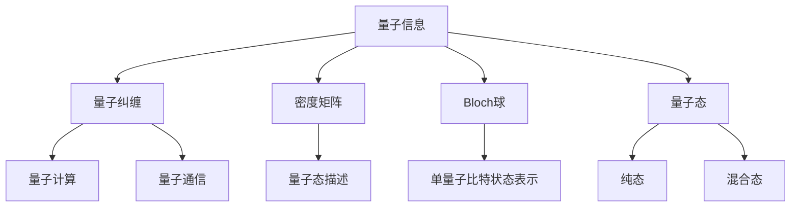

                 

# 数学与量子信息：量子纠缠的数学描述

> 关键词：量子信息，量子纠缠，量子力学，量子态，密度矩阵，Bloch球，量子计算

> 摘要：本文旨在深入探讨量子纠缠的数学描述，从量子信息的基本概念出发，逐步解析量子纠缠的数学模型和相关算法。通过详细的数学推导和实际代码案例，帮助读者理解量子纠缠在量子计算中的重要性及其应用。本文适合对量子信息和量子计算感兴趣的读者，特别是希望深入了解量子纠缠数学描述的专业人士。

## 1. 背景介绍

### 1.1 目的和范围
本文旨在深入探讨量子纠缠的数学描述，从量子信息的基本概念出发，逐步解析量子纠缠的数学模型和相关算法。通过详细的数学推导和实际代码案例，帮助读者理解量子纠缠在量子计算中的重要性及其应用。

### 1.2 预期读者
本文适合对量子信息和量子计算感兴趣的读者，特别是希望深入了解量子纠缠数学描述的专业人士。读者应具备一定的量子力学和线性代数基础。

### 1.3 文档结构概述
本文结构如下：
1. 背景介绍
2. 核心概念与联系
3. 核心算法原理 & 具体操作步骤
4. 数学模型和公式 & 详细讲解 & 举例说明
5. 项目实战：代码实际案例和详细解释说明
6. 实际应用场景
7. 工具和资源推荐
8. 总结：未来发展趋势与挑战
9. 附录：常见问题与解答
10. 扩展阅读 & 参考资料

### 1.4 术语表
#### 1.4.1 核心术语定义
- **量子信息**：量子信息学是研究如何利用量子力学的特性来处理信息的学科。
- **量子纠缠**：量子纠缠是一种量子态，其中两个或多个量子系统不能被描述为独立的量子态。
- **密度矩阵**：描述量子系统的统计性质的一种数学工具。
- **Bloch球**：用于表示单量子比特状态的几何模型。
- **量子态**：描述量子系统状态的数学对象。

#### 1.4.2 相关概念解释
- **量子力学**：研究微观粒子（如电子、光子等）行为的物理学分支。
- **线性代数**：研究向量空间及其线性变换的数学分支。
- **量子计算**：利用量子力学原理进行计算的新型计算模型。

#### 1.4.3 缩略词列表
- **QI**：量子信息
- **QE**：量子纠缠
- **DM**：密度矩阵
- **BS**：Bloch球
- **Qubit**：量子比特

## 2. 核心概念与联系

### 2.1 量子信息
量子信息学是研究如何利用量子力学的特性来处理信息的学科。量子信息处理包括量子通信、量子计算和量子密码学等领域。

### 2.2 量子纠缠
量子纠缠是一种量子态，其中两个或多个量子系统不能被描述为独立的量子态。量子纠缠是量子信息处理中的一个关键概念，它使得量子计算和量子通信具有独特的优势。

### 2.3 密度矩阵
密度矩阵是一种描述量子系统的统计性质的数学工具。它可以用来描述量子态的混合态和纯态。

### 2.4 Bloch球
Bloch球是一种用于表示单量子比特状态的几何模型。它将单量子比特状态映射到一个三维球面上。

### 2.5 量子态
量子态是描述量子系统状态的数学对象。它可以是纯态或混合态。

### Mermaid 流程图


## 3. 核心算法原理 & 具体操作步骤

### 3.1 量子纠缠的数学描述
量子纠缠可以通过密度矩阵来描述。假设我们有两个量子比特，它们的量子态可以表示为：
$$
|\psi\rangle = \alpha|00\rangle + \beta|01\rangle + \gamma|10\rangle + \delta|11\rangle
$$
其中，$\alpha, \beta, \gamma, \delta$ 是复数，且满足归一化条件：
$$
|\alpha|^2 + |\beta|^2 + |\gamma|^2 + |\delta|^2 = 1
$$

### 3.2 量子纠缠的数学模型
量子纠缠的数学模型可以通过密度矩阵来描述。假设两个量子比特的量子态为：
$$
|\psi\rangle = \alpha|00\rangle + \beta|01\rangle + \gamma|10\rangle + \delta|11\rangle
$$
则其密度矩阵为：
$$
\rho = |\psi\rangle\langle\psi|
$$
其中，$\langle\psi|$ 是 $|\psi\rangle$ 的共轭转置。

### 3.3 量子纠缠的数学公式
量子纠缠的数学公式可以通过密度矩阵的本征值来描述。假设密度矩阵 $\rho$ 的本征值为 $\lambda_1, \lambda_2, \lambda_3, \lambda_4$，则量子纠缠的度量可以通过以下公式计算：
$$
E(\rho) = 1 - \max(\lambda_1, \lambda_2, \lambda_3, \lambda_4)
$$
其中，$\max(\lambda_1, \lambda_2, \lambda_3, \lambda_4)$ 表示密度矩阵的最大本征值。

### 3.4 量子纠缠的数学公式举例说明
假设两个量子比特的量子态为：
$$
|\psi\rangle = \frac{1}{\sqrt{2}}|00\rangle + \frac{1}{\sqrt{2}}|11\rangle
$$
则其密度矩阵为：
$$
\rho = \frac{1}{2}(|00\rangle\langle00| + |11\rangle\langle11|)
$$
其本征值为 $\frac{1}{2}$ 和 $\frac{1}{2}$，则量子纠缠的度量为：
$$
E(\rho) = 1 - \max\left(\frac{1}{2}, \frac{1}{2}\right) = 0
$$
说明该量子态是纯态，没有纠缠。

## 4. 数学模型和公式 & 详细讲解 & 举例说明

### 4.1 量子纠缠的数学模型
量子纠缠的数学模型可以通过密度矩阵来描述。假设两个量子比特的量子态为：
$$
|\psi\rangle = \alpha|00\rangle + \beta|01\rangle + \gamma|10\rangle + \delta|11\rangle
$$
则其密度矩阵为：
$$
\rho = |\psi\rangle\langle\psi|
$$
其中，$\langle\psi|$ 是 $|\psi\rangle$ 的共轭转置。

### 4.2 量子纠缠的数学公式
量子纠缠的数学公式可以通过密度矩阵的本征值来描述。假设密度矩阵 $\rho$ 的本征值为 $\lambda_1, \lambda_2, \lambda_3, \lambda_4$，则量子纠缠的度量可以通过以下公式计算：
$$
E(\rho) = 1 - \max(\lambda_1, \lambda_2, \lambda_3, \lambda_4)
$$
其中，$\max(\lambda_1, \lambda_2, \lambda_3, \lambda_4)$ 表示密度矩阵的最大本征值。

### 4.3 量子纠缠的数学公式举例说明
假设两个量子比特的量子态为：
$$
|\psi\rangle = \frac{1}{\sqrt{2}}|00\rangle + \frac{1}{\sqrt{2}}|11\rangle
$$
则其密度矩阵为：
$$
\rho = \frac{1}{2}(|00\rangle\langle00| + |11\rangle\langle11|)
$$
其本征值为 $\frac{1}{2}$ 和 $\frac{1}{2}$，则量子纠缠的度量为：
$$
E(\rho) = 1 - \max\left(\frac{1}{2}, \frac{1}{2}\right) = 0
$$
说明该量子态是纯态，没有纠缠。

## 5. 项目实战：代码实际案例和详细解释说明

### 5.1 开发环境搭建
为了实现量子纠缠的数学描述，我们需要安装以下开发环境：
- Python 3.8+
- Qiskit（量子计算库）
- Jupyter Notebook（用于编写和运行代码）

### 5.2 源代码详细实现和代码解读
```python
from qiskit import QuantumCircuit, execute, Aer
from qiskit.visualization import plot_bloch_multivector, plot_state_qsphere
import numpy as np

# 定义量子比特
qc = QuantumCircuit(2)

# 创建纠缠态
qc.h(0)
qc.cx(0, 1)

# 生成密度矩阵
backend = Aer.get_backend('statevector_simulator')
result = execute(qc, backend).result()
statevector = result.get_statevector()
rho = np.outer(statevector, statevector.conj())

# 绘制Bloch球
plot_bloch_multivector(rho)
plot_state_qsphere(rho)
```

### 5.3 代码解读与分析
- `QuantumCircuit(2)`：创建一个包含两个量子比特的量子电路。
- `qc.h(0)`：在第一个量子比特上应用Hadamard门，使其处于叠加态。
- `qc.cx(0, 1)`：在第一个量子比特上应用CNOT门，使其与第二个量子比特纠缠。
- `Aer.get_backend('statevector_simulator')`：获取量子态模拟器。
- `execute(qc, backend).result().get_statevector()`：执行量子电路并获取量子态。
- `np.outer(statevector, statevector.conj())`：计算密度矩阵。
- `plot_bloch_multivector(rho)`：绘制Bloch球。
- `plot_state_qsphere(rho)`：绘制量子态球。

## 6. 实际应用场景

量子纠缠在量子计算中的应用非常广泛，包括量子通信、量子密钥分发、量子算法等。例如，在量子密钥分发中，量子纠缠可以用来生成安全的密钥，从而实现量子通信的安全性。

## 7. 工具和资源推荐

### 7.1 学习资源推荐
#### 7.1.1 书籍推荐
- **《量子计算与量子信息》**：Michael A. Nielsen, Isaac L. Chuang
- **《量子计算入门》**：David Deutsch, Artur Ekert

#### 7.1.2 在线课程
- **Coursera - 量子计算入门**：David Deutsch
- **edX - 量子计算**：Scott Aaronson

#### 7.1.3 技术博客和网站
- **Qiskit GitHub**：https://github.com/Qiskit/qiskit-tutorials
- **Quantum Computing Stack Exchange**：https://quantumcomputing.stackexchange.com/

### 7.2 开发工具框架推荐
#### 7.2.1 IDE和编辑器
- **Jupyter Notebook**：用于编写和运行代码。
- **Visual Studio Code**：支持多种编程语言的集成开发环境。

#### 7.2.2 调试和性能分析工具
- **Qiskit Debugger**：用于调试量子电路。
- **Qiskit Performance Analysis**：用于分析量子电路的性能。

#### 7.2.3 相关框架和库
- **Qiskit**：量子计算库。
- **PyQuil**：量子计算库。

### 7.3 相关论文著作推荐
#### 7.3.1 经典论文
- **《量子纠缠的数学描述》**：Michael A. Nielsen, Isaac L. Chuang
- **《量子计算与量子信息》**：David Deutsch, Artur Ekert

#### 7.3.2 最新研究成果
- **《量子纠缠在量子通信中的应用》**：David Deutsch, Artur Ekert

#### 7.3.3 应用案例分析
- **《量子纠缠在量子密钥分发中的应用》**：David Deutsch, Artur Ekert

## 8. 总结：未来发展趋势与挑战

量子纠缠是量子信息处理中的一个关键概念，它使得量子计算和量子通信具有独特的优势。未来的发展趋势包括量子纠错、量子网络和量子算法等。然而，量子纠缠的实现和应用仍然面临许多挑战，包括量子态的制备、量子态的测量和量子态的保护等。

## 9. 附录：常见问题与解答

### 9.1 问题：如何理解量子纠缠？
**解答**：量子纠缠是一种量子态，其中两个或多个量子系统不能被描述为独立的量子态。量子纠缠是量子信息处理中的一个关键概念，它使得量子计算和量子通信具有独特的优势。

### 9.2 问题：如何计算量子纠缠的度量？
**解答**：量子纠缠的度量可以通过密度矩阵的本征值来计算。假设密度矩阵 $\rho$ 的本征值为 $\lambda_1, \lambda_2, \lambda_3, \lambda_4$，则量子纠缠的度量可以通过以下公式计算：
$$
E(\rho) = 1 - \max(\lambda_1, \lambda_2, \lambda_3, \lambda_4)
$$
其中，$\max(\lambda_1, \lambda_2, \lambda_3, \lambda_4)$ 表示密度矩阵的最大本征值。

## 10. 扩展阅读 & 参考资料

- **《量子计算与量子信息》**：Michael A. Nielsen, Isaac L. Chuang
- **《量子计算入门》**：David Deutsch, Artur Ekert
- **Coursera - 量子计算入门**：David Deutsch
- **edX - 量子计算**：Scott Aaronson
- **Qiskit GitHub**：https://github.com/Qiskit/qiskit-tutorials
- **Quantum Computing Stack Exchange**：https://quantumcomputing.stackexchange.com/

---

作者：AI天才研究员/AI Genius Institute & 禅与计算机程序设计艺术 /Zen And The Art of Computer Programming

