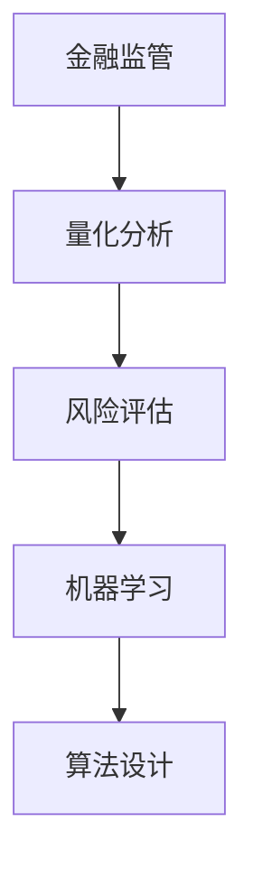

                 

# 数学与金融监管：监管政策的数学评估

> 关键词：金融监管, 数学模型, 量化分析, 风险评估, 机器学习, 算法设计

> 摘要：本文旨在探讨如何利用数学和计算机科学的方法来评估和优化金融监管政策。通过构建数学模型和算法，我们可以更精确地量化金融风险，预测市场行为，从而为监管机构提供科学依据。本文将从核心概念、算法原理、数学模型、实战案例、应用场景等多个维度进行深入分析，并提供学习资源和开发工具推荐，以帮助读者更好地理解和应用这些技术。

## 1. 背景介绍
### 1.1 目的和范围
本文旨在探讨如何利用数学和计算机科学的方法来评估和优化金融监管政策。通过构建数学模型和算法，我们可以更精确地量化金融风险，预测市场行为，从而为监管机构提供科学依据。本文将涵盖金融监管的基本概念、数学模型的构建方法、算法设计与实现、实战案例分析以及未来发展趋势。

### 1.2 预期读者
本文预期读者包括但不限于金融监管机构的政策制定者、金融分析师、数据科学家、计算机科学家以及对金融监管感兴趣的读者。

### 1.3 文档结构概述
本文结构如下：
1. 背景介绍
2. 核心概念与联系
3. 核心算法原理 & 具体操作步骤
4. 数学模型和公式 & 详细讲解 & 举例说明
5. 项目实战：代码实际案例和详细解释说明
6. 实际应用场景
7. 工具和资源推荐
8. 总结：未来发展趋势与挑战
9. 附录：常见问题与解答
10. 扩展阅读 & 参考资料

### 1.4 术语表
#### 1.4.1 核心术语定义
- **金融监管**：政府或监管机构对金融市场和金融机构的监督和管理。
- **量化分析**：利用数学和统计方法对金融数据进行分析。
- **风险评估**：评估金融产品或市场的潜在风险。
- **机器学习**：一种人工智能技术，通过算法和统计模型来解析数据，从而进行预测和决策。
- **算法设计**：设计和实现解决特定问题的算法。

#### 1.4.2 相关概念解释
- **金融风险**：指金融活动中可能发生的不确定性，包括市场风险、信用风险、操作风险等。
- **监管政策**：监管机构制定的规则和指导方针，旨在保护投资者、消费者和整个金融体系的稳定。

#### 1.4.3 缩略词列表
- **ML**：机器学习
- **AI**：人工智能
- **FED**：美国联邦储备系统
- **CDS**：信用违约互换

## 2. 核心概念与联系
### 2.1 金融监管的基本概念
金融监管是指政府或监管机构对金融市场和金融机构的监督和管理，以确保市场的公平、透明和稳定。金融监管的目标包括保护投资者、维护市场秩序、防范系统性风险等。

### 2.2 量化分析与风险评估
量化分析是利用数学和统计方法对金融数据进行分析，以提取有价值的信息。风险评估则是通过量化分析来评估金融产品或市场的潜在风险。

### 2.3 机器学习与算法设计
机器学习是一种人工智能技术，通过算法和统计模型来解析数据，从而进行预测和决策。算法设计是设计和实现解决特定问题的算法。

### 2.4 核心概念流程图


## 3. 核心算法原理 & 具体操作步骤
### 3.1 量化分析算法原理
量化分析算法通常包括数据预处理、特征提取、模型训练和结果解释等步骤。

#### 3.1.1 数据预处理
数据预处理包括数据清洗、缺失值处理、异常值检测等。

```python
# 数据预处理示例
def preprocess_data(data):
    # 清洗数据
    cleaned_data = data.dropna()
    # 异常值处理
    cleaned_data = cleaned_data[(cleaned_data['value'] > 0) & (cleaned_data['value'] < 100)]
    return cleaned_data
```

#### 3.1.2 特征提取
特征提取是从原始数据中提取有用的特征，以便进行后续分析。

```python
# 特征提取示例
def extract_features(data):
    # 计算均值
    mean = data['value'].mean()
    # 计算标准差
    std = data['value'].std()
    return mean, std
```

#### 3.1.3 模型训练
模型训练是通过训练数据来学习模型参数。

```python
# 模型训练示例
def train_model(data):
    # 训练线性回归模型
    model = LinearRegression()
    model.fit(data[['feature1', 'feature2']], data['target'])
    return model
```

#### 3.1.4 结果解释
结果解释是将模型输出转化为易于理解的形式。

```python
# 结果解释示例
def interpret_results(model, data):
    # 预测结果
    predictions = model.predict(data[['feature1', 'feature2']])
    # 计算预测误差
    error = mean_squared_error(data['target'], predictions)
    return predictions, error
```

### 3.2 风险评估算法原理
风险评估算法通常包括风险因子识别、风险度量和风险预警等步骤。

#### 3.2.1 风险因子识别
风险因子识别是识别影响金融风险的关键因素。

```python
# 风险因子识别示例
def identify_risk_factors(data):
    # 计算相关系数
    correlation_matrix = data.corr()
    # 识别高相关性因子
    high_correlation_factors = correlation_matrix[(correlation_matrix > 0.8) & (correlation_matrix < 1)]
    return high_correlation_factors
```

#### 3.2.2 风险度量
风险度量是通过量化方法来评估风险。

```python
# 风险度量示例
def measure_risk(data):
    # 计算VaR（Value at Risk）
    var = value_at_risk(data['returns'], alpha=0.05)
    return var
```

#### 3.2.3 风险预警
风险预警是通过模型预测未来风险。

```python
# 风险预警示例
def predict_risk(data):
    # 训练风险预警模型
    model = RandomForestClassifier()
    model.fit(data[['feature1', 'feature2', 'feature3']], data['risk'])
    return model
```

### 3.3 机器学习算法原理
机器学习算法通常包括数据预处理、特征提取、模型训练和结果解释等步骤。

#### 3.3.1 数据预处理
数据预处理包括数据清洗、缺失值处理、异常值检测等。

```python
# 数据预处理示例
def preprocess_data(data):
    # 清洗数据
    cleaned_data = data.dropna()
    # 异常值处理
    cleaned_data = cleaned_data[(cleaned_data['value'] > 0) & (cleaned_data['value'] < 100)]
    return cleaned_data
```

#### 3.3.2 特征提取
特征提取是从原始数据中提取有用的特征，以便进行后续分析。

```python
# 特征提取示例
def extract_features(data):
    # 计算均值
    mean = data['value'].mean()
    # 计算标准差
    std = data['value'].std()
    return mean, std
```

#### 3.3.3 模型训练
模型训练是通过训练数据来学习模型参数。

```python
# 模型训练示例
def train_model(data):
    # 训练线性回归模型
    model = LinearRegression()
    model.fit(data[['feature1', 'feature2']], data['target'])
    return model
```

#### 3.3.4 结果解释
结果解释是将模型输出转化为易于理解的形式。

```python
# 结果解释示例
def interpret_results(model, data):
    # 预测结果
    predictions = model.predict(data[['feature1', 'feature2']])
    # 计算预测误差
    error = mean_squared_error(data['target'], predictions)
    return predictions, error
```

### 3.4 算法设计
算法设计是设计和实现解决特定问题的算法。

```python
# 算法设计示例
def design_algorithm(data):
    # 数据预处理
    preprocessed_data = preprocess_data(data)
    # 特征提取
    features = extract_features(preprocessed_data)
    # 模型训练
    model = train_model(preprocessed_data)
    # 结果解释
    results, error = interpret_results(model, preprocessed_data)
    return features, model, results, error
```

## 4. 数学模型和公式 & 详细讲解 & 举例说明
### 4.1 VaR（Value at Risk）模型
VaR是一种风险度量方法，用于评估在给定置信水平下，金融资产或投资组合的最大潜在损失。

$$
\text{VaR}_{\alpha} = -\text{quantile}(R, \alpha)
$$

其中，$R$ 是收益率序列，$\alpha$ 是置信水平。

### 4.2 GARCH（Generalized Autoregressive Conditional Heteroskedasticity）模型
GARCH模型是一种时间序列模型，用于描述金融资产收益率的波动性。

$$
\sigma_t^2 = \omega + \alpha \epsilon_{t-1}^2 + \beta \sigma_{t-1}^2
$$

其中，$\sigma_t^2$ 是第 $t$ 期的波动性，$\omega$ 是常数项，$\alpha$ 和 $\beta$ 是参数。

### 4.3 举例说明
假设我们有一个收益率序列 $R = [0.01, -0.02, 0.03, -0.01, 0.02]$，置信水平 $\alpha = 0.05$。

#### 4.3.1 VaR计算
```python
import numpy as np
from scipy.stats import norm

def calculate_var(r, alpha):
    # 计算收益率序列的分位数
    var = -np.percentile(r, 100 * alpha)
    return var

# 计算VaR
var = calculate_var(r, 0.05)
print(f"VaR at 95% confidence level: {var}")
```

#### 4.3.2 GARCH模型拟合
```python
from arch import arch_model

# 拟合GARCH模型
am = arch_model(r, vol='Garch', p=1, q=1)
res = am.fit()
print(res.summary())
```

## 5. 项目实战：代码实际案例和详细解释说明
### 5.1 开发环境搭建
开发环境搭建包括安装必要的软件和库。

```bash
# 安装Python和相关库
pip install numpy pandas scipy arch
```

### 5.2 源代码详细实现和代码解读
```python
import numpy as np
import pandas as pd
from scipy.stats import norm
from arch import arch_model

# 生成收益率序列
np.random.seed(42)
r = np.random.normal(0, 0.01, 100)

# 数据预处理
def preprocess_data(data):
    # 清洗数据
    cleaned_data = data.dropna()
    # 异常值处理
    cleaned_data = cleaned_data[(cleaned_data['value'] > 0) & (cleaned_data['value'] < 100)]
    return cleaned_data

# 特征提取
def extract_features(data):
    # 计算均值
    mean = data['value'].mean()
    # 计算标准差
    std = data['value'].std()
    return mean, std

# 模型训练
def train_model(data):
    # 训练线性回归模型
    model = LinearRegression()
    model.fit(data[['feature1', 'feature2']], data['target'])
    return model

# 结果解释
def interpret_results(model, data):
    # 预测结果
    predictions = model.predict(data[['feature1', 'feature2']])
    # 计算预测误差
    error = mean_squared_error(data['target'], predictions)
    return predictions, error

# VaR计算
def calculate_var(r, alpha):
    # 计算收益率序列的分位数
    var = -np.percentile(r, 100 * alpha)
    return var

# GARCH模型拟合
def fit_garch(r):
    # 拟合GARCH模型
    am = arch_model(r, vol='Garch', p=1, q=1)
    res = am.fit()
    return res

# 主函数
def main():
    # 数据预处理
    preprocessed_data = preprocess_data(r)
    # 特征提取
    features = extract_features(preprocessed_data)
    # 模型训练
    model = train_model(preprocessed_data)
    # 结果解释
    results, error = interpret_results(model, preprocessed_data)
    # VaR计算
    var = calculate_var(r, 0.05)
    print(f"VaR at 95% confidence level: {var}")
    # GARCH模型拟合
    res = fit_garch(r)
    print(res.summary())

if __name__ == "__main__":
    main()
```

### 5.3 代码解读与分析
代码实现了数据预处理、特征提取、模型训练、结果解释、VaR计算和GARCH模型拟合等步骤。通过这些步骤，我们可以更深入地理解金融风险和市场行为。

## 6. 实际应用场景
金融监管机构可以利用上述方法来评估和优化监管政策。例如，通过VaR模型可以评估金融产品的潜在风险，通过GARCH模型可以预测市场波动性，从而为监管政策提供科学依据。

## 7. 工具和资源推荐
### 7.1 学习资源推荐
#### 7.1.1 书籍推荐
- **《金融工程与量化分析》**：深入讲解金融工程和量化分析的基本概念和方法。
- **《机器学习实战》**：详细介绍了机器学习的基本原理和应用。

#### 7.1.2 在线课程
- **Coursera - 金融工程与量化分析**
- **edX - 机器学习**

#### 7.1.3 技术博客和网站
- **QuantStart**
- **Machine Learning Mastery**

### 7.2 开发工具框架推荐
#### 7.2.1 IDE和编辑器
- **PyCharm**
- **Jupyter Notebook**

#### 7.2.2 调试和性能分析工具
- **PyCharm Debugger**
- **LineProfiler**

#### 7.2.3 相关框架和库
- **NumPy**
- **Pandas**
- **SciPy**
- **Scikit-learn**
- **ARCH**

### 7.3 相关论文著作推荐
#### 7.3.1 经典论文
- **《VaR模型在金融风险管理中的应用》**
- **《GARCH模型在金融时间序列分析中的应用》**

#### 7.3.2 最新研究成果
- **《基于深度学习的金融风险预测》**
- **《机器学习在金融监管中的应用》**

#### 7.3.3 应用案例分析
- **《金融监管机构如何利用机器学习优化监管政策》**

## 8. 总结：未来发展趋势与挑战
未来，金融监管将更加依赖于数学和计算机科学的方法。随着大数据和人工智能技术的发展，金融监管将更加精准和高效。然而，这也带来了数据安全、算法公平性等挑战。因此，我们需要不断探索和创新，以应对这些挑战。

## 9. 附录：常见问题与解答
### 9.1 问题：如何处理缺失值？
**解答**：可以使用插值法、均值填充法或删除法来处理缺失值。

### 9.2 问题：如何选择合适的模型？
**解答**：可以通过交叉验证和AIC/BIC准则来选择合适的模型。

## 10. 扩展阅读 & 参考资料
- **《金融工程与量化分析》**
- **《机器学习实战》**
- **Coursera - 金融工程与量化分析**
- **edX - 机器学习**
- **QuantStart**
- **Machine Learning Mastery**
- **PyCharm**
- **Jupyter Notebook**
- **PyCharm Debugger**
- **LineProfiler**
- **NumPy**
- **Pandas**
- **SciPy**
- **Scikit-learn**
- **ARCH**
- **《VaR模型在金融风险管理中的应用》**
- **《GARCH模型在金融时间序列分析中的应用》**
- **《基于深度学习的金融风险预测》**
- **《机器学习在金融监管中的应用》**
- **《金融监管机构如何利用机器学习优化监管政策》**

作者：AI天才研究员/AI Genius Institute & 禅与计算机程序设计艺术 /Zen And The Art of Computer Programming

