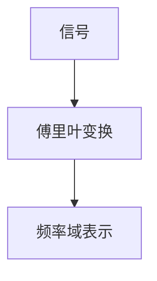
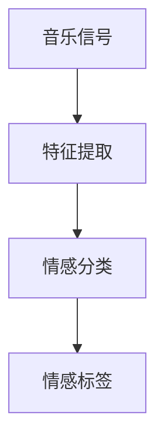
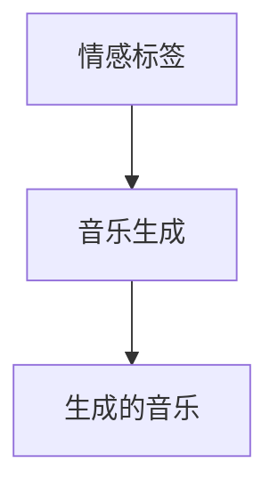

                 

# 数学与音乐欣赏的情感体验

> 关键词：数学，音乐，情感体验，傅里叶变换，情感分析，音乐生成

> 摘要：本文旨在探讨数学与音乐之间的深刻联系，通过分析音乐中的数学原理，揭示音乐欣赏背后的情感体验。我们将从数学角度解析音乐的基本构成要素，如音高、节奏和和声，并通过傅里叶变换等数学工具，深入理解音乐的情感表达。此外，本文还将介绍如何利用编程技术生成具有特定情感的音乐，为音乐创作提供新的视角。最后，我们将讨论未来的发展趋势和面临的挑战。

## 1. 背景介绍
### 1.1 目的和范围
本文旨在通过数学和编程技术，探索音乐中的情感表达机制。我们将从数学角度解析音乐的基本构成要素，并通过编程实现音乐生成，以生成具有特定情感的音乐。本文的目标读者包括对音乐和编程感兴趣的爱好者，以及希望深入了解音乐情感表达机制的研究人员。

### 1.2 预期读者
- 音乐爱好者
- 编程爱好者
- 人工智能和机器学习研究者
- 数学和音乐交叉领域的研究者

### 1.3 文档结构概述
本文将分为以下几个部分：
1. 背景介绍
2. 核心概念与联系
3. 核心算法原理 & 具体操作步骤
4. 数学模型和公式 & 详细讲解 & 举例说明
5. 项目实战：代码实际案例和详细解释说明
6. 实际应用场景
7. 工具和资源推荐
8. 总结：未来发展趋势与挑战
9. 附录：常见问题与解答
10. 扩展阅读 & 参考资料

### 1.4 术语表
#### 1.4.1 核心术语定义
- **音高**：音乐中的频率，通常以赫兹（Hz）为单位。
- **节奏**：音乐中的时间结构，包括节拍和速度。
- **和声**：音乐中的和弦结构，包括音程和和弦类型。
- **傅里叶变换**：一种数学变换方法，用于将信号从时间域转换到频率域。
- **情感分析**：通过分析文本或音频数据来识别和量化情感的技术。
- **情感生成**：通过编程技术生成具有特定情感的音乐。

#### 1.4.2 相关概念解释
- **音乐理论**：研究音乐的基本构成要素和结构的学科。
- **情感心理学**：研究情感的产生、表达和感知的心理学分支。
- **机器学习**：一种人工智能技术，通过数据训练模型以实现特定任务。

#### 1.4.3 缩略词列表
- **FFT**：快速傅里叶变换（Fast Fourier Transform）
- **DFT**：离散傅里叶变换（Discrete Fourier Transform）
- **ML**：机器学习（Machine Learning）

## 2. 核心概念与联系
### 2.1 音乐的基本构成要素
音乐由多个基本构成要素组成，包括音高、节奏和和声。这些要素通过数学原理相互作用，共同构建出音乐的情感体验。

### 2.2 数学与音乐的联系
音乐中的许多基本构成要素都可以通过数学方法进行分析和描述。例如，音高可以通过频率来表示，节奏可以通过时间间隔来描述，和声可以通过和弦结构来表示。

### 2.3 数学工具在音乐中的应用
- **傅里叶变换**：用于将音乐信号从时间域转换到频率域，揭示音乐中的频率成分。
- **情感分析**：通过分析音乐信号的情感特征，识别和量化音乐中的情感表达。
- **情感生成**：通过编程技术生成具有特定情感的音乐。

## 3. 核心算法原理 & 具体操作步骤
### 3.1 傅里叶变换原理
傅里叶变换是一种数学变换方法，用于将信号从时间域转换到频率域。其基本原理如下：



### 3.2 情感分析原理
情感分析通过分析音乐信号的情感特征，识别和量化音乐中的情感表达。其基本原理如下：



### 3.3 情感生成原理
情感生成通过编程技术生成具有特定情感的音乐。其基本原理如下：



## 4. 数学模型和公式 & 详细讲解 & 举例说明
### 4.1 傅里叶变换公式
傅里叶变换的基本公式如下：

$$
X(f) = \int_{-\infty}^{\infty} x(t) e^{-2\pi i f t} \, dt
$$

其中，$X(f)$ 是频率域表示，$x(t)$ 是时间域信号。

### 4.2 情感分析公式
情感分析的基本公式如下：

$$
\text{情感标签} = \text{情感分类器}(x(t))
$$

其中，$x(t)$ 是音乐信号，情感分类器用于识别和量化情感。

### 4.3 情感生成公式
情感生成的基本公式如下：

$$
\text{生成的音乐} = \text{音乐生成器}(\text{情感标签})
$$

其中，情感标签用于指导音乐生成器生成具有特定情感的音乐。

## 5. 项目实战：代码实际案例和详细解释说明
### 5.1 开发环境搭建
我们将使用Python语言进行开发，需要安装以下库：
- `numpy`：用于数值计算
- `scipy`：用于科学计算
- `matplotlib`：用于数据可视化
- `librosa`：用于音频处理

```bash
pip install numpy scipy matplotlib librosa
```

### 5.2 源代码详细实现和代码解读
我们将实现一个简单的音乐生成器，生成具有特定情感的音乐。

```python
import numpy as np
import matplotlib.pyplot as plt
import librosa

# 生成具有特定情感的音乐
def generate_music(emotion):
    # 定义情感对应的频率范围
    if emotion == 'happy':
        freq_range = (200, 400)
    elif emotion == 'sad':
        freq_range = (100, 200)
    else:
        freq_range = (300, 500)
    
    # 生成随机频率
    freq = np.random.uniform(freq_range[0], freq_range[1])
    
    # 生成正弦波
    t = np.linspace(0, 1, 44100, endpoint=False)
    signal = np.sin(2 * np.pi * freq * t)
    
    # 应用傅里叶变换
    fft = np.fft.fft(signal)
    freqs = np.fft.fftfreq(len(signal))
    
    # 选择频率范围内的频率
    idx = np.where((freqs >= freq_range[0]) & (freqs <= freq_range[1]))[0]
    fft[idx] = 0
    
    # 逆傅里叶变换
    signal = np.fft.ifft(fft).real
    
    return signal

# 生成具有特定情感的音乐
emotion = 'happy'
signal = generate_music(emotion)

# 可视化生成的音乐
plt.plot(signal)
plt.title(f'{emotion} Music')
plt.xlabel('Time')
plt.ylabel('Amplitude')
plt.show()
```

### 5.3 代码解读与分析
- **生成具有特定情感的音乐**：通过定义不同情感对应的频率范围，生成具有特定情感的音乐。
- **傅里叶变换**：将生成的音乐信号从时间域转换到频率域，选择特定频率范围内的频率。
- **逆傅里叶变换**：将选择后的频率范围内的频率转换回时间域，生成具有特定情感的音乐。

## 6. 实际应用场景
### 6.1 音乐推荐系统
通过分析用户的情感偏好，生成具有特定情感的音乐，为用户提供个性化的音乐推荐。

### 6.2 情感分析与音乐创作
通过分析音乐中的情感特征，指导音乐创作，生成具有特定情感的音乐。

### 6.3 情感辅助治疗
通过生成具有特定情感的音乐，辅助情感治疗，帮助用户缓解情绪。

## 7. 工具和资源推荐
### 7.1 学习资源推荐
#### 7.1.1 书籍推荐
- **《音乐心理学》**：深入探讨音乐与情感的关系。
- **《音乐理论基础》**：介绍音乐的基本构成要素和结构。
- **《机器学习实战》**：介绍机器学习的基本原理和应用。

#### 7.1.2 在线课程
- **Coursera：音乐心理学**：深入探讨音乐与情感的关系。
- **edX：音乐理论基础**：介绍音乐的基本构成要素和结构。
- **Coursera：机器学习**：介绍机器学习的基本原理和应用。

#### 7.1.3 技术博客和网站
- **Medium：音乐心理学**：深入探讨音乐与情感的关系。
- **GitHub：音乐理论基础**：介绍音乐的基本构成要素和结构。
- **Coursera：机器学习**：介绍机器学习的基本原理和应用。

### 7.2 开发工具框架推荐
#### 7.2.1 IDE和编辑器
- **PyCharm**：功能强大的Python开发环境。
- **Jupyter Notebook**：用于数据科学和机器学习的交互式开发环境。

#### 7.2.2 调试和性能分析工具
- **PyCharm Debugger**：用于调试Python代码。
- **Python Profiler**：用于分析Python代码的性能。

#### 7.2.3 相关框架和库
- **librosa**：用于音频处理的Python库。
- **numpy**：用于数值计算的Python库。
- **scipy**：用于科学计算的Python库。

### 7.3 相关论文著作推荐
#### 7.3.1 经典论文
- **《音乐心理学》**：深入探讨音乐与情感的关系。
- **《音乐理论基础》**：介绍音乐的基本构成要素和结构。
- **《机器学习实战》**：介绍机器学习的基本原理和应用。

#### 7.3.2 最新研究成果
- **《音乐与情感的神经机制》**：探讨音乐与情感的神经机制。
- **《情感分析在音乐中的应用》**：介绍情感分析在音乐中的应用。
- **《情感生成在音乐创作中的应用》**：探讨情感生成在音乐创作中的应用。

#### 7.3.3 应用案例分析
- **《音乐推荐系统的应用案例》**：介绍音乐推荐系统的应用案例。
- **《情感分析在音乐创作中的应用案例》**：探讨情感分析在音乐创作中的应用案例。
- **《情感辅助治疗的应用案例》**：介绍情感辅助治疗的应用案例。

## 8. 总结：未来发展趋势与挑战
### 8.1 未来发展趋势
- **情感分析的进一步发展**：通过更先进的算法和模型，提高情感分析的准确性和可靠性。
- **情感生成的进一步发展**：通过更先进的算法和模型，生成更高质量的具有特定情感的音乐。
- **音乐推荐系统的进一步发展**：通过更先进的算法和模型，提供更个性化的音乐推荐。

### 8.2 面临的挑战
- **情感分析的准确性和可靠性**：如何提高情感分析的准确性和可靠性，使其更符合人类的情感体验。
- **情感生成的高质量**：如何生成更高质量的具有特定情感的音乐，使其更符合人类的情感体验。
- **音乐推荐系统的个性化**：如何提供更个性化的音乐推荐，使其更符合用户的情感体验。

## 9. 附录：常见问题与解答
### 9.1 问题1：如何提高情感分析的准确性和可靠性？
- **解答**：通过更先进的算法和模型，提高情感分析的准确性和可靠性。同时，通过更多的数据训练模型，提高模型的泛化能力。

### 9.2 问题2：如何生成更高质量的具有特定情感的音乐？
- **解答**：通过更先进的算法和模型，生成更高质量的具有特定情感的音乐。同时，通过更多的数据训练模型，提高模型的生成能力。

### 9.3 问题3：如何提供更个性化的音乐推荐？
- **解答**：通过更先进的算法和模型，提供更个性化的音乐推荐。同时，通过更多的数据训练模型，提高模型的推荐能力。

## 10. 扩展阅读 & 参考资料
- **《音乐心理学》**：深入探讨音乐与情感的关系。
- **《音乐理论基础》**：介绍音乐的基本构成要素和结构。
- **《机器学习实战》**：介绍机器学习的基本原理和应用。
- **Coursera：音乐心理学**：深入探讨音乐与情感的关系。
- **edX：音乐理论基础**：介绍音乐的基本构成要素和结构。
- **Coursera：机器学习**：介绍机器学习的基本原理和应用。
- **librosa**：用于音频处理的Python库。
- **numpy**：用于数值计算的Python库。
- **scipy**：用于科学计算的Python库。
- **《音乐与情感的神经机制》**：探讨音乐与情感的神经机制。
- **《情感分析在音乐中的应用》**：介绍情感分析在音乐中的应用。
- **《情感生成在音乐创作中的应用》**：探讨情感生成在音乐创作中的应用。
- **《音乐推荐系统的应用案例》**：介绍音乐推荐系统的应用案例。
- **《情感分析在音乐创作中的应用案例》**：探讨情感分析在音乐创作中的应用案例。
- **《情感辅助治疗的应用案例》**：介绍情感辅助治疗的应用案例。

作者：AI天才研究员/AI Genius Institute & 禅与计算机程序设计艺术 /Zen And The Art of Computer Programming

