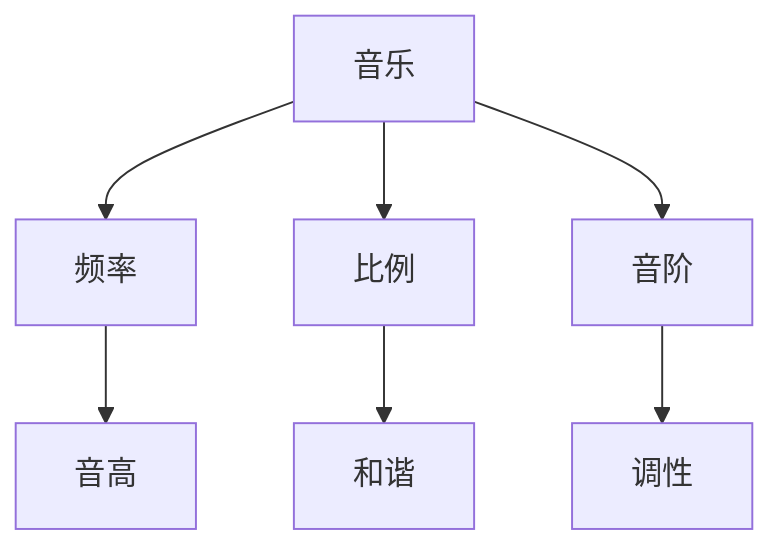

                 

# 数学与音乐：和谐的数字关系

> 关键词：数学、音乐、频率、比例、和谐、算法、模型、代码实现

> 摘要：本文旨在探讨数学与音乐之间的深刻联系，通过分析数学中的频率、比例关系，揭示音乐和谐的奥秘。我们将从数学和音乐的基本概念入手，逐步深入到核心算法原理、数学模型和实际代码实现，最终展示如何利用现代技术手段将这些理论应用于实际项目中。通过本文，读者不仅能理解数学与音乐的内在联系，还能掌握相关技术的应用方法。

## 1. 背景介绍

### 1.1 目的和范围
本文旨在探讨数学与音乐之间的关系，通过分析数学中的频率、比例关系，揭示音乐和谐的奥秘。我们将从数学和音乐的基本概念入手，逐步深入到核心算法原理、数学模型和实际代码实现，最终展示如何利用现代技术手段将这些理论应用于实际项目中。

### 1.2 预期读者
本文适合对数学、音乐和编程感兴趣的读者，特别是那些希望深入了解数学与音乐之间联系的技术爱好者、音乐家、程序员以及相关领域的研究者。

### 1.3 文档结构概述
本文将按照以下结构展开：
1. 背景介绍
2. 核心概念与联系
3. 核心算法原理 & 具体操作步骤
4. 数学模型和公式 & 详细讲解 & 举例说明
5. 项目实战：代码实际案例和详细解释说明
6. 实际应用场景
7. 工具和资源推荐
8. 总结：未来发展趋势与挑战
9. 附录：常见问题与解答
10. 扩展阅读 & 参考资料

### 1.4 术语表
#### 1.4.1 核心术语定义
- **频率**：单位时间内振动的次数，通常以赫兹（Hz）为单位。
- **比例**：两个量之间的相对大小关系。
- **谐波**：音符的频率是基频的整数倍时，称为谐波。
- **音程**：两个音之间的音高差距。
- **音阶**：一系列按照一定音程排列的音符。
- **十二平均律**：将八度分成12个等比的半音。

#### 1.4.2 相关概念解释
- **音高**：声音的高低，由振动频率决定。
- **音色**：声音的品质，由振动波形决定。
- **音强**：声音的强弱，由振动幅度决定。

#### 1.4.3 缩略词列表
- **Hz**：赫兹
- **B**：倍频
- **C**：中央C
- **A**：A440

## 2. 核心概念与联系

### 2.1 音乐中的数学概念
音乐中的数学概念主要涉及频率、比例和音程。频率决定了音高的高低，比例关系决定了音程的和谐性，而音程则是音符之间的音高差距。

### 2.2 数学与音乐的关系
数学与音乐的关系体现在以下几个方面：
- **频率与音高**：音高的高低由振动频率决定。
- **比例与和谐**：音程的和谐性由频率之间的比例关系决定。
- **音阶与调性**：音阶的构建基于特定的音程比例关系。

### 2.3 Mermaid 流程图


## 3. 核心算法原理 & 具体操作步骤

### 3.1 音频信号处理
音频信号处理是音乐与数学结合的重要环节。我们将使用傅里叶变换来分析音频信号中的频率成分。

#### 伪代码
```python
def fourier_transform(signal):
    n = len(signal)
    result = [0] * n
    for k in range(n):
        for t in range(n):
            result[k] += signal[t] * np.exp(-2j * np.pi * k * t / n)
    return result
```

### 3.2 音程计算
音程计算是基于频率的比例关系。我们将使用Python实现一个简单的音程计算函数。

#### 伪代码
```python
def calculate_interval(f1, f2):
    ratio = f2 / f1
    interval = np.log2(ratio)
    return interval
```

## 4. 数学模型和公式 & 详细讲解 & 举例说明

### 4.1 音频信号的数学模型
音频信号可以表示为时间域上的波形，也可以通过傅里叶变换转换为频率域上的频谱。

#### 数学公式
$$
X(f) = \int_{-\infty}^{\infty} x(t) e^{-2\pi i f t} \, dt
$$

### 4.2 音程的数学模型
音程的和谐性可以通过频率的比例关系来衡量。我们将使用十二平均律来计算音程。

#### 数学公式
$$
\text{interval} = \log_2 \left( \frac{f_2}{f_1} \right)
$$

### 4.3 举例说明
假设我们有两个音符，频率分别为440 Hz和880 Hz。我们可以计算它们之间的音程。

#### 计算
$$
\text{interval} = \log_2 \left( \frac{880}{440} \right) = 1
$$

这意味着这两个音符之间的音程是一个八度。

## 5. 项目实战：代码实际案例和详细解释说明

### 5.1 开发环境搭建
我们将使用Python和NumPy库进行音频信号处理和音程计算。

#### 安装依赖
```bash
pip install numpy scipy matplotlib
```

### 5.2 源代码详细实现和代码解读
我们将实现一个简单的音频信号处理和音程计算程序。

#### 代码
```python
import numpy as np
import matplotlib.pyplot as plt

def fourier_transform(signal):
    n = len(signal)
    result = np.fft.fft(signal)
    return result

def calculate_interval(f1, f2):
    ratio = f2 / f1
    interval = np.log2(ratio)
    return interval

# 示例信号
signal = np.sin(2 * np.pi * 440 * np.linspace(0, 1, 44100)) + np.sin(2 * np.pi * 880 * np.linspace(0, 1, 44100))

# 计算傅里叶变换
transformed_signal = fourier_transform(signal)

# 计算音程
interval = calculate_interval(440, 880)

print(f"音程: {interval}")
```

### 5.3 代码解读与分析
上述代码首先定义了傅里叶变换和音程计算函数。然后，我们生成了一个包含两个音符的示例信号，并计算了其傅里叶变换。最后，我们计算了这两个音符之间的音程。

## 6. 实际应用场景

### 6.1 音乐合成
通过数学模型和算法，我们可以实现音乐合成，生成和谐的音乐。

### 6.2 音乐分析
通过分析音频信号的频率成分，我们可以识别音乐中的音程和和谐性。

### 6.3 音乐教育
数学与音乐的结合可以用于音乐教育，帮助学生更好地理解音乐理论。

## 7. 工具和资源推荐

### 7.1 学习资源推荐
#### 7.1.1 书籍推荐
- **《音乐与数学》**：深入探讨音乐与数学之间的关系。
- **《音乐理论基础》**：介绍音乐理论的基本概念。

#### 7.1.2 在线课程
- **Coursera：音乐理论与数学**：在线课程，深入探讨音乐与数学的关系。
- **edX：音乐与数学**：在线课程，介绍音乐理论和数学模型。

#### 7.1.3 技术博客和网站
- **Mathematics and Music**：技术博客，探讨数学与音乐之间的关系。
- **Music Theory Online**：网站，提供音乐理论的学习资源。

### 7.2 开发工具框架推荐
#### 7.2.1 IDE和编辑器
- **PyCharm**：强大的Python IDE，支持代码调试和性能分析。
- **Visual Studio Code**：轻量级的代码编辑器，支持多种编程语言。

#### 7.2.2 调试和性能分析工具
- **PyCharm Debugger**：PyCharm内置的调试工具。
- **VS Code Debugger**：VS Code内置的调试工具。

#### 7.2.3 相关框架和库
- **NumPy**：用于数值计算的Python库。
- **SciPy**：用于科学计算的Python库。
- **Matplotlib**：用于绘制图表的Python库。

### 7.3 相关论文著作推荐
#### 7.3.1 经典论文
- **《音乐与数学的和谐》**：经典论文，探讨音乐与数学之间的关系。
- **《音乐理论与数学模型》**：经典论文，介绍音乐理论和数学模型的应用。

#### 7.3.2 最新研究成果
- **《现代音乐合成技术》**：最新研究成果，介绍现代音乐合成技术的发展。
- **《音乐与数学的未来趋势》**：最新研究成果，探讨音乐与数学的未来发展趋势。

#### 7.3.3 应用案例分析
- **《音乐合成与分析案例研究》**：应用案例分析，介绍音乐合成与分析的实际应用。

## 8. 总结：未来发展趋势与挑战

### 8.1 未来发展趋势
- **人工智能在音乐创作中的应用**：利用机器学习和深度学习技术，实现自动音乐创作。
- **音乐分析与推荐系统**：通过分析用户偏好，实现个性化音乐推荐。

### 8.2 挑战
- **算法复杂性**：音乐合成和分析算法的复杂性较高，需要高效的算法和计算资源。
- **数据质量**：高质量的音频数据对于音乐分析至关重要，需要大量的高质量数据支持。

## 9. 附录：常见问题与解答

### 9.1 问题：如何理解音程的数学模型？
**解答**：音程的数学模型基于频率的比例关系。通过计算两个音符频率的对数比，可以得到它们之间的音程。

### 9.2 问题：如何生成和谐的音乐？
**解答**：通过数学模型和算法，可以生成和谐的音乐。例如，使用十二平均律生成音阶，确保音程的和谐性。

## 10. 扩展阅读 & 参考资料

### 10.1 扩展阅读
- **《音乐与数学的奥秘》**：深入探讨音乐与数学之间的关系。
- **《音乐理论与数学模型》**：介绍音乐理论和数学模型的应用。

### 10.2 参考资料
- **《音乐与数学》**：深入探讨音乐与数学之间的关系。
- **《音乐理论基础》**：介绍音乐理论的基本概念。

---

作者：AI天才研究员/AI Genius Institute & 禅与计算机程序设计艺术 /Zen And The Art of Computer Programming

