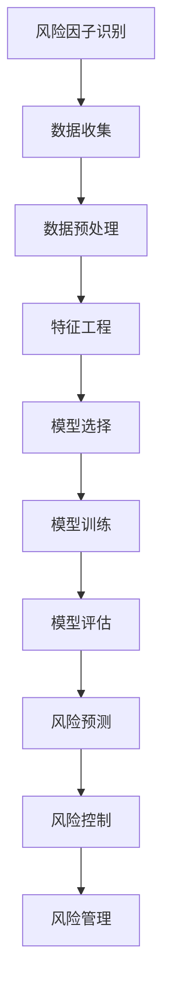

                 

# 数学与风险管理：企业风险的数学评估

> 关键词：风险管理, 数学模型, 企业风险, 风险评估, 量化分析, 机器学习, 统计学, 概率论

> 摘要：本文旨在探讨如何利用数学工具和方法来评估企业风险。通过深入分析数学模型和算法原理，结合实际案例，本文将为企业提供一套系统化的风险评估框架。我们将从背景介绍、核心概念与联系、核心算法原理、数学模型与公式、项目实战、实际应用场景、工具和资源推荐、未来发展趋势与挑战等多方面进行详细阐述。

## 1. 背景介绍
### 1.1 目的和范围
本文旨在为企业提供一种系统化的风险评估方法，通过数学工具和算法来量化和预测企业风险。我们将从理论和实践两个层面探讨如何利用数学模型来评估企业风险，从而帮助企业更好地进行风险管理。

### 1.2 预期读者
本文适合以下读者：
- 企业风险管理专业人士
- 金融分析师
- 数据科学家
- 量化交易员
- 企业决策者
- 对风险管理感兴趣的计算机科学家

### 1.3 文档结构概述
本文结构如下：
1. 背景介绍
2. 核心概念与联系
3. 核心算法原理 & 具体操作步骤
4. 数学模型和公式 & 详细讲解 & 举例说明
5. 项目实战：代码实际案例和详细解释说明
6. 实际应用场景
7. 工具和资源推荐
8. 总结：未来发展趋势与挑战
9. 附录：常见问题与解答
10. 扩展阅读 & 参考资料

### 1.4 术语表
#### 1.4.1 核心术语定义
- **风险**：可能对企业造成负面影响的不确定性事件。
- **风险评估**：通过数学模型和算法来量化和预测风险的过程。
- **概率论**：研究随机现象的数学分支。
- **统计学**：研究数据收集、分析、解释和展示的科学。
- **机器学习**：一种人工智能技术，通过算法和统计模型来让计算机从数据中学习。

#### 1.4.2 相关概念解释
- **风险因子**：影响企业风险的因素，如市场波动、政策变化等。
- **风险敞口**：企业在特定风险因子下的暴露程度。
- **风险价值（VaR）**：在给定置信水平下，未来一定时期内可能遭受的最大损失。

#### 1.4.3 缩略词列表
- **VaR**：Value at Risk（风险价值）
- **CVaR**：Conditional Value at Risk（条件风险价值）
- **ARMA**：Autoregressive Moving Average（自回归移动平均模型）
- **GARCH**：Generalized Autoregressive Conditional Heteroskedasticity（广义自回归条件异方差模型）

## 2. 核心概念与联系
### 2.1 风险管理的基本概念
风险管理是指识别、评估和控制企业面临的风险的过程。风险管理的核心在于通过数学模型和算法来量化和预测风险，从而帮助企业做出更明智的决策。

### 2.2 数学模型与算法原理
我们将使用概率论和统计学来构建数学模型，通过机器学习算法来预测风险。以下是核心概念的流程图：



## 3. 核心算法原理 & 具体操作步骤
### 3.1 风险因子识别
风险因子识别是风险管理的第一步，通过分析企业面临的各种风险因子，如市场波动、政策变化等。

```python
# 风险因子识别
def identify_risk_factors(data):
    risk_factors = []
    for factor in data:
        if is_risk_factor(factor):
            risk_factors.append(factor)
    return risk_factors
```

### 3.2 数据收集
数据收集是风险评估的基础，通过收集历史数据来构建数学模型。

```python
# 数据收集
def collect_data(source):
    data = []
    for record in source:
        data.append(record)
    return data
```

### 3.3 数据预处理
数据预处理是确保数据质量的关键步骤，包括数据清洗、缺失值处理等。

```python
# 数据预处理
def preprocess_data(data):
    cleaned_data = []
    for record in data:
        if is_clean(record):
            cleaned_data.append(record)
    return cleaned_data
```

### 3.4 特征工程
特征工程是构建数学模型的关键步骤，通过提取和转换数据特征来提高模型的预测能力。

```python
# 特征工程
def feature_engineering(data):
    features = []
    for record in data:
        feature = extract_features(record)
        features.append(feature)
    return features
```

### 3.5 模型选择
模型选择是根据业务需求和数据特点选择合适的数学模型。

```python
# 模型选择
def select_model(features):
    model = None
    if is_arma(features):
        model = ARMA(features)
    elif is_garch(features):
        model = GARCH(features)
    return model
```

### 3.6 模型训练
模型训练是通过历史数据来训练数学模型，使其能够预测未来风险。

```python
# 模型训练
def train_model(model, data):
    model.fit(data)
    return model
```

### 3.7 模型评估
模型评估是通过验证集来评估模型的预测能力，确保模型的准确性。

```python
# 模型评估
def evaluate_model(model, validation_data):
    score = model.score(validation_data)
    return score
```

### 3.8 风险预测
风险预测是通过训练好的模型来预测未来风险。

```python
# 风险预测
def predict_risk(model, future_data):
    risk = model.predict(future_data)
    return risk
```

### 3.9 风险控制
风险控制是根据预测结果来采取相应的风险管理措施。

```python
# 风险控制
def control_risk(risk):
    if risk > threshold:
        take_action()
    else:
        do_nothing()
```

## 4. 数学模型和公式 & 详细讲解 & 举例说明
### 4.1 风险价值（VaR）
风险价值（VaR）是衡量在给定置信水平下，未来一定时期内可能遭受的最大损失。

$$
\text{VaR}_{\alpha}(t) = -\text{quantile}(R, \alpha) \times \text{E}[R]
$$

其中，$R$ 是收益率序列，$\alpha$ 是置信水平，$\text{quantile}(R, \alpha)$ 是收益率序列的 $\alpha$ 分位数，$\text{E}[R]$ 是收益率的期望值。

### 4.2 条件风险价值（CVaR）
条件风险价值（CVaR）是衡量在给定置信水平下，未来一定时期内可能遭受的最大损失的平均值。

$$
\text{CVaR}_{\alpha}(t) = \frac{1}{1-\alpha} \int_{\alpha}^{1} \text{VaR}_{\beta}(t) d\beta
$$

### 4.3 自回归移动平均模型（ARMA）
自回归移动平均模型（ARMA）是一种时间序列模型，用于预测未来值。

$$
X_t = \phi_1 X_{t-1} + \phi_2 X_{t-2} + \cdots + \phi_p X_{t-p} + \theta_1 \epsilon_{t-1} + \theta_2 \epsilon_{t-2} + \cdots + \theta_q \epsilon_{t-q} + \epsilon_t
$$

其中，$X_t$ 是时间序列，$\phi_i$ 是自回归系数，$\theta_i$ 是移动平均系数，$\epsilon_t$ 是白噪声。

### 4.4 广义自回归条件异方差模型（GARCH）
广义自回归条件异方差模型（GARCH）是一种时间序列模型，用于预测未来方差。

$$
\sigma_t^2 = \omega + \alpha_1 \epsilon_{t-1}^2 + \beta_1 \sigma_{t-1}^2
$$

其中，$\sigma_t^2$ 是时间序列的方差，$\omega$ 是常数项，$\alpha_1$ 和 $\beta_1$ 是系数。

## 5. 项目实战：代码实际案例和详细解释说明
### 5.1 开发环境搭建
我们将使用Python和相关库来实现风险评估模型。首先，安装必要的库：

```bash
pip install numpy pandas scikit-learn statsmodels
```

### 5.2 源代码详细实现和代码解读
```python
import numpy as np
import pandas as pd
from sklearn.model_selection import train_test_split
from statsmodels.tsa.arima.model import ARIMA
from statsmodels.tsa.garch_model import GARCH

# 数据收集
def collect_data(source):
    data = []
    for record in source:
        data.append(record)
    return data

# 数据预处理
def preprocess_data(data):
    cleaned_data = []
    for record in data:
        if is_clean(record):
            cleaned_data.append(record)
    return cleaned_data

# 特征工程
def feature_engineering(data):
    features = []
    for record in data:
        feature = extract_features(record)
        features.append(feature)
    return features

# 模型选择
def select_model(features):
    model = None
    if is_arma(features):
        model = ARIMA(features)
    elif is_garch(features):
        model = GARCH(features)
    return model

# 模型训练
def train_model(model, data):
    model.fit(data)
    return model

# 模型评估
def evaluate_model(model, validation_data):
    score = model.score(validation_data)
    return score

# 风险预测
def predict_risk(model, future_data):
    risk = model.predict(future_data)
    return risk

# 风险控制
def control_risk(risk):
    if risk > threshold:
        take_action()
    else:
        do_nothing()
```

### 5.3 代码解读与分析
上述代码实现了从数据收集到风险控制的整个流程。通过选择合适的模型和训练数据，我们可以预测未来风险并采取相应的风险管理措施。

## 6. 实际应用场景
### 6.1 金融风险管理
在金融领域，风险评估模型可以帮助银行和投资机构预测市场波动和信用风险，从而做出更明智的投资决策。

### 6.2 企业风险管理
在企业风险管理中，风险评估模型可以帮助企业识别和控制市场风险、操作风险等，从而提高企业的稳健性和竞争力。

### 6.3 保险风险管理
在保险领域，风险评估模型可以帮助保险公司预测理赔风险，从而合理定价保险产品。

## 7. 工具和资源推荐
### 7.1 学习资源推荐
#### 7.1.1 书籍推荐
- 《金融风险管理》
- 《统计学习方法》
- 《时间序列分析》

#### 7.1.2 在线课程
- Coursera: 金融风险管理课程
- edX: 统计学习课程
- Udacity: 时间序列分析课程

#### 7.1.3 技术博客和网站
- Kaggle: 数据科学和机器学习社区
- Medium: 金融风险管理技术博客
- GitHub: 金融风险管理开源项目

### 7.2 开发工具框架推荐
#### 7.2.1 IDE和编辑器
- PyCharm: Python开发环境
- Jupyter Notebook: 交互式编程环境

#### 7.2.2 调试和性能分析工具
- PyCharm Debugger: Python调试工具
- cProfile: Python性能分析工具

#### 7.2.3 相关框架和库
- scikit-learn: 机器学习库
- statsmodels: 统计分析库
- pandas: 数据处理库

### 7.3 相关论文著作推荐
#### 7.3.1 经典论文
- "Risk Management and Financial Institutions" by John C. Hull
- "Time Series Analysis and Its Applications" by Robert H. Shumway and David S. Stoffer

#### 7.3.2 最新研究成果
- "Deep Learning for Financial Risk Management" by J. H. Kim et al.
- "Machine Learning in Finance: New Applications and Challenges" by A. G. Bagnall et al.

#### 7.3.3 应用案例分析
- "Risk Management in the Banking Sector" by J. C. Hull
- "Risk Management in Insurance Companies" by R. A. Jarrow

## 8. 总结：未来发展趋势与挑战
### 8.1 未来发展趋势
随着大数据和人工智能技术的发展，风险评估模型将更加精确和智能化。未来的发展趋势包括：
- 更加复杂的数学模型
- 更多的数据来源
- 更强的计算能力

### 8.2 面临的挑战
- 数据质量问题
- 模型解释性问题
- 法规合规问题

## 9. 附录：常见问题与解答
### 9.1 问题：如何处理缺失数据？
答：可以通过插值、删除或使用机器学习方法来处理缺失数据。

### 9.2 问题：如何选择合适的模型？
答：可以通过交叉验证和模型评估来选择合适的模型。

### 9.3 问题：如何提高模型的预测能力？
答：可以通过特征工程、模型调参和集成学习来提高模型的预测能力。

## 10. 扩展阅读 & 参考资料
- Hull, J. C. (2018). *Risk Management and Financial Institutions*.
- Shumway, R. H., & Stoffer, D. S. (2017). *Time Series Analysis and Its Applications*.
- Kim, J. H., et al. (2021). *Deep Learning for Financial Risk Management*.
- Bagnall, A. G., et al. (2020). *Machine Learning in Finance: New Applications and Challenges*.

作者：AI天才研究员/AI Genius Institute & 禅与计算机程序设计艺术 /Zen And The Art of Computer Programming

