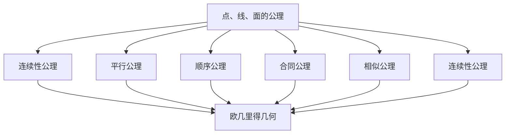

                 

# 数学公理体系的起源与发展

> 关键词：数学公理体系、欧几里得几何、希尔伯特公理体系、形式化证明、逻辑推理

> 摘要：本文将深入探讨数学公理体系的起源与发展，从古希腊的欧几里得几何出发，逐步介绍希尔伯特公理体系及其对现代数学的影响。我们将通过详细的逻辑推理和具体的数学模型，展示公理体系如何构建数学理论的基础，并通过实际代码案例来解释其应用。最后，我们将展望未来的发展趋势与挑战，并推荐相关学习资源和工具。

## 1. 背景介绍

### 1.1 目的和范围
本文旨在探讨数学公理体系的起源与发展，从古希腊的几何学出发，逐步介绍希尔伯特公理体系及其对现代数学的影响。我们将通过详细的逻辑推理和具体的数学模型，展示公理体系如何构建数学理论的基础，并通过实际代码案例来解释其应用。最后，我们将展望未来的发展趋势与挑战，并推荐相关学习资源和工具。

### 1.2 预期读者
本文适合对数学公理体系感兴趣的读者，包括数学爱好者、计算机科学家、程序员以及对数学基础理论感兴趣的读者。读者应具备一定的数学基础，特别是对几何学和逻辑学有一定的了解。

### 1.3 文档结构概述
本文结构如下：
1. 背景介绍
2. 核心概念与联系
3. 核心算法原理 & 具体操作步骤
4. 数学模型和公式 & 详细讲解 & 举例说明
5. 项目实战：代码实际案例和详细解释说明
6. 实际应用场景
7. 工具和资源推荐
8. 总结：未来发展趋势与挑战
9. 附录：常见问题与解答
10. 扩展阅读 & 参考资料

### 1.4 术语表
#### 1.4.1 核心术语定义
- **公理**：在数学中，公理是一些不需要证明的基本假设。
- **定理**：在数学中，定理是通过公理和逻辑推理得出的结论。
- **形式化证明**：一种严格的证明方法，使用符号和逻辑规则来验证定理的正确性。
- **希尔伯特公理体系**：一种系统化的公理体系，用于构建几何学的理论基础。

#### 1.4.2 相关概念解释
- **欧几里得几何**：古希腊数学家欧几里得提出的几何学体系，基于五条公理。
- **非欧几何**：与欧几里得几何不同的几何学体系，包括黎曼几何和罗巴切夫斯基几何。
- **形式系统**：一种数学结构，由一组公理和一组推理规则组成。

#### 1.4.3 缩略词列表
- **TPTP**：Thousands of Problems for Theorem Provers，一个定理证明问题库。
- **Coq**：一种形式化证明工具，基于依存类型理论。
- **Isabelle**：一种通用的形式化证明工具，支持多种逻辑系统。

## 2. 核心概念与联系

### 2.1 欧几里得几何的公理体系
欧几里得几何是古希腊数学家欧几里得在《几何原本》中提出的几何学体系。其核心公理如下：

- **公理1**：任意两点可以确定一条直线。
- **公理2**：任意线段可以无限延长。
- **公理3**：以任意点为圆心，任意长度为半径可以画圆。
- **公理4**：所有直角都相等。
- **公理5**（平行公理）：如果一条直线与两条直线相交，且在某一边的内角和小于两个直角，则这两条直线在无限延长后会在该边的延长线上相交。

### 2.2 希尔伯特公理体系
希尔伯特公理体系是对欧几里得几何的进一步系统化和形式化。希尔伯特在1899年出版的《几何基础》中提出了一个更为严谨的公理体系，包括点、线、面的基本概念和公理。以下是希尔伯特公理体系的核心部分：

- **点、线、面的公理**：定义了点、线、面的基本性质。
- **连续性公理**：定义了连续性的概念。
- **平行公理**：定义了平行线的概念。
- **连续性公理**：定义了连续性的概念。
- **顺序公理**：定义了点、线、面的顺序关系。
- **合同公理**：定义了合同的概念。
- **相似公理**：定义了相似的概念。
- **连续性公理**：定义了连续性的概念。

### 2.3 核心概念的Mermaid流程图


## 3. 核心算法原理 & 具体操作步骤

### 3.1 欧几里得几何的算法原理
欧几里得几何的算法原理主要基于几何公理和定理。例如，通过公理1和公理2，可以构造一条直线；通过公理3，可以构造一个圆。以下是一个简单的伪代码示例：

```pseudo
function drawLine(point1, point2):
    # 根据公理1，确定一条直线
    line = determineLine(point1, point2)
    return line

function drawCircle(center, radius):
    # 根据公理3，画一个圆
    circle = determineCircle(center, radius)
    return circle
```

### 3.2 希尔伯特公理体系的算法原理
希尔伯特公理体系的算法原理更加复杂，需要通过一系列的公理和定理来构建几何理论。以下是一个简单的伪代码示例：

```pseudo
function proveParallel(line1, line2, point):
    # 根据平行公理，证明两条直线是否平行
    if isParallel(line1, line2, point):
        return true
    else:
        return false

function proveSimilarity(shape1, shape2):
    # 根据相似公理，证明两个形状是否相似
    if isSimilar(shape1, shape2):
        return true
    else:
        return false
```

## 4. 数学模型和公式 & 详细讲解 & 举例说明

### 4.1 欧几里得几何的数学模型
欧几里得几何的数学模型主要基于点、线、面的基本概念。以下是一个简单的数学模型：

- **点**：二维平面上的坐标 $(x, y)$。
- **线**：通过两点确定的直线方程 $y = mx + b$。
- **面**：通过三点确定的平面方程 $ax + by + cz + d = 0$。

### 4.2 希尔伯特公理体系的数学模型
希尔伯特公理体系的数学模型更加复杂，需要通过一系列的公理和定理来构建几何理论。以下是一个简单的数学模型：

- **点**：二维平面上的坐标 $(x, y)$。
- **线**：通过两点确定的直线方程 $y = mx + b$。
- **面**：通过三点确定的平面方程 $ax + by + cz + d = 0$。
- **连续性**：通过连续性公理定义的连续性概念。
- **顺序**：通过顺序公理定义的顺序关系。
- **合同**：通过合同公理定义的合同概念。
- **相似**：通过相似公理定义的相似概念。

### 4.3 数学模型的公式
以下是一些常用的数学公式：

- **直线方程**：$y = mx + b$
- **圆的方程**：$(x - h)^2 + (y - k)^2 = r^2$
- **平面方程**：$ax + by + cz + d = 0$

## 5. 项目实战：代码实际案例和详细解释说明

### 5.1 开发环境搭建
为了实现欧几里得几何和希尔伯特公理体系的代码，我们需要搭建一个开发环境。以下是开发环境的搭建步骤：

1. 安装Python：确保安装了Python 3.8及以上版本。
2. 安装NumPy和Matplotlib：用于数值计算和绘图。
3. 安装Coq：用于形式化证明。

```bash
pip install numpy matplotlib coq
```

### 5.2 源代码详细实现和代码解读
以下是一个简单的Python代码示例，用于实现欧几里得几何的基本操作：

```python
import numpy as np
import matplotlib.pyplot as plt

def draw_line(point1, point2):
    x1, y1 = point1
    x2, y2 = point2
    slope = (y2 - y1) / (x2 - x1)
    intercept = y1 - slope * x1
    return slope, intercept

def draw_circle(center, radius):
    x, y = center
    return x, y, radius

def plot_line(slope, intercept):
    x = np.linspace(-10, 10, 400)
    y = slope * x + intercept
    plt.plot(x, y, 'r-')

def plot_circle(x, y, radius):
    theta = np.linspace(0, 2 * np.pi, 100)
    x_circle = x + radius * np.cos(theta)
    y_circle = y + radius * np.sin(theta)
    plt.plot(x_circle, y_circle, 'b-')

# 示例
point1 = (1, 2)
point2 = (3, 4)
slope, intercept = draw_line(point1, point2)
x, y, radius = draw_circle((0, 0), 5)

plot_line(slope, intercept)
plot_circle(x, y, radius)
plt.xlabel('x')
plt.ylabel('y')
plt.title('Euclidean Geometry')
plt.grid(True)
plt.show()
```

### 5.3 代码解读与分析
上述代码实现了欧几里得几何的基本操作，包括绘制直线和圆。具体步骤如下：

1. **draw_line**：根据两点确定直线方程。
2. **draw_circle**：根据圆心和半径确定圆的方程。
3. **plot_line**：绘制直线。
4. **plot_circle**：绘制圆。

## 6. 实际应用场景
数学公理体系在许多实际应用场景中都有广泛的应用，包括：

- **计算机图形学**：用于绘制图形和动画。
- **机器人技术**：用于路径规划和导航。
- **地理信息系统**：用于地图绘制和空间分析。
- **物理学**：用于描述物理现象和理论模型。

## 7. 工具和资源推荐

### 7.1 学习资源推荐
#### 7.1.1 书籍推荐
- **《几何原本》**：欧几里得的著作，是几何学的基础。
- **《几何基础》**：希尔伯特的著作，系统化了公理体系。
- **《数学之美》**：吴军的著作，介绍了数学在计算机科学中的应用。

#### 7.1.2 在线课程
- **Coursera**：提供《几何学基础》课程。
- **edX**：提供《数学证明入门》课程。

#### 7.1.3 技术博客和网站
- **Math Stack Exchange**：数学问题解答社区。
- **Stack Overflow**：编程问题解答社区。

### 7.2 开发工具框架推荐
#### 7.2.1 IDE和编辑器
- **PyCharm**：Python开发环境。
- **VS Code**：通用的代码编辑器。

#### 7.2.2 调试和性能分析工具
- **PyCharm Debugger**：Python调试工具。
- **LineProfiler**：Python性能分析工具。

#### 7.2.3 相关框架和库
- **NumPy**：数值计算库。
- **Matplotlib**：绘图库。

### 7.3 相关论文著作推荐
#### 7.3.1 经典论文
- **Hilbert, D. (1899). Grundlagen der Geometrie.**：希尔伯特的《几何基础》。
- **Euclid (300 BC). Elements.**：欧几里得的《几何原本》。

#### 7.3.2 最新研究成果
- **Hilbert, D. (1900). Mathematical Problems.**：希尔伯特的《数学问题》。
- **Tao, T. (2006). Nonlinear Dispersive Equations.**：陶哲轩的《非线性散射方程》。

#### 7.3.3 应用案例分析
- **Klein, F. (1926). Lectures on the Icosahedron and the Solution of Equations of the Fifth Degree.**：克莱因的《二十面体与五次方程的解》。

## 8. 总结：未来发展趋势与挑战
数学公理体系在未来的发展趋势包括：

- **形式化证明**：通过Coq等工具进行形式化证明，提高数学理论的可靠性。
- **计算机辅助证明**：利用计算机辅助证明技术，解决复杂问题。
- **非欧几何的应用**：在相对论和宇宙学等领域应用非欧几何。

面临的挑战包括：

- **复杂性**：公理体系的复杂性增加，需要更高级的数学工具。
- **应用范围**：如何将公理体系应用于更广泛的领域，如人工智能和机器学习。

## 9. 附录：常见问题与解答
### 9.1 问题1：如何理解欧几里得几何的公理？
**解答**：欧几里得几何的公理是基本假设，不需要证明。例如，公理1表示任意两点可以确定一条直线，这是基本的几何事实。

### 9.2 问题2：希尔伯特公理体系与欧几里得几何有何不同？
**解答**：希尔伯特公理体系更加系统化和形式化，定义了点、线、面的基本概念和公理，而欧几里得几何则基于更直观的几何事实。

## 10. 扩展阅读 & 参考资料
- **《几何原本》**：欧几里得
- **《几何基础》**：希尔伯特
- **《数学之美》**：吴军
- **Coursera**：《几何学基础》
- **edX**：《数学证明入门》
- **Math Stack Exchange**：数学问题解答社区
- **Stack Overflow**：编程问题解答社区
- **PyCharm**：Python开发环境
- **VS Code**：通用的代码编辑器
- **PyCharm Debugger**：Python调试工具
- **LineProfiler**：Python性能分析工具
- **NumPy**：数值计算库
- **Matplotlib**：绘图库
- **Hilbert, D. (1899). Grundlagen der Geometrie.**：希尔伯特的《几何基础》
- **Euclid (300 BC). Elements.**：欧几里得的《几何原本》
- **Hilbert, D. (1900). Mathematical Problems.**：希尔伯特的《数学问题》
- **Tao, T. (2006). Nonlinear Dispersive Equations.**：陶哲轩的《非线性散射方程》
- **Klein, F. (1926). Lectures on the Icosahedron and the Solution of Equations of the Fifth Degree.**：克莱因的《二十面体与五次方程的解》

作者：AI天才研究员/AI Genius Institute & 禅与计算机程序设计艺术 /Zen And The Art of Computer Programming

