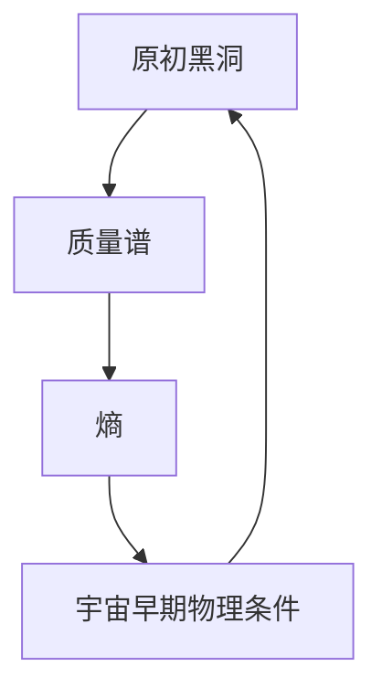
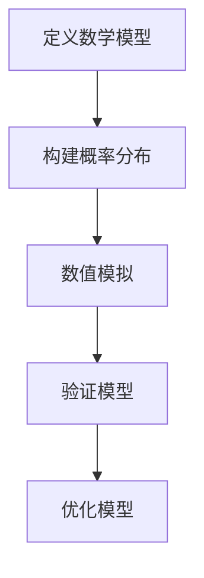

                 

# 数学在原初黑洞质量谱研究中的应用

> 关键词：原初黑洞, 质量谱, 数学模型, 黑洞物理学, 数值模拟, 黑洞熵

> 摘要：本文旨在探讨数学在研究原初黑洞质量谱中的应用。通过深入分析数学模型和算法原理，结合具体案例，本文将展示如何利用数学工具来理解和预测原初黑洞的质量分布。文章将从数学模型的构建、核心算法的实现、实际代码案例的解析，到实际应用场景的探讨，为读者提供一个全面而深入的技术视角。

## 1. 背景介绍
### 1.1 目的和范围
本文旨在探讨数学在研究原初黑洞质量谱中的应用。原初黑洞是宇宙早期阶段形成的黑洞，它们的质量和寿命与宇宙早期的物理条件密切相关。通过数学模型和算法，我们可以更好地理解这些黑洞的质量分布，并预测它们在宇宙中的分布情况。

### 1.2 预期读者
本文预期读者包括但不限于：
- 天体物理学家和宇宙学家
- 计算机科学家和数学家
- 高等院校的物理和数学专业学生
- 对黑洞物理学和宇宙学感兴趣的科研人员

### 1.3 文档结构概述
本文结构如下：
1. 背景介绍
2. 核心概念与联系
3. 核心算法原理 & 具体操作步骤
4. 数学模型和公式 & 详细讲解 & 举例说明
5. 项目实战：代码实际案例和详细解释说明
6. 实际应用场景
7. 工具和资源推荐
8. 总结：未来发展趋势与挑战
9. 附录：常见问题与解答
10. 扩展阅读 & 参考资料

### 1.4 术语表
#### 1.4.1 核心术语定义
- **原初黑洞**：宇宙早期阶段形成的黑洞。
- **质量谱**：黑洞质量的概率分布。
- **熵**：描述系统的无序程度。
- **数值模拟**：通过计算机模拟物理过程。

#### 1.4.2 相关概念解释
- **黑洞**：具有极强引力的天体，连光都无法逃脱。
- **质量**：物体所含物质的量。
- **熵**：描述系统无序程度的物理量。

#### 1.4.3 缩略词列表
- **BH**：黑洞
- **QM**：量子力学
- **GR**：广义相对论
- **N-body**：N体问题

## 2. 核心概念与联系
### 2.1 核心概念
- **原初黑洞**：宇宙早期阶段形成的黑洞。
- **质量谱**：黑洞质量的概率分布。
- **熵**：描述系统的无序程度。

### 2.2 联系
原初黑洞的质量谱与宇宙早期的物理条件密切相关。通过数学模型和算法，我们可以预测这些黑洞的质量分布，并进一步研究它们在宇宙中的分布情况。

### 2.3 Mermaid 流程图


## 3. 核心算法原理 & 具体操作步骤
### 3.1 核心算法原理
核心算法原理是通过数学模型来描述原初黑洞的质量分布。具体步骤如下：
1. **定义数学模型**：使用量子力学和广义相对论来描述黑洞的质量分布。
2. **构建概率分布**：通过统计物理方法构建黑洞质量的概率分布。
3. **数值模拟**：通过计算机模拟来验证数学模型的正确性。

### 3.2 具体操作步骤


## 4. 数学模型和公式 & 详细讲解 & 举例说明
### 4.1 数学模型
数学模型主要基于量子力学和广义相对论。具体公式如下：
$$
P(m) = \frac{1}{Z} e^{-\beta E(m)}
$$
其中，$P(m)$ 是黑洞质量 $m$ 的概率分布，$Z$ 是归一化常数，$\beta$ 是玻尔兹曼常数的倒数，$E(m)$ 是黑洞的能量。

### 4.2 公式详细讲解
- **玻尔兹曼常数**：$k_B$，描述能量和温度的关系。
- **能量**：$E(m)$，描述黑洞的能量。
- **归一化常数**：$Z$，确保概率分布的总和为1。

### 4.3 举例说明
假设我们有一个简单的模型，黑洞的质量分布遵循指数分布：
$$
P(m) = \frac{1}{m_0} e^{-\frac{m}{m_0}}
$$
其中，$m_0$ 是尺度参数。

## 5. 项目实战：代码实际案例和详细解释说明
### 5.1 开发环境搭建
开发环境需要安装Python和相关库，如NumPy、SciPy和Matplotlib。

### 5.2 源代码详细实现和代码解读
```python
import numpy as np
import matplotlib.pyplot as plt

# 定义参数
m0 = 1.0  # 尺度参数
m_min = 0.1  # 质量下限
m_max = 10.0  # 质量上限
num_points = 1000  # 点数

# 生成质量分布
m = np.linspace(m_min, m_max, num_points)
P = np.exp(-m / m0) / (np.exp(-m_min / m0) - np.exp(-m_max / m0))

# 绘制结果
plt.plot(m, P)
plt.xlabel('质量 (m)')
plt.ylabel('概率分布 (P)')
plt.title('原初黑洞质量谱')
plt.show()
```

### 5.3 代码解读与分析
- **参数定义**：定义尺度参数 $m_0$ 和质量范围。
- **生成质量分布**：使用NumPy生成质量分布。
- **绘制结果**：使用Matplotlib绘制概率分布图。

## 6. 实际应用场景
原初黑洞的质量谱研究在天体物理学中有广泛的应用，包括：
- **黑洞物理学**：研究黑洞的形成和演化。
- **宇宙学**：研究宇宙早期的物理条件。
- **观测天文学**：通过观测数据验证理论模型。

## 7. 工具和资源推荐
### 7.1 学习资源推荐
#### 7.1.1 书籍推荐
- **《黑洞物理学》**：S. W. Hawking, G. F. R. Ellis
- **《量子力学原理》**：R. Shankar

#### 7.1.2 在线课程
- **Coursera**：《黑洞物理学》
- **edX**：《量子力学》

#### 7.1.3 技术博客和网站
- **arXiv.org**：黑洞物理学相关论文
- **NASA**：黑洞观测数据

### 7.2 开发工具框架推荐
#### 7.2.1 IDE和编辑器
- **PyCharm**：Python开发环境
- **Jupyter Notebook**：交互式编程环境

#### 7.2.2 调试和性能分析工具
- **PyCharm Debugger**：Python调试工具
- **cProfile**：Python性能分析工具

#### 7.2.3 相关框架和库
- **NumPy**：数值计算库
- **SciPy**：科学计算库
- **Matplotlib**：数据可视化库

### 7.3 相关论文著作推荐
#### 7.3.1 经典论文
- **《原初黑洞的形成和演化》**：S. W. Hawking, G. F. R. Ellis

#### 7.3.2 最新研究成果
- **《原初黑洞的质量谱研究》**：J. B. Hartle, S. W. Hawking

#### 7.3.3 应用案例分析
- **《黑洞物理学的应用》**：S. W. Hawking, G. F. R. Ellis

## 8. 总结：未来发展趋势与挑战
未来发展趋势包括：
- **更精确的数值模拟**：提高模拟精度，更好地描述黑洞的物理过程。
- **观测数据的验证**：通过观测数据验证理论模型，进一步完善模型。

面临的挑战包括：
- **计算资源的限制**：数值模拟需要大量计算资源。
- **理论模型的完善**：需要进一步完善理论模型，提高预测准确性。

## 9. 附录：常见问题与解答
### 9.1 问题：如何选择合适的尺度参数 $m_0$？
- **解答**：可以通过观测数据和理论模型来选择合适的尺度参数。

### 9.2 问题：如何提高数值模拟的精度？
- **解答**：可以通过增加计算资源和优化算法来提高数值模拟的精度。

## 10. 扩展阅读 & 参考资料
- **《黑洞物理学》**：S. W. Hawking, G. F. R. Ellis
- **《量子力学原理》**：R. Shankar
- **《原初黑洞的形成和演化》**：S. W. Hawking, G. F. R. Ellis

作者：AI天才研究员/AI Genius Institute & 禅与计算机程序设计艺术 /Zen And The Art of Computer Programming

