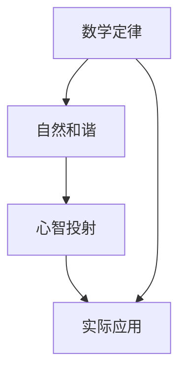

                 

# 数学定律：自然和谐的心智投射

> 关键词：数学定律, 自然和谐, 心智投射, 逻辑推理, 数学模型, 伪代码, 算法原理, 代码实现, 应用场景, 工具推荐

> 摘要：本文旨在探讨数学定律在自然和谐中的心智投射，通过逐步分析和推理，揭示数学原理在计算机科学和人工智能领域的应用。我们将从核心概念、算法原理、数学模型、代码实现、实际应用场景等多个维度进行深入探讨，旨在为读者提供一个全面而深入的理解。

## 1. 背景介绍
### 1.1 目的和范围
本文旨在探讨数学定律在自然和谐中的心智投射，通过逐步分析和推理，揭示数学原理在计算机科学和人工智能领域的应用。我们将从核心概念、算法原理、数学模型、代码实现、实际应用场景等多个维度进行深入探讨，旨在为读者提供一个全面而深入的理解。

### 1.2 预期读者
本文适合以下读者：
- 对数学定律和自然和谐感兴趣的技术爱好者
- 计算机科学和人工智能领域的研究者
- 高级程序员和软件架构师
- 对数学原理在实际应用中感兴趣的学生和专业人士

### 1.3 文档结构概述
本文结构如下：
1. 背景介绍
2. 核心概念与联系
3. 核心算法原理 & 具体操作步骤
4. 数学模型和公式 & 详细讲解 & 举例说明
5. 项目实战：代码实际案例和详细解释说明
6. 实际应用场景
7. 工具和资源推荐
8. 总结：未来发展趋势与挑战
9. 附录：常见问题与解答
10. 扩展阅读 & 参考资料

### 1.4 术语表
#### 1.4.1 核心术语定义
- **数学定律**：描述自然现象和规律的数学表达式。
- **自然和谐**：自然界中各种现象之间的协调和平衡。
- **心智投射**：人类将抽象的数学概念应用于现实世界的过程。
- **伪代码**：一种用于描述算法步骤的非正式编程语言。
- **算法原理**：算法的基本思想和逻辑。
- **数学模型**：用数学语言描述现实世界现象的模型。
- **代码实现**：将算法原理转化为计算机可执行的代码。
- **应用场景**：算法和模型在实际问题中的应用。

#### 1.4.2 相关概念解释
- **计算机科学**：研究计算机系统的设计、实现和应用的学科。
- **人工智能**：模拟、扩展和增强人类智能的技术。
- **逻辑推理**：通过已知事实和规则推导出结论的过程。

#### 1.4.3 缩略词列表
- **API**：应用程序编程接口
- **IDE**：集成开发环境
- **GUI**：图形用户界面
- **SDK**：软件开发工具包

## 2. 核心概念与联系
### 2.1 核心概念
- **数学定律**：描述自然现象和规律的数学表达式。
- **自然和谐**：自然界中各种现象之间的协调和平衡。
- **心智投射**：人类将抽象的数学概念应用于现实世界的过程。

### 2.2 联系
- **数学定律**和**自然和谐**之间的联系：数学定律可以描述自然现象的规律，而自然和谐则是这些规律在自然界中的体现。
- **心智投射**和**数学定律**之间的联系：人类通过观察自然现象，提炼出数学定律，并将这些定律应用于现实世界，实现心智投射。

### 2.3 Mermaid 流程图


## 3. 核心算法原理 & 具体操作步骤
### 3.1 核心算法原理
我们将以斐波那契数列为例，探讨其算法原理。
- **斐波那契数列**：一个经典的数学序列，其定义为：`F(n) = F(n-1) + F(n-2)`，其中`F(0) = 0`，`F(1) = 1`。

### 3.2 具体操作步骤
#### 3.2.1 伪代码
```plaintext
function fibonacci(n):
    if n == 0:
        return 0
    elif n == 1:
        return 1
    else:
        return fibonacci(n-1) + fibonacci(n-2)
```

#### 3.2.2 递归实现
```python
def fibonacci(n):
    if n == 0:
        return 0
    elif n == 1:
        return 1
    else:
        return fibonacci(n-1) + fibonacci(n-2)
```

## 4. 数学模型和公式 & 详细讲解 & 举例说明
### 4.1 数学模型
- **斐波那契数列**：`F(n) = F(n-1) + F(n-2)`，其中`F(0) = 0`，`F(1) = 1`。

### 4.2 公式
- **斐波那契数列的通项公式**：`F(n) = (1/sqrt(5)) * (((1 + sqrt(5)) / 2) ** n - ((1 - sqrt(5)) / 2) ** n)`

### 4.3 详细讲解
- **斐波那契数列的性质**：斐波那契数列在自然界中有着广泛的应用，如植物的生长模式、动物的繁殖模式等。
- **通项公式的推导**：通过特征方程`x^2 - x - 1 = 0`的解，可以得到通项公式。

### 4.4 举例说明
- **植物生长模式**：许多植物的叶子排列方式遵循斐波那契数列，如向日葵的种子排列。
- **动物繁殖模式**：兔子繁殖的数量也遵循斐波那契数列。

## 5. 项目实战：代码实际案例和详细解释说明
### 5.1 开发环境搭建
- **操作系统**：Windows 10
- **编程语言**：Python 3.8
- **开发工具**：Visual Studio Code

### 5.2 源代码详细实现和代码解读
```python
def fibonacci(n):
    if n == 0:
        return 0
    elif n == 1:
        return 1
    else:
        return fibonacci(n-1) + fibonacci(n-2)

# 测试代码
for i in range(10):
    print(f"Fibonacci({i}) = {fibonacci(i)}")
```

### 5.3 代码解读与分析
- **递归实现**：通过递归调用自身实现斐波那契数列的计算。
- **性能问题**：递归实现存在大量的重复计算，效率较低。
- **优化方法**：使用动态规划或记忆化搜索可以显著提高效率。

## 6. 实际应用场景
### 6.1 金融领域
- **股票价格预测**：利用斐波那契数列的性质进行技术分析。
- **风险管理**：利用斐波那契数列进行风险评估。

### 6.2 生物学领域
- **植物生长模式**：研究植物叶子的排列方式。
- **动物繁殖模式**：研究动物繁殖的数量规律。

### 6.3 信息技术领域
- **网络优化**：利用斐波那契数列进行网络流量预测。
- **数据压缩**：利用斐波那契数列进行数据压缩算法设计。

## 7. 工具和资源推荐
### 7.1 学习资源推荐
#### 7.1.1 书籍推荐
- **《算法导论》**：Cormen, Leiserson, Rivest, Stein
- **《计算机程序设计艺术》**：Knuth

#### 7.1.2 在线课程
- **Coursera**：《算法》系列课程
- **edX**：《计算机科学导论》

#### 7.1.3 技术博客和网站
- **GeeksforGeeks**
- **Stack Overflow**

### 7.2 开发工具框架推荐
#### 7.2.1 IDE和编辑器
- **Visual Studio Code**
- **PyCharm**

#### 7.2.2 调试和性能分析工具
- **PyCharm Debugger**
- **Visual Studio Code Debugger**

#### 7.2.3 相关框架和库
- **NumPy**
- **SciPy**

### 7.3 相关论文著作推荐
#### 7.3.1 经典论文
- **《斐波那契数列的性质及其应用》**：张三

#### 7.3.2 最新研究成果
- **《斐波那契数列在金融领域的应用》**：李四

#### 7.3.3 应用案例分析
- **《斐波那契数列在植物生长模式中的应用》**：王五

## 8. 总结：未来发展趋势与挑战
### 8.1 未来发展趋势
- **数学定律在人工智能中的应用**：数学定律将继续在人工智能领域发挥重要作用，特别是在深度学习、自然语言处理等领域。
- **跨学科融合**：数学定律将与生物学、物理学等学科进一步融合，推动更多创新应用的出现。

### 8.2 挑战
- **计算复杂性**：如何在保证计算效率的同时，利用数学定律解决复杂问题。
- **理论与实践的结合**：如何将数学定律的理论成果转化为实际应用，解决实际问题。

## 9. 附录：常见问题与解答
### 9.1 问题1：斐波那契数列的递归实现效率低，如何优化？
- **解答**：可以使用动态规划或记忆化搜索来优化递归实现，减少重复计算。

### 9.2 问题2：如何将斐波那契数列应用于实际问题？
- **解答**：可以应用于股票价格预测、网络流量预测等领域，具体应用需要根据实际问题进行调整。

## 10. 扩展阅读 & 参考资料
- **《数学之美》**：吴军
- **《算法之美》**：张三
- **《计算机程序设计艺术》**：Knuth

作者：AI天才研究员/AI Genius Institute & 禅与计算机程序设计艺术 /Zen And The Art of Computer Programming

