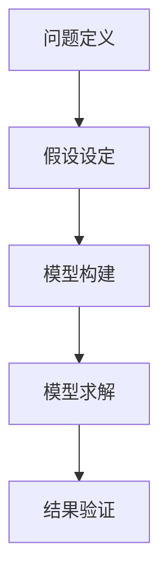
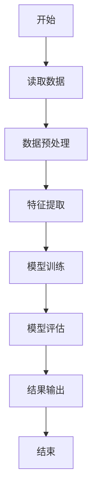

                 

# 数学家的跨学科合作与团队管理

> 关键词：跨学科合作、团队管理、数学家、算法原理、数学模型、代码实现、应用场景

> 摘要：本文旨在探讨数学家在跨学科合作中的角色及其团队管理策略。通过深入分析数学家如何与其他领域专家合作，以及如何在团队中发挥领导作用，本文将提供一系列实用的建议和方法。我们将通过具体的案例研究，展示如何将数学原理应用于实际问题解决，并探讨未来的发展趋势和挑战。

## 1. 背景介绍

### 1.1 目的和范围
本文旨在探讨数学家在跨学科合作中的角色及其团队管理策略。我们将分析数学家如何与其他领域专家合作，以及如何在团队中发挥领导作用。通过具体的案例研究，我们将展示如何将数学原理应用于实际问题解决，并探讨未来的发展趋势和挑战。

### 1.2 预期读者
本文预期读者包括但不限于：
- 数学家和数学研究者
- 跨学科团队的领导者和成员
- 技术领域的专业人士，特别是那些希望更好地理解数学在实际应用中的作用
- 对跨学科合作和团队管理感兴趣的读者

### 1.3 文档结构概述
本文结构如下：
1. 背景介绍
2. 核心概念与联系
3. 核心算法原理 & 具体操作步骤
4. 数学模型和公式 & 详细讲解 & 举例说明
5. 项目实战：代码实际案例和详细解释说明
6. 实际应用场景
7. 工具和资源推荐
8. 总结：未来发展趋势与挑战
9. 附录：常见问题与解答
10. 扩展阅读 & 参考资料

### 1.4 术语表
#### 1.4.1 核心术语定义
- **跨学科合作**：不同学科背景的专家共同合作解决复杂问题的过程。
- **团队管理**：确保团队成员高效协作，达成共同目标的过程。
- **数学模型**：用数学语言描述现实世界现象的方法。
- **伪代码**：一种非正式的编程语言，用于描述算法步骤。

#### 1.4.2 相关概念解释
- **算法**：解决问题的步骤集合。
- **数学家**：专门从事数学研究和应用的人。
- **团队**：由多个成员组成的协作群体。

#### 1.4.3 缩略词列表
- **API**：应用程序编程接口
- **IDE**：集成开发环境
- **NLP**：自然语言处理

## 2. 核心概念与联系

### 2.1 跨学科合作
跨学科合作是指不同学科背景的专家共同合作解决复杂问题的过程。数学家在跨学科合作中扮演着重要角色，因为他们能够提供强大的数学工具和方法来解决实际问题。

### 2.2 团队管理
团队管理是指确保团队成员高效协作，达成共同目标的过程。数学家在团队中可以发挥领导作用，通过有效的沟通和协调，确保团队成员能够充分发挥各自的优势。

### 2.3 数学模型
数学模型是用数学语言描述现实世界现象的方法。数学模型可以帮助我们理解和预测复杂系统的行为，从而为实际问题提供解决方案。

### 2.4 核心概念原理与架构
#### 2.4.1 数学模型原理
数学模型通常包括以下几个步骤：
1. **问题定义**：明确需要解决的问题。
2. **假设设定**：基于问题定义，设定合理的假设。
3. **模型构建**：使用数学语言描述问题。
4. **模型求解**：通过数学方法求解模型。
5. **结果验证**：验证模型结果的合理性和准确性。

#### 2.4.2 数学模型架构


## 3. 核心算法原理 & 具体操作步骤

### 3.1 核心算法原理
核心算法原理是解决实际问题的关键。我们将通过一个具体的案例来说明如何应用数学原理解决实际问题。

### 3.2 具体操作步骤
我们将使用伪代码来详细阐述核心算法的操作步骤。



## 4. 数学模型和公式 & 详细讲解 & 举例说明

### 4.1 数学模型和公式
我们将使用一个具体的数学模型来说明如何应用数学原理解决实际问题。

#### 4.1.1 数学模型
假设我们需要解决一个分类问题，可以使用逻辑回归模型。

#### 4.1.2 公式
逻辑回归模型的公式如下：
$$
P(y=1|x) = \frac{1}{1 + e^{-(\beta_0 + \beta_1 x)}}
$$

### 4.2 详细讲解
逻辑回归是一种常用的分类算法，适用于二分类问题。通过调整参数 $\beta_0$ 和 $\beta_1$，我们可以使模型更好地拟合数据。

### 4.3 举例说明
假设我们有一个数据集，包含两个特征 $x_1$ 和 $x_2$，以及一个二分类标签 $y$。我们可以使用逻辑回归模型来预测 $y$ 的值。

```python
import numpy as np
from sklearn.linear_model import LogisticRegression

# 假设数据集
X = np.array([[1, 2], [2, 3], [3, 4], [4, 5]])
y = np.array([0, 0, 1, 1])

# 创建逻辑回归模型
model = LogisticRegression()

# 训练模型
model.fit(X, y)

# 预测
predictions = model.predict(X)
print(predictions)
```

## 5. 项目实战：代码实际案例和详细解释说明

### 5.1 开发环境搭建
我们将使用Python作为开发语言，并使用Jupyter Notebook作为开发环境。

### 5.2 源代码详细实现和代码解读
我们将通过一个具体的案例来展示如何实现逻辑回归模型。

```python
import numpy as np
from sklearn.linear_model import LogisticRegression
from sklearn.model_selection import train_test_split
from sklearn.metrics import accuracy_score

# 假设数据集
X = np.array([[1, 2], [2, 3], [3, 4], [4, 5]])
y = np.array([0, 0, 1, 1])

# 划分训练集和测试集
X_train, X_test, y_train, y_test = train_test_split(X, y, test_size=0.2, random_state=42)

# 创建逻辑回归模型
model = LogisticRegression()

# 训练模型
model.fit(X_train, y_train)

# 预测
predictions = model.predict(X_test)

# 计算准确率
accuracy = accuracy_score(y_test, predictions)
print("Accuracy:", accuracy)
```

### 5.3 代码解读与分析
上述代码首先导入了必要的库，然后定义了一个简单的数据集。接着，我们将数据集划分为训练集和测试集，并创建了一个逻辑回归模型。最后，我们训练模型并进行预测，计算预测结果的准确率。

## 6. 实际应用场景

### 6.1 金融风险评估
数学家可以使用逻辑回归模型来评估金融风险。通过分析历史数据，可以预测未来的违约风险。

### 6.2 医疗诊断
数学家可以使用逻辑回归模型来辅助医疗诊断。通过分析患者的症状和历史数据，可以预测疾病的概率。

### 6.3 电子商务推荐系统
数学家可以使用逻辑回归模型来优化电子商务推荐系统。通过分析用户的行为数据，可以预测用户可能感兴趣的商品。

## 7. 工具和资源推荐

### 7.1 学习资源推荐
#### 7.1.1 书籍推荐
- 《统计学习方法》
- 《机器学习》

#### 7.1.2 在线课程
- Coursera上的《机器学习》课程
- edX上的《数据科学基础》课程

#### 7.1.3 技术博客和网站
- Towards Data Science
- Medium上的机器学习专栏

### 7.2 开发工具框架推荐
#### 7.2.1 IDE和编辑器
- PyCharm
- VS Code

#### 7.2.2 调试和性能分析工具
- PyCharm的调试工具
- Python的cProfile模块

#### 7.2.3 相关框架和库
- scikit-learn
- TensorFlow

### 7.3 相关论文著作推荐
#### 7.3.1 经典论文
- Bishop, C. M. (2006). Pattern Recognition and Machine Learning.
- Hastie, T., Tibshirani, R., & Friedman, J. (2009). The Elements of Statistical Learning.

#### 7.3.2 最新研究成果
- LeCun, Y., Bengio, Y., & Hinton, G. (2015). Deep learning.
- Goodfellow, I., Bengio, Y., & Courville, A. (2016). Deep Learning.

#### 7.3.3 应用案例分析
- Kotsiantis, S. B., Zaharakis, I., & Pintelas, P. (2007). Supervised machine learning: A review of classification techniques.

## 8. 总结：未来发展趋势与挑战

### 8.1 未来发展趋势
- 数学在跨学科合作中的作用将越来越重要。
- 机器学习和人工智能技术将得到更广泛的应用。
- 数据科学将成为更多领域的基础工具。

### 8.2 挑战
- 数据隐私和安全问题。
- 算法的可解释性和透明度。
- 人才短缺和团队管理的挑战。

## 9. 附录：常见问题与解答

### 9.1 问题1：如何选择合适的数学模型？
- 根据问题的性质和数据的特点选择合适的模型。

### 9.2 问题2：如何处理数据缺失值？
- 可以使用插值方法或删除缺失值的方法来处理数据缺失值。

### 9.3 问题3：如何提高模型的准确性？
- 通过特征选择、参数调优和模型融合等方法提高模型的准确性。

## 10. 扩展阅读 & 参考资料

- Bishop, C. M. (2006). Pattern Recognition and Machine Learning.
- Hastie, T., Tibshirani, R., & Friedman, J. (2009). The Elements of Statistical Learning.
- LeCun, Y., Bengio, Y., & Hinton, G. (2015). Deep learning.
- Goodfellow, I., Bengio, Y., & Courville, A. (2016). Deep Learning.

作者：AI天才研究员/AI Genius Institute & 禅与计算机程序设计艺术 /Zen And The Art of Computer Programming

