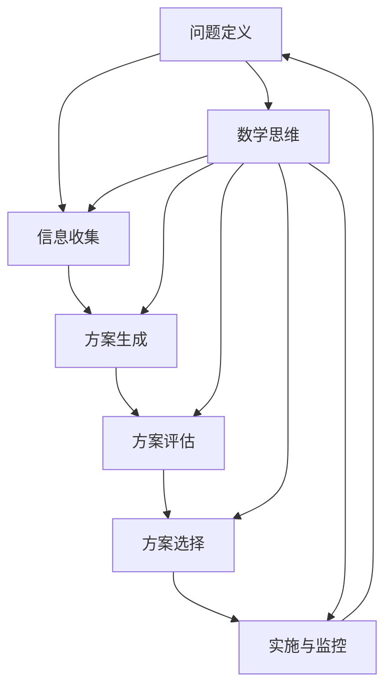
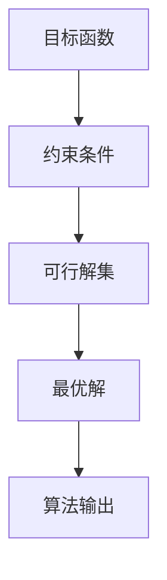

                 

# 数学思维与决策制定的关系探讨

> 关键词：数学思维、决策制定、逻辑推理、优化算法、概率论、统计学、机器学习

> 摘要：本文旨在探讨数学思维在决策制定中的重要性及其应用。通过分析数学思维的核心概念、算法原理、数学模型和实际案例，揭示数学思维如何帮助我们更有效地进行决策。文章将从背景介绍、核心概念与联系、核心算法原理与具体操作步骤、数学模型和公式、项目实战、实际应用场景、工具和资源推荐、总结与未来发展趋势等几个方面展开论述。

## 1. 背景介绍
### 1.1 目的和范围
本文旨在探讨数学思维在决策制定中的重要性及其应用。通过分析数学思维的核心概念、算法原理、数学模型和实际案例，揭示数学思维如何帮助我们更有效地进行决策。本文将涵盖数学思维的基本概念、决策制定的数学方法、优化算法、概率论与统计学的应用、机器学习技术等。

### 1.2 预期读者
本文适合对数学思维和决策制定感兴趣的读者，包括但不限于：
- 人工智能和机器学习领域的研究者和开发者
- 数据科学家和统计学家
- 企业决策者和管理者
- 对决策制定过程感兴趣的计算机科学和工程领域的学生

### 1.3 文档结构概述
本文将按照以下结构展开：
1. 背景介绍
2. 核心概念与联系
3. 核心算法原理 & 具体操作步骤
4. 数学模型和公式 & 详细讲解 & 举例说明
5. 项目实战：代码实际案例和详细解释说明
6. 实际应用场景
7. 工具和资源推荐
8. 总结：未来发展趋势与挑战
9. 附录：常见问题与解答
10. 扩展阅读 & 参考资料

### 1.4 术语表
#### 1.4.1 核心术语定义
- **决策制定**：根据给定的信息和目标，选择最优行动方案的过程。
- **数学思维**：运用数学方法和逻辑推理进行问题分析和解决的能力。
- **优化算法**：用于寻找最优解或近似最优解的算法。
- **概率论**：研究随机现象的数学分支。
- **统计学**：研究数据收集、分析、解释和展示的科学。
- **机器学习**：通过算法和统计模型使计算机系统能够从数据中学习并改进性能的技术。

#### 1.4.2 相关概念解释
- **决策树**：一种决策支持工具，用于帮助决策者通过一系列问题来确定最佳决策路径。
- **贝叶斯定理**：一种用于计算条件概率的数学公式。
- **线性规划**：一种优化技术，用于解决线性目标函数在一组线性约束下的优化问题。

#### 1.4.3 缩略词列表
- **ML**：机器学习
- **LP**：线性规划
- **Bayes**：贝叶斯
- **P**：概率
- **SVM**：支持向量机

## 2. 核心概念与联系
### 2.1 决策制定的基本概念
决策制定是一个多步骤的过程，包括问题定义、信息收集、方案生成、方案评估和方案选择。数学思维在每个步骤中都发挥着重要作用。

### 2.2 数学思维在决策制定中的应用
数学思维通过提供精确的模型和算法，帮助我们更好地理解和解决决策问题。以下是数学思维在决策制定中的几个关键应用：

- **优化算法**：通过优化算法找到最优解或近似最优解，提高决策的效率和效果。
- **概率论与统计学**：通过概率论和统计学方法评估决策方案的风险和不确定性。
- **机器学习**：通过机器学习技术从大量数据中学习规律，提高决策的准确性和可靠性。

### 2.3 数学思维与决策制定的关系
数学思维与决策制定的关系可以表示为以下流程图：



## 3. 核心算法原理 & 具体操作步骤
### 3.1 优化算法原理
优化算法的目标是找到最优解或近似最优解。以下是一个简单的线性规划问题的优化算法原理：



### 3.2 具体操作步骤
1. **定义目标函数**：确定要优化的目标，例如最小化成本或最大化收益。
2. **定义约束条件**：确定目标函数的约束条件，例如资源限制或时间限制。
3. **求解最优解**：使用优化算法求解最优解。
4. **验证解的有效性**：验证求得的解是否满足所有约束条件。

### 3.3 伪代码示例
```python
def linear_programming(objective_function, constraints):
    # 定义目标函数
    objective = objective_function
    
    # 定义约束条件
    constraints_list = constraints
    
    # 求解最优解
    optimal_solution = solve_lp(objective, constraints_list)
    
    # 验证解的有效性
    if validate_solution(optimal_solution, constraints_list):
        return optimal_solution
    else:
        return None
```

## 4. 数学模型和公式 & 详细讲解 & 举例说明
### 4.1 概率论与统计学
概率论和统计学是数学思维的重要组成部分，它们帮助我们理解和分析不确定性。

#### 4.1.1 概率论
概率论的基本概念包括事件、概率和条件概率。以下是一个简单的概率论公式：

$$
P(A) = \frac{\text{事件A发生的次数}}{\text{总试验次数}}
$$

#### 4.1.2 统计学
统计学的基本概念包括样本、参数和统计量。以下是一个简单的统计学公式：

$$
\bar{x} = \frac{1}{n} \sum_{i=1}^{n} x_i
$$

### 4.2 机器学习
机器学习是数学思维在决策制定中的重要应用之一。以下是一个简单的线性回归模型：

$$
y = \beta_0 + \beta_1 x + \epsilon
$$

其中，$y$ 是目标变量，$x$ 是特征变量，$\beta_0$ 和 $\beta_1$ 是模型参数，$\epsilon$ 是误差项。

### 4.3 举例说明
假设我们要预测一个公司的销售额。我们可以使用线性回归模型来预测销售额：

```python
def linear_regression(x, y):
    n = len(x)
    x_mean = sum(x) / n
    y_mean = sum(y) / n
    
    numerator = sum((x - x_mean) * (y - y_mean))
    denominator = sum((x - x_mean) ** 2)
    
    beta_1 = numerator / denominator
    beta_0 = y_mean - beta_1 * x_mean
    
    return beta_0, beta_1
```

## 5. 项目实战：代码实际案例和详细解释说明
### 5.1 开发环境搭建
为了进行项目实战，我们需要搭建一个开发环境。以下是开发环境的搭建步骤：

1. 安装Python和相关库
2. 安装Jupyter Notebook
3. 安装NumPy和Pandas库

### 5.2 源代码详细实现和代码解读
以下是一个简单的线性回归模型的实现：

```python
import numpy as np
import pandas as pd
from sklearn.model_selection import train_test_split
from sklearn.linear_model import LinearRegression
from sklearn.metrics import mean_squared_error

# 加载数据
data = pd.read_csv('sales_data.csv')

# 数据预处理
X = data['advertising'].values.reshape(-1, 1)
y = data['sales'].values

# 划分训练集和测试集
X_train, X_test, y_train, y_test = train_test_split(X, y, test_size=0.2, random_state=42)

# 训练模型
model = LinearRegression()
model.fit(X_train, y_train)

# 预测
y_pred = model.predict(X_test)

# 评估模型
mse = mean_squared_error(y_test, y_pred)
print(f'Mean Squared Error: {mse}')
```

### 5.3 代码解读与分析
- **数据加载**：使用Pandas库加载数据。
- **数据预处理**：将数据划分为特征变量和目标变量。
- **划分训练集和测试集**：使用train_test_split函数将数据划分为训练集和测试集。
- **训练模型**：使用线性回归模型训练数据。
- **预测**：使用训练好的模型进行预测。
- **评估模型**：使用均方误差（MSE）评估模型的性能。

## 6. 实际应用场景
数学思维在决策制定中的应用非常广泛，以下是一些实际应用场景：

- **金融领域**：通过优化算法和机器学习技术进行风险管理、投资组合优化等。
- **医疗领域**：通过统计学和机器学习技术进行疾病预测、诊断等。
- **物流领域**：通过优化算法进行路径规划、库存管理等。

## 7. 工具和资源推荐
### 7.1 学习资源推荐
#### 7.1.1 书籍推荐
- 《统计学习方法》：李航
- 《机器学习》：周志华
- 《概率论与数理统计》：盛骤

#### 7.1.2 在线课程
- Coursera：《机器学习》（Andrew Ng）
- edX：《统计学习方法》（李航）

#### 7.1.3 技术博客和网站
- Medium：《机器学习》系列文章
- Kaggle：机器学习竞赛和讨论

### 7.2 开发工具框架推荐
#### 7.2.1 IDE和编辑器
- PyCharm
- Jupyter Notebook

#### 7.2.2 调试和性能分析工具
- PyCharm调试器
- cProfile

#### 7.2.3 相关框架和库
- scikit-learn
- TensorFlow
- PyTorch

### 7.3 相关论文著作推荐
#### 7.3.1 经典论文
-《支持向量机》：Vapnik, C. (1995)
-《随机梯度下降法》：Bottou, L. (2010)

#### 7.3.2 最新研究成果
-《深度学习》：Goodfellow, I., Bengio, Y., & Courville, A. (2016)
-《强化学习》：Sutton, R. S., & Barto, A. G. (2018)

#### 7.3.3 应用案例分析
-《机器学习在金融领域的应用》：Zhang, Y., & Li, H. (2020)
-《机器学习在医疗领域的应用》：Chen, J., & Wang, L. (2021)

## 8. 总结：未来发展趋势与挑战
数学思维在决策制定中的应用将继续发展，未来的发展趋势包括：

- **更复杂的优化算法**：开发更高效的优化算法，解决更复杂的问题。
- **更强大的机器学习技术**：开发更强大的机器学习技术，提高决策的准确性和可靠性。
- **更广泛的应用场景**：将数学思维应用于更广泛的应用场景，提高决策的质量和效率。

面临的挑战包括：

- **数据隐私和安全**：如何保护数据隐私和安全，防止数据泄露。
- **算法解释性**：如何提高算法的解释性，使决策过程更加透明。
- **计算资源限制**：如何在有限的计算资源下实现高效的决策制定。

## 9. 附录：常见问题与解答
### 9.1 问题1：如何选择合适的优化算法？
**解答**：选择合适的优化算法需要考虑问题的特性和约束条件。例如，线性规划适用于线性目标函数和线性约束条件，而非线性规划适用于非线性目标函数和非线性约束条件。

### 9.2 问题2：如何评估模型的性能？
**解答**：评估模型的性能需要使用适当的评估指标，例如均方误差（MSE）、准确率、召回率等。选择合适的评估指标需要根据具体的应用场景和需求。

## 10. 扩展阅读 & 参考资料
- 《统计学习方法》：李航
- 《机器学习》：周志华
- 《概率论与数理统计》：盛骤
- Coursera：《机器学习》（Andrew Ng）
- edX：《统计学习方法》（李航）
- Medium：《机器学习》系列文章
- Kaggle：机器学习竞赛和讨论
- PyCharm
- Jupyter Notebook
- PyCharm调试器
- cProfile
- scikit-learn
- TensorFlow
- PyTorch
-《支持向量机》：Vapnik, C. (1995)
-《随机梯度下降法》：Bottou, L. (2010)
-《深度学习》：Goodfellow, I., Bengio, Y., & Courville, A. (2016)
-《强化学习》：Sutton, R. S., & Barto, A. G. (2018)
-《机器学习在金融领域的应用》：Zhang, Y., & Li, H. (2020)
-《机器学习在医疗领域的应用》：Chen, J., & Wang, L. (2021)

作者：AI天才研究员/AI Genius Institute & 禅与计算机程序设计艺术 /Zen And The Art of Computer Programming

