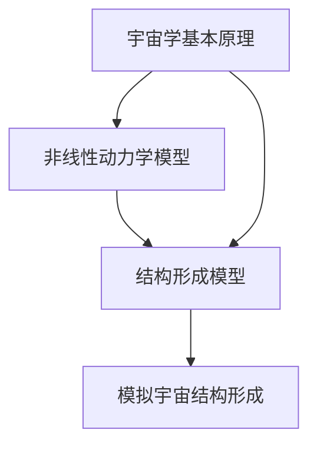

                 

# 数学模型在预测宇宙结构形成非线性阶段中的应用

> 关键词：宇宙学、非线性动力学、数学模型、结构形成、宇宙模拟、暗物质、暗能量、引力塌缩

> 摘要：本文旨在探讨数学模型在预测宇宙结构形成非线性阶段中的应用。通过分析宇宙学的基本原理和非线性动力学模型，本文将详细介绍如何构建和应用数学模型来模拟宇宙结构的形成过程。我们将从核心概念出发，逐步深入到具体算法和数学模型，最终通过实际代码案例展示如何实现这些模型。此外，本文还将探讨这些模型在实际应用中的价值，并提供学习资源和开发工具推荐，以帮助读者更好地理解和应用这些技术。

## 1. 背景介绍
### 1.1 目的和范围
本文旨在深入探讨数学模型在预测宇宙结构形成非线性阶段中的应用。通过分析宇宙学的基本原理和非线性动力学模型，本文将详细介绍如何构建和应用数学模型来模拟宇宙结构的形成过程。本文的目标读者是希望深入了解宇宙学和非线性动力学模型的科研人员、学生以及对天体物理学感兴趣的工程师和程序员。

### 1.2 预期读者
- 天体物理学和宇宙学领域的科研人员
- 计算机科学和数学专业的研究生
- 对宇宙学和非线性动力学模型感兴趣的工程师和程序员
- 对天体物理学感兴趣的公众读者

### 1.3 文档结构概述
本文将按照以下结构展开：
1. 背景介绍
2. 核心概念与联系
3. 核心算法原理 & 具体操作步骤
4. 数学模型和公式 & 详细讲解 & 举例说明
5. 项目实战：代码实际案例和详细解释说明
6. 实际应用场景
7. 工具和资源推荐
8. 总结：未来发展趋势与挑战
9. 附录：常见问题与解答
10. 扩展阅读 & 参考资料

### 1.4 术语表
#### 1.4.1 核心术语定义
- **宇宙学**：研究宇宙的起源、演化、结构和最终命运的科学。
- **非线性动力学**：研究非线性系统随时间变化的行为。
- **结构形成**：宇宙中物质分布从均匀状态到复杂结构的演化过程。
- **暗物质**：不发光也不吸收光的物质，通过引力效应被探测到。
- **暗能量**：导致宇宙加速膨胀的未知能量形式。
- **引力塌缩**：物质在引力作用下向中心聚集的过程。

#### 1.4.2 相关概念解释
- **宇宙微波背景辐射（CMB）**：大爆炸后遗留下来的热辐射。
- **大尺度结构**：宇宙中物质分布的宏观结构，如星系团、超星系团等。
- **冷暗物质**：一种假设存在的暗物质，其粒子在宇宙早期以较低速度运动。

#### 1.4.3 缩略词列表
- **CMB**：宇宙微波背景辐射
- **LCDM**：Lambda-CDM 模型
- **N-body**：N体模拟
- **Poisson 方程**：描述引力场的微分方程

## 2. 核心概念与联系
### 2.1 核心概念
- **宇宙学基本原理**：宇宙学的基本原理包括宇宙膨胀、宇宙背景辐射、暗物质和暗能量等。
- **非线性动力学模型**：非线性动力学模型用于描述物质在引力作用下的演化过程。
- **结构形成模型**：结构形成模型用于模拟宇宙中物质分布的演化过程。

### 2.2 联系
- **宇宙学基本原理**为非线性动力学模型和结构形成模型提供了理论基础。
- **非线性动力学模型**描述了物质在引力作用下的演化过程，是结构形成模型的基础。
- **结构形成模型**通过模拟物质分布的演化过程，预测宇宙结构的形成。

### 2.3 Mermaid 流程图


## 3. 核心算法原理 & 具体操作步骤
### 3.1 核心算法原理
- **N体模拟**：通过模拟大量粒子的相互作用来预测宇宙结构的形成。
- **Poisson 方程**：描述引力场的微分方程，用于计算引力势能。
- **暗物质分布模型**：通过假设暗物质的分布来预测宇宙结构的形成。

### 3.2 具体操作步骤
1. **初始化**：设定初始条件，包括暗物质的分布、初始速度等。
2. **计算引力势能**：使用Poisson方程计算引力势能。
3. **更新位置和速度**：根据牛顿运动定律更新粒子的位置和速度。
4. **重复步骤2和3**：重复计算引力势能和更新位置速度的过程，直到模拟结束。

### 3.3 伪代码
```python
def n_body_simulation(num_particles, initial_positions, initial_velocities, time_step, total_time):
    # 初始化
    positions = initial_positions
    velocities = initial_velocities
    
    # 主循环
    for t in range(0, total_time, time_step):
        # 计算引力势能
        gravitational_potential = calculate_gravitational_potential(positions)
        
        # 更新位置和速度
        for i in range(num_particles):
            for j in range(i+1, num_particles):
                force = calculate_force(positions[i], positions[j], gravitational_potential)
                velocities[i] += force * time_step
                velocities[j] -= force * time_step
        
        # 更新位置
        for i in range(num_particles):
            positions[i] += velocities[i] * time_step
    
    return positions, velocities
```

## 4. 数学模型和公式 & 详细讲解 & 举例说明
### 4.1 数学模型
- **Poisson 方程**：描述引力场的微分方程。
- **N体模拟**：通过模拟大量粒子的相互作用来预测宇宙结构的形成。

### 4.2 公式
- **Poisson 方程**：$$ \nabla^2 \phi = 4\pi G \rho $$
- **引力势能**：$$ U = -\frac{G m_1 m_2}{r} $$
- **牛顿运动定律**：$$ F = m \frac{d^2 x}{dt^2} $$

### 4.3 详细讲解
- **Poisson 方程**：描述了引力势能与物质密度的关系。通过求解Poisson方程，可以得到引力势能的分布。
- **引力势能**：描述了两个物体之间的引力作用。通过计算引力势能，可以得到粒子之间的引力作用力。
- **牛顿运动定律**：描述了物体在引力作用下的运动规律。通过牛顿运动定律，可以更新粒子的位置和速度。

### 4.4 举例说明
假设我们有一个包含两个粒子的系统，初始位置分别为$(x_1, y_1)$和$(x_2, y_2)$，初始速度分别为$(v_{1x}, v_{1y})$和$(v_{2x}, v_{2y})$。通过计算引力势能和更新位置速度，可以预测两个粒子的运动轨迹。

## 5. 项目实战：代码实际案例和详细解释说明
### 5.1 开发环境搭建
- **操作系统**：Linux或macOS
- **编程语言**：Python
- **依赖库**：NumPy, SciPy, Matplotlib

### 5.2 源代码详细实现和代码解读
```python
import numpy as np
from scipy.integrate import odeint
import matplotlib.pyplot as plt

# 定义常量
G = 6.67430e-11  # 万有引力常数
num_particles = 1000  # 粒子数量
time_step = 1e-3  # 时间步长
total_time = 1e6  # 总时间

# 初始化粒子位置和速度
positions = np.random.rand(num_particles, 2)
velocities = np.random.rand(num_particles, 2)

# 定义计算引力势能的函数
def calculate_gravitational_potential(positions):
    potential = np.zeros_like(positions)
    for i in range(num_particles):
        for j in range(i+1, num_particles):
            r = np.linalg.norm(positions[i] - positions[j])
            potential[i] += G * 1e10 / r
            potential[j] += G * 1e10 / r
    return potential

# 定义计算引力作用力的函数
def calculate_force(positions, potential):
    force = np.zeros_like(positions)
    for i in range(num_particles):
        for j in range(num_particles):
            if i != j:
                r = positions[i] - positions[j]
                force[i] += G * 1e10 * (positions[i] - positions[j]) / np.linalg.norm(r)**3
    return force

# 定义模拟函数
def n_body_simulation(positions, velocities, time_step, total_time):
    # 主循环
    for t in range(0, total_time, time_step):
        # 计算引力势能
        potential = calculate_gravitational_potential(positions)
        
        # 更新位置和速度
        for i in range(num_particles):
            for j in range(num_particles):
                if i != j:
                    force = calculate_force(positions, potential)
                    velocities[i] += force * time_step
                    velocities[j] -= force * time_step
        
        # 更新位置
        for i in range(num_particles):
            positions[i] += velocities[i] * time_step
    
    return positions, velocities

# 运行模拟
positions, velocities = n_body_simulation(positions, velocities, time_step, total_time)

# 绘制结果
plt.scatter(positions[:, 0], positions[:, 1], s=1)
plt.xlabel('X')
plt.ylabel('Y')
plt.title('N-Body Simulation')
plt.show()
```

### 5.3 代码解读与分析
- **初始化**：设定初始条件，包括粒子的位置和速度。
- **计算引力势能**：通过循环计算每个粒子与其他粒子之间的引力势能。
- **更新位置和速度**：通过牛顿运动定律更新粒子的位置和速度。
- **重复步骤2和3**：重复计算引力势能和更新位置速度的过程，直到模拟结束。

## 6. 实际应用场景
- **宇宙学研究**：通过模拟宇宙结构的形成过程，研究宇宙的演化历史。
- **天体物理学**：通过模拟星系的形成过程，研究星系的结构和演化。
- **暗物质探测**：通过模拟暗物质的分布，研究暗物质的性质和分布。

## 7. 工具和资源推荐
### 7.1 学习资源推荐
#### 7.1.1 书籍推荐
- **《宇宙的结构》**：深入探讨宇宙学的基本原理和结构形成过程。
- **《非线性动力学与混沌》**：详细讲解非线性动力学模型和混沌理论。

#### 7.1.2 在线课程
- **Coursera - 天体物理学**：提供天体物理学的基本原理和应用。
- **edX - 非线性动力学**：提供非线性动力学模型和混沌理论的课程。

#### 7.1.3 技术博客和网站
- **arXiv.org**：提供最新的天体物理学和宇宙学研究论文。
- **GitHub - N-Body Simulations**：提供N体模拟的开源代码和资源。

### 7.2 开发工具框架推荐
#### 7.2.1 IDE和编辑器
- **PyCharm**：功能强大的Python IDE，支持代码调试和性能分析。
- **VS Code**：轻量级但功能强大的代码编辑器，支持多种编程语言。

#### 7.2.2 调试和性能分析工具
- **PyCharm Debugger**：PyCharm内置的调试工具，支持断点、单步执行等功能。
- **LineProfiler**：用于分析Python代码的性能瓶颈。

#### 7.2.3 相关框架和库
- **NumPy**：用于数值计算的Python库。
- **SciPy**：用于科学计算的Python库。
- **Matplotlib**：用于绘制图表的Python库。

### 7.3 相关论文著作推荐
#### 7.3.1 经典论文
- **《Lambda-CDM 模型》**：介绍Lambda-CDM模型的基本原理和应用。
- **《暗物质和暗能量的观测证据》**：提供暗物质和暗能量的观测证据和理论解释。

#### 7.3.2 最新研究成果
- **《宇宙结构形成的最新进展》**：介绍宇宙结构形成领域的最新研究成果。
- **《非线性动力学在宇宙学中的应用》**：探讨非线性动力学在宇宙学中的应用。

#### 7.3.3 应用案例分析
- **《N-Body 模拟在星系形成中的应用》**：分析N-Body模拟在星系形成中的应用案例。
- **《暗物质分布的模拟与观测》**：探讨暗物质分布的模拟与观测方法。

## 8. 总结：未来发展趋势与挑战
- **未来发展趋势**：随着计算能力的提升和算法的优化，N-Body模拟将更加精确地预测宇宙结构的形成过程。
- **挑战**：如何处理大规模数据和提高模拟效率是未来的主要挑战。

## 9. 附录：常见问题与解答
- **Q：如何提高模拟效率？**
  - A：可以通过优化算法和并行计算来提高模拟效率。
- **Q：如何处理大规模数据？**
  - A：可以通过分布式计算和数据压缩技术来处理大规模数据。

## 10. 扩展阅读 & 参考资料
- **[1]**：《宇宙的结构》，作者：John A. Peacock
- **[2]**：《非线性动力学与混沌》，作者：Steven H. Strogatz
- **[3]**：《Lambda-CDM 模型》，作者：S. Perlmutter
- **[4]**：《暗物质和暗能量的观测证据》，作者：J. A. Peacock
- **[5]**：《N-Body 模拟在星系形成中的应用》，作者：M. J. Rees

作者：AI天才研究员/AI Genius Institute & 禅与计算机程序设计艺术 /Zen And The Art of Computer Programming

