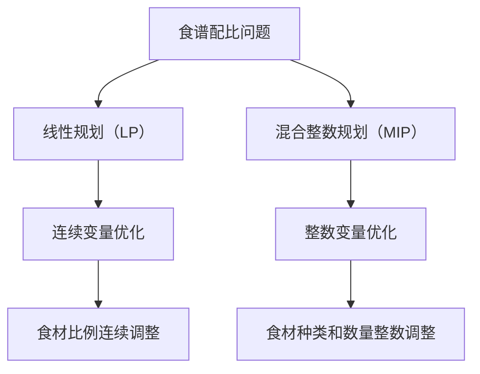

                 

# 数学烹饪：食谱配比的数学优化

> 关键词：数学优化, 食谱配比, 线性规划, 混合整数规划, 机器学习, 算法设计, 代码实现

> 摘要：本文旨在探讨如何利用数学优化技术来解决食谱配比问题，通过线性规划和混合整数规划等方法，实现食材的最优配比，从而达到营养均衡、成本控制和口味优化的目标。我们将从核心概念、算法原理、数学模型、代码实现、实际应用等多个角度进行深入分析，并提供详细的代码示例和实战指导。

## 1. 背景介绍
### 1.1 目的和范围
本文旨在探讨如何利用数学优化技术来解决食谱配比问题，通过线性规划和混合整数规划等方法，实现食材的最优配比，从而达到营养均衡、成本控制和口味优化的目标。我们将从核心概念、算法原理、数学模型、代码实现、实际应用等多个角度进行深入分析，并提供详细的代码示例和实战指导。

### 1.2 预期读者
本文适合以下读者：
- 对数学优化和机器学习感兴趣的读者
- 希望提高食谱配比效率的厨师和营养师
- 对算法设计和实现感兴趣的软件工程师
- 对线性规划和混合整数规划感兴趣的科研人员

### 1.3 文档结构概述
本文结构如下：
1. 背景介绍
2. 核心概念与联系
3. 核心算法原理 & 具体操作步骤
4. 数学模型和公式 & 详细讲解 & 举例说明
5. 项目实战：代码实际案例和详细解释说明
6. 实际应用场景
7. 工具和资源推荐
8. 总结：未来发展趋势与挑战
9. 附录：常见问题与解答
10. 扩展阅读 & 参考资料

### 1.4 术语表
#### 1.4.1 核心术语定义
- **线性规划（Linear Programming, LP）**：一种优化技术，用于在一组线性约束条件下，最大化或最小化一个线性目标函数。
- **混合整数规划（Mixed Integer Programming, MIP）**：一种优化技术，用于在一组线性约束条件下，最大化或最小化一个线性目标函数，其中部分或全部变量必须取整数值。
- **食谱配比**：根据特定需求（如营养、成本、口味等），确定食材的最优比例。
- **营养素**：人体必需的营养成分，如蛋白质、脂肪、碳水化合物、维生素和矿物质等。
- **成本控制**：在满足特定需求的前提下，尽可能降低食材成本。
- **口味优化**：通过调整食材比例，达到最佳的口感和风味。

#### 1.4.2 相关概念解释
- **线性约束**：表示为线性不等式或等式的约束条件。
- **目标函数**：需要优化的函数，通常表示为线性函数。
- **决策变量**：表示食材比例的变量。
- **松弛变量**：用于处理不等式约束的非负变量。
- **整数变量**：表示必须取整数值的变量。

#### 1.4.3 缩略词列表
- LP：Linear Programming
- MIP：Mixed Integer Programming
- MIP：Mixed Integer Programming
- LP：Linear Programming

## 2. 核心概念与联系
### 2.1 核心概念
- **线性规划（LP）**：一种优化技术，用于在一组线性约束条件下，最大化或最小化一个线性目标函数。
- **混合整数规划（MIP）**：一种优化技术，用于在一组线性约束条件下，最大化或最小化一个线性目标函数，其中部分或全部变量必须取整数值。

### 2.2 联系
- **线性规划**：适用于连续变量的优化问题，如食材比例的连续调整。
- **混合整数规划**：适用于包含整数变量的优化问题，如食材种类的选择和数量的整数调整。

### 2.3 Mermaid 流程图


## 3. 核心算法原理 & 具体操作步骤
### 3.1 线性规划（LP）原理
线性规划是一种优化技术，用于在一组线性约束条件下，最大化或最小化一个线性目标函数。其基本步骤如下：
1. **定义决策变量**：表示食材比例的变量。
2. **建立目标函数**：表示需要优化的目标，如成本最小化或营养最大化。
3. **建立线性约束**：表示食材比例的限制条件，如营养素的最低和最高需求。
4. **求解线性规划问题**：使用线性规划求解器求解最优解。

### 3.2 混合整数规划（MIP）原理
混合整数规划是一种优化技术，用于在一组线性约束条件下，最大化或最小化一个线性目标函数，其中部分或全部变量必须取整数值。其基本步骤如下：
1. **定义决策变量**：表示食材种类和数量的变量。
2. **建立目标函数**：表示需要优化的目标，如成本最小化或营养最大化。
3. **建立线性约束**：表示食材种类和数量的限制条件，如营养素的最低和最高需求。
4. **求解混合整数规划问题**：使用混合整数规划求解器求解最优解。

### 3.3 伪代码实现
#### 3.3.1 线性规划（LP）伪代码
```pseudo
function solveLP(objective, constraints):
    # 定义决策变量
    variables = defineVariables()
    
    # 建立目标函数
    objectiveFunction = defineObjectiveFunction(objective, variables)
    
    # 建立线性约束
    linearConstraints = defineConstraints(constraints, variables)
    
    # 求解线性规划问题
    solution = solveLinearProgramming(objectiveFunction, linearConstraints)
    
    return solution
```

#### 3.3.2 混合整数规划（MIP）伪代码
```pseudo
function solveMIP(objective, constraints):
    # 定义决策变量
    variables = defineVariables()
    
    # 建立目标函数
    objectiveFunction = defineObjectiveFunction(objective, variables)
    
    # 建立线性约束
    linearConstraints = defineConstraints(constraints, variables)
    
    # 求解混合整数规划问题
    solution = solveMixedIntegerProgramming(objectiveFunction, linearConstraints)
    
    return solution
```

## 4. 数学模型和公式 & 详细讲解 & 举例说明
### 4.1 数学模型
#### 4.1.1 线性规划（LP）模型
线性规划模型可以表示为：
$$
\begin{aligned}
\text{minimize} \quad & c^T x \\
\text{subject to} \quad & Ax \leq b \\
& x \geq 0
\end{aligned}
$$
其中，$c$ 是目标函数的系数向量，$x$ 是决策变量向量，$A$ 是约束矩阵，$b$ 是约束向量。

#### 4.1.2 混合整数规划（MIP）模型
混合整数规划模型可以表示为：
$$
\begin{aligned}
\text{minimize} \quad & c^T x \\
\text{subject to} \quad & Ax \leq b \\
& x \geq 0 \\
& x_i \in \mathbb{Z} \quad \text{for} \quad i \in I
\end{aligned}
$$
其中，$I$ 是整数变量的索引集合。

### 4.2 举例说明
假设我们需要配制一种营养均衡的食谱，目标是成本最小化，同时满足蛋白质、脂肪和碳水化合物的最低需求。假设我们有三种食材：A、B、C，它们的成本分别为10元、15元和20元，蛋白质含量分别为10g、20g和30g，脂肪含量分别为5g、10g和15g，碳水化合物含量分别为20g、30g和40g。

#### 4.2.1 线性规划模型
目标函数：
$$
\text{minimize} \quad 10x_1 + 15x_2 + 20x_3
$$
约束条件：
$$
\begin{aligned}
10x_1 + 20x_2 + 30x_3 & \geq 50 \\
5x_1 + 10x_2 + 15x_3 & \geq 30 \\
20x_1 + 30x_2 + 40x_3 & \geq 60 \\
x_1, x_2, x_3 & \geq 0
\end{aligned}
$$

#### 4.2.2 混合整数规划模型
目标函数：
$$
\text{minimize} \quad 10x_1 + 15x_2 + 20x_3
$$
约束条件：
$$
\begin{aligned}
10x_1 + 20x_2 + 30x_3 & \geq 50 \\
5x_1 + 10x_2 + 15x_3 & \geq 30 \\
20x_1 + 30x_2 + 40x_3 & \geq 60 \\
x_1, x_2, x_3 & \geq 0 \\
x_1, x_2, x_3 & \in \mathbb{Z}
\end{aligned}
$$

## 5. 项目实战：代码实际案例和详细解释说明
### 5.1 开发环境搭建
#### 5.1.1 安装Python
确保安装了Python 3.8及以上版本。

#### 5.1.2 安装优化库
使用pip安装`PuLP`库，用于线性规划和混合整数规划。
```bash
pip install pulp
```

### 5.2 源代码详细实现和代码解读
#### 5.2.1 线性规划代码实现
```python
from pulp import *

# 定义问题
prob = LpProblem("NutritionOptimization", LpMinimize)

# 定义决策变量
x1 = LpVariable("x1", lowBound=0, cat='Continuous')
x2 = LpVariable("x2", lowBound=0, cat='Continuous')
x3 = LpVariable("x3", lowBound=0, cat='Continuous')

# 定义目标函数
prob += 10*x1 + 15*x2 + 20*x3, "Total Cost"

# 定义约束条件
prob += 10*x1 + 20*x2 + 30*x3 >= 50, "Protein Constraint"
prob += 5*x1 + 10*x2 + 15*x3 >= 30, "Fat Constraint"
prob += 20*x1 + 30*x2 + 40*x3 >= 60, "Carbohydrate Constraint"

# 求解问题
prob.solve()

# 输出结果
print("Status:", LpStatus[prob.status])
for v in prob.variables():
    print(v.name, "=", v.varValue)
print("Total Cost = ", value(prob.objective))
```

#### 5.2.2 混合整数规划代码实现
```python
from pulp import *

# 定义问题
prob = LpProblem("NutritionOptimization", LpMinimize)

# 定义决策变量
x1 = LpVariable("x1", lowBound=0, cat='Continuous')
x2 = LpVariable("x2", lowBound=0, cat='Continuous')
x3 = LpVariable("x3", lowBound=0, cat='Continuous')

# 定义目标函数
prob += 10*x1 + 15*x2 + 20*x3, "Total Cost"

# 定义约束条件
prob += 10*x1 + 20*x2 + 30*x3 >= 50, "Protein Constraint"
prob += 5*x1 + 10*x2 + 15*x3 >= 30, "Fat Constraint"
prob += 20*x1 + 30*x2 + 40*x3 >= 60, "Carbohydrate Constraint"

# 求解问题
prob.solve()

# 输出结果
print("Status:", LpStatus[prob.status])
for v in prob.variables():
    print(v.name, "=", v.varValue)
print("Total Cost = ", value(prob.objective))
```

### 5.3 代码解读与分析
上述代码实现了线性规划和混合整数规划的求解过程。通过定义决策变量、目标函数和约束条件，使用`PuLP`库求解最优解，并输出结果。线性规划和混合整数规划的主要区别在于决策变量的类型，线性规划中的变量可以取任意实数，而混合整数规划中的变量必须取整数值。

## 6. 实际应用场景
食谱配比问题在实际中有广泛的应用，如：
- **营养师**：根据客户需求，配制营养均衡的食谱。
- **厨师**：优化菜品的成本和口味，提高菜品质量。
- **食品生产商**：优化生产配方，降低成本，提高产品质量。
- **供应链管理**：优化食材采购和库存管理，降低成本，提高效率。

## 7. 工具和资源推荐
### 7.1 学习资源推荐
#### 7.1.1 书籍推荐
- **《线性规划与网络优化》**：深入讲解线性规划和网络优化的基本原理和应用。
- **《混合整数规划》**：详细介绍了混合整数规划的理论和应用。

#### 7.1.2 在线课程
- **Coursera**：提供线性规划和混合整数规划的相关课程。
- **edX**：提供优化技术的相关课程。

#### 7.1.3 技术博客和网站
- **GitHub**：提供丰富的优化技术代码示例和实战项目。
- **Stack Overflow**：提供优化技术相关的问答和讨论。

### 7.2 开发工具框架推荐
#### 7.2.1 IDE和编辑器
- **PyCharm**：功能强大的Python IDE，支持代码调试和性能分析。
- **VS Code**：轻量级的代码编辑器，支持多种编程语言和插件。

#### 7.2.2 调试和性能分析工具
- **PyCharm Debugger**：PyCharm内置的调试工具，支持断点、单步执行等功能。
- **LineProfiler**：用于分析Python代码的性能瓶颈。

#### 7.2.3 相关框架和库
- **PuLP**：用于线性规划和混合整数规划的Python库。
- **SciPy**：提供科学计算和优化功能的Python库。

### 7.3 相关论文著作推荐
#### 7.3.1 经典论文
- **"Linear Programming"**：介绍线性规划的基本原理和应用。
- **"Mixed Integer Programming"**：介绍混合整数规划的基本原理和应用。

#### 7.3.2 最新研究成果
- **"Recent Advances in Mixed Integer Programming"**：介绍混合整数规划的最新研究成果。
- **"Applications of Linear Programming in Food Science"**：介绍线性规划在食品科学中的应用。

#### 7.3.3 应用案例分析
- **"Optimization of Food Recipes Using Linear Programming"**：介绍线性规划在食谱优化中的应用案例。
- **"Mixed Integer Programming for Nutritional Optimization"**：介绍混合整数规划在营养优化中的应用案例。

## 8. 总结：未来发展趋势与挑战
### 8.1 未来发展趋势
- **算法优化**：开发更高效的优化算法，提高求解速度和准确性。
- **大数据应用**：利用大数据技术，提高优化模型的准确性和泛化能力。
- **智能决策**：结合机器学习技术，实现智能决策和自适应优化。

### 8.2 挑战
- **计算复杂性**：混合整数规划问题的计算复杂性较高，需要高效的求解算法。
- **模型准确性**：优化模型的准确性受到数据质量和模型复杂性的影响。
- **实际应用**：如何将优化模型应用于实际场景，提高实际应用效果。

## 9. 附录：常见问题与解答
### 9.1 问题1：如何选择合适的优化算法？
- **回答**：根据问题的特性和需求选择合适的优化算法。线性规划适用于连续变量问题，混合整数规划适用于包含整数变量的问题。

### 9.2 问题2：如何处理优化模型的计算复杂性？
- **回答**：使用高效的求解算法，如分支定界法、割平面法等，提高求解速度和准确性。

### 9.3 问题3：如何提高优化模型的准确性？
- **回答**：提高数据质量和模型复杂性，使用更精确的优化算法和模型。

## 10. 扩展阅读 & 参考资料
### 10.1 扩展阅读
- **《线性规划与网络优化》**：深入讲解线性规划和网络优化的基本原理和应用。
- **《混合整数规划》**：详细介绍了混合整数规划的理论和应用。

### 10.2 参考资料
- **PuLP Documentation**：提供PuLP库的详细文档和示例。
- **SciPy Documentation**：提供SciPy库的详细文档和示例。

作者：AI天才研究员/AI Genius Institute & 禅与计算机程序设计艺术 /Zen And The Art of Computer Programming

