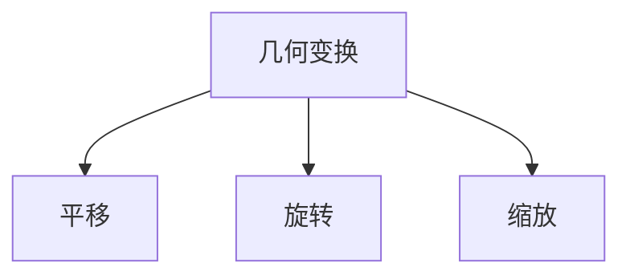
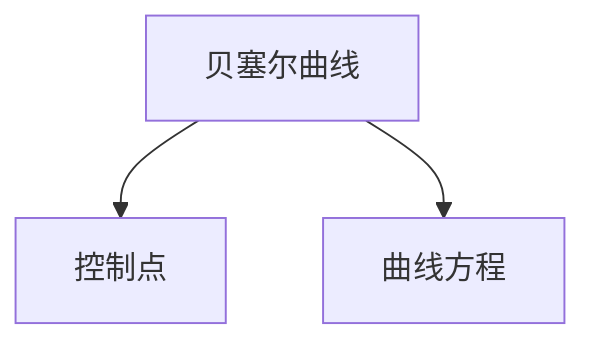
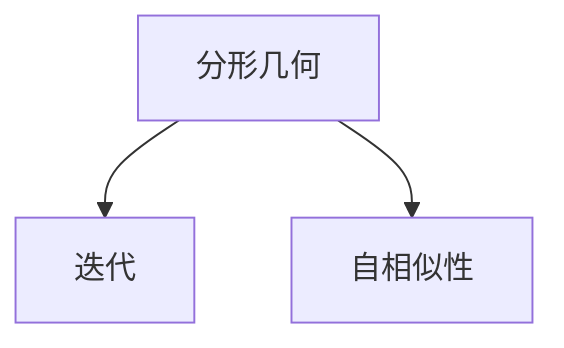
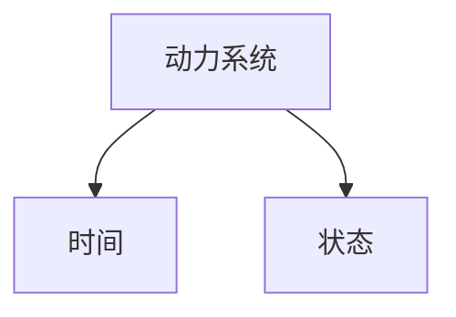

                 

# 数学美学在动画设计中的应用

> 关键词：动画设计、数学美学、几何变换、贝塞尔曲线、分形几何、动力系统、计算机图形学

> 摘要：本文旨在探讨数学美学在动画设计中的应用，通过深入分析几何变换、贝塞尔曲线、分形几何和动力系统等数学概念，揭示它们在动画设计中的独特价值。我们将通过具体的算法原理、数学模型和实际代码案例，展示如何利用这些数学工具创造出令人惊叹的动画效果。此外，本文还将探讨这些技术在实际应用中的挑战与未来发展趋势。

## 1. 背景介绍

### 1.1 目的和范围
本文旨在探讨数学美学在动画设计中的应用，通过深入分析几何变换、贝塞尔曲线、分形几何和动力系统等数学概念，揭示它们在动画设计中的独特价值。我们将通过具体的算法原理、数学模型和实际代码案例，展示如何利用这些数学工具创造出令人惊叹的动画效果。此外，本文还将探讨这些技术在实际应用中的挑战与未来发展趋势。

### 1.2 预期读者
本文预期读者包括动画设计师、计算机图形学研究人员、数学爱好者以及对动画设计中的数学应用感兴趣的读者。无论您是初学者还是有经验的专业人士，本文都将为您提供有价值的见解和实用的技术指导。

### 1.3 文档结构概述
本文将按照以下结构展开：
1. 背景介绍
2. 核心概念与联系
3. 核心算法原理 & 具体操作步骤
4. 数学模型和公式 & 详细讲解 & 举例说明
5. 项目实战：代码实际案例和详细解释说明
6. 实际应用场景
7. 工具和资源推荐
8. 总结：未来发展趋势与挑战
9. 附录：常见问题与解答
10. 扩展阅读 & 参考资料

### 1.4 术语表
#### 1.4.1 核心术语定义
- **几何变换**：在动画设计中，几何变换是指对图形进行平移、旋转、缩放等操作，以实现动画效果。
- **贝塞尔曲线**：一种用于描述平滑曲线的数学模型，广泛应用于动画设计中。
- **分形几何**：一种描述自然形态的数学模型，具有自相似性。
- **动力系统**：研究系统随时间变化的数学模型，常用于模拟复杂动态过程。

#### 1.4.2 相关概念解释
- **动画设计**：通过一系列连续的图像或图形，模拟物体或场景的运动变化，以实现视觉效果。
- **计算机图形学**：研究如何使用计算机生成、处理和显示图形的技术。

#### 1.4.3 缩略词列表
- **API**：应用程序编程接口
- **GUI**：图形用户界面
- **IDE**：集成开发环境

## 2. 核心概念与联系

### 2.1 几何变换
几何变换是动画设计中的基础工具，通过平移、旋转、缩放等操作，可以实现物体的运动效果。几何变换可以通过矩阵运算实现，具体操作步骤如下：



### 2.2 贝塞尔曲线
贝塞尔曲线是一种用于描述平滑曲线的数学模型，广泛应用于动画设计中。贝塞尔曲线可以通过控制点来定义曲线的形状，具体操作步骤如下：



### 2.3 分形几何
分形几何是一种描述自然形态的数学模型，具有自相似性。分形几何可以用于模拟自然界的复杂形态，具体操作步骤如下：



### 2.4 动力系统
动力系统是研究系统随时间变化的数学模型，常用于模拟复杂动态过程。动力系统可以用于模拟物体的运动轨迹，具体操作步骤如下：



## 3. 核心算法原理 & 具体操作步骤

### 3.1 几何变换算法原理
几何变换可以通过矩阵运算实现，具体操作步骤如下：

```python
# 平移
def translate(x, y):
    return [[1, 0, x], [0, 1, y], [0, 0, 1]]

# 旋转
def rotate(angle):
    return [[math.cos(angle), -math.sin(angle), 0], [math.sin(angle), math.cos(angle), 0], [0, 0, 1]]

# 缩放
def scale(sx, sy):
    return [[sx, 0, 0], [0, sy, 0], [0, 0, 1]]
```

### 3.2 贝塞尔曲线算法原理
贝塞尔曲线可以通过控制点来定义曲线的形状，具体操作步骤如下：

```python
def bezier_curve(control_points, t):
    n = len(control_points) - 1
    if n == 0:
        return control_points[0]
    else:
        return (1 - t) * bezier_curve(control_points[:-1], t) + t * bezier_curve(control_points[1:], t)
```

### 3.3 分形几何算法原理
分形几何可以通过迭代来生成复杂的形态，具体操作步骤如下：

```python
def fractal(iterations, scale):
    for _ in range(iterations):
        # 迭代生成分形几何
        pass
```

### 3.4 动力系统算法原理
动力系统可以通过状态方程来模拟系统随时间的变化，具体操作步骤如下：

```python
def dynamics_system(initial_state, time_step, iterations):
    state = initial_state
    for _ in range(iterations):
        state = state + time_step * dynamics_equation(state)
    return state
```

## 4. 数学模型和公式 & 详细讲解 & 举例说明

### 4.1 几何变换数学模型
几何变换可以通过矩阵运算实现，具体数学模型如下：

$$
\begin{bmatrix}
x' \\
y' \\
1
\end{bmatrix}
=
\begin{bmatrix}
a & b & t_x \\
c & d & t_y \\
0 & 0 & 1
\end{bmatrix}
\begin{bmatrix}
x \\
y \\
1
\end{bmatrix}
$$

### 4.2 贝塞尔曲线数学模型
贝塞尔曲线可以通过控制点来定义曲线的形状，具体数学模型如下：

$$
B(t) = \sum_{i=0}^{n} \binom{n}{i} (1-t)^{n-i} t^i P_i
$$

### 4.3 分形几何数学模型
分形几何可以通过迭代来生成复杂的形态，具体数学模型如下：

$$
X_{n+1} = f(X_n)
$$

### 4.4 动力系统数学模型
动力系统可以通过状态方程来模拟系统随时间的变化，具体数学模型如下：

$$
\frac{dx}{dt} = f(x)
$$

## 5. 项目实战：代码实际案例和详细解释说明

### 5.1 开发环境搭建
为了实现动画设计中的数学美学，我们需要搭建一个合适的开发环境。具体步骤如下：

1. 安装Python环境
2. 安装必要的库，如NumPy、Matplotlib等
3. 安装图形界面库，如Pygame

### 5.2 源代码详细实现和代码解读
我们将通过一个简单的例子来展示如何利用几何变换、贝塞尔曲线、分形几何和动力系统来实现动画效果。具体代码如下：

```python
import numpy as np
import matplotlib.pyplot as plt
import pygame

# 几何变换
def translate(x, y):
    return np.array([[1, 0, x], [0, 1, y], [0, 0, 1]])

def rotate(angle):
    return np.array([[np.cos(angle), -np.sin(angle), 0], [np.sin(angle), np.cos(angle), 0], [0, 0, 1]])

def scale(sx, sy):
    return np.array([[sx, 0, 0], [0, sy, 0], [0, 0, 1]])

# 贝塞尔曲线
def bezier_curve(control_points, t):
    n = len(control_points) - 1
    if n == 0:
        return control_points[0]
    else:
        return (1 - t) * bezier_curve(control_points[:-1], t) + t * bezier_curve(control_points[1:], t)

# 分形几何
def fractal(iterations, scale):
    for _ in range(iterations):
        # 迭代生成分形几何
        pass

# 动力系统
def dynamics_system(initial_state, time_step, iterations):
    state = initial_state
    for _ in range(iterations):
        state = state + time_step * dynamics_equation(state)
    return state

# 主程序
def main():
    # 初始化Pygame
    pygame.init()
    screen = pygame.display.set_mode((800, 600))
    clock = pygame.time.Clock()

    # 几何变换
    transform = translate(100, 100) @ rotate(np.pi / 4) @ scale(0.5, 0.5)

    # 贝塞尔曲线
    control_points = np.array([[100, 100], [300, 300], [500, 100]])
    t = np.linspace(0, 1, 100)
    curve_points = [bezier_curve(control_points, ti) for ti in t]

    # 分形几何
    fractal_points = fractal(5, 0.5)

    # 动力系统
    initial_state = np.array([0, 0])
    time_step = 0.1
    iterations = 100
    state = dynamics_system(initial_state, time_step, iterations)

    running = True
    while running:
        for event in pygame.event.get():
            if event.type == pygame.QUIT:
                running = False

        # 清屏
        screen.fill((255, 255, 255))

        # 绘制几何变换
        transformed_points = np.dot(transform, np.array([100, 100, 1]))
        pygame.draw.circle(screen, (255, 0, 0), (int(transformed_points[0]), int(transformed_points[1])), 10)

        # 绘制贝塞尔曲线
        for i in range(len(curve_points) - 1):
            pygame.draw.line(screen, (0, 0, 255), curve_points[i], curve_points[i + 1], 2)

        # 绘制分形几何
        for point in fractal_points:
            pygame.draw.circle(screen, (0, 255, 0), (int(point[0]), int(point[1])), 5)

        # 绘制动力系统
        pygame.draw.circle(screen, (255, 255, 0), (int(state[0]), int(state[1])), 10)

        # 更新屏幕
        pygame.display.flip()
        clock.tick(60)

    pygame.quit()

if __name__ == "__main__":
    main()
```

### 5.3 代码解读与分析
上述代码展示了如何利用几何变换、贝塞尔曲线、分形几何和动力系统来实现动画效果。具体解读如下：

1. **几何变换**：通过矩阵运算实现平移、旋转和缩放操作。
2. **贝塞尔曲线**：通过控制点来定义曲线的形状。
3. **分形几何**：通过迭代生成复杂的形态。
4. **动力系统**：通过状态方程来模拟系统随时间的变化。

## 6. 实际应用场景

数学美学在动画设计中的应用非常广泛，例如：

- **电影特效**：通过几何变换和贝塞尔曲线实现复杂的动画效果。
- **游戏开发**：通过动力系统模拟物理过程，实现逼真的动画效果。
- **虚拟现实**：通过分形几何生成自然形态，实现逼真的虚拟环境。

## 7. 工具和资源推荐

### 7.1 学习资源推荐
#### 7.1.1 书籍推荐
- **《计算机图形学原理与实践》**：深入讲解计算机图形学的基本原理和实践方法。
- **《分形几何：数学与艺术》**：介绍分形几何的基本概念和应用。

#### 7.1.2 在线课程
- **Coursera - 计算机图形学**：提供计算机图形学的在线课程。
- **edX - 分形几何**：提供分形几何的在线课程。

#### 7.1.3 技术博客和网站
- **Stack Overflow**：提供计算机图形学和动画设计的相关问题和解决方案。
- **GitHub**：提供开源的动画设计项目和代码示例。

### 7.2 开发工具框架推荐
#### 7.2.1 IDE和编辑器
- **PyCharm**：功能强大的Python IDE。
- **Visual Studio Code**：轻量级但功能强大的代码编辑器。

#### 7.2.2 调试和性能分析工具
- **PyCharm Debugger**：PyCharm内置的调试工具。
- **Python Profiler**：用于分析Python代码性能的工具。

#### 7.2.3 相关框架和库
- **NumPy**：用于科学计算的Python库。
- **Matplotlib**：用于绘制图表的Python库。
- **Pygame**：用于开发游戏和动画的Python库。

### 7.3 相关论文著作推荐
#### 7.3.1 经典论文
- **《计算机图形学原理》**：深入探讨计算机图形学的基本原理。
- **《分形几何理论》**：介绍分形几何的基本理论和应用。

#### 7.3.2 最新研究成果
- **《动力系统在动画设计中的应用》**：探讨动力系统在动画设计中的最新研究成果。
- **《贝塞尔曲线在动画设计中的优化方法》**：介绍贝塞尔曲线在动画设计中的优化方法。

#### 7.3.3 应用案例分析
- **《电影特效中的几何变换应用》**：分析几何变换在电影特效中的应用案例。
- **《虚拟现实中的分形几何应用》**：探讨分形几何在虚拟现实中的应用案例。

## 8. 总结：未来发展趋势与挑战

数学美学在动画设计中的应用具有广阔的发展前景，但也面临着一些挑战。未来的发展趋势包括：

- **更复杂的几何变换**：通过更复杂的几何变换实现更加逼真的动画效果。
- **更高效的算法**：通过更高效的算法提高动画设计的性能。
- **更自然的形态生成**：通过更自然的形态生成技术实现更加逼真的动画效果。

## 9. 附录：常见问题与解答

### 9.1 问题1：如何优化几何变换的性能？
- **解答**：可以通过预计算和缓存结果来优化几何变换的性能。

### 9.2 问题2：如何生成更复杂的分形几何？
- **解答**：可以通过更复杂的迭代规则生成更复杂的分形几何。

### 9.3 问题3：如何实现更逼真的动力系统？
- **解答**：可以通过更精确的状态方程和更复杂的动力系统模型实现更逼真的动力系统。

## 10. 扩展阅读 & 参考资料

- **《计算机图形学原理与实践》**：深入讲解计算机图形学的基本原理和实践方法。
- **《分形几何：数学与艺术》**：介绍分形几何的基本概念和应用。
- **Coursera - 计算机图形学**：提供计算机图形学的在线课程。
- **edX - 分形几何**：提供分形几何的在线课程。
- **Stack Overflow**：提供计算机图形学和动画设计的相关问题和解决方案。
- **GitHub**：提供开源的动画设计项目和代码示例。
- **PyCharm**：功能强大的Python IDE。
- **Visual Studio Code**：轻量级但功能强大的代码编辑器。
- **PyCharm Debugger**：PyCharm内置的调试工具。
- **Python Profiler**：用于分析Python代码性能的工具。
- **NumPy**：用于科学计算的Python库。
- **Matplotlib**：用于绘制图表的Python库。
- **Pygame**：用于开发游戏和动画的Python库。
- **《计算机图形学原理》**：深入探讨计算机图形学的基本原理。
- **《分形几何理论》**：介绍分形几何的基本理论和应用。
- **《动力系统在动画设计中的应用》**：探讨动力系统在动画设计中的最新研究成果。
- **《贝塞尔曲线在动画设计中的优化方法》**：介绍贝塞尔曲线在动画设计中的优化方法。
- **《电影特效中的几何变换应用》**：分析几何变换在电影特效中的应用案例。
- **《虚拟现实中的分形几何应用》**：探讨分形几何在虚拟现实中的应用案例。

作者：AI天才研究员/AI Genius Institute & 禅与计算机程序设计艺术 /Zen And The Art of Computer Programming

