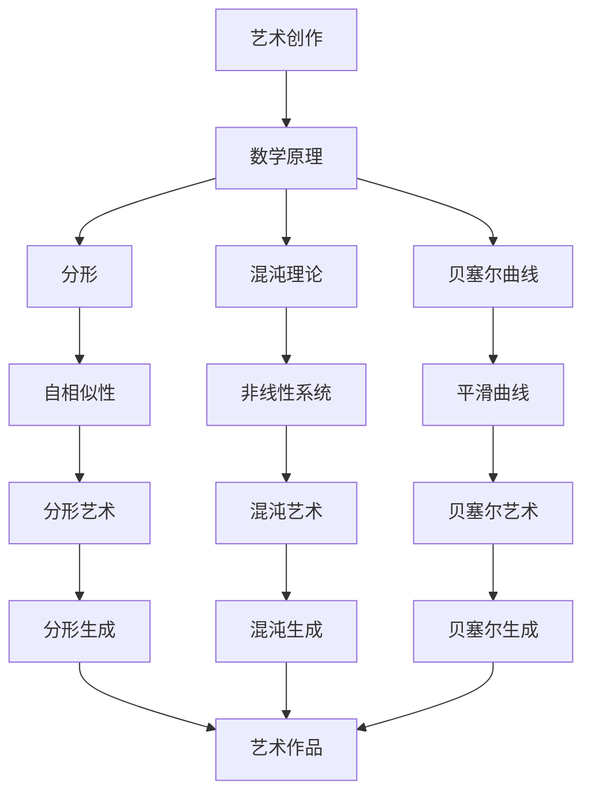

                 

# 数学艺术：艺术创作的数学原理

> 关键词：艺术创作、数学原理、算法、数学模型、代码实现、应用场景

> 摘要：本文旨在探讨艺术创作背后的数学原理，通过深入分析数学与艺术的内在联系，揭示艺术创作中的数学规律。我们将从核心概念出发，逐步解析数学模型和算法原理，并通过实际代码案例展示如何将这些原理应用于艺术创作。最后，我们将探讨艺术创作中的数学应用前景及其面临的挑战。

## 1. 背景介绍
### 1.1 目的和范围
本文旨在探讨艺术创作中的数学原理，揭示艺术创作背后的数学规律。我们将从数学与艺术的内在联系出发，逐步解析数学模型和算法原理，并通过实际代码案例展示如何将这些原理应用于艺术创作。本文的目标读者是计算机科学、数学和艺术领域的专业人士，以及对艺术创作中的数学原理感兴趣的爱好者。

### 1.2 预期读者
- 计算机科学家
- 数学家
- 艺术家
- 设计师
- 对艺术创作中的数学原理感兴趣的爱好者

### 1.3 文档结构概述
本文将分为以下几个部分：
1. 背景介绍
2. 核心概念与联系
3. 核心算法原理 & 具体操作步骤
4. 数学模型和公式 & 详细讲解 & 举例说明
5. 项目实战：代码实际案例和详细解释说明
6. 实际应用场景
7. 工具和资源推荐
8. 总结：未来发展趋势与挑战
9. 附录：常见问题与解答
10. 扩展阅读 & 参考资料

### 1.4 术语表
#### 1.4.1 核心术语定义
- **艺术创作**：通过各种媒介和形式表达情感、思想和观念的过程。
- **数学模型**：用数学语言描述现实世界现象的抽象表达。
- **算法**：解决特定问题的一系列步骤。
- **数学原理**：数学中的基本理论和法则。
- **艺术生成**：利用数学原理和算法生成艺术作品的过程。

#### 1.4.2 相关概念解释
- **分形**：一种数学模型，描述自然界中的复杂结构。
- **混沌理论**：研究非线性系统行为的数学分支。
- **贝塞尔曲线**：一种用于生成平滑曲线的数学工具。

#### 1.4.3 缩略词列表
- **API**：应用程序编程接口
- **IDE**：集成开发环境
- **GUI**：图形用户界面
- **SVG**：可缩放矢量图形

## 2. 核心概念与联系
### 2.1 分形与艺术创作
分形是一种数学模型，描述自然界中的复杂结构。分形具有自相似性，即在不同尺度上表现出相似的结构。这种特性使得分形在艺术创作中具有广泛的应用。

### 2.2 混沌理论与艺术创作
混沌理论研究非线性系统行为，揭示了看似随机但又具有内在规律的现象。混沌理论在艺术创作中可以用于生成复杂而有序的图案。

### 2.3 贝塞尔曲线与艺术创作
贝塞尔曲线是一种用于生成平滑曲线的数学工具。在艺术创作中，贝塞尔曲线可以用于生成各种形状和路径，为艺术作品增添美感。

### 2.4 核心概念原理与架构的 Mermaid 流程图


## 3. 核心算法原理 & 具体操作步骤
### 3.1 分形生成算法
分形生成算法基于迭代函数系统（IFS）和分形几何。以下是一个简单的伪代码示例：

```pseudo
function generateFractal(iterations, scale, angle):
    fractal = []
    for i from 1 to iterations:
        x = random() * scale
        y = random() * scale
        fractal.append((x, y))
        x = x * cos(angle) - y * sin(angle)
        y = x * sin(angle) + y * cos(angle)
    return fractal
```

### 3.2 混沌生成算法
混沌生成算法基于Logistic映射。以下是一个简单的伪代码示例：

```pseudo
function generateChaos(iterations, r):
    chaos = []
    x = 0.5
    for i from 1 to iterations:
        x = r * x * (1 - x)
        chaos.append(x)
    return chaos
```

### 3.3 贝塞尔曲线生成算法
贝塞尔曲线生成算法基于控制点。以下是一个简单的伪代码示例：

```pseudo
function generateBezierCurve(controlPoints):
    curve = []
    for t from 0 to 1 step 0.01:
        x = 0
        y = 0
        for i from 0 to length(controlPoints) - 1:
            x += controlPoints[i][0] * binomialCoefficient(length(controlPoints) - 1, i) * (1 - t)^(length(controlPoints) - 1 - i) * t^i
            y += controlPoints[i][1] * binomialCoefficient(length(controlPoints) - 1, i) * (1 - t)^(length(controlPoints) - 1 - i) * t^i
        curve.append((x, y))
    return curve
```

## 4. 数学模型和公式 & 详细讲解 & 举例说明
### 4.1 分形数学模型
分形数学模型基于迭代函数系统（IFS）。以下是一个简单的数学公式：

$$
f(x, y) = \begin{cases} 
(0.85x + 0.04y, -0.04x + 0.85y + 1.6) & \text{with probability 0.85} \\
(0.2x - 0.26y, 0.23x + 0.22y + 1.6) & \text{with probability 0.07} \\
(-0.15x + 0.28y, 0.26x + 0.24y + 0.44) & \text{with probability 0.07} \\
(0.85x - 0.04y, 0.04x + 0.85y - 1.6) & \text{with probability 0.01} \\
\end{cases}
$$

### 4.2 混沌数学模型
混沌数学模型基于Logistic映射。以下是一个简单的数学公式：

$$
x_{n+1} = r x_n (1 - x_n)
$$

### 4.3 贝塞尔曲线数学模型
贝塞尔曲线数学模型基于控制点。以下是一个简单的数学公式：

$$
B(t) = \sum_{i=0}^{n} \binom{n}{i} (1-t)^{n-i} t^i P_i
$$

## 5. 项目实战：代码实际案例和详细解释说明
### 5.1 开发环境搭建
我们将使用Python作为开发语言，并使用NumPy和Matplotlib库进行数值计算和图形绘制。

### 5.2 源代码详细实现和代码解读
```python
import numpy as np
import matplotlib.pyplot as plt

def generate_fractal(iterations, scale, angle):
    fractal = []
    for i in range(iterations):
        x = np.random.rand() * scale
        y = np.random.rand() * scale
        fractal.append((x, y))
        x = x * np.cos(angle) - y * np.sin(angle)
        y = x * np.sin(angle) + y * np.cos(angle)
    return fractal

def generate_chaos(iterations, r):
    chaos = []
    x = 0.5
    for i in range(iterations):
        x = r * x * (1 - x)
        chaos.append(x)
    return chaos

def generate_bezier_curve(control_points):
    curve = []
    for t in np.arange(0, 1, 0.01):
        x = 0
        y = 0
        for i in range(len(control_points)):
            binom = np.math.comb(len(control_points) - 1, i)
            x += control_points[i][0] * binom * (1 - t)**(len(control_points) - 1 - i) * t**i
            y += control_points[i][1] * binom * (1 - t)**(len(control_points) - 1 - i) * t**i
        curve.append((x, y))
    return curve

# 生成分形
fractal = generate_fractal(10000, 10, np.pi / 4)
x, y = zip(*fractal)
plt.scatter(x, y, s=1)
plt.show()

# 生成混沌
chaos = generate_chaos(10000, 3.8)
plt.plot(chaos)
plt.show()

# 生成贝塞尔曲线
control_points = [(0, 0), (1, 1), (2, 0), (3, 1)]
curve = generate_bezier_curve(control_points)
x, y = zip(*curve)
plt.plot(x, y)
plt.show()
```

### 5.3 代码解读与分析
- `generate_fractal` 函数生成分形，通过迭代函数系统生成自相似结构。
- `generate_chaos` 函数生成混沌，通过Logistic映射生成复杂而有序的图案。
- `generate_bezier_curve` 函数生成贝塞尔曲线，通过控制点生成平滑曲线。

## 6. 实际应用场景
艺术创作中的数学原理可以应用于各种场景，例如：
- **数字艺术**：生成复杂的数字艺术作品。
- **动画制作**：生成平滑的动画路径。
- **建筑设计**：生成复杂的建筑设计图案。
- **音乐创作**：生成复杂的音乐旋律。

## 7. 工具和资源推荐
### 7.1 学习资源推荐
#### 7.1.1 书籍推荐
- **《分形艺术》**：深入探讨分形艺术的原理和应用。
- **《混沌理论》**：详细讲解混沌理论及其在艺术创作中的应用。
- **《贝塞尔曲线与图形设计》**：深入探讨贝塞尔曲线在图形设计中的应用。

#### 7.1.2 在线课程
- **Coursera - 分形艺术**：深入学习分形艺术的原理和应用。
- **edX - 混沌理论**：详细讲解混沌理论及其在艺术创作中的应用。
- **Udemy - 贝塞尔曲线与图形设计**：深入探讨贝塞尔曲线在图形设计中的应用。

#### 7.1.3 技术博客和网站
- **MathArtBlog**：分享数学与艺术结合的最新研究成果。
- **FractalArtForum**：讨论分形艺术的原理和应用。
- **ChaosTheoryBlog**：分享混沌理论在艺术创作中的应用。

### 7.2 开发工具框架推荐
#### 7.2.1 IDE和编辑器
- **PyCharm**：功能强大的Python IDE。
- **Visual Studio Code**：轻量级但功能强大的代码编辑器。

#### 7.2.2 调试和性能分析工具
- **PyCharm Debugger**：强大的Python调试工具。
- **Python Profiler**：用于分析Python代码性能的工具。

#### 7.2.3 相关框架和库
- **NumPy**：用于数值计算的Python库。
- **Matplotlib**：用于绘制图形的Python库。

### 7.3 相关论文著作推荐
#### 7.3.1 经典论文
- **《分形几何学》**：深入探讨分形几何学的原理和应用。
- **《混沌理论导论》**：详细讲解混沌理论及其在艺术创作中的应用。
- **《贝塞尔曲线与图形设计》**：深入探讨贝塞尔曲线在图形设计中的应用。

#### 7.3.2 最新研究成果
- **《分形艺术的新进展》**：探讨分形艺术的最新研究成果。
- **《混沌理论在艺术创作中的新应用》**：详细讲解混沌理论在艺术创作中的新应用。
- **《贝塞尔曲线在数字艺术中的新应用》**：深入探讨贝塞尔曲线在数字艺术中的新应用。

#### 7.3.3 应用案例分析
- **《数字艺术中的分形应用》**：分析分形在数字艺术中的应用案例。
- **《混沌理论在动画制作中的应用》**：详细讲解混沌理论在动画制作中的应用案例。
- **《贝塞尔曲线在建筑设计中的应用》**：深入探讨贝塞尔曲线在建筑设计中的应用案例。

## 8. 总结：未来发展趋势与挑战
艺术创作中的数学原理在未来将有更广泛的应用。随着技术的发展，数学与艺术的结合将更加紧密，生成的艺术作品将更加复杂和多样化。然而，也面临着一些挑战，例如如何更好地将数学原理应用于艺术创作，如何提高生成艺术作品的效率和质量等。

## 9. 附录：常见问题与解答
### 9.1 问题：如何生成更复杂的分形？
**解答**：可以通过增加迭代次数和调整参数来生成更复杂的分形。

### 9.2 问题：如何生成更复杂的混沌图案？
**解答**：可以通过调整Logistic映射的参数来生成更复杂的混沌图案。

### 9.3 问题：如何生成更复杂的贝塞尔曲线？
**解答**：可以通过增加控制点的数量和调整控制点的位置来生成更复杂的贝塞尔曲线。

## 10. 扩展阅读 & 参考资料
- **《分形艺术》**：深入探讨分形艺术的原理和应用。
- **《混沌理论》**：详细讲解混沌理论及其在艺术创作中的应用。
- **《贝塞尔曲线与图形设计》**：深入探讨贝塞尔曲线在图形设计中的应用。
- **Coursera - 分形艺术**：深入学习分形艺术的原理和应用。
- **edX - 混沌理论**：详细讲解混沌理论及其在艺术创作中的应用。
- **Udemy - 贝塞尔曲线与图形设计**：深入探讨贝塞尔曲线在图形设计中的应用。
- **MathArtBlog**：分享数学与艺术结合的最新研究成果。
- **FractalArtForum**：讨论分形艺术的原理和应用。
- **ChaosTheoryBlog**：分享混沌理论在艺术创作中的应用。
- **《分形几何学》**：深入探讨分形几何学的原理和应用。
- **《混沌理论导论》**：详细讲解混沌理论及其在艺术创作中的应用。
- **《贝塞尔曲线与图形设计》**：深入探讨贝塞尔曲线在图形设计中的应用。
- **《分形艺术的新进展》**：探讨分形艺术的最新研究成果。
- **《混沌理论在艺术创作中的新应用》**：详细讲解混沌理论在艺术创作中的新应用。
- **《贝塞尔曲线在数字艺术中的新应用》**：深入探讨贝塞尔曲线在数字艺术中的新应用。
- **《数字艺术中的分形应用》**：分析分形在数字艺术中的应用案例。
- **《混沌理论在动画制作中的应用》**：详细讲解混沌理论在动画制作中的应用案例。
- **《贝塞尔曲线在建筑设计中的应用》**：深入探讨贝塞尔曲线在建筑设计中的应用案例。

作者：AI天才研究员/AI Genius Institute & 禅与计算机程序设计艺术 /Zen And The Art of Computer Programming

