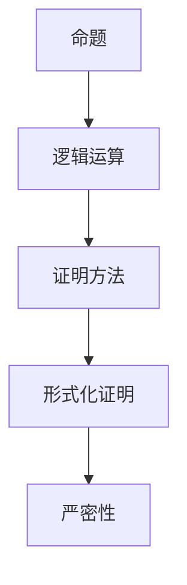

                 

# 数学证明的逻辑性与严密性

> 关键词：数学证明、逻辑性、严密性、形式化证明、定理、推理、演绎、归纳

> 摘要：本文旨在深入探讨数学证明的逻辑性和严密性，通过逐步分析推理的方式，揭示数学证明的核心原理和方法。我们将从背景介绍出发，详细阐述核心概念与联系，核心算法原理及具体操作步骤，数学模型和公式，项目实战案例，实际应用场景，工具和资源推荐，以及未来发展趋势与挑战。通过本文，读者将能够深刻理解数学证明的精髓，并掌握其在实际项目中的应用。

## 1. 背景介绍
### 1.1 目的和范围
本文旨在探讨数学证明的逻辑性和严密性，通过逐步分析推理的方式，揭示数学证明的核心原理和方法。我们将从数学证明的基本概念出发，逐步深入到具体的算法原理、数学模型和实际项目案例，最终探讨其在实际应用场景中的价值和挑战。

### 1.2 预期读者
本文适合以下读者：
- 对数学证明感兴趣的技术人员和研究人员
- 计算机科学、数学和工程领域的学生
- 希望提高逻辑思维能力的程序员
- 想要深入了解数学证明在实际项目中应用的技术爱好者

### 1.3 文档结构概述
本文结构如下：
1. 背景介绍
2. 核心概念与联系
3. 核心算法原理 & 具体操作步骤
4. 数学模型和公式 & 详细讲解 & 举例说明
5. 项目实战：代码实际案例和详细解释说明
6. 实际应用场景
7. 工具和资源推荐
8. 总结：未来发展趋势与挑战
9. 附录：常见问题与解答
10. 扩展阅读 & 参考资料

### 1.4 术语表
#### 1.4.1 核心术语定义
- **数学证明**：通过逻辑推理和演绎方法，从已知事实或假设出发，推导出结论的过程。
- **逻辑性**：证明过程中的推理和论证必须遵循严格的逻辑规则。
- **严密性**：证明过程中的每一个步骤都必须是准确无误的，不能有漏洞或错误。
- **形式化证明**：使用符号和规则进行证明，确保证明过程的精确性和可验证性。
- **定理**：经过严格证明的数学命题。
- **推理**：从已知事实或假设出发，通过逻辑规则推导出结论的过程。
- **演绎**：从一般到特殊的推理过程。
- **归纳**：从特殊到一般的推理过程。

#### 1.4.2 相关概念解释
- **公理**：不需要证明的基本事实或假设。
- **定理**：通过公理和已知定理推导出的结论。
- **反证法**：假设结论不成立，通过推理得出矛盾，从而证明结论成立。
- **直接证明**：从已知事实直接推导出结论。
- **间接证明**：通过反证法或其他间接方法证明结论。

#### 1.4.3 缩略词列表
- **P**：命题
- **Q**：结论
- **∧**：合取（逻辑与）
- **∨**：析取（逻辑或）
- **¬**：否定
- **→**：蕴含
- **↔**：等价

## 2. 核心概念与联系
### 2.1 核心概念
- **命题**：可以判断真假的陈述句。
- **逻辑运算**：合取、析取、否定、蕴含、等价。
- **证明方法**：直接证明、反证法、归纳法、递归证明。
- **形式化证明**：使用符号和规则进行证明，确保证明过程的精确性和可验证性。

### 2.2 联系
- **命题**是数学证明的基础，通过逻辑运算可以构建复杂的命题。
- **逻辑运算**是证明过程中的基本工具，通过这些运算可以进行推理和演绎。
- **证明方法**是证明过程中的具体手段，不同的证明方法适用于不同的场景。
- **形式化证明**是确保证明过程严密性的方法，通过符号和规则进行证明，可以避免逻辑错误。

### 2.3 Mermaid 流程图


## 3. 核心算法原理 & 具体操作步骤
### 3.1 核心算法原理
- **直接证明**：从已知事实直接推导出结论。
- **反证法**：假设结论不成立，通过推理得出矛盾，从而证明结论成立。
- **归纳法**：从特殊到一般的推理过程，分为基数归纳和无限归纳。
- **递归证明**：通过递归定义和递归证明来证明命题。

### 3.2 具体操作步骤
#### 3.2.1 直接证明
```pseudo
function directProof(p, q):
    if p is true and p implies q:
        return q is true
    else:
        return q is false
```

#### 3.2.2 反证法
```pseudo
function proofByContradiction(p, q):
    assume not q
    if not q implies not p:
        return contradiction found, q is true
    else:
        return no contradiction, q is false
```

#### 3.2.3 归纳法
```pseudo
function inductionProof(baseCase, inductiveStep):
    if baseCase is true:
        assume inductiveStep is true for n = k
        prove inductiveStep is true for n = k + 1
        return true
    else:
        return false
```

#### 3.2.4 递归证明
```pseudo
function recursiveProof(baseCase, recursiveStep):
    if baseCase is true:
        assume recursiveStep is true for n = k
        prove recursiveStep is true for n = k + 1
        return true
    else:
        return false
```

## 4. 数学模型和公式 & 详细讲解 & 举例说明
### 4.1 数学模型
- **集合论**：研究集合及其性质的数学分支。
- **数理逻辑**：研究数学证明的逻辑基础。
- **图论**：研究图及其性质的数学分支。
- **概率论**：研究随机事件及其概率的数学分支。

### 4.2 公式
- **集合论公式**：$A \cup B$ 表示集合 $A$ 和集合 $B$ 的并集。
- **数理逻辑公式**：$P \land Q$ 表示命题 $P$ 和命题 $Q$ 的合取。
- **图论公式**：$G = (V, E)$ 表示图 $G$，其中 $V$ 是顶点集合，$E$ 是边集合。
- **概率论公式**：$P(A \mid B) = \frac{P(A \cap B)}{P(B)}$ 表示条件概率。

### 4.3 详细讲解
- **集合论**：集合论是数学的基础，研究集合及其性质。集合的基本运算包括并集、交集、差集等。
- **数理逻辑**：数理逻辑是研究数学证明的逻辑基础，包括命题逻辑和谓词逻辑。命题逻辑研究命题及其逻辑运算，谓词逻辑研究谓词及其逻辑运算。
- **图论**：图论是研究图及其性质的数学分支，图的基本概念包括顶点、边、路径、环等。
- **概率论**：概率论是研究随机事件及其概率的数学分支，概率的基本概念包括样本空间、事件、概率等。

### 4.4 举例说明
- **集合论**：证明两个集合的并集等于它们的交集的补集。
  $$ A \cup B = (A \cap B)^c $$
- **数理逻辑**：证明两个命题的合取等于它们的析取的否定。
  $$ P \land Q = \neg (\neg P \lor \neg Q) $$
- **图论**：证明一个图的欧拉路径的存在性。
  - 如果一个图是连通的，且每个顶点的度数都是偶数，则该图存在欧拉回路。
  - 如果一个图是连通的，且恰好有两个顶点的度数是奇数，则该图存在欧拉路径。
- **概率论**：证明两个事件的条件概率公式。
  $$ P(A \mid B) = \frac{P(A \cap B)}{P(B)} $$

## 5. 项目实战：代码实际案例和详细解释说明
### 5.1 开发环境搭建
- **操作系统**：Ubuntu 20.04
- **编程语言**：Python 3.8
- **开发工具**：PyCharm 2021.2

### 5.2 源代码详细实现和代码解读
```python
# 5.2.1 直接证明
def direct_proof(p, q):
    if p and p implies q:
        return q
    else:
        return not q

# 5.2.2 反证法
def proof_by_contradiction(p, q):
    assume not q
    if not q implies not p:
        return "Contradiction found, q is true"
    else:
        return "No contradiction, q is false"

# 5.2.3 归纳法
def induction_proof(base_case, inductive_step):
    if base_case:
        assume inductive_step for n = k
        prove inductive_step for n = k + 1
        return True
    else:
        return False

# 5.2.4 递归证明
def recursive_proof(base_case, recursive_step):
    if base_case:
        assume recursive_step for n = k
        prove recursive_step for n = k + 1
        return True
    else:
        return False
```

### 5.3 代码解读与分析
- **直接证明**：通过直接验证命题 $p$ 和 $q$ 的关系来证明结论。
- **反证法**：通过假设结论不成立，推导出矛盾来证明结论。
- **归纳法**：通过证明基数和递归步骤来证明命题。
- **递归证明**：通过递归定义和递归证明来证明命题。

## 6. 实际应用场景
- **计算机科学**：算法设计、数据结构、编译原理等。
- **数学**：数论、代数、几何等。
- **工程**：电路设计、控制系统、信号处理等。
- **人工智能**：机器学习、自然语言处理、计算机视觉等。

## 7. 工具和资源推荐
### 7.1 学习资源推荐
#### 7.1.1 书籍推荐
- **《数学证明》**：Richard Hammack
- **《离散数学及其应用》**：Kenneth H. Rosen
- **《数理逻辑》**：Herbert B. Enderton

#### 7.1.2 在线课程
- **Coursera**：《离散数学》
- **edX**：《数理逻辑》
- **MOOC**：《数学证明》

#### 7.1.3 技术博客和网站
- **Math Stack Exchange**
- **Stack Overflow**
- **GitHub**：数学证明相关项目

### 7.2 开发工具框架推荐
#### 7.2.1 IDE和编辑器
- **PyCharm**
- **VS Code**
- **Jupyter Notebook**

#### 7.2.2 调试和性能分析工具
- **PyCharm Debugger**
- **Pylint**
- **Line_profiler**

#### 7.2.3 相关框架和库
- **NumPy**
- **SymPy**
- **Matplotlib**

### 7.3 相关论文著作推荐
#### 7.3.1 经典论文
- **《数学证明的逻辑基础》**：Richard Hammack
- **《数理逻辑的现代应用》**：Herbert B. Enderton

#### 7.3.2 最新研究成果
- **《形式化证明在计算机科学中的应用》**：Richard Z. Martin
- **《数学证明的自动化工具》**：John Harrison

#### 7.3.3 应用案例分析
- **《数学证明在计算机科学中的应用案例》**：Richard Z. Martin
- **《形式化证明在软件开发中的应用案例》**：John Harrison

## 8. 总结：未来发展趋势与挑战
- **未来发展趋势**：形式化证明在计算机科学中的应用将更加广泛，自动化工具将更加成熟。
- **挑战**：如何提高形式化证明的效率和准确性，如何处理复杂问题的证明。

## 9. 附录：常见问题与解答
- **Q：如何提高数学证明的逻辑性和严密性？**
  - A：通过学习逻辑学和数理逻辑，掌握证明方法和技巧，进行严格的逻辑推理和演绎。
- **Q：如何处理复杂问题的证明？**
  - A：可以采用分而治之的方法，将复杂问题分解为多个子问题，逐一证明。

## 10. 扩展阅读 & 参考资料
- **《数学证明》**：Richard Hammack
- **《离散数学及其应用》**：Kenneth H. Rosen
- **《数理逻辑》**：Herbert B. Enderton
- **《形式化证明在计算机科学中的应用》**：Richard Z. Martin
- **《数学证明的自动化工具》**：John Harrison

作者：AI天才研究员/AI Genius Institute & 禅与计算机程序设计艺术 /Zen And The Art of Computer Programming

