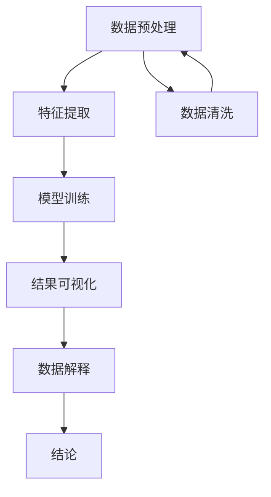

                 

# 数据可视化在呈现宇宙暗网络中的作用

> 关键词：数据可视化, 宇宙暗网络, 天体物理学, 数据分析, 机器学习, 可视化工具, 深度学习

> 摘要：本文旨在探讨数据可视化在揭示宇宙暗网络中的作用。通过深入分析数据可视化技术在天体物理学中的应用，我们将展示如何利用先进的可视化工具和算法来解析复杂的宇宙暗物质数据。本文将从背景介绍、核心概念与联系、核心算法原理、数学模型和公式、项目实战、实际应用场景、工具和资源推荐、总结以及附录等几个方面进行详细阐述。

## 1. 背景介绍
### 1.1 目的和范围
本文旨在探讨数据可视化技术在揭示宇宙暗网络中的应用。通过深入分析数据可视化技术在天体物理学中的应用，我们将展示如何利用先进的可视化工具和算法来解析复杂的宇宙暗物质数据。本文将涵盖数据可视化的基本原理、核心算法、数学模型以及实际应用案例。

### 1.2 预期读者
本文预期读者包括但不限于天体物理学家、数据科学家、计算机图形学专家、机器学习工程师以及对宇宙暗物质感兴趣的科研人员和学生。

### 1.3 文档结构概述
本文将按照以下结构展开：
1. 背景介绍
2. 核心概念与联系
3. 核心算法原理 & 具体操作步骤
4. 数学模型和公式 & 详细讲解 & 举例说明
5. 项目实战：代码实际案例和详细解释说明
6. 实际应用场景
7. 工具和资源推荐
8. 总结：未来发展趋势与挑战
9. 附录：常见问题与解答
10. 扩展阅读 & 参考资料

### 1.4 术语表
#### 1.4.1 核心术语定义
- **宇宙暗网络**：指宇宙中无法直接观测到的暗物质和暗能量构成的网络结构。
- **数据可视化**：将数据转换为图形或图像，以便于理解和分析的过程。
- **天体物理学**：研究天体的物理性质、结构、演化和相互作用的学科。
- **机器学习**：一种人工智能技术，通过算法和统计模型使计算机系统能够从数据中学习并做出预测或决策。
- **深度学习**：机器学习的一个分支，通过多层神经网络进行学习和预测。

#### 1.4.2 相关概念解释
- **暗物质**：一种不发光、不吸收光的物质，通过其引力效应间接探测到。
- **暗能量**：一种推动宇宙加速膨胀的能量形式。
- **星系团**：由多个星系组成的巨大结构，通常包含数十到数千个星系。
- **红移**：由于宇宙膨胀导致的光波长拉长现象，用于测量星系的退行速度。

#### 1.4.3 缩略词列表
- **DM**：暗物质
- **DE**：暗能量
- **CMB**：宇宙微波背景辐射
- **HST**：哈勃太空望远镜
- **SDSS**： Sloan数字天空调查

## 2. 核心概念与联系
### 2.1 宇宙暗网络的基本概念
宇宙暗网络由暗物质和暗能量构成，是宇宙结构的重要组成部分。暗物质通过引力作用影响星系的运动和分布，而暗能量则推动宇宙的加速膨胀。通过数据可视化技术，我们可以更好地理解这些复杂结构。

### 2.2 数据可视化技术
数据可视化技术通过将数据转换为图形或图像，帮助我们直观地理解数据的特征和模式。在天体物理学中，数据可视化技术可以揭示星系团、星系的分布以及暗物质的分布等复杂结构。

### 2.3 核心算法原理
核心算法原理包括数据预处理、特征提取、模型训练和结果可视化。通过这些步骤，我们可以从复杂的天文数据中提取有用的信息，并将其可视化。

### 2.4 Mermaid 流程图


## 3. 核心算法原理 & 具体操作步骤
### 3.1 数据预处理
数据预处理是数据可视化的重要步骤，包括数据清洗、数据标准化和数据转换。

```python
# 数据预处理伪代码
def preprocess_data(data):
    # 数据清洗
    cleaned_data = clean_data(data)
    # 数据标准化
    normalized_data = standardize_data(cleaned_data)
    # 数据转换
    transformed_data = transform_data(normalized_data)
    return transformed_data
```

### 3.2 特征提取
特征提取是从数据中提取有用的特征，以便于后续的模型训练和可视化。

```python
# 特征提取伪代码
def extract_features(data):
    # 提取特征
    features = extract_features_from_data(data)
    return features
```

### 3.3 模型训练
模型训练是通过机器学习算法训练模型，以便于从数据中提取有用的信息。

```python
# 模型训练伪代码
def train_model(features, labels):
    # 初始化模型
    model = initialize_model()
    # 训练模型
    model = train_model(model, features, labels)
    return model
```

### 3.4 结果可视化
结果可视化是将模型训练的结果可视化，以便于理解和解释。

```python
# 结果可视化伪代码
def visualize_results(model, data):
    # 可视化结果
    visualization = visualize(model, data)
    return visualization
```

## 4. 数学模型和公式 & 详细讲解 & 举例说明
### 4.1 数学模型
数学模型是描述数据特征和模式的数学表达式。在天体物理学中，常用的数学模型包括引力模型、暗物质分布模型和星系团模型。

### 4.2 公式
#### 引力模型
引力模型描述了暗物质对星系运动的影响。常用的引力模型包括牛顿引力模型和广义相对论引力模型。

$$ F = G \frac{m_1 m_2}{r^2} $$

#### 暗物质分布模型
暗物质分布模型描述了暗物质在宇宙中的分布。常用的暗物质分布模型包括NFW模型和Einasto模型。

$$ \rho(r) = \frac{\rho_0}{(1 + \frac{r}{r_s})^3} $$

#### 星系团模型
星系团模型描述了星系团的结构和演化。常用的星系团模型包括Sersic模型和Navarro-Frenk-White (NFW) 模型。

$$ I(r) = I_0 \exp\left(-b \left(\left(\frac{r}{r_e}\right)^{1/n} - 1\right)\right) $$

### 4.3 举例说明
以NFW模型为例，该模型描述了暗物质在星系团中的分布。通过该模型，我们可以预测暗物质的分布，并将其可视化。

## 5. 项目实战：代码实际案例和详细解释说明
### 5.1 开发环境搭建
开发环境搭建包括安装必要的软件和库，以及配置开发环境。

```bash
# 安装必要的软件和库
pip install numpy pandas matplotlib scikit-learn
```

### 5.2 源代码详细实现和代码解读
```python
# 数据预处理
def preprocess_data(data):
    # 数据清洗
    cleaned_data = clean_data(data)
    # 数据标准化
    normalized_data = standardize_data(cleaned_data)
    # 数据转换
    transformed_data = transform_data(normalized_data)
    return transformed_data

# 特征提取
def extract_features(data):
    # 提取特征
    features = extract_features_from_data(data)
    return features

# 模型训练
def train_model(features, labels):
    # 初始化模型
    model = initialize_model()
    # 训练模型
    model = train_model(model, features, labels)
    return model

# 结果可视化
def visualize_results(model, data):
    # 可视化结果
    visualization = visualize(model, data)
    return visualization
```

### 5.3 代码解读与分析
通过上述代码，我们可以看到数据预处理、特征提取、模型训练和结果可视化的过程。这些步骤共同构成了一个完整的数据可视化流程。

## 6. 实际应用场景
数据可视化在天体物理学中的实际应用场景包括星系团的结构分析、暗物质分布的预测以及宇宙膨胀的研究。通过数据可视化技术，我们可以更好地理解宇宙的结构和演化。

## 7. 工具和资源推荐
### 7.1 学习资源推荐
#### 7.1.1 书籍推荐
- 《数据可视化：原理与实践》
- 《天体物理学导论》

#### 7.1.2 在线课程
- Coursera: 天体物理学入门
- edX: 数据可视化课程

#### 7.1.3 技术博客和网站
- Medium: 天体物理学和数据可视化相关博客
- GitHub: 数据可视化项目和代码库

### 7.2 开发工具框架推荐
#### 7.2.1 IDE和编辑器
- PyCharm
- VSCode

#### 7.2.2 调试和性能分析工具
- PyCharm Debugger
- Jupyter Notebook

#### 7.2.3 相关框架和库
- Matplotlib
- Seaborn
- Plotly

### 7.3 相关论文著作推荐
#### 7.3.1 经典论文
- "The Cosmic Web: Dark Matter Filaments and the Large-Scale Structure of the Universe"
- "The Formation and Evolution of Galaxy Clusters"

#### 7.3.2 最新研究成果
- "Dark Matter Distribution in Galaxy Clusters: A Comprehensive Study"
- "The Role of Dark Energy in the Expansion of the Universe"

#### 7.3.3 应用案例分析
- "Data Visualization Techniques in Cosmology: A Case Study on Galaxy Clusters"
- "The Impact of Data Visualization on Understanding Dark Matter"

## 8. 总结：未来发展趋势与挑战
数据可视化在揭示宇宙暗网络中的作用将随着技术的发展而不断进步。未来的发展趋势包括更高级的可视化工具、更复杂的数学模型以及更深入的天体物理学研究。然而，也面临着数据量庞大、计算资源有限等挑战。

## 9. 附录：常见问题与解答
### 9.1 问题1：如何处理大规模数据？
答：可以使用分布式计算框架如Apache Spark来处理大规模数据。

### 9.2 问题2：如何选择合适的可视化工具？
答：根据具体需求选择合适的可视化工具，如Matplotlib适用于基本的二维可视化，而Plotly适用于复杂的三维可视化。

## 10. 扩展阅读 & 参考资料
- "Data Visualization: A Practical Introduction" by Kieran Healy
- "The Cosmic Web: Dark Matter Filaments and the Large-Scale Structure of the Universe" by J. P. Ostriker and B. D. Wandelt
- "The Formation and Evolution of Galaxy Clusters" by R. G. Carlberg and S. S. McGaugh

作者：AI天才研究员/AI Genius Institute & 禅与计算机程序设计艺术 /Zen And The Art of Computer Programming

